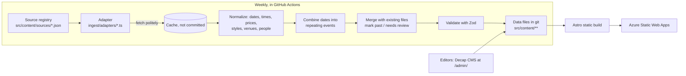

# Long Island Dance Events

**One mobile-friendly list of social dances and live music in Nassau and Suffolk counties, Long Island, New York, plus dance classes.** Listings are collected every week from public calendars, written up in our own words, and linked back to where they came from.

- Swing, West Coast Swing, hustle, salsa, bachata, Argentine tango, ballroom, country and more.
- Dances and live music come first; classes are one tap away.
- Browse by list, month calendar or map, with "This week", "Today" and "This weekend" shortcuts.
- Black, dark red, silver and white design with light and dark modes, built for phones first.
- Every event links to its venue, organizer, teachers, bands and DJs, and each of those pages lists what is coming up.
- Add any event to Google, Outlook or Apple calendars, or subscribe to the whole list (`/events/all.ics`, `/events/rss.xml`).
- Optional free account (email one-time code, Microsoft Entra External ID): like pages, leave notes, send private corrections and share photos. Every note is checked by AI; unclear notes and every photo wait for a volunteer. Browsing never needs an account.

Status: **MVP (build phases 1-2) plus community features, live at <https://longisland.dance>** on Azure Static Web Apps (Standard) in the owner's personal Azure subscription. Search engines are kept away until launch (`ALLOW_INDEXING=false`). See [Roadmap](#roadmap).

## How it works



- **GitOps:** every event, venue, organizer, teacher, band/DJ, dance style and source is a small JSON or YAML file in `src/content/`. Every change is a git commit, and every commit rebuilds the site.
- **Heavy work happens at build time** (scraping, PDF reading, matching). The live site is static files plus thin Azure Functions.
- **Polite collecting:** the bot follows each site's `robots.txt`, waits between requests, caches downloads, and identifies itself (`LongIslandDanceEventsBot/1.0`).
- **Our own words:** titles and summaries are generated from facts (date, time, place, price, style, people). Original text is never republished. Every event records `sourceId` and `sourceUrl`, and the [Sources page](src/pages/sources.astro) credits each source and explains corrections, opt-outs and takedowns.
- **Scope:** only Nassau and Suffolk counties. Towns are checked against `src/data/long-island-places.json` (283 places). Listings in Queens, Brooklyn and elsewhere are skipped and counted in the run report.

## Where the listings come from

| Source | Type | Status |
| --- | --- | --- |
| [The Dance Calendar](https://www.thedancecalendar.com/dance-calendar) | Monthly PDF newsletter | Live (adapter `thedancecalendar`), weekly |
| [Ira's List LI](https://www.iraslistli.com/) | Live-music calendar (public Google Calendar feed) | Live (adapter `iraslist`), daily. Reads the calendar's public iCal address for the next 60 days, with times and addresses, and falls back to the home-page list (decision P40). |
| 42 more calendars: dance clubs and studios, bars and music venues with researched venue files, band pages, town and library calendars | Calendar feeds, built-in event data, web page lists | Switched on (generic adapters `ical`, `jsonld`, `htmllist`), twice a week or weekly |
| 101 more that we know about | Blocked by `robots.txt` or bot checks, social media or flyers only, seasonal, need a feed, or all their listings are at venues nobody has researched yet | Off, with a note in each file saying why and what to do |

The owner approved all proposed sources in [docs/source-proposals.md](docs/source-proposals.md) plus the larger catalog in [docs/source-catalog.md](docs/source-catalog.md) (PR #8). Each one has a file in `src/content/sources/`. Sources whose `robots.txt`, terms or bot protection do not allow reading stay turned off (`enabled: false` with a `permission` note) until the organizer agrees or shares a calendar feed; we never get around a block, and screenshots or reading text from images count as automated access too. Organizers can [ask for a correction](https://github.com/michaelsrichter/long-island-dance-events/issues/new?template=listing-correction.yml), [suggest a listing](https://github.com/michaelsrichter/long-island-dance-events/issues/new?template=add-listing.yml) or [opt out](https://github.com/michaelsrichter/long-island-dance-events/issues/new?template=remove-listing.yml).

## Can you dance there?

Live-music listings are a mix of dance nights and sit-down concerts, so every listing that is not from a dance calendar gets a **dancing score** from 0 to 10 and the **kinds of dancing** you will likely see: partner, line or party dancing (freestyle). The score blends what we found about the **venue** (dance floor, seated theater, standing room) and the **band or DJ** (dance band, tribute act, listening music), then adjusts for clues in the listing (DJ, "dance party", theater, library, acoustic, brunch, jam). Each event page shows the score, the reasons and the web pages we checked. Editors can override it. Logic: `src/lib/dancing.ts`; research fields: `dancing` on venues and performers.

## Run it on your computer

You need **Node 24** (see `.nvmrc`), **Python 3.12+** and Git.

```powershell
npm ci
npm ci --prefix api
pip install -r ingest/requirements.txt

npm run dev                         # http://localhost:4321, live reload
```

To see exactly what visitors see (production build):

```powershell
$env:BUILD_NOW = npm run -s build-now   # pin "today" to the morning of the latest scrape (optional)
npm run build
npx astro preview --port 4321
```

`BUILD_NOW` is optional. Without it the build uses the real time. Tests set it so results are repeatable as the data changes.

## Collect events (ingest)

```powershell
npm run ingest -- --dry-run                 # show what would change, write nothing
npm run ingest                              # all enabled sources; writes src/content/**
npm run ingest -- --source thedancecalendar
npm run ingest -- --cadence daily,twice-weekly   # only sources with these cadences
npm run ingest -- --offline                 # reuse cached downloads only (.cache/ingest)
npm run ingest -- --report report.md --json report.json --strict
```

What a run does:

1. Downloads each enabled source (respecting `robots.txt` and `rateLimitSeconds`).
2. Reads the listings. For PDFs, `ingest/pdf/extract_calendar.py` uses font sizes and bold text to find day headings, sections and towns.
3. Skips anything outside Nassau and Suffolk.
4. Checks each listing's own words. On a dance calendar a listing must name a dance (or a class or lesson); on a calendar of everything in a town it must name a dance, live music or a band or DJ. A deadline ("RSVP by Oct 10"), the end of a date range, a "no class on" day, a post date, or a weekday that does not match the date never becomes a listing. A listing that says it happens off Long Island ("5th Avenue Manhattan") is skipped.
5. Matches venues, organizers, teachers, bands/DJs and dance styles against the existing files (by name and aliases). Unknown venues and DJs are created with a review note.
6. Combines dates of the same listing into one repeating event with a rule such as "every Tuesday" or "1st and 3rd Friday of the month".
7. Merges with existing files. It keeps `firstSeen`, respects `lockedFields` (fields an editor fixed by hand), marks ended events as `past`, and never deletes anything. Listings that vanish from a month the source still covers, or that the program is unsure about (confidence below 0.6), become `pending-review` and are hidden until someone checks them. A new listing for an evening another source already lists (same venue and day, same band or the same kind of event at about the same time) is not added twice; venues', clubs' and bands' own calendars run first, so their version is the one kept.
8. Validates every file with the Zod schemas, writes sorted JSON, and prints a run report.

### Scheduled runs (GitHub Actions)

| Workflow | When | What it does |
| --- | --- | --- |
| `ingest-scheduled.yml` | Daily (`cadence: daily`), Monday and Thursday (`twice-weekly`), Sunday (`weekly`, `monthly`) | Collects, validates, builds the report database, and updates **one** rolling pull request (`ingest/updates`). The Sunday run requests review from and @mentions the owner, which is the weekly email. A source that finds nothing or breaks gets an issue labeled `ingest-failure` with a snapshot (sizes, hashes, page type; never the page text); after 3 failures in a row it is switched off in the pull request. |
| `report-database.yml` | Every change to `src/content/**` on `main`, and monthly | Builds `data/li-dance.sqlite` (see [docs/database-plan.md](docs/database-plan.md)) and saves it, with the sample reports, as a download on the run page. |
| `source-discovery.yml` | 1st of each month | Searches for new sources with Microsoft Web IQ (needs the repository secret `WEBIQ_API_KEY`), rechecks every tracked source politely, and opens an issue with the results. Nothing is switched on automatically. |

One-time settings for the owner: allow GitHub Actions to create pull requests (Settings → Actions → General → Workflow permissions), and add the `WEBIQ_API_KEY` secret for discovery. A pull request opened by a workflow does not start other workflows by itself (a GitHub rule), so after each push to `ingest/updates` the collection run starts CI on that branch (`gh workflow run ci.yml`); its checks appear on the pull request without the "Approve workflows to run" button.

### Add a new source

1. Get the owner's approval (see [docs/source-catalog.md](docs/source-catalog.md); new finds come from the monthly discovery issue).
2. Check `robots.txt` and the site's terms. Prefer structured data: schema.org Event JSON-LD, then iCal (`.ics`), then a tidy web page list, then PDF.
3. Add `src/content/sources/<id>.json`. Set `enabled`, `type`, `url`, `attribution`, `rateLimitSeconds`, `cadence` and `focus` (`dance` for a dance calendar, club or studio; `music` for a band, bar or venue music list).
4. Try a generic adapter first. No code is needed:
   - `ical` reads a calendar feed: set `feedUrl` (for example `.../events/?ical=1` on WordPress "The Events Calendar").
   - `jsonld` reads schema.org Event data on the page; set `feedUrl` to an event sitemap (`.xml`) if the list page has none.
   - `htmllist` reads dated lists on a web page (and Squarespace event lists, SpotApps cards, and hand-made lists split by `=====` lines with a `Location:` line). Set `defaults.venueId` + `defaults.town` for a venue's own page, or `defaults.performerIds` for a band's own page. If the calendar page hides names or dates in separate boxes but the site is WordPress, set `feedUrl` to its `/wp-json/wp/v2/<event type>` address: each post's title and the date written in its text are used instead of the page. When the page's title or main heading names a dance ("Swing Dances", "LICMA Dances"), every listing on it counts as a dance; otherwise each listing must name one.
   - Optional: `pageUrls` (more pages), `defaults.organizerId`, `defaults.danceStyles`, `defaults.category`, and `include` / `exclude` (case-insensitive patterns on the listing text).
5. Only if none of those work, add `ingest/adapters/<id>.ts` exporting `adapter: Adapter` with `fetch(ctx)` and `normalize(docs, ctx)` that return `Candidate`s (see `ingest/lib/types.ts` and `ingest/lib/structured.ts`), with a small fictional fixture in `ingest/fixtures/` and a golden-file test (regenerate with `UPDATE_GOLDEN=1`).
6. Run `npm run ingest -- --source <id> --dry-run`, review the report, then run without `--dry-run` and open a pull request.

No core code changes are needed: `ingest/run.ts` loads `ingest/adapters/<adapter>.ts` by name.

## Data model

| Entity | Folder | Links to |
| --- | --- | --- |
| Event | `src/content/events/*.json` | venue, organizer, performers, instructors, styles, source |
| Venue | `src/content/venues/*.json` | (address, town, map coordinates, parking/access) |
| Organizer (studio, club, DJ series) | `src/content/organizers/*.json` | home venue |
| Instructor (teacher) | `src/content/instructors/*.json` | organizers, styles |
| Performer (band or DJ) | `src/content/performers/*.json` | genres |
| Dance style | `src/content/styles/*.yml` | aliases used for matching |
| Source | `src/content/sources/*.json` | adapter, focus (dance or music), cadence, feed and defaults, permission, last run status and counts |

Schemas: [`src/lib/schemas.ts`](src/lib/schemas.ts). Repeating events use a small, tested subset of iCalendar RRULE ([`src/lib/rrule.ts`](src/lib/rrule.ts)). Field-by-field details: [docs/content-model.md](docs/content-model.md).

## Editing (CMS)

Editors use **Decap CMS** at `/admin/`, signing in with GitHub. Each save becomes a commit or pull request.

> **Deviation from the brief:** the brief asked for Keystatic. This project keeps **Decap CMS** because the base template (`michaelsrichter/community-site-starter` and the community-site-kit) is built and tested around it: OAuth bridge Function, generated config, CSP, editor guide and e2e tests. Both are git-backed, so the GitOps model is the same. Recorded in [docs/decision-log.md](docs/decision-log.md).

- CMS source: `cms/config.yml` (generated into `public/admin/config.yml` on install/build).
- Editor how-to: [docs/editor-guide.md](docs/editor-guide.md).
- Sign-in needs a GitHub OAuth app; see [docs/deployment.md](docs/deployment.md).

## Tests and quality checks

```powershell
npm run lockfile:check          # package-lock.json must point at registry.npmjs.org
npx astro check                 # types + content validation
npm test                        # unit tests, incl. ingest golden files (needs PyMuPDF for the PDF test)
npm run test:py                 # PDF extractor tests
npm test --prefix api           # Azure Functions tests
$env:BUILD_NOW = npm run -s build-now; $env:ALLOW_INDEXING = 'true'; npm run build
npm run test:links              # internal links and #anchors
npx playwright test             # journeys, filters, map, calendar, CMS, axe (WCAG 2.2 AA), phone + desktop
npx lhci autorun                # Lighthouse budgets (CI; on Windows run Lighthouse per URL instead)
```

CI (`.github/workflows/ci.yml`) runs all of these on every pull request, plus a gitleaks secret scan.

> If your computer installs npm packages from a private mirror, run `npm run lockfile:normalize` before committing.

## Repository layout

```text
src/content/      data files (events, venues, organizers, instructors, performers, styles, sources, faqs, pages, settings)
src/data/         Long Island place list used for the Nassau/Suffolk check
src/lib/          schemas, repeating-event rules, event resolution, SEO, calendar export
src/pages/        Astro pages (events, calendar, map, venues, organizers, teachers, bands & DJs, styles, sources)
ingest/           weekly collector: run.ts, adapters/, lib/, pdf/ (Python extractor), fixtures/
api/              Azure Functions (CMS sign-in bridge, telemetry)
cms/              Decap CMS configuration
infra/            Bicep + deploy script for Azure Static Web Apps (phase 6)
tests/            unit (vitest) and end-to-end (Playwright) tests
docs/             decisions, content audit, content model, architecture, editor guide, deployment
```

## Roadmap

1. ✅ Scaffold: Astro + Decap, entity schemas, dance-style list, CI.
2. ✅ The Dance Calendar end-to-end (PDF) → data files → browsable, filterable site. **MVP checkpoint.**
3. ✅ Ira's List LI adapter and dancing score. Next: duplicate detection (exact match key, then local embeddings with bge-small: ≥ 0.9 merge, 0.8-0.9 human review).
4. Submit-an-event form (to a moderation queue).
5. Admin area: ✅ moderation queue and private corrections (community features, decision P21); source panel and bug inbox still to come.
6. Azure: ✅ Static Web Apps Standard + managed Functions + monitoring + community Storage and AI Content Safety + Entra External ID (Bicep and scripts in `infra/`, decisions P21, P37, P38).
7. ✅ Scheduled GitHub Actions runs (daily, twice weekly, weekly) that update one pull request with the run report and @mention the owner weekly (GitHub sends the email); an issue is filed if a source breaks. A report database (SQLite) is built on every change.
8. ✅ Discovery: 218 websites checked with Web IQ; 145 source files; monthly search and recheck ([docs/source-catalog.md](docs/source-catalog.md), [docs/database-plan.md](docs/database-plan.md)). Next: permission requests for blocked sources, flyer intake, AI help for messy pages (owner decisions), launch.

## Cost

About **$9/month**: Azure Static Web Apps Standard ($9 per app per month; needed for visitor sign-in), managed Functions, one Storage account (pennies), Entra External ID (free up to 50,000 signed-in users a month), AI Content Safety (free tier: 5,000 notes and 5,000 photos a month), free GitHub Actions minutes for the scheduled runs, OpenStreetMap tiles and geocoding (Nominatim, 1 request per second). Optional: monthly Web IQ discovery, about $1.06 a month after the free evaluation. Full cost table: [docs/database-plan.md](docs/database-plan.md#10-cost-table).

## Security and privacy

- No secrets in the repo. Deployment tokens live in GitHub Actions secrets; OAuth secrets in Azure app settings.
- Strict Content Security Policy generated at build time (`scripts/postbuild.mjs`).
- Analytics are consent-gated; first-party telemetry strips unknown fields.
- We do not store people's private details. Public contact details come from public listings only.

## Credits

Built from [community-site-starter](https://github.com/michaelsrichter/community-site-starter) with the community-site-kit. Map data © OpenStreetMap contributors. Font: Inter by Rasmus Andersson (SIL Open Font License), via Fontsource. Sample dance photos: Thomas Quine, CC BY 2.0 (Wikimedia Commons), credited on each page they appear. Event facts come from the sources credited on the [Sources page](src/pages/sources.astro).
