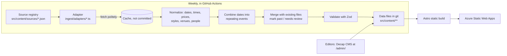

# Long Island Dance Events

**One mobile-friendly list of social dances and live music in Nassau and Suffolk counties, Long Island, New York, plus dance classes.** Listings are collected every week from public calendars, written up in our own words, and linked back to where they came from.

- Swing, West Coast Swing, hustle, salsa, bachata, Argentine tango, ballroom, country and more.
- Dances and live music come first; classes are one tap away.
- Browse by list, month calendar or map, with "This week", "Today" and "This weekend" shortcuts.
- Black, dark red, silver and white design with light and dark modes, built for phones first.
- Every event links to its venue, organizer, teachers, bands and DJs, and each of those pages lists what is coming up.
- Add any event to Google, Outlook or Apple calendars, or subscribe to the whole list (`/events/all.ics`, `/events/rss.xml`).

Status: **MVP (build phases 1-2), live at <https://black-dune-0e0f3e40f.1.azurestaticapps.net>** on Azure Static Web Apps (Free). Search engines are kept away until launch (`ALLOW_INDEXING=false`). See [Roadmap](#roadmap).

## How it works



- **GitOps:** every event, venue, organizer, teacher, band/DJ, dance style and source is a small JSON or YAML file in `src/content/`. Every change is a git commit, and every commit rebuilds the site.
- **Heavy work happens at build time** (scraping, PDF reading, matching). The live site is static files plus thin Azure Functions.
- **Polite collecting:** the bot follows each site's `robots.txt`, waits between requests, caches downloads, and identifies itself (`LongIslandDanceEventsBot/1.0`).
- **Our own words:** titles and summaries are generated from facts (date, time, place, price, style, people). Original text is never republished. Every event records `sourceId` and `sourceUrl`, and the [Sources page](src/pages/sources.astro) credits each source and explains corrections, opt-outs and takedowns.
- **Scope:** only Nassau and Suffolk counties. Towns are checked against `src/data/long-island-places.json` (283 places). Listings in Queens, Brooklyn and elsewhere are skipped and counted in the run report.

## Where the listings come from

| Source | Type | Status |
| --- | --- | --- |
| [The Dance Calendar](https://www.thedancecalendar.com/dance-calendar) | Monthly PDF newsletter | Live (adapter `thedancecalendar`) |
| [Ira's List LI](https://www.iraslistli.com/) | Website | Planned for phase 3 |

New sources are proposed in [docs/source-proposals.md](docs/source-proposals.md) (24 candidates from the discovery pass) and added only after the owner approves them. Organizers can [ask for a correction](https://github.com/michaelsrichter/long-island-dance-events/issues/new?template=listing-correction.yml), [suggest a listing](https://github.com/michaelsrichter/long-island-dance-events/issues/new?template=add-listing.yml) or [opt out](https://github.com/michaelsrichter/long-island-dance-events/issues/new?template=remove-listing.yml).

## Run it on your computer

You need **Node 24** (see `.nvmrc`), **Python 3.12+** and Git.

```powershell
npm ci
npm ci --prefix api
pip install -r ingest/requirements.txt

npm run dev                         # http://localhost:4321, live reload
```

To see exactly what visitors see (production build):

```powershell
$env:BUILD_NOW = npm run -s build-now   # pin "today" to the morning of the latest scrape (optional)
npm run build
npx astro preview --port 4321
```

`BUILD_NOW` is optional. Without it the build uses the real time. Tests set it so results are repeatable as the data changes.

## Collect events (ingest)

```powershell
npm run ingest -- --dry-run                 # show what would change, write nothing
npm run ingest                              # all enabled sources; writes src/content/**
npm run ingest -- --source thedancecalendar
npm run ingest -- --offline                 # reuse cached downloads only (.cache/ingest)
npm run ingest -- --report report.md --json report.json --strict
```

What a run does:

1. Downloads each enabled source (respecting `robots.txt` and `rateLimitSeconds`).
2. Reads the listings. For PDFs, `ingest/pdf/extract_calendar.py` uses font sizes and bold text to find day headings, sections and towns.
3. Skips anything outside Nassau and Suffolk.
4. Matches venues, organizers, teachers, bands/DJs and dance styles against the existing files (by name and aliases). Unknown venues and DJs are created with a review note.
5. Combines dates of the same listing into one repeating event with a rule such as "every Tuesday" or "1st and 3rd Friday of the month".
6. Merges with existing files. It keeps `firstSeen`, respects `lockedFields` (fields an editor fixed by hand), marks ended events as `past`, and never deletes anything. Listings that vanish from a month the source still covers, or that the program is unsure about (confidence below 0.6), become `pending-review` and are hidden until someone checks them.
7. Validates every file with the Zod schemas, writes sorted JSON, and prints a run report.

### Add a new source

1. Get the owner's approval (see [docs/source-proposals.md](docs/source-proposals.md)).
2. Check `robots.txt` and the site's terms. Prefer structured data: schema.org Event JSON-LD, then iCal (`.ics`), then HTML, then PDF.
3. Add `src/content/sources/<id>.json` (copy `thedancecalendar.json`; set `enabled`, `type`, `url`, `attribution`, `rateLimitSeconds`).
4. Add `ingest/adapters/<id>.ts` exporting `adapter: Adapter` with `fetch(ctx)` and `normalize(docs, ctx)` that return `Candidate`s (see `ingest/lib/types.ts`). Reuse the helpers in `ingest/lib/` for times, prices, places and descriptions.
5. Save a small sample of the source in `ingest/fixtures/` and add a golden-file test in `tests/unit/ingest.test.ts` (regenerate with `UPDATE_GOLDEN=1`).
6. Run `npm run ingest -- --source <id> --dry-run`, review the report, then run without `--dry-run` and open a pull request.

No core code changes are needed: `ingest/run.ts` loads `ingest/adapters/<adapter>.ts` by name.

## Data model

| Entity | Folder | Links to |
| --- | --- | --- |
| Event | `src/content/events/*.json` | venue, organizer, performers, instructors, styles, source |
| Venue | `src/content/venues/*.json` | (address, town, map coordinates, parking/access) |
| Organizer (studio, club, DJ series) | `src/content/organizers/*.json` | home venue |
| Instructor (teacher) | `src/content/instructors/*.json` | organizers, styles |
| Performer (band or DJ) | `src/content/performers/*.json` | genres |
| Dance style | `src/content/styles/*.yml` | aliases used for matching |
| Source | `src/content/sources/*.json` | adapter, last run status and counts |

Schemas: [`src/lib/schemas.ts`](src/lib/schemas.ts). Repeating events use a small, tested subset of iCalendar RRULE ([`src/lib/rrule.ts`](src/lib/rrule.ts)). Field-by-field details: [docs/content-model.md](docs/content-model.md).

## Editing (CMS)

Editors use **Decap CMS** at `/admin/`, signing in with GitHub. Each save becomes a commit or pull request.

> **Deviation from the brief:** the brief asked for Keystatic. This project keeps **Decap CMS** because the base template (`michaelsrichter/community-site-starter` and the community-site-kit) is built and tested around it: OAuth bridge Function, generated config, CSP, editor guide and e2e tests. Both are git-backed, so the GitOps model is the same. Recorded in [docs/decision-log.md](docs/decision-log.md).

- CMS source: `cms/config.yml` (generated into `public/admin/config.yml` on install/build).
- Editor how-to: [docs/editor-guide.md](docs/editor-guide.md).
- Sign-in needs a GitHub OAuth app; see [docs/deployment.md](docs/deployment.md).

## Tests and quality checks

```powershell
npm run lockfile:check          # package-lock.json must point at registry.npmjs.org
npx astro check                 # types + content validation
npm test                        # unit tests, incl. ingest golden files (needs PyMuPDF for the PDF test)
npm run test:py                 # PDF extractor tests
npm test --prefix api           # Azure Functions tests
$env:BUILD_NOW = npm run -s build-now; $env:ALLOW_INDEXING = 'true'; npm run build
npm run test:links              # internal links and #anchors
npx playwright test             # journeys, filters, map, calendar, CMS, axe (WCAG 2.2 AA), phone + desktop
npx lhci autorun                # Lighthouse budgets (CI; on Windows run Lighthouse per URL instead)
```

CI (`.github/workflows/ci.yml`) runs all of these on every pull request, plus a gitleaks secret scan.

> If your computer installs npm packages from a private mirror, run `npm run lockfile:normalize` before committing.

## Repository layout

```text
src/content/      data files (events, venues, organizers, instructors, performers, styles, sources, faqs, pages, settings)
src/data/         Long Island place list used for the Nassau/Suffolk check
src/lib/          schemas, repeating-event rules, event resolution, SEO, calendar export
src/pages/        Astro pages (events, calendar, map, venues, organizers, teachers, bands & DJs, styles, sources)
ingest/           weekly collector: run.ts, adapters/, lib/, pdf/ (Python extractor), fixtures/
api/              Azure Functions (CMS sign-in bridge, telemetry)
cms/              Decap CMS configuration
infra/            Bicep + deploy script for Azure Static Web Apps (phase 6)
tests/            unit (vitest) and end-to-end (Playwright) tests
docs/             decisions, content audit, content model, architecture, editor guide, deployment
```

## Roadmap

1. ✅ Scaffold: Astro + Decap, entity schemas, dance-style list, CI.
2. ✅ The Dance Calendar end-to-end (PDF) → data files → browsable, filterable site. **MVP checkpoint.**
3. Ira's List LI adapter; duplicate detection (exact match key, then local embeddings with bge-small: ≥ 0.9 merge, 0.8-0.9 human review).
4. Submit-an-event form (to a moderation queue).
5. Admin area (GitHub sign-in, `admin` role): moderation queue, source panel, feedback and bug inbox (Table Storage + GitHub issues).
6. Azure: ✅ Static Web Apps Free + managed Functions + monitoring (Bicep, `infra/`). Storage account comes with phase 5, when its first Functions need it.
7. Weekly GitHub Actions run that opens a pull request with the run report and @mentions the owner (GitHub sends the email); an issue is filed if a source breaks.
8. Discovery of more sources (owner approves each), docs, launch.

## Cost

Designed for about **$0/month**: Azure Static Web Apps Free tier, managed Functions, one Storage account (pennies), free GitHub Actions minutes for the weekly run, OpenStreetMap tiles and geocoding (Nominatim, 1 request per second).

## Security and privacy

- No secrets in the repo. Deployment tokens live in GitHub Actions secrets; OAuth secrets in Azure app settings.
- Strict Content Security Policy generated at build time (`scripts/postbuild.mjs`).
- Analytics are consent-gated; first-party telemetry strips unknown fields.
- We do not store people's private details. Public contact details come from public listings only.

## Credits

Built from [community-site-starter](https://github.com/michaelsrichter/community-site-starter) with the community-site-kit. Map data © OpenStreetMap contributors. Font: Inter by Rasmus Andersson (SIL Open Font License), via Fontsource. Sample dance photos: Thomas Quine, CC BY 2.0 (Wikimedia Commons), credited on each page they appear. Event facts come from the sources credited on the [Sources page](src/pages/sources.astro).
