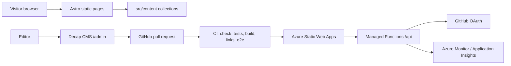

# Community site starter

A reusable, rebrandable starter for volunteer dance and community organization websites. The included sample organization is fictional: **Riverbend Swing Dance Club** in **Riverbend Valley**. The sample exists so a new team can see the whole site working before replacing names, venues, dates, photos, colors, OAuth settings and analytics IDs.

Derived from the Swing Dance Long Island website: https://github.com/michaelsrichter/sdli-website

## What this is for

This starter helps a small volunteer organization answer the questions visitors ask first:

- Is there an event coming up?
- When and where is it?
- Is there a beginner lesson?
- How much does it cost?
- Do I need a partner?
- Can I add it to my calendar, get directions, or share it?
- What else is happening in the local community?

It is intentionally static-first and content-first. Editors change Markdown/YAML files through Decap CMS, pull requests get previews and tests, and Azure Static Web Apps hosts the site cheaply with automatic HTTPS.

## Create your site from this template

```powershell
gh repo create <owner>/<name> --template michaelsrichter/community-site-starter --public --clone
cd <name>
npm ci
npm ci --prefix api
npm run dev
```

Then run the rebrand helper:

```powershell
node scripts/rebrand.mjs --name "Your Dance Club" --short "Your Club" --slug your-club --domain https://www.example.org --email info@example.org --region "Your Region"
```

Finish the manual steps in [REBRAND.md](REBRAND.md).

## Use with the Copilot plugin

This template is designed to be used with the Copilot plugin **community-site-kit**, which provides skills and agents for content audits, legacy-site mapping, rebranding and launch checks.

```powershell
copilot plugin marketplace add michaelsrichter/community-site-kit
copilot plugin install community-site-kit@community-site-kit
```

Recommended workflow:

1. Ask the plugin to audit the old site or source folder.
2. Create redirects and a content replacement plan.
3. Use this starter as the implementation target.
4. Run the full verification before publishing.

## Features

### Visitor experience

- Homepage hero with the next home-organization event.
- Next three home events shown first, with a **Show more** toggle for longer lists.
- Community events listed after home events and clearly labeled.
- Event detail pages with lesson time, dancing time, venue, prices, lineup, organizer, source, share buttons and print action.
- Add-to-calendar support: per-event `.ics`, Google Calendar, Outlook personal, Outlook work/school and subscribable feeds.
- Event list, month calendar and Leaflet/OpenStreetMap venue map.
- Humanized relative dates with a pinned test clock.
- Light/dark/auto theme switch with no-JS fallback.
- Accessible share dialog fallback when native sharing is unavailable.
- No-JS event list that still shows all home events.

### Editor experience

- Decap CMS 3 at `/admin/`.
- GitHub OAuth bridge in Azure Static Web Apps managed Functions.
- Editorial workflow pull requests, preview links and tests.
- Content collections validated by Zod schemas.
- Required explicit `published` booleans for events, series, FAQs, announcements and gallery albums.
- Focus-point image crops and alt text validation.
- Home series plus one-off event overrides for cancellations, band nights and special dates.

### Engineering and operations

- Astro static site with strict TypeScript.
- Custom image service that supports focus crops and avoids upscaling.
- CSP generated at build time with hashes for allowed inline scripts.
- Postbuild legacy redirect stub generation.
- Link checker for internal links and fragments.
- Unit tests, API tests and Playwright e2e/axe/mobile tests.
- GA4 and Microsoft Clarity are consent-gated and optional.
- First-party OpenTelemetry endpoint can send metrics/events to Azure Monitor.
- Bicep + `infra/deploy.ps1` provisioning.
- GitHub Actions for CI, deployment, CodeQL, geocoding and link checks.

## Architecture summary



Key design choices are documented in [docs/architecture.md](docs/architecture.md) and [docs/decision-log.md](docs/decision-log.md).

## Prerequisites

- Node.js version from `.nvmrc`.
- npm.
- Git.
- GitHub CLI (`gh`) for deployment automation.
- Azure CLI (`az`) for Azure provisioning.
- A GitHub repository for the new site.
- Optional: a custom domain and DNS access.

Check versions:

```powershell
node --version
npm --version
git --version
gh --version
az version
```

## Local development

Install dependencies:

```powershell
npm ci
npm ci --prefix api
```

Run the site:

```powershell
npm run dev
```

Run the local Decap CMS proxy in another terminal if you want file-based CMS editing:

```powershell
npm run cms:local
```

Then open:

- Site: <http://localhost:4321/>
- CMS: <http://localhost:4321/admin/>

Build locally with deterministic dates:

```powershell
$env:BUILD_NOW='2026-10-01T22:00:00-04:00'
npm run build
npm run test:links
```

## Repository structure

```text
.github/                    GitHub Actions, issue forms and PR template
api/                        Azure Static Web Apps managed Functions
  src/functions/oauth.js    GitHub OAuth bridge for Decap CMS
  src/functions/telemetry.js First-party telemetry endpoint
cms/config.yml              Source Decap CMS config
public/admin/               Admin shell and generated CMS config
infra/                      Bicep and deployment script
scripts/                    Build, CMS, geocoding, redirects, rebrand, smoke checks
src/assets/uploads/         Reusable sample images with open licenses
src/components/             Astro UI components
src/content/                Editable content collections
src/data/                   Legacy redirects and optional history data
src/lib/                    Pure logic and shared helpers
src/pages/                  Astro routes
tests/unit/                 Vitest unit tests
tests/e2e/                  Playwright e2e, axe and mobile tests
docs/                       Architecture, editor and launch documentation
```

## Content model summary

The editable content lives under `src/content/`:

- `settings/site.yml`: organization names, region, contact details, membership, prices, map center and default venue.
- `series/`: recurring weekly or monthly schedules.
- `events/`: one-time events and one-date changes to a series.
- `venues/`: addresses, coordinates, parking, accessibility and map links.
- `organizers/`: community groups listed on the site.
- `instructors/` and `performers/`: teachers, DJs and bands.
- `styles/`: dance style taxonomy used for tags and filters.
- `pages/`: editable long-form pages.
- `faqs/`: questions shown on the FAQ and New to Swing pages.
- `announcements/`: optional site-wide banners.
- `gallery/`: albums and homepage slideshow images.

See [docs/content-model.md](docs/content-model.md) for every field.

## CMS operation

The CMS source is `cms/config.yml`. During install/build, `scripts/build-cms-config.mjs` writes `public/admin/config.yml`.

Important Decap rules in this project:

- `sortable_fields` must be a list.
- Every publishable entry needs an explicit `published` boolean.
- Do not add a `media_library` block.
- Images live under `src/assets/uploads/`.
- Use relation fields where possible so event references remain valid.

CMS sign-in uses a GitHub OAuth app. See [docs/editor-guide.md](docs/editor-guide.md) for setup, troubleshooting and editor tasks.

## Auth setup for Decap CMS

Create a GitHub OAuth app for the live domain:

- Homepage URL: `https://<domain>`
- Authorization callback URL: `https://<domain>/api/callback`
- Uncheck **Expire user access tokens**.

Store the values as Azure Static Web Apps app settings:

- `GITHUB_OAUTH_CLIENT_ID`
- `GITHUB_OAUTH_CLIENT_SECRET`
- `ALLOWED_HOSTS=<domain>,<azure-host>`

When you add a custom domain, update the OAuth callback URL to match the new domain. Enterprise Managed User accounts cannot be collaborators on personal repositories, so use an organization-owned repository if your editors use EMU accounts.

## Azure provisioning

Provision a new Static Web App and monitoring resources:

```powershell
./infra/deploy.ps1 -Name <slug> -Repo <owner/repo>
```

With a custom domain:

```powershell
./infra/deploy.ps1 -Name <slug> -Repo <owner/repo> -CustomDomain www.example.org
```

The script derives names:

- Resource group: `rg-<slug>-web`
- Static Web App: `swa-<slug>-web`
- Monitoring: `log-swa-<slug>-web`, `appi-swa-<slug>-web`

It sets the deployment token secret and GitHub variables for `SITE_URL` and `ALLOW_INDEXING`.

## Deployment

GitHub Actions builds `dist/` and uploads it to Azure Static Web Apps. The API folder is uploaded as managed Functions.

Before launch, use:

- `SITE_URL=https://example.org` or the Azure preview host.
- `ALLOW_INDEXING=false`.

At launch, use:

- `SITE_URL=https://www.example.org` or the chosen production origin.
- `ALLOW_INDEXING=true`.

## Custom domain and DNS

See [docs/dns-cutover.md](docs/dns-cutover.md). Typical records:

- `CNAME www -> <static-web-app>.azurestaticapps.net`
- `TXT _dnsauth.www -> <Azure validation token>`

Update the GitHub OAuth callback after the domain is active.

## Rollback

See [docs/rollback.md](docs/rollback.md). In short:

1. Re-run the previous successful deployment or revert the commit.
2. Put `ALLOW_INDEXING=false` on any temporary host.
3. Move DNS back only if necessary.
4. Keep redirects stable unless the rollback returns to the old site.

## Testing

Run the full local verification:

```powershell
npm ci
npm ci --prefix api
npx astro check
npx vitest run
$env:BUILD_NOW='2026-10-01T22:00:00-04:00'; npm run build
npm run test:links
npm test --prefix api
npx playwright test
```

Playwright uses the built site through Astro preview. It covers visitor journeys, home-first ordering, sharing, calendars, map pins, CMS loading, legacy redirects, no-JS behavior, axe scans, keyboard behavior and 320 px screens.

## Troubleshooting

| Symptom | Likely cause | Fix |
| --- | --- | --- |
| CMS says it cannot load config | `public/admin/config.yml` missing or invalid | Run `npm run cms:config`; check `cms/config.yml` indentation. |
| CMS sign-in returns 503 | OAuth app settings missing or host not allowed | Set `GITHUB_OAUTH_CLIENT_ID`, `GITHUB_OAUTH_CLIENT_SECRET`, `ALLOWED_HOSTS`. |
| GitHub says callback mismatch | OAuth app callback still points at an old domain | Update callback to `https://<domain>/api/callback`. |
| An event does not appear | `published: false`, `status: draft`, past date, or invalid series override | Check frontmatter and run `npm test`. |
| Map pin missing | Venue has no latitude/longitude | Run `npm run geocode` or enter coordinates manually. |
| Link checker fails for `example.org` | A sample URL uses the site origin and is treated as internal | Use `example.com` for placeholder external links. |
| Build fails on inline styles | CSP guard found `style=""` in generated HTML | Move styling to CSS classes. |
| Playwright port busy | A preview server is already running on 4321 | Stop it or set `E2E_PORT`. |
| Rare Windows build crash with a libuv assertion | Known intermittent platform issue | Re-run the same build command. |
| CI step "Lockfiles use the public npm registry" fails, or Dependabot reports `private_source_authentication_failure` | `npm install` ran on a machine that uses a private npm mirror (company proxy, Azure Artifacts, Artifactory), which wrote the mirror's URLs into `package-lock.json` | Run `npm run lockfile:normalize` and commit. Installs on that machine still go through the mirror. |

## Cost

For a small volunteer site, expected Azure cost is near zero:

- Azure Static Web Apps Free SKU: no hosting charge for typical usage.
- Managed Functions: included with SWA usage limits.
- Log Analytics daily cap defaults to 0.1 GB/day and 30-day retention.
- Third-party analytics are optional.

Review Azure pricing before raising retention, daily caps or SKU.

## Security and privacy

- Do not commit secrets.
- OAuth client secrets belong in Azure app settings.
- Deployment tokens belong in GitHub Actions secrets.
- Analytics are consent-gated.
- Telemetry strips unknown fields and rejects script-like values.
- CSP is generated in `scripts/postbuild.mjs`.
- Admin routes use a separate CSP.
- The site should not store member databases or private rosters in public content files.

## Known limitations

- This is a static public website, not a membership system.
- Decap CMS edits files; complex workflows still require pull request review.
- Venue geocoding is best-effort. Editors can override coordinates.
- Nominatim is rate-limited to one request per second.
- The starter includes fictional sample content and open-licensed photos; replace them before launch.
- The sample legal/privacy text is not legal advice.
