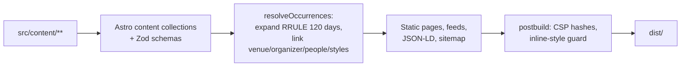
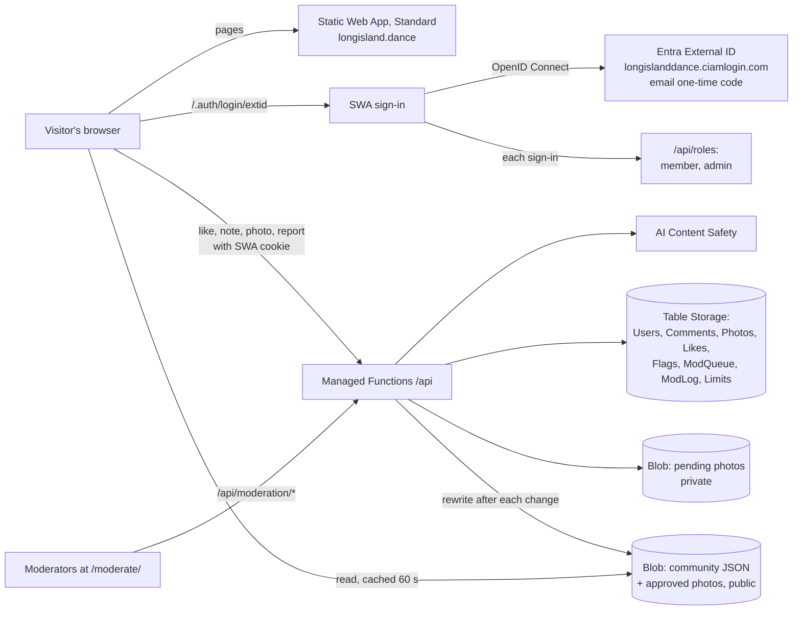
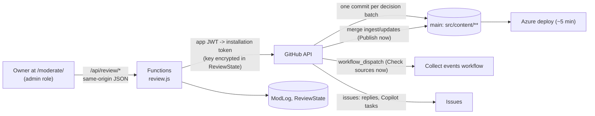
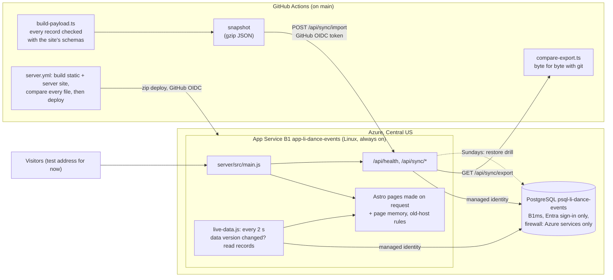

# Architecture

Long Island Dance Events is a static website built from data files in git. All heavy work (collecting, PDF reading, matching) runs in GitHub Actions or on a developer's computer. The live site is static files on Azure Static Web Apps (Free tier) plus a few thin Azure Functions.

## System diagram

## Ingest pipeline

For a plain-language walk-through of what runs every week, where, when and what it costs, see
[how-weekly-updates-work.md](how-weekly-updates-work.md).

| Step | Code | Notes |
| --- | --- | --- |
| Load registries | `ingest/lib/registry.ts` | Venues, organizers, teachers, bands/DJs, styles and their `aliases`; Long Island place list. |
| Fetch | `ingest/lib/fetch.ts` | Honors `robots.txt`, waits `rateLimitSeconds` between requests to a host, conditional GET, cache in `.cache/ingest/` (never committed). User-Agent `LongIslandDanceEventsBot/1.0 (+repo URL)`. |
| Adapter | `ingest/adapters/<id>.ts` | `fetch(ctx)` returns documents; `normalize(docs, ctx)` returns dated `Candidate`s. Loaded by name from the source file's `adapter` field. Most sources use a generic adapter configured in their source file: `ical` (calendar feeds), `jsonld` (schema.org Event data, event sitemaps) or `htmllist` (dated web page lists, Squarespace event lists), all sharing `ingest/lib/structured.ts`. `agentmail` reads email newsletters from the project inbox (senders in `catalog/newsletters.json`) with the `htmllist` reader; an adapter can set `quietWhenNoDocuments` so "no new issue" is not a failure. |
| PDF | `ingest/pdf/extract_calendar.py` | Day headings are uppercase and larger than body text; sections and towns are bold. Outputs rows: date, section, town, text, page. |
| Normalize | `ingest/lib/times.ts`, `prices.ts`, `text.ts`, `describe.ts` | Times ("7:30-11pm", "lesson at 7"), prices ("$15/$20 members"), styles, venues and people; titles and summaries in our own words. |
| Scope | `src/data/long-island-places.json` | Keeps only Nassau and Suffolk; counts the rest as "out of area". |
| Collapse | `ingest/lib/collapse.ts` | Same listing on many dates → one event with an RRULE (weekly, or monthly "Nth weekday" only when stated or clearly repeated). Themed nights stay one-off. |
| Merge | `ingest/lib/merge.ts` | Match by `matchKey`; keep `firstSeen`; respect `lockedFields`; ended → `past`; vanished or low confidence → `pending-review`; never delete. |
| Validate + write | `src/lib/schemas.ts`, `ingest/lib/store.ts` | Zod validation; stable key order for small diffs. Invalid records are reported, not written. |
| Report | `ingest/run.ts` | Markdown + JSON: per-source status, found/kept/out-of-area, created/updated/past/needs-review. |

## Build

- `BUILD_NOW` (optional) fixes "today" for repeatable tests. Production builds use the real time.
- Events that end after the page was built are hidden by a small script (`src/scripts/expire.ts`), so lists stay correct between rebuilds.
- **Saved share pictures (P55).** Drawing share pictures was most of the build. `src/lib/og.ts` saves each finished picture (and each cropped photo or logo) in `.cache/og/` under a fingerprint of everything that goes into it: the card's facts and photo, the size, the drawing code in `og.ts`, the fonts and the satori and sharp versions. A build with the same fingerprint reuses the file. The deploy and CI workflows keep `.cache/og/` and Astro's resized photos (`node_modules/.astro/assets/`) between runs with `actions/cache`, and drop pictures not used for 14 days. `OG_CACHE_DIR=off` turns it off.

## Routes

| Route | Purpose |
| --- | --- |
| `/` | Search, quick links (Today, This weekend, Classes, Live music, Map) with counts, today's and this week's events, dance styles. |
| `/events/` | All upcoming events with filters (when, type, style, town, county, day, price, level, venue, teacher/band/DJ, text). Filters live in the URL. Works without JavaScript. |
| `/events/calendar/`, `/events/calendar/<yyyy-mm>/` | Month grid on desktop, agenda list on phones. |
| `/events/map/` | Leaflet + OpenStreetMap; star pins for dances and live music, round pins for classes; list fallback. |
| `/events/<date>-<id>/` | One date of an event: when, where, price, organizer, teachers, bands/DJs, repeat rule, other dates, add to calendar, share, source credit, "Report a problem". |
| `/events/<slug>/calendar.ics` | One date as an iCalendar file. |
| `/events/<slug>/social.png`, `social-square.png` | Share pictures for dates in the next 21 days (P46). |
| `/og/series/<event id>.png`, `/og/<type>/<id>.jpg`, `/og/page/<page>.png` | Share pictures: one per event series for later dates, one per venue, band/DJ, teacher, organizer and dance style (with its photo or logo), one per list page (P47). |
| `/events/all.ics`, `/events/rss.xml` | Subscribe to everything. |
| `/events/past/`, `/events/past/<year>/` | Archive. |
| `/venues/`, `/organizers/`, `/instructors/`, `/performers/`, `/styles/` and `/<type>/<id>/` | Directory pages; each lists its upcoming events. |
| `/sources/` | Credits every source, explains how collection works, corrections, opt-out and takedown. |
| `/faq/`, `/about/`, `/privacy/` | Plain-language help. |
| `/admin/` | Decap CMS. Each save is a commit on `main` and goes live with the next deploy (no draft pull request; P55). |
| `/api/auth`, `/api/callback`, `/api/telemetry` | CMS sign-in bridge and first-party telemetry (Azure Functions). |
| `/.auth/login/extid`, `/.auth/logout`, `/.auth/me` | Visitor sign-in (Static Web Apps + Entra External ID). |
| `/account/`, `/saved/`, `/community-rules/` | Your account (name, age check, download, delete), your saved events (private), community rules. |
| `/moderate/` | **Review center** (editors only, decision P51): tabs To do, Held listings, New events, Sources, Messages, Community posts (the moderation queue) and Log. Route rule `allowedRoles: ["admin"]`; signed-out visitors see the "You're signed out" page with a Sign in button that comes back here; signed-in non-editors see `/not-allowed/`. Its own CSP (only its script hashes; `form-action` also allows `https://github.com` for the one-time GitHub App setup). |
| `/api/review/*`, `/api/github-setup` | Review center API (editors only; see below). |
| `/api/roles`, `/api/me*`, `/api/likes`, `/api/saves`, `/api/comments`, `/api/photos`, `/api/flags`, `/api/moderation/*` | Community API (see below). |
| `/community-pages.json` | Pages that accept likes, notes and photos (the API checks keys against it). |
| `/saved-events.json` | Next dates, time and place of every event series, for the Saved events page (built with the site). |
| `/towns/`, `/towns/<town>/` | Dancing town by town: what's coming up in each town, its places, styles and nearby towns (P48). Towns with nothing coming up are `noindex`. |
| `/llms.txt`, `/llms-full.txt`, `/events/upcoming.json` | Guides for AI assistants: summary with links, every upcoming event as one line, and the same as JSON (P48). |
| `/robots.txt` | Welcomes search engines and AI assistants by name; keeps `/admin/`, `/api/` and `/.auth/` private. |
| `/sitemap-index.xml`, `/sitemap-<kind>.xml`, `/sitemap-state.json` | Sitemaps by kind (pages, events, venues, people, styles, towns) with real last-changed dates and pictures; the state file holds each page's fingerprint (P48). |

## Security and privacy

| Area | Decision |
| --- | --- |
| Public pages | Static; no server rendering. |
| Secrets | GitHub Actions secrets and Azure app settings only; gitleaks scans history in CI. |
| CSP | Generated at build time with script hashes; inline styles rejected; separate admin CSP. |
| CMS sign-in | GitHub OAuth bridge; token goes only to the CMS window. |
| Collecting | `robots.txt` honored, rate limits, identifying User-Agent, cache. Original text and PDFs are never committed. |
| Personal data | Only public business contact details from public listings. Private contacts and members' names are not recorded. |
| Analytics | Consent-gated; telemetry strips unknown fields and rate-limits. |

## Community features (likes, notes, photos)

Decided in P21 (details and options: [proposals/social-sign-in-and-community-features.md](proposals/social-sign-in-and-community-features.md)). Pages stay static: approved notes, photos and like counts are read by the browser straight from Blob Storage; only writes go through Functions.

| API | What it does |
| --- | --- |
| `POST /api/roles` | SWA `rolesSource`: after each sign-in, saves the profile (no email) and returns `member` (unless banned or under 13) and `admin` (emails in `ADMIN_EMAILS`). |
| `GET /api/me`, `POST /api/me/profile`, `GET /api/me/likes`, `GET /api/me/saves`, `GET /api/me/export`, `POST /api/me/delete` | Profile (display name, neutral age question: only "13+" and "18+" are kept), my likes (all of them when no `keys` are given, for list pages), my saved events, download, delete. |
| `POST /api/likes` | One like per person per page (`Likes`: PartitionKey page key, RowKey user id). Like buttons with counts are on every event card and at the top of every detail page (`Reactions.astro`, `scripts/reactions.ts`); counts come from `community/counts/<type>.json`. |
| `POST /api/saves` | Save or unsave an event (events only). A private bookmark in `UserItems` (`save~<page key>`), never public; listed at `/saved/`, included in the download and removed with the account. |
| `POST /api/comments` | Notes (AI: 0 publish, 2 queue, 4+ reject; links/phones/emails queue) and private corrections (always queue; never posted anywhere public). |
| `POST /api/photos` | 18+; type sniffed, EXIF/GPS removed, 480/1024/2048 px WebP, AI image check, then **always** the human queue. |
| `POST /api/flags` | Reports; 3 people (or a safety reason) hide the item until reviewed. |
| `/api/moderation/queue`, `photo`, `decide`, `ban`, `unban`, `log` | Moderation (route rule requires `admin`). Every decision is written to `ModLog`. |

Page keys are `<type>:<id>` (`event:<series id>`, `venue:<id>`, `organizer:`, `instructor:`, `performer:`, `style:`). Public files: `community/<type>/<id>.json`, `community/counts/<type>.json`, `photos/<type>/<id>/<photo id>-<size>.webp`.

## Review center (owner decisions)

Decided in P51 (no database: P52). The page at `/moderate/` is static; every section loads live from `/api/review/*`, which reads and writes the GitHub repository as a **GitHub App** installed only on this repository. Git stays the master copy: each decision is one commit on `main`, and the normal deploy publishes it a few minutes later (usually about 5).

| API | What it does |
| --- | --- |
| `GET /api/review/status` | GitHub connection (app set up? installed?) and the community queue count. |
| `GET/POST /api/review/listings` | Held listings (`status: pending-review` on `main`, read with one GraphQL call and cached per commit) with reasons parsed from `reviewNotes`; decisions publish, fix (start time, venue, band or DJ, town), cancel, hide (`status: hidden`) and undo. Changed fields go into `lockedFields`; files keep the `ingest/lib/store.ts` layout (`api/src/lib/content-files.js`, checked by `tests/unit/review-content.test.ts`). |
| `GET/POST /api/review/collected` | The rolling `ingest/updates` pull request: run report, check runs, mergeable; **Publish now** merges it (merge commit) only when checks passed and the head commit is the one the owner saw. |
| `GET/POST /api/review/sources`, `POST /api/review/run`, `POST /api/review/candidate` | Sources grouped by next step (`api/src/lib/review-data.js`), `ingest-failure` and `source-discovery` issues, recent runs; switch on/off and permission answers (commits); run the Collect workflow for a cadence or one source; new websites: Copilot task or `owner-no` in `catalog/search-triage.json`. |
| `GET/POST /api/review/messages` | Open visitor issues (automation labels excluded), reply and close. |
| `POST /api/review/copilot` | An issue labeled `copilot-task` with the context. Copilot does not start it by itself: a person starts a Copilot session with the link (or assigns it to Copilot and checks for an error reply). |
| `GET /api/review/outreach`, `GET /api/review/outreach/draft`, `POST /api/review/outreach/send`, `GET /api/review/outreach/thread` | Emails to website owners through the site's AgentMail inbox (P53): ready-made drafts, review-then-send (production only; previews dry-run), 30-day and 14-day limits, conversations labeled `outreach` + `source-<id>`, and the source's `permission` updated by a commit. |
| `POST /api/review/snooze`, `GET /api/review/log` | Snoozes (`ReviewState`), and the shared decision log (`ModLog`). |
| `POST /api/review/github/start`, `GET /api/github-setup` | One-time setup with GitHub's app-manifest flow: a single-use state (1 hour), the code is swapped for the app's private key, which is stored encrypted (AES-256-GCM, key in `REVIEW_SECRET_KEY`). The app must belong to the repository owner. |

## Live database and server (phases 1 and 2 of the move, P54, P56 to P60)

The owner approved moving the site to a live PostgreSQL database ([proposals/postgres-live-site.md](proposals/postgres-live-site.md)). Git is still the master copy: the database holds an exact copy of `src/content/**`, refreshed every night and after every content change, and checked byte for byte each time. An always-on **App Service** server (P58) makes the same pages as today's site **from the database records** (P59: it checks for changes every 2 seconds, so a change shows in about 2 seconds) at the test address https://new.longisland.dance; longisland.dance still comes from Static Web Apps until switch day. Setup and restore: [deployment.md](deployment.md#live-database-and-server-phases-1-and-2).

| Piece | Where | Notes |
| --- | --- | --- |
| Design | `server/migrations/001_initial.sql` | One table per kind of record with the exact file text (`raw`) and the parsed record (`doc jsonb`), generated columns, full-text search and `pg_trgm`; `event_dates`, `places`, `history` (append-only, enforced by a trigger), state tables for later phases, report views. |
| Server | `server/` (plain Node, ES modules) | `src/main.js` (HTTP, compression), `src/app.js` (which code answers which address), `src/routes/` (`GET /api/live`, `GET /api/health`, `POST /api/sync/import`, `GET /api/sync/export`, `POST /api/sync/drill`; the sync endpoints accept only GitHub OIDC tokens from `database-sync.yml` on `main`), `src/site.js` (files, pages, page memory, resized photos), `src/rules.js` (the rules of `staticwebapp.config.json`). Design changes are applied once, under an advisory lock, on first use. |
| Records on the server (P59) | `src/lib/collections.ts` (what pages import instead of `astro:content`), `src/lib/collection-schemas.ts` (one list of schemas), `src/lib/live-store.ts` (server build only), `server/src/live-data.js`, `server/src/sitemap-state.js` | Static build: Astro's own functions. Server: every record's file text from PostgreSQL, read with Astro's readers and the same schemas and pictures, sorted like Astro's data store; a bad record keeps its last good version. Sitemap dates in `sitemap_state`. |
| Speed (P61, P62) | `server/src/prepare.js`, `server/src/site.js`, `server/src/telemetry.js` | Every sitemap page prepared in the background after each change (using about a quarter of the processor), kept as Brotli until the data or the day changes; pictures sent from disk; a small, capped memory for the 1.9 GB B1 machine; monitoring started inside the server instead of App Service's separate agent. |
| Pages on the server | `astro.config.mjs` (`ASTRO_TARGET=server`), `server/astro-adapter/`, `src/lib/page-props.ts`, `src/lib/freshness.ts`, `scripts/live/build-server.mjs` | The same pages, built a second time for the server. Dynamic pages find their props by calling their own `getStaticPaths()` (remembered until the data changes or a new day starts on Long Island). Photos keep their `/_astro/` addresses: the server gives Astro the build's photo-naming hook, and the static build's resized photos are deployed with it. Share pictures (P64) are made by the pages, so a live edit shows on them too: each is saved once under a fingerprint of its card in `/home/data/og-cache` (unused ones removed after 30 days), the static build's pictures of the same commit come with the package as a read-only seed (`server/site/og-seed`), the server draws one at a time, and pictures are never kept in its memory. |
| Sign-in and community `/api` (P60) | `server/src/identity.js`, `server/src/api-adapter.js`, `server/src/functions-shim.cjs`, `infra/live/main.bicep` (`authsettingsV2`, Key Vault), `infra/live/copy-secrets.ps1` | App Service built-in sign-in with the `extid` provider (14-day sessions); the server maps each account to its Static Web Apps user id and roles, then runs `api/src/functions/*.js` unchanged with Static Web Apps' principal header. `/api/session` for `whoAmI()`. |
| Same as the static site | `scripts/live/parity.mjs`, `scripts/live/load-db.mjs`, `scripts/live/change-check.mjs`, `server.yml` | Before every deploy, the server reads a real PostgreSQL loaded from the same commit; every file of the static site must come back identical (5,629 of 5,629 on 2026-10-06; pictures made on another system are compared by pixels), and a changed venue name must show on its page within 10 seconds (2.1 s). |
| Snapshot and check | `scripts/db/` | `build-payload.ts` (records, event dates 120 days ahead with `src/lib/event-core.ts`, places), `compare-export.ts`. |
| Tests | `server/test/`, `tests/unit/db-payload.test.ts`, `tests/unit/freshness.test.ts` | Real PostgreSQL 17 in CI (`server.yml`): design, sync, history, refusal to empty a table, export, drill, the full round trip with the real content; the server's headers, redirects, page memory, photo cache and path safety. |
| Infrastructure | `infra/live/main.bicep`, `infra/live/custom-domain.bicep` | Central US (P57). App Service B1 (P58), no CDN. Host names with free managed certificates, one deployment per name (new.longisland.dance, P59). No private network: the database firewall admits only Azure services, with Entra sign-in only. The rest of the site moves to Central US in phase 2; the Static Web App is deleted on switch day ([deployment.md](deployment.md#moving-the-rest-to-central-us)). |
## Planned (later phases)

- **Duplicates (phase 3):** exact `matchKey` pass, then local embeddings (bge-small, run in CI, no API key). Cosine ≥ 0.9 merges; 0.8-0.9 goes to a human review queue.
- **Admin (phase 5):** shipped as the review center (P51): held listings, publishing collected events, sources and visitor messages, next to the moderation queue.
- **Azure (phase 6):** Bicep for Static Web App, Storage account (Tables for mutable state, Blobs for raw snapshots) and settings.
- **Scheduled runs (built):** `.github/workflows/ingest-scheduled.yml` runs each source on its `cadence` (daily, Monday + Thursday, Sunday), updates one rolling pull request with the report, requests review from and @mentions the owner on Sundays (the weekly email), and files an issue with a metadata-only snapshot when a source finds nothing or returns invalid data. `report-database.yml` builds the SQLite report database; `source-discovery.yml` searches for new sources monthly (85 Long Island-wide queries plus one twelfth of the town-by-town matrix in `catalog/search-matrix.json`). See [database-plan.md](database-plan.md) and [how-weekly-updates-work.md](how-weekly-updates-work.md).

## Known tradeoffs

- Weekly freshness: a change made by an organizer mid-week shows up at the next run (or sooner if an editor fixes it in the CMS).
- PDF layouts can change. The golden-file test fails loudly when that happens.
- Repeating rules are a tested subset of iCalendar RRULE; unusual patterns are stored as explicit date lists.
