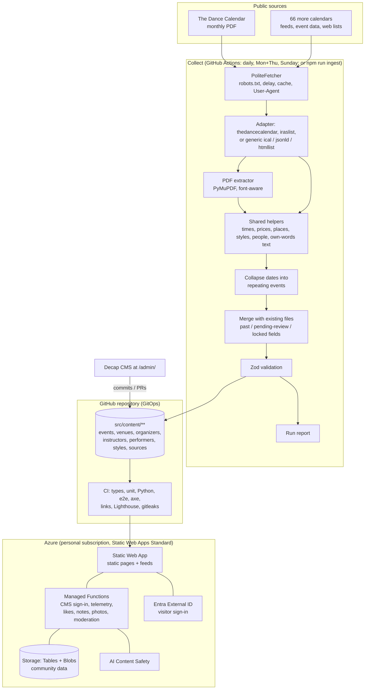
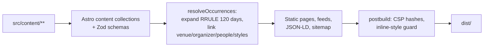
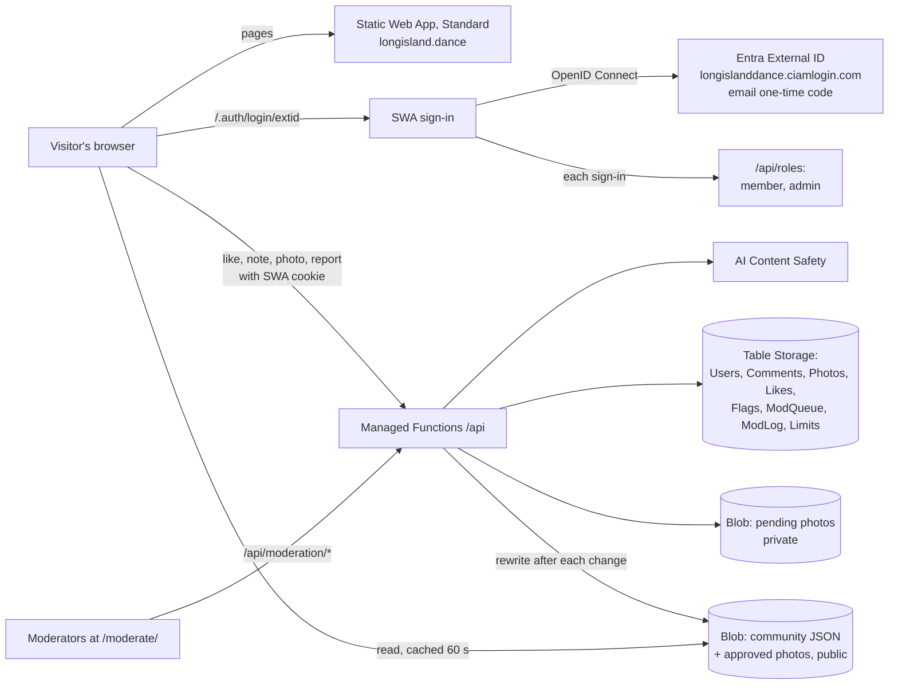

# Architecture

Long Island Dance Events is a static website built from data files in git. All heavy work (collecting, PDF reading, matching) runs in GitHub Actions or on a developer's computer. The live site is static files on Azure Static Web Apps (Free tier) plus a few thin Azure Functions.

## System diagram

## Ingest pipeline

For a plain-language walk-through of what runs every week, where, when and what it costs, see
[how-weekly-updates-work.md](how-weekly-updates-work.md).

| Step | Code | Notes |
| --- | --- | --- |
| Load registries | `ingest/lib/registry.ts` | Venues, organizers, teachers, bands/DJs, styles and their `aliases`; Long Island place list. |
| Fetch | `ingest/lib/fetch.ts` | Honors `robots.txt`, waits `rateLimitSeconds` between requests to a host, conditional GET, cache in `.cache/ingest/` (never committed). User-Agent `LongIslandDanceEventsBot/1.0 (+repo URL)`. |
| Adapter | `ingest/adapters/<id>.ts` | `fetch(ctx)` returns documents; `normalize(docs, ctx)` returns dated `Candidate`s. Loaded by name from the source file's `adapter` field. Most sources use a generic adapter configured in their source file: `ical` (calendar feeds), `jsonld` (schema.org Event data, event sitemaps) or `htmllist` (dated web page lists, Squarespace event lists), all sharing `ingest/lib/structured.ts`. `agentmail` reads email newsletters from the project inbox (senders in `catalog/newsletters.json`) with the `htmllist` reader; an adapter can set `quietWhenNoDocuments` so "no new issue" is not a failure. |
| PDF | `ingest/pdf/extract_calendar.py` | Day headings are uppercase and larger than body text; sections and towns are bold. Outputs rows: date, section, town, text, page. |
| Normalize | `ingest/lib/times.ts`, `prices.ts`, `text.ts`, `describe.ts` | Times ("7:30-11pm", "lesson at 7"), prices ("$15/$20 members"), styles, venues and people; titles and summaries in our own words. |
| Scope | `src/data/long-island-places.json` | Keeps only Nassau and Suffolk; counts the rest as "out of area". |
| Collapse | `ingest/lib/collapse.ts` | Same listing on many dates → one event with an RRULE (weekly, or monthly "Nth weekday" only when stated or clearly repeated). Themed nights stay one-off. |
| Merge | `ingest/lib/merge.ts` | Match by `matchKey`; keep `firstSeen`; respect `lockedFields`; ended → `past`; vanished or low confidence → `pending-review`; never delete. |
| Validate + write | `src/lib/schemas.ts`, `ingest/lib/store.ts` | Zod validation; stable key order for small diffs. Invalid records are reported, not written. |
| Report | `ingest/run.ts` | Markdown + JSON: per-source status, found/kept/out-of-area, created/updated/past/needs-review. |

## Build

- `BUILD_NOW` (optional) fixes "today" for repeatable tests. Production builds use the real time.
- Events that end after the page was built are hidden by a small script (`src/scripts/expire.ts`), so lists stay correct between rebuilds.

## Routes

| Route | Purpose |
| --- | --- |
| `/` | Search, quick links (Today, This weekend, Classes, Live music, Map) with counts, today's and this week's events, dance styles. |
| `/events/` | All upcoming events with filters (when, type, style, town, county, day, price, level, venue, teacher/band/DJ, text). Filters live in the URL. Works without JavaScript. |
| `/events/calendar/`, `/events/calendar/<yyyy-mm>/` | Month grid on desktop, agenda list on phones. |
| `/events/map/` | Leaflet + OpenStreetMap; star pins for dances and live music, round pins for classes; list fallback. |
| `/events/<date>-<id>/` | One date of an event: when, where, price, organizer, teachers, bands/DJs, repeat rule, other dates, add to calendar, share, source credit, "Report a problem". |
| `/events/<slug>/calendar.ics` | One date as an iCalendar file. |
| `/events/<slug>/social.png`, `social-square.png` | Share pictures for dates in the next 21 days (P46). |
| `/og/series/<event id>.png`, `/og/<type>/<id>.jpg`, `/og/page/<page>.png` | Share pictures: one per event series for later dates, one per venue, band/DJ, teacher, organizer and dance style (with its photo or logo), one per list page (P47). |
| `/events/all.ics`, `/events/rss.xml` | Subscribe to everything. |
| `/events/past/`, `/events/past/<year>/` | Archive. |
| `/venues/`, `/organizers/`, `/instructors/`, `/performers/`, `/styles/` and `/<type>/<id>/` | Directory pages; each lists its upcoming events. |
| `/sources/` | Credits every source, explains how collection works, corrections, opt-out and takedown. |
| `/faq/`, `/about/`, `/privacy/` | Plain-language help. |
| `/admin/` | Decap CMS. |
| `/api/auth`, `/api/callback`, `/api/telemetry` | CMS sign-in bridge and first-party telemetry (Azure Functions). |
| `/.auth/login/extid`, `/.auth/logout`, `/.auth/me` | Visitor sign-in (Static Web Apps + Entra External ID). |
| `/account/`, `/saved/`, `/community-rules/`, `/moderate/` | Your account (name, age check, download, delete), your saved events (private), community rules, moderation queue (admins). |
| `/api/roles`, `/api/me*`, `/api/likes`, `/api/saves`, `/api/comments`, `/api/photos`, `/api/flags`, `/api/moderation/*` | Community API (see below). |
| `/community-pages.json` | Pages that accept likes, notes and photos (the API checks keys against it). |
| `/saved-events.json` | Next dates, time and place of every event series, for the Saved events page (built with the site). |
| `/llms.txt`, `/robots.txt`, `/sitemap-index.xml` | Machine-readable summaries. |

## Security and privacy

| Area | Decision |
| --- | --- |
| Public pages | Static; no server rendering. |
| Secrets | GitHub Actions secrets and Azure app settings only; gitleaks scans history in CI. |
| CSP | Generated at build time with script hashes; inline styles rejected; separate admin CSP. |
| CMS sign-in | GitHub OAuth bridge; token goes only to the CMS window. |
| Collecting | `robots.txt` honored, rate limits, identifying User-Agent, cache. Original text and PDFs are never committed. |
| Personal data | Only public business contact details from public listings. Private contacts and members' names are not recorded. |
| Analytics | Consent-gated; telemetry strips unknown fields and rate-limits. |

## Community features (likes, notes, photos)

Decided in P21 (details and options: [proposals/social-sign-in-and-community-features.md](proposals/social-sign-in-and-community-features.md)). Pages stay static: approved notes, photos and like counts are read by the browser straight from Blob Storage; only writes go through Functions.

| API | What it does |
| --- | --- |
| `POST /api/roles` | SWA `rolesSource`: after each sign-in, saves the profile (no email) and returns `member` (unless banned or under 13) and `admin` (emails in `ADMIN_EMAILS`). |
| `GET /api/me`, `POST /api/me/profile`, `GET /api/me/likes`, `GET /api/me/saves`, `GET /api/me/export`, `POST /api/me/delete` | Profile (display name, neutral age question: only "13+" and "18+" are kept), my likes (all of them when no `keys` are given, for list pages), my saved events, download, delete. |
| `POST /api/likes` | One like per person per page (`Likes`: PartitionKey page key, RowKey user id). Like buttons with counts are on every event card and at the top of every detail page (`Reactions.astro`, `scripts/reactions.ts`); counts come from `community/counts/<type>.json`. |
| `POST /api/saves` | Save or unsave an event (events only). A private bookmark in `UserItems` (`save~<page key>`), never public; listed at `/saved/`, included in the download and removed with the account. |
| `POST /api/comments` | Notes (AI: 0 publish, 2 queue, 4+ reject; links/phones/emails queue) and private corrections (always queue; never posted anywhere public). |
| `POST /api/photos` | 18+; type sniffed, EXIF/GPS removed, 480/1024/2048 px WebP, AI image check, then **always** the human queue. |
| `POST /api/flags` | Reports; 3 people (or a safety reason) hide the item until reviewed. |
| `/api/moderation/queue`, `photo`, `decide`, `ban`, `unban`, `log` | Moderation (route rule requires `admin`). Every decision is written to `ModLog`. |

Page keys are `<type>:<id>` (`event:<series id>`, `venue:<id>`, `organizer:`, `instructor:`, `performer:`, `style:`). Public files: `community/<type>/<id>.json`, `community/counts/<type>.json`, `photos/<type>/<id>/<photo id>-<size>.webp`.

## Planned (later phases)

- **Duplicates (phase 3):** exact `matchKey` pass, then local embeddings (bge-small, run in CI, no API key). Cosine ≥ 0.9 merges; 0.8-0.9 goes to a human review queue.
- **Admin (phase 5):** source panel and bug inbox. (The moderation queue and private corrections shipped with the community features below.)
- **Azure (phase 6):** Bicep for Static Web App, Storage account (Tables for mutable state, Blobs for raw snapshots) and settings.
- **Scheduled runs (built):** `.github/workflows/ingest-scheduled.yml` runs each source on its `cadence` (daily, Monday + Thursday, Sunday), updates one rolling pull request with the report, requests review from and @mentions the owner on Sundays (the weekly email), and files an issue with a metadata-only snapshot when a source finds nothing or returns invalid data. `report-database.yml` builds the SQLite report database; `source-discovery.yml` searches for new sources monthly (85 Long Island-wide queries plus one twelfth of the town-by-town matrix in `catalog/search-matrix.json`). See [database-plan.md](database-plan.md) and [how-weekly-updates-work.md](how-weekly-updates-work.md).

## Known tradeoffs

- Weekly freshness: a change made by an organizer mid-week shows up at the next run (or sooner if an editor fixes it in the CMS).
- PDF layouts can change. The golden-file test fails loudly when that happens.
- Repeating rules are a tested subset of iCalendar RRULE; unusual patterns are stored as explicit date lists.
