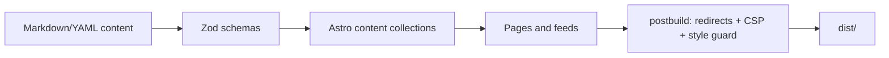
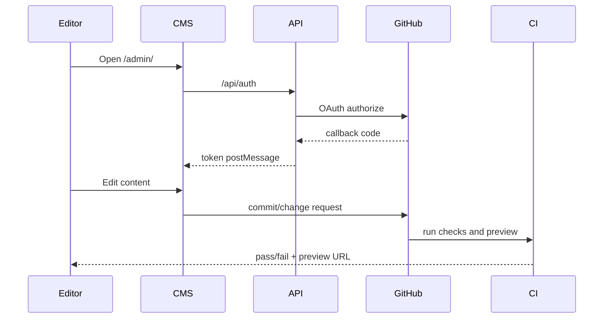

# Architecture

This site is a static-first community website with editable content, a small managed API surface and a strong test/build pipeline.

## System diagram

```mermaid
flowchart TD
  visitor[Visitor browser] --> cdn[Azure Static Web Apps CDN]
  cdn --> html[Static Astro HTML/CSS/JS]
  html --> content[src/content collections]
  html --> feeds[RSS and iCalendar feeds]
  html --> map[Leaflet + OpenStreetMap tiles]
  html --> api[/api managed Functions]
  api --> oauth[GitHub OAuth]
  api --> otel[Azure Monitor / Application Insights]
  editor[Editor] --> cms[Decap CMS /admin]
  cms --> oauth
  cms --> github[GitHub content branch / pull request]
  github --> actions[GitHub Actions CI]
  actions --> build[astro build + postbuild]
  build --> cdn
```

## Request flow

1. Visitor requests a page from Azure Static Web Apps.
2. Static HTML is served from `dist/`.
3. Client scripts progressively enhance filters, slideshow, share, relative dates, map and theme controls.
4. Internal API calls are limited to `/api/auth`, `/api/callback` and `/api/telemetry`.
5. If telemetry is configured, the API sends OpenTelemetry metrics/logs to Azure Monitor.

## Content build flow



Key points:

- Astro content collections validate every entry.
- Unit tests also parse content directly to catch CMS mistakes early.
- A fixed `BUILD_NOW` keeps tests deterministic.
- Recurring series generate occurrences; one-off event entries can override one occurrence.

## Runtime routes

| Route | Purpose | Source |
| --- | --- | --- |
| `/` | Homepage, next home event, slideshow, community teaser | `src/pages/index.astro` |
| `/events/` | Upcoming list with filters and home-first ordering | `src/pages/events/index.astro` |
| `/events/calendar/` | Month calendar | `src/pages/events/calendar/` |
| `/events/map/` | Map of venues with upcoming events | `src/pages/events/map.astro` |
| `/events/<slug>/` | Event detail | `src/pages/events/[slug]/index.astro` |
| `/events/<slug>/calendar.ics` | One-event iCalendar file | `src/pages/events/[slug]/calendar.ics.ts` |
| `/events/club-events.ics` | Home organization calendar feed | `src/pages/events/club-events.ics.ts` |
| `/events/community-events.ics` | Community event feed | `src/pages/events/community-events.ics.ts` |
| `/admin/` | Decap CMS shell | `public/admin/` |
| `/api/auth`, `/api/callback` | GitHub OAuth bridge | `api/src/functions/oauth.js` |
| `/api/telemetry` | First-party telemetry endpoint | `api/src/functions/telemetry.js` |

## Data model

```mermaid
erDiagram
  SETTINGS ||--o{ SERIES : defaults
  VENUE ||--o{ SERIES : hosts
  VENUE ||--o{ EVENT : hosts
  SERIES ||--o{ EVENT : override
  ORGANIZER ||--o{ EVENT : runs
  ORGANIZER ||--o{ SERIES : runs
  INSTRUCTOR ||--o{ EVENT : teaches
  PERFORMER ||--o{ EVENT : plays
  STYLE ||--o{ EVENT : tags
  GALLERY ||--o{ IMAGE : contains
```

`host: home` means the organization running the site. `host: community` means a listing from another organizer.

## Home-first event logic

1. Resolve one-time events.
2. Resolve recurring series dates through each series horizon.
3. Apply overrides for cancellation, postponement, band nights, price changes or one-time details.
4. Partition upcoming/past using the event end time.
5. Sort home events chronologically before community events.
6. Choose the next confirmed home event as the hero.
7. Client-side expiry promotes the next candidate if the built page is viewed after the first event ends.

## Client-side enhancement boundaries

The site works without JavaScript for the core flow:

- Event lists render server-side.
- No-JS users see all home events instead of a collapsed list.
- Calendar links are real links.
- Theme follows the device preference.

JavaScript adds:

- Filters.
- Show-more toggles.
- Relative dates after the page ages.
- Share/copy behavior.
- Slideshow controls and autoplay.
- Leaflet map.
- Consent and analytics.

## Security design

| Area | Decision |
| --- | --- |
| Static pages | No server rendering for public pages. |
| CMS auth | OAuth token returned only to the CMS window; not logged or stored server-side. |
| Secrets | GitHub Actions secrets and Azure app settings only. |
| CSP | Generated in `scripts/postbuild.mjs`; no `unsafe-inline` for site scripts/styles. |
| Admin CSP | Separate because Decap CMS needs broader script/style permissions. |
| Telemetry | Payload validation, size limits, rate limiting, origin checks. |
| Content | Public content only; no private rosters or member databases. |

## Performance design

- Static HTML from CDN.
- Astro image pipeline with responsive sizes.
- Custom image service avoids upscaling.
- Fonts are local packages and preloaded.
- Leaflet loads only on the map page.
- Third-party analytics load only after consent and only if IDs exist.

## Deployment environments

| Environment | Purpose | Indexing |
| --- | --- | --- |
| Local dev | Editing and testing | noindex by default |
| Pull request preview | Review content and design | noindex |
| Azure default host | Pre-launch testing | usually noindex |
| Custom domain | Production | `ALLOW_INDEXING=true` after launch |

## Important files

| File | Responsibility |
| --- | --- |
| `src/lib/event-core.ts` | Pure event expansion, sorting and partitioning. |
| `src/lib/content.ts` | Astro collection lookup and event enrichment. |
| `src/lib/schemas.ts` | Zod schemas shared by Astro and tests. |
| `src/lib/calendar.ts` | iCalendar and add-to-calendar links. |
| `src/lib/seo.ts` | JSON-LD and metadata helpers. |
| `src/lib/focus-image-service.mjs` | Focus crops and no-upscale image guard. |
| `scripts/postbuild.mjs` | Redirect pages, CSP hashes and inline-style enforcement. |
| `scripts/geocode-venues.mjs` | Census-first geocoding with Nominatim fallback. |
| `api/src/functions/oauth.js` | CMS OAuth flow. |
| `api/src/functions/telemetry.js` | Telemetry validation and ingestion. |

## Mermaid sequence: CMS edit



## Known tradeoffs

- Static builds are fast and cheap, but schedule changes require a rebuild.
- The CMS is simpler than a custom database app, but complex content migrations are better done in files/scripts.
- Community listings are useful, but they must clearly show source and organizer because the home organization does not control them.
- Geocoding is automated but guarded by map center/radius because public geocoders can return distant false matches.
