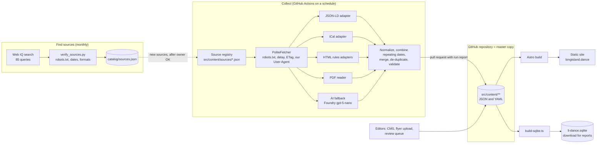
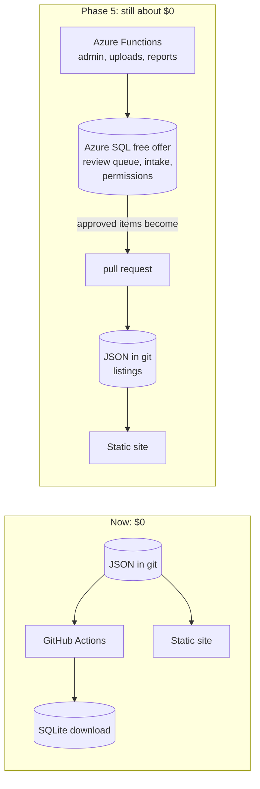
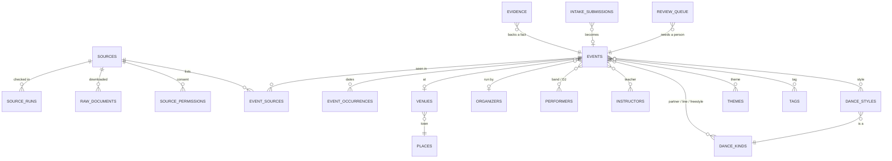
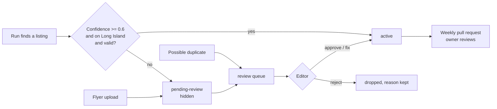
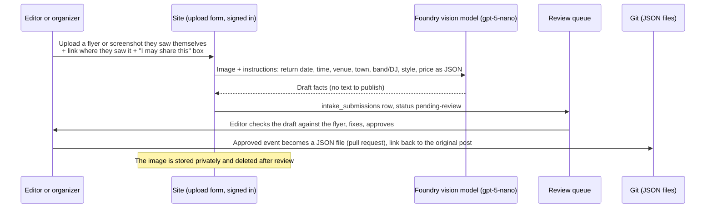
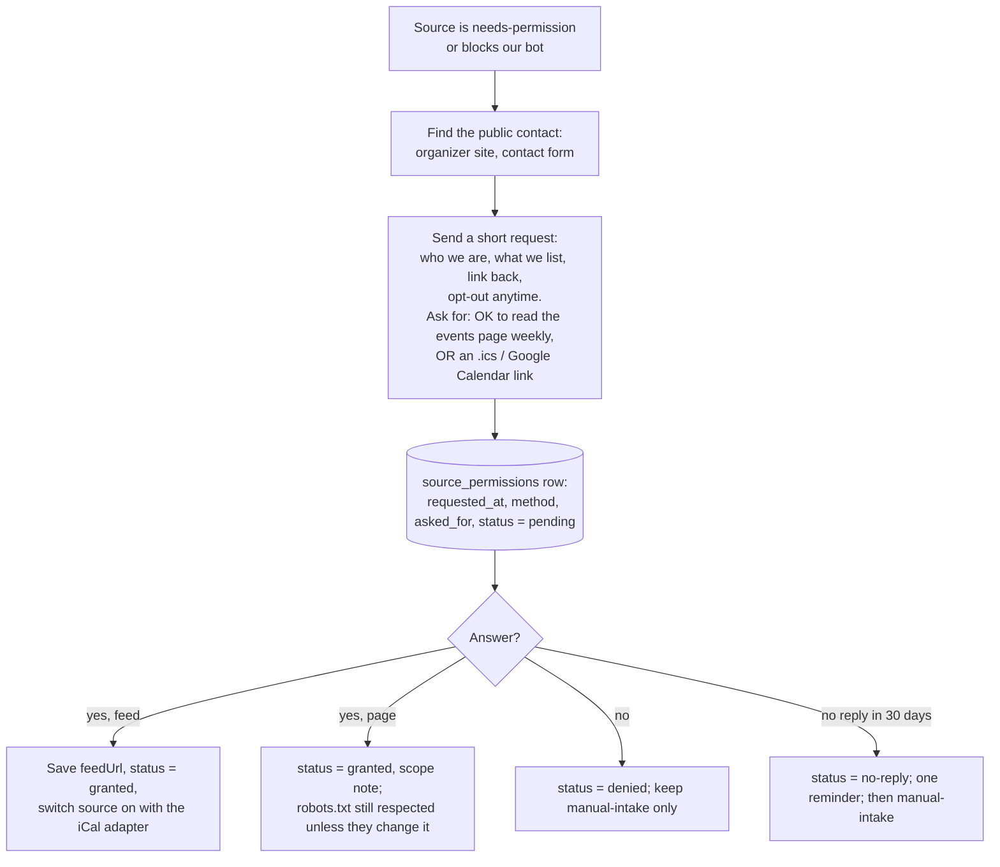

# Database, collection schedule and AI plan

> Written October 3, 2026 for **Long Island Dance Events** (https://longisland.dance). Area: Nassau and Suffolk counties only.
> Prices were checked on October 3, 2026 from official sources (links in [Prices we checked](#prices-we-checked)). "Unverified" means we could not confirm it.
> Companion files: [`catalog/schema.sql`](../catalog/schema.sql) (the database design), [`catalog/queries.sql`](../catalog/queries.sql) (sample reports),
> [`catalog/scripts/build-sqlite.ts`](../catalog/scripts/build-sqlite.ts) (builds the database), [`docs/source-catalog.md`](source-catalog.md) (the sources).

## The short version

- **Keep the files in git as the master copy.** Every event, venue, band, teacher, organizer, style and source stays a small JSON/YAML file that editors change through the CMS or a pull request, as today.
- **Build a SQLite database from those files on every run.** It takes a few seconds and makes one file (about 0.6 MB today, roughly 5-10 MB at a few thousand events a year). GitHub Actions saves it as a download next to each run. The owner opens it with any free SQLite tool and runs the [sample reports](#example-report-queries). Cost: **$0**.
- **The website does not need a live database yet.** The pages are built ahead of time. Add a managed database only when the site must save things instantly (editor review list, flyer uploads, organizer submissions). The cheapest good choice is the **Azure SQL Database free offer ($0)**. Managed PostgreSQL or MySQL costs about **$15-16 a month** even when idle.
- **Check sources on a schedule that fits them:** daily for weekly bar-band lists, twice a week for busy bar and venue calendars, weekly for clubs, studios and monthly calendars, monthly for new-source discovery with Web IQ, and each spring for summer concert series.
- **Read structured data first:** event data built into pages (JSON-LD) and calendar feeds (.ics) need no AI. Use rules for tidy web pages. Use a **small, cheap Microsoft Foundry model (gpt-5-nano)** only for messy pages and flyer photos.
- **Expected running cost: about $1.27 a month (about $15 a year) at list prices**, mostly Web IQ discovery. AI costs pennies. See the [cost table](#10-cost-table).
- **Never get around a block.** Screenshots, reading text from images, or pretending to be a browser are still automated access. Blocked sources get a [permission request](#9-permission-request-flow). Social-media-only and flyer-only events come in by [hand upload](#8-human-in-the-loop-flyer-intake).

## What is built (October 3, 2026)

| Piece | Where | State |
| --- | --- | --- |
| Source files for every accepted and tracked source (145) | `src/content/sources/*.json` | **68 switched on** (The Dance Calendar, Ira's List, and 66 more); 77 off with a reason (needs permission, browser-only calendar, seasonal, hand entry, or our office network could not check it) |
| Generic adapters | `ingest/adapters/ical.ts`, `jsonld.ts`, `htmllist.ts` + `ingest/lib/structured.ts` | Built, with golden tests on fictional fixtures. A live dry run on October 3 read 59 of the 66 new sources; the rest had only past or off-island dates that day |
| Scheduled collection | `.github/workflows/ingest-scheduled.yml` | Daily, Monday + Thursday, Sunday. One rolling pull request; weekly review request (the weekly email); issues for broken sources |
| Report database | `catalog/schema.sql`, `catalog/scripts/build-sqlite.ts`, `.github/workflows/report-database.yml` | Built on every change to the data; download from the run page |
| Monthly discovery | `.github/workflows/source-discovery.yml`, `catalog/scripts/discovery_report.py` | Built; the search step waits for the `WEBIQ_API_KEY` secret |
| AI help (Foundry) and flyer upload | Plan only (sections 5 and 8) | Waiting for owner decisions |
| Permission requests | Plan (section 9); a `permission` note in each blocked source file | Ready to send once the owner picks a contact address |

**Owner setup (one time):** in GitHub, Settings → Actions → General → Workflow permissions → allow GitHub Actions to create pull requests. Then add the repository secret `WEBIQ_API_KEY`. We did not add it.

## 1. How the pieces fit



### Is the SQLite database republished every time?

Yes, and that is on purpose. It is a **copy**, not the master:

1. Every scheduled run (and every push to `main`) rebuilds `data/li-dance.sqlite` from scratch from the files in git.
2. The workflow uploads it as an artifact (kept 90 days). Optionally it is also attached to a monthly GitHub Release so there is a permanent history.
3. Nobody writes to it, so it can never drift from the website. If it is lost, rebuild it in seconds.

The website itself does not read the database at all. Astro reads the JSON files when it builds the pages, exactly as today, so nothing about the live site changes.

## 2. Storage options compared

We looked at nine ways to store the data. Prices are list prices in US dollars for one month, East US 2, checked October 3, 2026.

| Option | Monthly cost | Master copy | How the website build reads it | Live writes from the website? | Work to run it | Main risk |
| --- | --- | --- | --- | --- | --- | --- |
| **A. SQLite built in CI from git, saved as a download (recommended now)** | **$0** | JSON in git | Unchanged (reads JSON) | No | None | Reports are only as fresh as the last run |
| B. SQLite file committed to git | $0 | SQLite or JSON (two copies) | Would need a loader | No | Low | Binary file in git: merge conflicts, repo grows every run, CMS cannot edit it |
| C. Turso (hosted libSQL/SQLite) | $0 free plan (5 GB, 500 million reads, 10 million writes a month) | Turso | API at build time | Yes | Low | Outside Azure; company is joining Supabase (announced on its pricing page), so terms may change |
| D. Cloudflare D1 | $0 free plan (5 GB, 5 million reads and 100,000 writes a day) | D1 | API at build time | Yes (Cloudflare Workers) | Medium | Outside Azure; best used from Cloudflare Workers, not Azure Functions |
| **E. Azure SQL Database free offer (recommended when we need live writes)** | **$0** (each month: 100,000 vCore-seconds, 32 GB data, 32 GB backup) | Azure SQL, or keep JSON as master and sync | Export to JSON before build | Yes (Azure Functions) | Medium | If the free amount runs out it pauses until next month, or bills about $0.52 per vCore-hour if you choose "keep running" |
| F. Azure Database for PostgreSQL, Flexible Server, Burstable B1ms | about **$16.09** ($12.41 compute + 32 GB storage at $0.115) | Postgres | Export to JSON before build | Yes | Medium | Bills every hour even when idle (can be stopped up to 7 days at a time). Free for 12 months only with a new Azure free account |
| G. Azure Database for MySQL, Flexible Server, Burstable B1ms | about **$14.71** ($12.41 compute + 20 GB storage at $0.115) | MySQL | Export to JSON before build | Yes | Medium | Same as PostgreSQL; fewer handy features (JSON, full-text, maps) |
| H. Azure Table Storage | about **$0.05** ($0.045 per GB + $0.00036 per 10,000 operations) | JSON in git; tables hold only live admin data | Unchanged | Yes | Low | Not SQL: no joins or reports, simple key lookups only |
| I. Azure Cosmos DB free tier | $0 (1,000 RU/s and 25 GB free, one account per subscription) | Cosmos | Export to JSON before build | Yes | Medium | Document database, not SQL tables; the free tier is not available for serverless accounts |

### Recommendation

1. **Now (phase 1-2): option A.** It fits the current "files in git are the truth" design (decision P20 says the Azure Storage account is not created yet), costs nothing, and gives the owner a real SQL database for reports.
2. **When the admin features arrive (phase 5):** keep JSON in git as the master for listings. Store the things that must change instantly (review queue, flyer uploads, organizer submissions, visitor reports, permission records) in **Azure SQL Database free offer**. The same `catalog/schema.sql` tables (`review_queue`, `intake_submissions`, `source_permissions`) move over with small type changes. Azure Table Storage (option H, already planned) is the even simpler choice if we only need lists and no reports.
3. **Choose PostgreSQL (option F) only if** the owner wants an open-source database and accepts about **$16 a month (about $193 a year)**. Between the two paid options, PostgreSQL is better than MySQL for this project (JSON fields, full-text search, PostGIS for "events near me"). The $1.38 a month difference does not matter.



### Things to watch at "thousands of events a year"

- **Website file limit.** Azure Static Web Apps Free allows **15,000 files and 250 MB** per environment. Today the site makes one page per date for the next 120 days, plus an `.ics` file per date. About 4,000 events a year, many of them weekly, could pass 15,000 files. Fixes, in order: shorten the window to 60-90 days, make one `.ics` per event instead of per date, or move to Static Web Apps Standard (about $9 a month, unverified).
- **Database size** is not a concern: SQLite, Azure SQL free (32 GB) and every other option handle this volume easily.

## 3. Database design

The full design is in [`catalog/schema.sql`](../catalog/schema.sql). In plain words:



| Part | Tables | What it answers |
| --- | --- | --- |
| Sources and runs | `sources`, `source_content_types`, `source_runs`, `raw_documents`, `source_permissions` | Which sites we read, how often, did the last check work, what changed, do we have permission |
| Places and people | `places`, `venues`, `organizers`, `performers`, `instructors` (+ aliases, genres, styles) | Where, who runs it, which band or DJ, which teacher |
| Events | `events`, `event_occurrences`, `event_exdates` | What, when (every date of a repeating event), price, level, status |
| Links | `event_styles`, `event_dance_kinds`, `event_performers`, `event_instructors`, `event_themes`, `event_tags`, `event_sources` | Many-to-many links, including "seen in these 3 sources" |
| Trust | `evidence`, `event_merges`, `review_queue`, `intake_submissions` | Why we believe a fact, which duplicates were merged, what a person must check, flyer uploads |
| Reports | `v_upcoming`, `v_upcoming_by_town`, `v_upcoming_by_style`, `v_upcoming_by_kind`, `v_source_health`, `v_events_per_month_by_source`, `v_performer_upcoming`, `v_review_open` | Ready-made answers |

**Kind of dancing and the dancing score.** Each style belongs to one kind of dancing: `partner`, `line` or `freestyle`. Events can also list kinds directly, for example a bar night with a cover band is `freestyle`. `events.dancing_likelihood` (0 to 1) stores the "will people dance?" score being added in the content model. It is built from venue facts (`venues.room_to_dance`: dance floor, some room, seated) and band facts (`performers.danceability`: dance band, party cover band, DJ, listening act). The inputs are saved in `dancing_basis`, and the proof links are in `evidence`.

**Build and check it yourself:**

```powershell
npm ci
npx tsx catalog/scripts/build-sqlite.ts          # writes data/li-dance.sqlite and data/li-dance-report.md
sqlite3 data/li-dance.sqlite "SELECT * FROM v_upcoming_by_town LIMIT 10;"
```

On today's files it loads 41 events, 112 dates, 13 venues, 218 sources and all 283 Long Island places with no warnings, and passes SQLite's integrity and foreign-key checks. The `.sqlite` file is never committed (`data/*.sqlite` is in `.gitignore`).

### Example report queries

All of these are in [`catalog/queries.sql`](../catalog/queries.sql), and the build runs them into `data/li-dance-report.md`.

| Question | Query name |
| --- | --- |
| Which towns have the most dances and music in the next 60 days? | `upcoming-by-town` |
| Which dance styles are most common? | `upcoming-by-style` |
| How will people dance (partner, line, freestyle)? | `upcoming-by-kind` |
| What is on this Friday to Sunday? | `this-weekend` |
| Which nights start with a lesson? | `lesson-then-dance` |
| What is free? | `free-events` |
| Which bands and DJs play most? | `busiest-performers` |
| Which venues are busiest, and is there room to dance? | `busiest-venues` |
| How many dates per month? | `dates-per-month` |
| How many sources per status, and how many are switched on? | `source-catalog` |
| Is every source still working? | `source-health` |
| Which sources need permission? | `permission-needed` |
| Which towns have nothing listed? | `coverage-gaps` |
| What is waiting for an editor? | `review-queue` |

Example: swing and Lindy nights in Huntington this fall.

```sql
SELECT u.occurrence_date, u.title, u.venue_name
FROM v_upcoming u
JOIN event_styles es ON es.event_id = u.event_id
WHERE es.style_id IN ('east-coast-swing', 'lindy-hop', 'west-coast-swing')
  AND u.town IN ('Huntington', 'Huntington Station', 'Greenlawn')
  AND u.occurrence_date BETWEEN '2026-10-01' AND '2026-12-31'
ORDER BY u.start_local;
```

## 4. Checking schedule

| Kind of source | Examples | How often | Why |
| --- | --- | --- | --- |
| Weekly bar-band lists | Ira's List | **Daily** | They change every few days; weekend gigs get added late |
| Busy bar and venue calendars | Daisy's, Mulcahy's, Lily Flanagan's, The Villager, Stereo Garden, Webtunes | **Twice a week** (Mon and Thu) | Many dated shows, frequent changes |
| Clubs, studios, organizers, bands, libraries | SDLI, Brumidi Lodge, JLR, band gig lists, Oceanside Library | **Weekly** (Sunday night) | A few events a month, published ahead |
| Monthly calendars | The Dance Calendar (PDF) | **Weekly** (looks for the new issue) | New issue near the start of each month |
| Seasonal sources | Town summer concerts, beach bars | **Monthly**, and weekly from April to September | No dates most of the year |
| Discovery | Web IQ search + verify script | **Monthly** (1st of the month) | Find new sources and dead ones |
| Permission and recheck lists | needs-permission, recheck-from-ci | **Monthly** robots.txt check | robots.txt and blocks can change |

**Change detection (so we do not redo work):**

1. Conditional download: send the saved `ETag` / `Last-Modified`; an unchanged page answers "304 Not Modified" and costs nothing (already built into `ingest/lib/fetch.ts`).
2. If the server does not support that, compare the SHA-256 hash of the page's main text with last time (`raw_documents.sha256`). Same hash = skip parsing and skip AI.
3. Only changed pages go to the (paid) AI step.

**Failure alerts:**

- Each run opens a pull request with the run report and requests review from `michaelsrichter` (decision P14). That is the weekly email.
- If a source returns **0 events** or **invalid data**, the workflow opens a GitHub issue with the source name, the error and the saved page (as an artifact). Same-source issues are reused, not duplicated.
- After **3 failed runs in a row**, the source is paused (`enabled: false` in a pull request) so one broken site cannot block the rest.
- An event that disappears from its source is not deleted. It goes to `pending-review`, as today.

## 5. How we read each format

| Format | How | AI needed? | Sources in the catalog |
| --- | --- | --- | --- |
| Event data in the page (schema.org JSON-LD) | Generic adapter `ingest/adapters/jsonld.ts`: reads `Event`, `MusicEvent`, `DanceEvent` and similar: name, start, end, place, price, performer, URL | No | 16 |
| Calendar feed (.ics), public Google Calendar | Generic adapter `ingest/adapters/ical.ts`: reads `VEVENT`, `RRULE`, `EXDATE`, `LOCATION`, `URL` | No | 19 |
| Data feeds (JSON APIs, e.g. The Events Calendar REST, LibNet) | Small adapter per platform | No | 4 |
| Tidy web page lists | Small rules adapter per site (dates, times, band names), reusing `ingest/lib` | No | most of the 77 HTML sources |
| Messy web pages (free text, mixed layouts) | Clean the page to its main text, then ask a small Foundry model to return events as JSON with a strict schema. Rules check the answer (dates real, town on Long Island, time sensible) | **Yes** | about 20-30 |
| PDF | PyMuPDF font-aware reader (already live for The Dance Calendar) | No | 1 |
| Browser-only calendars (JavaScript widgets) | Use the widget's public feed if robots.txt allows it. Otherwise ask for an .ics feed. We do not run a headless browser on sites that block bots | No | 8 |
| Picture flyers, social media only | Hand upload, then a vision model drafts the facts (see below) | **Yes (vision)** | 4 |

**Words on the site are always ours.** Titles and summaries are built from the facts by `ingest/lib/describe.ts` (or written by an editor). Even when AI reads a page, it returns facts (date, time, place, band, price, style), not text to publish.

### Which Foundry model

Small models on Microsoft Foundry ("Global Standard" pay-per-use deployment: no monthly fee, you pay only for tokens). A token is about 4 letters of text.

| Model | Input price (per 1 million tokens) | Output price (per 1 million tokens) | Reads images? | Retirement date | Notes |
| --- | ---: | ---: | --- | --- | --- |
| **gpt-5-nano** (recommended) | $0.05 | $0.40 | Yes | 2027-02-09 | Cheapest OpenAI model. Reasoning model: its hidden "thinking" is billed as output, so set reasoning effort to minimal |
| gpt-5.4-nano | $0.20 | $1.25 | Unverified | 2027-09-21 | Newer and lasts longer; 4x the input price |
| gpt-5.6-luna | $0.20 | $1.20 | Unverified | 2028-01-11 | Newest small tier; longest support |
| Phi-4-mini-instruct / Phi-4-multimodal-instruct | $0.075 / $0.08 | $0.30 / $0.32 | Multimodal: yes | No date listed | Very cheap. Less accurate on messy pages; good backup |
| gpt-4.1-nano (do not use) | $0.10 | $0.40 | Yes | **2026-10-14** | Retires in 11 days |
| gpt-4.1-mini, gpt-4o-mini (do not use) | $0.40 / $0.15 | $1.60 / $0.60 | Yes | 2027-04-14 (deprecated) | Already deprecated |

**Plan:** start with **gpt-5-nano** for both text and flyers. Keep the prompt and JSON schema model-neutral so we can switch to gpt-5.6-luna before gpt-5-nano retires in February 2027. Test 10 real pages and 10 flyers before turning it on. Expected test cost: under $0.05. This needs a Foundry resource, which needs the owner's OK.

**Tokens per run (estimate):**

| Job | Per month | Tokens in | Tokens out (incl. reasoning) |
| --- | --- | ---: | ---: |
| Messy pages that changed (about 60 a week) | ~260 pages × (3,000 page + 800 instructions) | ~1.0 million | ~0.23 million |
| Classify new venues and bands (dance floor? dance band?) | ~300 short checks × 1,500 | ~0.45 million | ~0.06 million |
| Flyer uploads (vision) | ~30 flyers × (about 1,600 image + 800 instructions) | ~0.07 million | ~0.03 million |

The image token count per flyer is an estimate (about 1,600 tokens for a 1024-pixel image). The worst case uses the older gpt-4o-mini rule, about 25,500 tokens for a 768×1024 image (2,833 + 4 × 5,667). Even then a flyer costs under $0.002 with gpt-5-nano.

## 6. Duplicates across sources

The same dance can appear in The Dance Calendar, the club's own site and Ira's List. We keep **one event** and list every source that has it (`event_sources`).

1. **Same key.** `matchKey` (source + venue + organizer + weekday + time + style) recognizes the same listing from week to week (already built).
2. **Same place and time.** Same venue, same date, start times within 30 minutes → same event. Same band on the same date in the same town → same event.
3. **Similar wording.** Titles and facts are compared with small local embeddings (bge-small, runs in CI, no API key). Score 0.9 or higher merges automatically; 0.8 to 0.9 goes to the review queue (planned phase 3).
4. **Who wins.** The organizer's own site beats an aggregator for times and prices; an editor's fix (`lockedFields`) beats everything. Every merge is recorded in `event_merges` and can be undone.

## 7. Review and moderation



- New sources are **proposals** until the owner approves them; approved sources are switched on in their registry file.
- AI-extracted events start with lower confidence. Until an editor has approved 20 events from a source with no fixes, each new one waits in `pending-review`.
- Organizers can opt out (`organizers.opt_out`); their events are never listed.

## 8. Human-in-the-loop flyer intake

**Owner policy (October 3, 2026): we do not screenshot or OCR pages that block us.** A headless browser screenshot, text read from an image, or a browser User-Agent is still automated access, so robots.txt and the site's rules still apply. We never get around a 403 or bot check. Those sources stay in the catalog as `needs-permission` (robots.txt says no, or blocked) or `manual-intake` (social media only, or picture flyers).

The legal, simple path is a person:



- Who can upload: signed-in editors and organizers (Static Web Apps roles), later trusted visitors.
- What we keep: the facts, the link to where the flyer was seen, and a hash of the file. The flyer image is deleted after review. We never publish the flyer or its text.
- Cost: about $0.0005 per flyer with gpt-5-nano, worst case $0.002. At 30 flyers a month that is about **$0.02 a month**.

## 9. Permission-request flow



- The registry file of each blocked source has `enabled: false` and a `permission` note saying what we asked for and when.
- **Consent is written down:** the date, the method and what was allowed go in `source_permissions` (in phase 5) or the source file's `permission` field. We record where the email is kept, not the email itself.
- If an organizer gives us an `.ics` link, that is the best result: one feed, no scraping, and they control what is shared.
- First people to ask (High and Medium priority): LongIsland.com (events and nightlife), Triple Step Swing, DiVa Ballroom (Lourdes Cruz) Google Calendar, Societelle, BaseLocal, Long Beach (city concerts), Ballroom Factory.

## 10. Cost table

At the expected volume: about 4,000 events a year, about 90 sources switched on, monthly discovery. List prices, checked October 3, 2026.

| Item | Assumption | Per month | Per year |
| --- | --- | ---: | ---: |
| Web IQ discovery (monthly job) | 85 searches a month at $12.50 per 1,000 calls (free during evaluation). Add $0.25 a month for 20 page reads if a person checks blocked sites through Web IQ Browse | $1.06 | $12.75 |
| Foundry text extraction (gpt-5-nano) | 1.45 million tokens in, 0.29 million out | $0.19 | $2.28 |
| Foundry flyer vision (gpt-5-nano) | 30 flyers; worst case 0.8 million tokens in | $0.02 (worst $0.06) | $0.24 (worst $0.72) |
| GitHub Actions | Public repository: standard runners and artifact storage are free (~300 minutes a month) | $0 | $0 |
| Raw page copies | Kept in the Actions cache and artifacts for 90 days ($0). Optional Azure Blob Hot LRS: about 0.5 GB at $0.0184 per GB + writes | $0 (Blob option: about $0.02) | $0 (about $0.24) |
| Database for reports (SQLite artifact) | Rebuilt every run | $0 | $0 |
| Azure Static Web Apps Free | Hosting, 100 GB bandwidth | $0 | $0 |
| **Total (recommended setup)** | | **about $1.27** | **about $15.27** |
| Optional: Azure SQL Database free offer (phase 5 admin data) | Within the free monthly amount | $0 | $0 |
| Optional instead: PostgreSQL Flexible B1ms | Runs all month | $16.09 | $193.08 |
| If the AI use is 10× higher than planned | Busy season, many messy pages | +$2.10 | +$25 |

Not included: the domain name renewal and any paid plan the owner chooses later.

## 11. Roadmap

| Phase | What | Result |
| --- | --- | --- |
| 1 ✅ (PR #8) | Source catalog, database design, SQLite build in CI with sample reports, plan | Owner can see every source and run reports |
| 2 ✅ (PR #8) | 145 source files (68 switched on); generic JSON-LD, iCal and HTML-list adapters with golden tests; scheduled workflows (daily + twice weekly + weekly), one rolling PR with the report, issue on failure; monthly Web IQ rediscovery | Dozens of sources collected automatically |
| 3 | Permission requests for blocked sources; first `.ics` feeds from organizers; duplicate detection with embeddings | More events, fewer duplicates |
| 4 | Foundry resource + gpt-5-nano for messy pages (after a 10-page test); dancing score from venue and band facts | The long tail of bar and band sites |
| 5 | Admin area: review queue, flyer upload, permission records in Azure SQL free offer (or Table Storage) | Editors work in the site, not in git |
| 6 | Watch the 15,000-file limit; shorten the date window or move to Standard if needed | Site keeps building as volume grows |

## 12. Decisions for the owner

1. **Storage:** keep the free SQLite copy now and add the **Azure SQL free offer** for admin data in phase 5 (recommended)? Or pay about **$16 a month** for PostgreSQL now?
2. **AI:** approve creating a Microsoft Foundry resource with **gpt-5-nano** (pay per use, about $0.20 a month expected) and a small test (under $0.05)?
3. **Permission outreach:** who contacts organizers that block bots, starting with LongIsland.com, Triple Step Swing and Lourdes Cruz? Which contact address should those emails come from? (Related: decision P13, there is no public email yet.)
4. **Web IQ in production:** add the repository secret `WEBIQ_API_KEY` for the monthly discovery job (`.github/workflows/source-discovery.yml`). After evaluation it costs about $1.06 a month.
5. **Flyer intake:** turn on organizer uploads (signed-in) when the admin area ships, with the "I may share this" checkbox and delete-after-review rule?

## Prices we checked

All on October 3, 2026.

| What | Price | Where |
| --- | --- | --- |
| Web IQ `/web` and `/browse` | $12.50 per 1,000 calls; evaluation traffic free; trial limit 1 or 5 requests a second | https://webiq.microsoft.ai/documentation/pricing/ and https://webiq.microsoft.ai/documentation/faq/ |
| Foundry model token prices (gpt-5-nano, gpt-5.4-nano, gpt-5.6-luna, gpt-4.1-nano, gpt-4.1-mini, gpt-4o-mini, Phi-4-mini) | See table above (Global Standard, East US 2) | Azure Retail Prices API, `serviceName eq 'Foundry Models'` (https://prices.azure.com/api/retail/prices) |
| Model retirement dates | gpt-4.1-nano 2026-10-14; gpt-5-nano 2027-02-09; gpt-5.4-nano 2027-09-21; gpt-5.6-luna 2028-01-11 | https://learn.microsoft.com/azure/foundry/openai/concepts/model-retirement-schedule |
| Image token rule (gpt-4o-mini) | 2,833 + 5,667 per 512-pixel tile | https://learn.microsoft.com/azure/ai-foundry/openai/overview |
| PostgreSQL / MySQL Flexible B1ms | $0.017 per hour; storage $0.115 per GB-month | Azure Retail Prices API (`Azure Database for PostgreSQL`, `Azure Database for MySQL`) |
| PostgreSQL 12-month free (free account only) | 750 hours B1MS + 32 GB | https://learn.microsoft.com/azure/postgresql/flexible-server/how-to-deploy-on-azure-free-account |
| Azure SQL Database free offer | 100,000 vCore-seconds, 32 GB data and 32 GB backup per database per month; up to 10 databases | https://learn.microsoft.com/azure/azure-sql/database/free-offer |
| Azure SQL serverless beyond free | $0.521758 per vCore-hour | Azure Retail Prices API (`SQL Database`) |
| Azure Blob Hot LRS / Table Storage | $0.0184 per GB-month / $0.045 per GB-month and $0.00036 per 10,000 operations | Azure Retail Prices API (`Storage`) |
| Cosmos DB free tier | 1,000 RU/s and 25 GB free | https://learn.microsoft.com/azure/cosmos-db/free-tier |
| Static Web Apps Free | 100 GB bandwidth, 250 MB and 15,000 files per environment | https://learn.microsoft.com/azure/static-web-apps/quotas |
| GitHub Actions | Free for public repositories on standard runners | https://docs.github.com/en/billing/concepts/product-billing/github-actions |
| Cloudflare D1 | Free: 5 million rows read and 100,000 written a day, 5 GB | https://developers.cloudflare.com/d1/platform/pricing/ |
| Turso | Free: 5 GB, 500 million rows read and 10 million written a month | https://turso.tech/pricing |
| Static Web Apps Standard | About $9 a month | Unverified |
