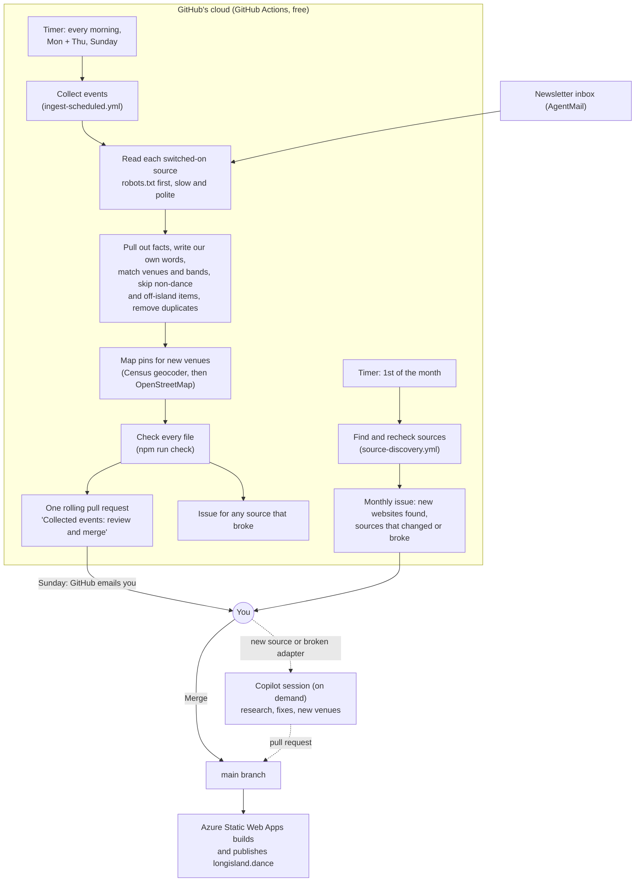

# How the weekly updates work

This page explains, in plain words, how new dances and live-music nights get onto
[longisland.dance](https://longisland.dance) every week: what runs, where it runs, when, what it
costs, and what you (the owner) need to do. Technical details live in
[architecture.md](architecture.md) and the [README](../README.md).

## The short answer

- **What runs:** a set of small programs called **GitHub Actions workflows**. They run on
  **GitHub's own computers in the cloud**, on a timer. Nothing has to be running on your computer,
  and your computer can be off.
- **What they do:** every morning (and more on Mondays, Thursdays and Sundays) they visit the
  event calendars we are allowed to read, pull out the facts (date, time, place, band, price, kind
  of dancing), write short listings in our own words, and put all the changes into **one pull
  request** on GitHub. A pull request is a "proposed change" you can look at before it goes live.
- **What you do:** once a week, on Sunday, GitHub emails you (an @mention). Open the **review center**
  at [longisland.dance/moderate/](https://longisland.dance/moderate/), look over the new events and press
  **Publish now**, then decide on the few listings the program was unsure about. Publishing puts the new
  listings on the website within a few minutes (usually about 5).
- **What it costs:** the weekly collecting is **free** (GitHub Actions is free for public
  repositories). The search for new sources costs about **$4.25 a month** (Microsoft Web IQ). The
  website itself costs about **$9 a month** on Azure. The newsletter inbox is **free** (AgentMail
  free plan).
- **Is it a GitHub Copilot App automation?** **No.** See [the comparison](#github-actions-vs-a-copilot-app-automation)
  below. A Copilot session is the helper you call in when something new needs research or a fix,
  not the thing that runs every week.
- **Is it working?** Yes. See [Is it running?](#is-it-running) for the latest runs.

## The picture

## The schedule

All times are New York time. GitHub's timers use world time (UTC), so in winter everything runs one
hour earlier. GitHub sometimes starts a timed run late when it is busy (on October 4, 2026 the
first runs started about five hours late). That is normal and does not lose anything.

| When | Workflow | What it does |
| --- | --- | --- |
| Every morning, about 6:15 AM | Collect events (`ingest-scheduled.yml`) | Reads the sources marked **daily** (weekly bar-band lists that change all the time). |
| Monday and Thursday, about 6:45 AM | Collect events | Reads the **twice-weekly** sources: busy bar, venue and music calendars. |
| Sunday, about 5:30 AM | Collect events | Reads the **weekly** and **monthly** sources: dance clubs, studios, bands, libraries, town calendars, newsletters and The Dance Calendar's monthly PDF. Then GitHub **emails you** to review. |
| Every night, about 5:15 AM | Azure Static Web Apps (`azure-static-web-apps.yml`) | Rebuilds the site so "This week" and "Today" stay correct. |
| Every morning, about 6:30 AM | Community maintenance | Backups and cleanup for likes, notes and photos. |
| Monday, 8 AM | External link check | Reports broken outside links (does not block anything). |
| 1st of the month, 7 AM | Find and recheck sources (`source-discovery.yml`) | Searches the web for new sources (Web IQ) and rechecks every source we track. Opens an issue with what it found. |
| 1st of the month, 8 AM | Report database | Saves a spreadsheet-style copy of all the data for reports. |
| Any time a venue is added or changed | Venue map locations (`geocode-venues.yml`) | Looks up the map pin from the street address. |

Which sources run when (counts are switched-on sources):

<!-- source-schedule-table -->
| Cadence | Runs | Sources switched on | Examples |
| --- | --- | ---: | --- |
| daily | every morning | 1 | Ira's List (weekly list of bar bands and DJs) |
| twice-weekly | Monday and Thursday | 18 | Mulcahy's (Wantagh), 89 North (Patchogue), Daisy's (Miller Place), Stereo Garden (Patchogue), BobbiQue (Patchogue) |
| weekly | Sunday | 50 | Swing Dance Long Island, Brumidi Lodge (Deer Park), DiVa Ballroom classes, The Dance Calendar (monthly PDF), Rooted North Vineyards (Cutchogue), Plattduetsche Park (Franklin Square), Mixed Vibes Band |
| monthly | Sunday (every week) | 0 | none right now |
| newsletters | Sunday | 0 (4 waiting for a first issue) | SDLI, DiVa Ballroom, Dancing With Deanna, BaseLocal Islip |
<!-- /source-schedule-table -->

That is 69 switched-on sources. Another 120 source files are switched off, each with a note saying why
(blocked by robots.txt or a bot check, only on social media, seasonal, no readable list, or its venues
still need research).

"Monthly" sources would be read every Sunday too: reading often is cheap, and a new monthly issue (like
The Dance Calendar's PDF, which is set to weekly for that reason) shows up within a week of being posted.

## Step by step: what one collection run does

1. **Pick the sources.** Each source has a file in `src/content/sources/` that says how often to
   read it (its *cadence*), where its calendar is, and whether it is switched on.
2. **Visit politely.** Before reading any page, the program reads the site's `robots.txt` (the file
   where a website says what robots may read). If it says no, we do not read that page. The program
   names itself `LongIslandDanceEventsBot/1.0`, waits several seconds between pages on the same site,
   and remembers what it downloaded last time so unchanged pages are not downloaded again.
3. **Read the best format first.**
   - *Calendar feeds* (`.ics` files, the same thing your phone calendar uses) and *event data built
     into the page* (schema.org "Event" data that sites add for Google) are read first, because they
     already have exact dates and times.
   - *Web page lists* (a page that says "Fri, Oct 16 - The Fictionals, 9 PM") come next.
   - *PDF newsletters* (The Dance Calendar) are read last, using the font sizes to find each day.
   - *Email newsletters* are read like a web page list (see [Newsletters](#newsletters)).
4. **Turn each listing into facts:** date, start and end time, lesson time, price, venue, town,
   band or DJ, teacher, organizer, and dance styles.
5. **Write it in our own words.** Titles and summaries are built from those facts, for example
   "The Fictionals at Sample Pub" and "Live music by The Fictionals at Sample Pub." We never copy a
   site's description.
6. **Match names to our files.** "Mulcahy's" is matched to our Mulcahy's venue file, "DJ Sample" to
   our DJ file, and so on (by name, other names, or street address).
7. **Skip what does not belong:**
   - anything outside Nassau and Suffolk counties (checked against our list of 303 Long Island towns,
     villages and hamlets);
   - anything that is not dancing or live music in its own words (trivia, karaoke, comedy, movies,
     fairs, food specials);
   - deadlines ("RSVP by Oct 10"), "no class on" days, and dates whose weekday does not match;
   - listings at a venue we have not researched yet. Those are listed in the run report so a person
     (or a Copilot session) can add the venue.
8. **Remove duplicates.** If two sources list the same evening at the same venue, it is added once.
   The venue's, club's or band's own calendar wins over a calendar of everything. This works for
   repeating classes too: when an organizer's own calendar lists its Monday classes at the same time,
   the copy from The Dance Calendar is hidden and noted for review (nothing is deleted). If the own
   calendar lists only some of those dates (say, one workshop), only those dates are taken out of the
   other copy. Two bands that list the same show at the same start time (a double bill) are listed once.
9. **Combine repeats.** The same listing every Tuesday becomes one event that repeats "every Tuesday."
10. **Map pins.** New venues get their map location from their street address (see
    [How venues get a map pin](#how-venues-get-a-map-pin)).
11. **Dancing score.** Every live-music listing gets a 0-10 score for how likely people are to dance,
    from our research on the venue and the band (see [How we learn about bands and venues](#how-we-learn-about-bands-djs-and-venues)).
12. **Check everything.** Every file is checked against strict rules (`npm run check`). Anything
    broken is reported, not published.
13. **Update the pull request.** All changes go into **one** rolling pull request called
    "Collected events: review and merge to publish," with a run report on top: what each source
    found, what was skipped and why, and what needs a person. The review center's **New events** tab
    shows the same report in plain words, with a **Publish now** button.
14. **Report problems.** A source that breaks gets a GitHub issue labeled `ingest-failure`. After
    three failures in a row it is switched off in the pull request, with a note.
15. **Sunday email.** The Sunday run asks you to review the pull request. GitHub sends the email.
16. **You publish, the site updates.** Pressing **Publish now** in the review center (or merging the pull
    request on GitHub) starts the Azure build, and the new listings are live a few minutes later (usually about 5; share pictures that did not change are reused, decision P55).

## How we get the details of each event

| Detail | Where it comes from |
| --- | --- |
| Date and time | The calendar feed or event data first; otherwise the date and time written in the listing ("Fri, Oct 16 ... 9 PM"). If a feed's time is off by exactly 4 or 5 hours from the written time (a common website setting mistake), the written time wins. A start between 1 and 8 AM sends the listing to review. |
| Lesson before the dance | Words like "lesson at 7" or "beginner class 7:30, dancing 8:30-11". |
| Price | "$15", "$15/$20 members", "free". |
| Band, DJ or teacher | The names in the listing, matched to our files. A new name is only added when it looks like a real name (no dates, no "Happy Hour with..."). |
| Dance styles | Words in the listing ("salsa", "West Coast Swing", "line dancing"), plus the source's usual styles. |
| Venue and town | The listing's place name and address, matched to our venue files. |

**What we never copy:** a site's own description text, photos, logos, or anything behind a login.
We keep a link back to the source on every event, and the [Sources page](https://longisland.dance/sources/)
credits every source.

## How venues get a map pin

1. A person (or a Copilot session) adds the venue file with its **street address**, found on the
   venue's own website.
2. The program `scripts/geocode-venues.mjs` looks the address up in the free **U.S. Census Bureau
   Geocoder**. If the Census cannot find it, it asks **OpenStreetMap Nominatim** (one request per
   second, as their rules ask).
3. A pin more than 130 km from the middle of Long Island (the map center in the site settings) is
   rejected as a mistake.
4. It saves the latitude, longitude, and which service found them, in the venue file.
5. **If a pin is wrong:** open the venue in the editor at `/admin/`, fix the address or type the
   correct latitude and longitude (right-click the spot in Google Maps to copy them), and save. Clear
   both numbers instead to make the program look the address up again.

This runs inside every collection run, and again whenever a venue file changes.

## How we learn about bands, DJs and venues

Knowing the venue and the act is how we guess whether people will dance.

- **Venues:** for each venue we record whether there is a dance floor, open space, or mostly seats;
  which kinds of dancing happen there (partner, line, party dancing); and links to the pages that
  show it (the venue's own site, reviews that mention dancing, event listings). We write the notes in
  our own words.
- **Bands and DJs:** whether they play dance music (a party band, a swing band, a DJ) or mostly
  listening music, with links to their own site and listings.
- **The score:** the venue and act research are combined into a 0-10 score, then adjusted by clues
  in the listing ("DJ", "dance party" raise it; "theater", "library", "acoustic", "brunch" lower it).
  Every event page shows the score, the reasons and the links.
- **Who does this research:** a person or a Copilot session, when a new venue or act starts showing
  up. The weekly run lists unknown venues and acts in its report. Editors can override any score.

## Newsletters

Some venues, bands and studios send email newsletters with their upcoming events. Since October
2026 the site has its own newsletter inbox (an AgentMail inbox). Its address and key are kept as
GitHub secrets (`AGENTMAIL_INBOX`, `AGENTMAIL_API_KEY`), never in the code.

- **Signing up:** `scripts/newsletter-signup.ts` signs the inbox up on a source's own website,
  with a normal browser that says it is our bot. It types only the inbox address (and, if a form
  insists, the name "Long Island Dance Events" and a central Long Island ZIP code). It **never** solves
  a CAPTCHA ("I'm not a robot" box) and never gives a phone number, birthday or home address. Those
  sign-ups go on a short list for you to do by hand.
- **Sites that ask robots to stay away:** at your request ("for sites that block bots, still try sign
  up for the newsletter"), the sign-up script may still open the one sign-up page on those sites and
  fill in the one form (decision P44). It reads nothing else there and never collects events from them.
  On October 5, 2026 this was tried on 17 sites; none could be signed up this way (12 bot walls,
  2 CAPTCHAs, 3 with no form), so they are on your by-hand list or marked "none found".
- **Confirming:** many lists send a "please confirm" email. `scripts/newsletter-inbox.mjs confirm`
  opens the confirmation link only when it comes from that site or its mail service (the whole host
  name must match, so `list-manage.com.example.net` is refused). If the link forwards somewhere
  else, each new address is checked the same way. Nothing else in an email is ever followed.
- **Reading:** each newsletter that is switched on has its own source file (adapter `agentmail`).
  The Sunday run reads issues from the last 45 days and treats each one like a web page list, with all
  the same rules. The emails are kept only in a temporary folder during the run, never in the saved
  download cache, so the inbox address in their footers cannot leak. Links on the website point to the
  venue's public page, never to the email. Emails the review center sends to website owners (permission requests, decision P53) and their answers share the inbox, but they carry the label `outreach`, and the reader skips every thread with that label.
- **Switching one on:** after the first real issue arrives, a person checks a few listings against
  the email, then switches the source on. Until then it stays off.
- The list of sign-ups and their status is in [`catalog/newsletters.json`](../catalog/newsletters.json).

## How new sources are found and switched on

1. **Searching (monthly, automatic).** On the 1st of each month, `source-discovery.yml` runs about 340
   Microsoft Web IQ searches: 85 Long Island-wide searches (for example "Long Island salsa night"), plus
   one twelfth of the **town-by-town** searches (every Long Island town, village and hamlet with dance
   styles and music words, such as "Commack NY line dancing" or "Wantagh NY cover band"). Every town
   is searched again once a year. It also rechecks every source we already track (does `robots.txt`
   still allow us? are there still upcoming dates?).
2. **The monthly issue.** It opens a GitHub issue listing websites it has never seen before and any
   tracked source that changed or broke. **Nothing is switched on automatically.** The new websites also
   show in the review center's **Sources** tab (read from a hidden `review-data` block at the end of the
   issue), with **Worth adding** (a Copilot task) and **Not useful** (saved in `catalog/search-triage.json`
   as `owner-no`, so it is not suggested again).
3. **Checking a find.** A person (usually with a Copilot session) opens each promising website and
   asks: does it list **several upcoming** dance or live-music events on Long Island? Is it allowed
   (robots.txt and the site's rules)? Is it more than one event page, and is it kept up to date?
4. **Adding it.** If yes, the session adds:
   - a line in `catalog/sources.json` (what we found and why);
   - a source file in `src/content/sources/<id>.json` (where the calendar is and how to read it);
   - venue, band or organizer files for anything the source needs, with addresses and dancing research;
   - an attempt to sign up for the source's newsletter.
5. **You approve.** All of that arrives as a pull request. Merging it is your approval. The next
   collection run starts reading the source.

The October 2026 town-by-town search is described in [source-catalog.md](source-catalog.md#town-by-town-search-october-2026).

## What you do each week

Everything below is in one place: the **review center** at **https://longisland.dance/moderate/**
(sign in with your editor email). See "Your review center" in [editor-guide.md](editor-guide.md#your-review-center).

1. **Sunday:** open the email from GitHub, then the review center's **New events** tab. It shows the run
   report in plain words: new events, sources that found nothing, new venues and bands to check.
2. If the automatic checks passed, press **Publish now**. The site updates a few minutes later (usually about 5).
3. Open **Held listings** and decide on each one (Publish, Fix, Cancelled or Hide). Each card says why it
   was held and links the source page. Fixed fields are locked, so the next run keeps your fix.
4. **Messages** and **Community posts:** answer what waits there.
5. **Now and then:** the **Sources** tab shows sources that broke (`ingest-failure` issues), new websites
   from the monthly source check (**Worth adding** asks Copilot to add one, **Not useful** remembers the
   no), switched-off sources you could help with (a ready-made permission email), and **Check sources now**.

Most weeks this takes 10-15 minutes. You can still do everything on GitHub (merge the pull request,
edit in `/admin/`) if you prefer.

## What it costs

| Item | Cost |
| --- | --- |
| GitHub Actions (all the timed runs) | **$0** (free for public repositories) |
| Microsoft Web IQ (monthly source search, about 340 searches at $12.50 per 1,000) | about **$4.25 a month** |
| Microsoft Web IQ (the one-time October 2026 town-by-town search: 3,068 calls) | about **$38.35** once |
| AgentMail newsletter inbox (free plan: 3 inboxes, 3,000 emails a month) | **$0** |
| Azure Static Web Apps Standard, Storage, sign-in | about **$9 a month** (see [database-plan.md](database-plan.md#10-cost-table)) |
| Live database (PostgreSQL, from the day Azure allows it in East US 2; decision P56) | about **$16.60 a month** more; about $23 in total once the old site is retired ([proposal](proposals/postgres-live-site.md#13-costs-before-and-after)) |
| Geocoding (U.S. Census, OpenStreetMap Nominatim) | **$0** |
| Copilot sessions for research and fixes | your existing GitHub Copilot plan |

## How big the website can get

The website is a folder of ready-made pages that Azure Static Web Apps hosts. Our plan (Standard)
allows **500 MB and 15,000 files** for the live site, and **2 GB** for the live site plus all
pull-request previews together.

| Measured October 5, 2026 (all sources collected) | Size | Files |
| --- | ---: | ---: |
| Before this change | 237.9 MB | 5,571 |
| Share pictures only for the next 3 weeks | 190.1 MB | 4,667 |
| Now (plus a share picture for every venue, band, teacher, organizer, style, list page and event series) | 233.3 MB | 5,429 |

- The biggest part used to be the **share pictures**: two for every event date up to 120 days ahead.
  Now they are made only for dates in the next three weeks; the nightly rebuild adds them as dates
  come closer (decision P46).
- Event pages grow with the number of events. Each new weekly class adds about 17 dates.
- Every build checks the size (`npm run test:size`) and fails above **12,000 files or 400 MB**, well under the limits.
- If the site ever grows past about 300 MB, the next step is to keep the share pictures in Azure
  Storage instead of in the website folder.

## When a source breaks or a site blocks us

- **A source finds nothing or its data is broken:** the run files a GitHub issue labeled
  `ingest-failure` with a small snapshot (page size, type and fingerprint, never the page text). The
  rest of the run goes on as normal. After three failures in a row, the source is switched off in the
  pull request with a note.
- **Finding only past or off-island events is not a failure** (a summer concert series in winter, for
  example).
- **A site changes its layout:** usually the adapter needs a small fix. Start a Copilot session,
  point it at the issue, and it fixes the adapter and adds a test.
- **A site blocks robots** (`robots.txt` says no, or a "checking your browser" page): we stop
  reading it, switch it off and mark it **needs permission**. We never get around a block: no
  disguised browsers, no screenshots, no reading text from images. You can email the organizer and
  ask for permission or a calendar feed. Their newsletter, if they have one, is another allowed way.
- **Social-media-only events** (Facebook, Instagram) are **manual intake**: someone adds them by hand.

## GitHub Actions vs. a Copilot App automation

| | GitHub Actions workflow (what runs weekly) | GitHub Copilot App automation |
| --- | --- | --- |
| What it is | A fixed script in `.github/workflows/` | A saved prompt that starts a new Copilot (AI) session from the Copilot app |
| Where it runs | GitHub's cloud computers | A Copilot session started from the app (on your computer or a cloud session) |
| Needs your computer on? | No | Usually, for local sessions |
| Same result every time? | Yes: the same code reads the same sources the same way | No: an AI decides what to do each time |
| Cost | Free here | Uses your Copilot plan |
| Good for | Collecting events on a timer, checking, building, publishing | Research and judgment: checking new sources, writing a new adapter, researching venues and bands, fixing a broken source |

We use **GitHub Actions for the weekly collection** because it must run the same way every time,
cost nothing, and not depend on anyone's computer. Use a **Copilot session** (started by you, when
needed) to:

- go through the monthly "source check" issue and add good new sources;
- fix a source after an `ingest-failure` issue;
- research venues and bands listed as "unknown" in the run report;
- check a newsletter's first issue and switch it on.

## Is it running?

<!-- actions-history -->
**Yes: the scheduled collection is running and every run so far has succeeded** (checked October 5, 2026
with `gh run list --workflow ingest-scheduled.yml`).

| When (UTC) | Started by | Result |
| --- | --- | --- |
| Oct 4, 2026, 2:54 PM | timer (Sunday run) | success |
| Oct 4, 2026, 3:19 PM | timer (daily run) | success |
| Oct 4-5, 2026 | 8 runs started by hand (testing new sources and fixes) | all success |

- The workflow was added on October 3, 2026, so October 4 was its first day on the timer. Both timed
  runs that day started about five hours late; GitHub delays timed runs when it is busy, and nothing is lost.
- The collection pull requests are being merged, which publishes the events:
  [#17](https://github.com/michaelsrichter/long-island-dance-events/pull/17) on October 4 and
  [#23](https://github.com/michaelsrichter/long-island-dance-events/pull/23) on October 5. The next run
  opens a new rolling pull request.
- The monthly source search (`source-discovery.yml`) has not run yet. Its first timed run is November 1, 2026.
<!-- /actions-history -->

To check for yourself: open the repository on GitHub, click **Actions**, then **Collect events
(scheduled)**. A green check means the run worked. You can also start a run by hand there with
**Run workflow** (choose which cadences to read).

## Words used on this page

- **Workflow / GitHub Actions:** a script GitHub runs for us on a timer or when something changes.
- **Pull request:** a set of proposed changes you can review before they go live.
- **Merge:** accept a pull request so its changes go live.
- **Source:** a website, feed, PDF or newsletter we read events from.
- **Adapter:** the part of the program that knows how to read one kind of source.
- **robots.txt:** a file where a website says which pages robots may read.
- **Feed (.ics):** a calendar file other apps can read, the same kind your phone calendar uses.
- **Geocoding:** turning a street address into a map location (latitude and longitude).
