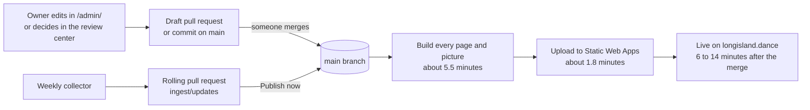
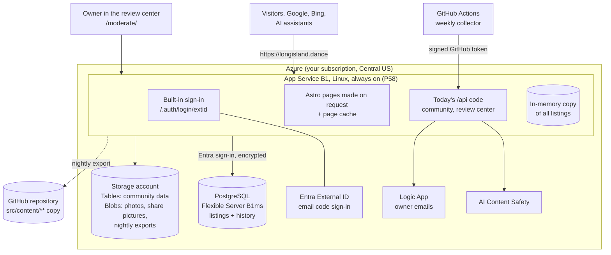
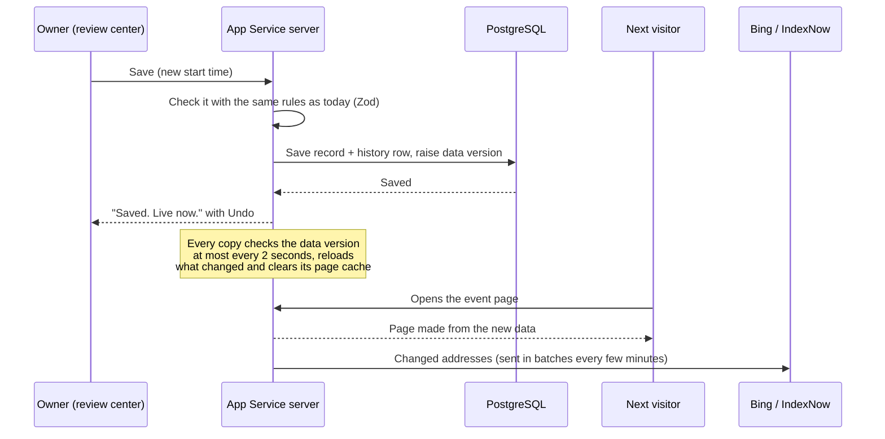
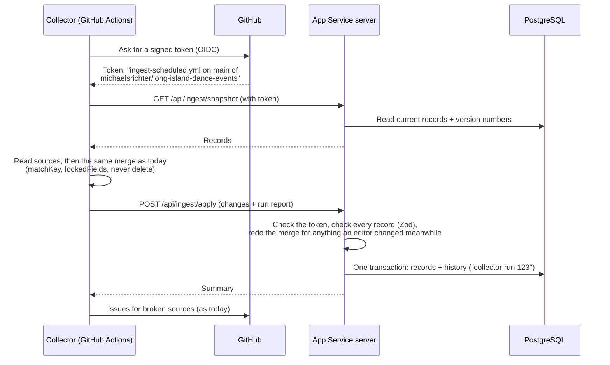
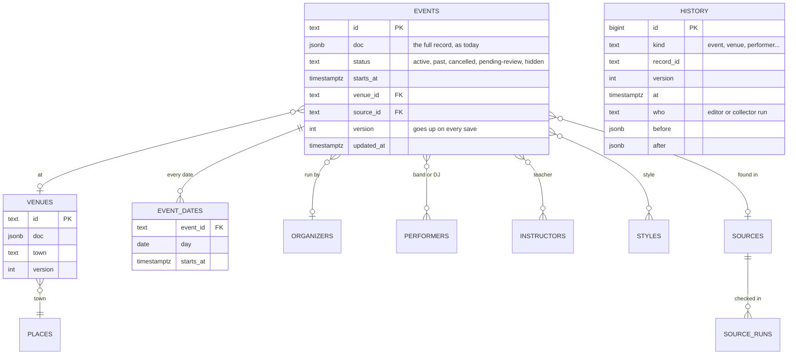
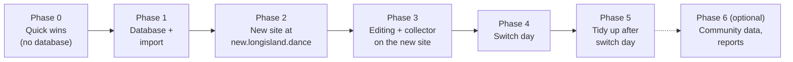

# Proposal: a live database, so changes show up in seconds

> **Status: approved by the owner on October 5, 2026 (decision P54), with his answers in [section 16](#16-open-questions).** Phase 0 ([section 12](#12-phase-0-quick-wins-we-can-ship-right-after-approval), 0a and 0b) shipped on October 5 (decision P55). Phase 1 (the database) shipped on October 5 (decisions P56 and P57). Phase 2 started on October 5 on **App Service B1** (decision P58, see the box below). On October 6 the server started making its pages from the database records (decision P59): a change shows in about 2 seconds, and the test address **https://new.longisland.dance** is up (not listed by search engines).
> Prices are Azure list prices for East US 2, checked October 5, 2026 (see [Prices we checked](#18-prices-we-checked)). **Region (P57):** everything moves to **Central US** (Iowa). It is the only US region where this Visual Studio subscription may create PostgreSQL that also has everything else the site uses (Static Web Apps, Functions, Content Safety, Logic Apps, monitoring). East US and East US 2 do not allow PostgreSQL or Azure SQL for this subscription. The database costs a little more there: about $18.18 a month instead of $16.09. **No private network** (owner's choice; this data is not sensitive): the database has a public address, but only Azure services may connect, only with Microsoft Entra sign-in and only encrypted.
> **Host (P58, October 5):** the owner asked whether App Service would be better for search engines and AI assistants. It is: one small server that is **always on** (no cold starts, a full processor core), so every page answers equally fast. Pages are now made by **App Service B1** (Linux, Central US, about $13.14 a month) instead of Azure Functions, and **Static Web Apps goes away** at the switch (App Service serves the files too). **No CDN for now:** Azure Front Door costs at least $35 a month, and Azure's cheaper classic CDN stopped taking new customers on August 15, 2025. A free option stays open (photos and scripts from a free Static Web Apps address, `ASSETS_PREFIX`). New total after the switch: **about $33 a month** ([costs](#13-costs-before-and-after)). Where this page still says Functions, read App Service.
> Related: [database-plan.md](../database-plan.md), [architecture.md](../architecture.md), decisions P46, P47, P48, P51 and P52 in [decision-log.md](../decision-log.md).

## The short version

- **Why you wait today.** The website is a big folder of ready-made pages (about 5,400 files). Any change, even one start time, means building the whole folder again and uploading it. That takes **6 to 14 minutes** (we timed the last 8 deploys). Many changes also wait for someone to **merge a pull request** first.
- **The honest part.** A database alone does not remove the wait. If pages are still made ahead of time, a change in the database still needs a rebuild. Changes show up **in seconds** only if each page is made **when a visitor asks for it**, straight from the database, and then kept in a short-term memory (a *cache*) until something changes.
- **What we recommend (option A).** Keep everything that works and change three things:
  1. Listings, venues, bands and DJs, teachers, organizers, dance styles, sources and help pages move into a small **PostgreSQL database** in Azure (Flexible Server, Burstable B1ms, already approved in P52).
  2. Pages are made on request by a small, always-on **App Service** server (Linux B1, decision P58), using the same Astro page code we have today. (The first plan used Azure Functions; the owner chose App Service for steady speed.)
  3. The **review center** (`/moderate/`) becomes the one place to edit everything. Press Save and the site shows the change a few seconds later. No pull requests, no rebuilds.
- **Cost:** about **$9.80 a month today**, about **$33 a month after** (App Service, P58). While the old and new sites both run (phases 2 to 4), about $41 to $42. The owner chose no "safety month": the old site is deleted once the switch-day checks pass. See [costs](#13-costs-before-and-after).
- **Search engines and AI assistants:** every web address stays the same, with the same tags, sitemaps, structured data and share pictures. Two limits go away: every event date gets its own share picture (not only the next 21 days), and there is no more 15,000-file limit.
- **Sign-in:** the same Microsoft sign-in (Entra External ID). Most people won't notice the move; at worst someone types an email code once more. Likes, notes, photos and saved events are kept.
- **Safety:** we build the new site next to the old one at `new.longisland.dance`, compare every page automatically until they match, and only then switch. The old site is deleted once the switch-day checks pass (owner's choice); it could be rebuilt from its template and the nightly export if ever needed.
- **Right away (Phase 0):** two small changes can ship as soon as you say yes, before any database work: saving in `/admin/` publishes directly (no draft pull request), and deploys get faster (from about 9 to about 4 or 5 minutes) because share pictures are reused between builds.

## Words we use

| Word | What it means here |
| --- | --- |
| **Database** | A program that stores records (one per event, venue, band...) and finds, changes and saves them instantly. |
| **PostgreSQL** | A free, widely used database. Azure runs it for us ("managed"): updates, backups and repairs are Azure's job. |
| **Pre-built (static) pages** | Today's site: every page is made ahead of time and uploaded as a file. Fast and cheap, but any change means making and uploading them all again. |
| **Made on request (server rendering)** | A program builds the page the moment someone opens it, from the latest data. |
| **Cache** | A short-term memory of pages already made, so the next visitor gets them instantly. It is cleared when something changes. |
| **Azure Functions** | Azure runs our code only when a request comes in and bills by use. **Flex Consumption** is the newest kind. An **always-ready copy** is one copy kept running so nobody waits for it to start. |
| **Cold start** | The few seconds a copy needs to start when none was running. |
| **Pull request (PR)** | A proposed change on GitHub that someone must approve ("merge") before it counts. |
| **Deploy** | Building the site and putting the new version online. |
| **Firewall** | A list of who may connect. The database accepts only Azure services (such as our app), never the open internet. |
| **Managed identity** | Azure gives our app its own identity, so it can sign in to the database and storage without any password. |
| **Point-in-time restore** | Azure can rewind the database to any minute of the last 7 days. |
| **JSON** | The text format our records are stored in today (`src/content/**`). |

## 1. Why changes wait today

We checked the code and the last deploys on October 5, 2026.

| # | What waits | Why | Where |
| --- | --- | --- | --- |
| 1 | A save in the editor at `/admin/` | Every save becomes a **draft pull request** that someone has to Publish. | `cms/config.yml` (`publish_mode: editorial_workflow`) |
| 2 | Every change of any kind | The whole site (1,459 pages and about 5,400 files with pictures) is built again and uploaded. | `.github/workflows/azure-static-web-apps.yml` |
| 3 | New events from the weekly collector | They go into one rolling pull request (`ingest/updates`) that has to be merged. | `.github/workflows/ingest-scheduled.yml` |
| 4 | Decisions in the review center | Each decision is saved as a git commit, so it also waits for the rebuild. | `api/src/functions/review.js`, `api/src/lib/github.js` |
| 5 | Workarounds for having only files | Share pictures only for the next 21 days (P46), then one per series (P47); a 15,000-file limit (CI stops at 12,000, `scripts/check-site-size.mjs`); "held" listings are files with `status: pending-review`. | `src/lib/content.ts`, `scripts/check-site-size.mjs` |

**How long a deploy takes.** The last 8 successful deploys took **6.4 to 13.8 minutes** from start to live. In the most recent one, building took 5.5 minutes and uploading 1.8 minutes. Most of the building is pictures:

| Part of the build (October 5, 2026) | How many | Time spent |
| --- | ---: | ---: |
| Drawing share pictures (`social.png`, `/og/...`) | 1,743 | about 4.3 minutes |
| Making smaller copies of photos | 909 | about 50 seconds |
| Making the HTML pages | 1,458 | about 9 seconds |
| Calendar files (`.ics`) | 964 | about 2 seconds |

## 2. The honest part: a database alone does not remove the wait

Think of a printed program versus a scoreboard. Today's site is a printed program: to fix one line, we reprint the whole thing. Moving the text into a database is like typing it into a computer, but if we keep printing, we still wait for the printer.

To make changes show up in seconds, the site has to work like a scoreboard: **each page is made when someone opens it**, from the database, and kept in a short-term memory until the data changes. That is the main change in this proposal. The database is the part that makes it safe and simple.

What "in seconds" means in practice:

- **People:** a few seconds after Save, the next person who opens the page sees the change (our target is under 3 seconds).
- **Bing, Copilot, ChatGPT search and other IndexNow engines** are told about changed pages within minutes.
- **Google** sees the change on its next visit. Sitemaps show the real time of the last change.

## 3. Ways to do it (options compared)

- **A. Pages made on request by Azure Functions + PostgreSQL (recommended).** One Function App (Flex Consumption plan, one always-ready copy with 512 MB of memory) makes every page and also runs today's `/api` code. It answers at `longisland.dance` directly. Static Web Apps retires after the safety month.
- **A2. The same, on App Service B1 (the backup host).** The same Astro code on a small server that is always on (1 processor core, 1.75 GB of memory). We switch to A2 only if Functions fails the test at the start of phase 2 (see [4.6](#46-the-server-app-service-b1-p58)).
- **B. Keep pre-built pages + PostgreSQL + automatic rebuilds + a "live patch".** The database is the master copy. Every change starts a rebuild a few minutes later. Until it finishes, a small script in each page asks the database "what changed since this page was built?" and patches what it shows (cancelled, new time, new venue).
- **C. Pages made on request by Azure Container Apps + PostgreSQL.** Like A, but the code runs in a container. The collector could also run in Azure as a Container Apps job. (Container Apps *express* can't use our own domain name, so it would be the standard kind.)

| | **A. Functions (recommended)** | A2. App Service B1 | B. Static + rebuild + live patch | C. Container Apps |
| --- | --- | --- | --- | --- |
| Total Azure cost per month | **about $25** | about $32 | about $28 | about $27 to $53 (depends on traffic) |
| Work to build | Large | Large | Large (two ways to show a page) | Large, plus containers |
| Risk | Medium: we write a small connector between Astro and Functions | Lower: Astro's official Node adapter | Medium: easy to show different things in different places | Medium: more Azure parts to look after |
| When people see an edit | **Seconds** | Seconds | Seconds for patched details; the full page only after a rebuild (several minutes) | Seconds |
| When search engines see it | Minutes (IndexNow) | Minutes | After the rebuild | Minutes |
| Share pictures for every date, no file limit | Yes | Yes | No (same limits as today) | Yes |
| Being found (SEO) | Same addresses and tags | Same | Same, but slower to update | Same |
| Staying up | Azure swaps in new versions without downtime; another copy starts if one fails | A short restart (seconds) on every code update; no spare copy | Very good (static files) | Good |
| Sign-in | Azure's built-in sign-in on the Function App; same Microsoft sign-in | Same as A | Unchanged | Same as A |
| What happens to Static Web Apps | Retired after switch day | Retired | Stays | Retired |

**Ruled out:**

- **Static Web Apps' own Functions, or a server linked to Static Web Apps:** Static Web Apps sends only addresses that start with `/api/` to code. Pages like `/events/...` can't be made on request there.
- **Azure Front Door in front of everything:** a worldwide cache, but it costs at least $35 a month. Our visitors are on Long Island and the server is in Virginia, so it wouldn't make the site noticeably faster.
- **Azure SQL Database free offer:** free, but it pauses when the free amount runs out, and you already approved PostgreSQL (P52).
- **Cloudflare or another company in front:** it would mean moving DNS away from Namecheap and adding another account to manage.
- **Functions with no always-ready copy:** about $5 a month cheaper, but the first visitor after a quiet spell would wait several seconds, and Google measures that.

**Why A:** it is the cheapest way to get changes live in seconds. It keeps all the SEO work. The `/api` code is already Azure Functions code, so it moves over almost unchanged. Updates happen without downtime. And if the Functions test fails, the same site runs on App Service (A2) for about $7 a month more.

**Update (P58):** the owner chose **A2, App Service B1**, before the Functions test: steady speed for search engines and AI assistants matters more to him than about $8 a month. Everything else in option A stays the same.

## 4. The recommended design (option A) in detail

### 4.1 How a visitor gets a page

1. A browser asks for, say, `/events/2026-10-17-swing-night-huntington/`.
2. The server checks its **page cache**. If the page was made since the last change, it is sent at once. **Built (P61):** after each change the server prepares every page in its sitemaps in the background and keeps them compressed, so visitors and search engines almost never wait for a page to be made.
3. If not, Astro makes the page from the **in-memory copy** of all listings. The copy is small: about 1,400 records, a few megabytes. Making a page takes a few hundredths of a second. The result goes into the cache.
4. Browsers may reuse a page for 30 seconds, the same as on today's site (`Cache-Control: public, must-revalidate, max-age=30`). After that they check back with an `ETag`; if nothing changed, the server answers "not changed" with almost no data.
5. Files whose names change with every code update (CSS, JavaScript, fonts) are kept by browsers for a year. Share pictures have a fingerprint of their facts in the address, so a new picture gets a new address when the facts change.

### 4.2 How a change goes live

**Built (P59):** the server asks the database "has anything changed?" every 2 seconds. This is one tiny question, about a thousandth of a second. When the answer is yes, it reads the records again (only changed ones are checked again: about 5 thousandths of a second for one change) and clears its cache. It needs no always-open connection. Measured: a changed venue name showed on its page **2.1 seconds** after the database change. A new day on Long Island also clears the cache, so "upcoming" and repeating dates move on by themselves (`src/lib/freshness.ts`).

### 4.3 If the database is down

Pages keep working. The server already holds all listings in memory, so visitors don't notice a short database outage (for example Azure's monthly maintenance). Only saving waits; the review center says "Saving is paused, try again in a minute." If the server starts while the database is down, it uses the listings it was built with (the git copy from its last deploy) until the database answers (P59).

### 4.4 What happens to Static Web Apps

It keeps serving the site until the switch, unchanged. On switch day, once the checks pass, we delete it and save $9 a month (the owner chose no "safety month"). If it were ever needed again, its template (`infra/main.bicep`) and the nightly export to git rebuild it in under an hour ([rollback](#114-rollback)).

### 4.5 Speed

| Measure | Target |
| --- | --- |
| Server time for a page already in the cache | under 0.05 seconds |
| Server time for a page made fresh after a change | under 1 second (most pages); share pictures under 2 seconds the first time, then cached |
| Time to first byte for Long Island visitors, 3 out of 4 visits | under 0.3 seconds |
| Lighthouse scores (`lighthouserc.json`) | the same limits as today, checked against `new.longisland.dance` before the switch |

Our code compresses pages and files (Brotli or gzip), because App Service doesn't do it for us. Pages, CSS and JavaScript stay exactly as they are today, so loading speed in the browser doesn't change.

### 4.6 The server: App Service B1 (P58)

The owner chose **App Service** over Functions (P58): one small Linux server (1 processor core, 1.75 GB of memory) that is **always on**, so no visitor ever waits for it to start. One Node program (`server/`) does everything:

- **Pages:** the same Astro pages, built a second time for the server (`npm run build:server`). A small connector (`server/astro-adapter/`) hands each request to Astro. Pages need no changes; dynamic pages find their data with `src/lib/page-props.ts`.
- **Files and photos:** scripts, styles, fonts and photos come from the same server. Resized photos keep **exactly the same addresses** as today, so search engines keep their image history. Resized photos and share pictures made by the static build of the same commit ship with each deploy (a share picture takes about 1.4 seconds of the server's one core); once listings come from the database, changed share pictures are drawn on request and kept.
- **The old host's rules:** the same security headers, cache times, redirects (`www` and missing slashes) and "please sign in" pages as `staticwebapp.config.json` (`server/src/rules.js`).
- **Speed:** finished pages are kept in memory (`server/src/site.js`), and pages are compressed.
- **Safety check on every change:** GitHub builds the static site and the server site from the same commit, starts the server and checks that **every file is identical** (`scripts/live/parity.mjs`). Only then does it deploy.

Pass criteria (on the test address, then `new.longisland.dance`):

- Every page, file, sitemap and share picture is the same as on today's site. **Met on October 5: all 5,618 files identical.**
- A remembered page answers in under 0.05 seconds at the server; a fresh event page in under 1 second; a fresh share picture in under 2 seconds. **Met on October 6 (test address):** remembered pages 5 to 30 thousandths of a second, a fresh event page about 0.06 seconds, a fresh share picture 1.4 seconds (they now ship ready-made).
- With 20 visitors at once for 5 minutes, no errors. **Met on October 6:** 20 visitors non-stop, each opening a random one of 3,050 addresses (most never opened before): 2,986 answers, no errors. Half were answered within 1.6 seconds, because almost every page had to be made for the first time on one processor core. Real visitors mostly open the same popular pages, which come from memory.
- A code update happens without any failed request. **Met on October 6, with a catch:** during a restart no request failed, but Azure needs about 4 minutes to start the new copy on the same processor core, so answers are slower meanwhile (one took 12.6 seconds). A bigger plan or a second copy would remove this; not worth it now.

Things to know:

- The server signs in to PostgreSQL with its own **managed identity**, so there are no keys. (Today's Static Web Apps Functions can't do that; it is why P38 had to use a storage key.)
- It uses at most 5 of the database's 35 connections.
- Until the switch, the test address tells search engines not to list it (`X-Robots-Tag: noindex`), so Google never sees two copies of the site.

## 5. Sign-in for visitors and moderators

**Built (P60, October 6):** built-in sign-in on the App Service app with the same `extid` provider, 14-day sessions, people matched to their old user ids, the community `/api` code running unchanged inside the server, and `/api/session`. The secrets live in a Key Vault. Waiting on one owner step: adding the test address's sign-in return address in External ID.

**What stays the same:** the same External ID tenant (`longislanddance.ciamlogin.com`), the same app registration, the same email-code sign-in and branded pages, the same sign-in addresses (`/.auth/login/extid`, `/.auth/logout`) and the same return address (`/.auth/login/extid/callback`). The Function App uses Azure's **built-in sign-in** (the same feature App Service and Container Apps have), set up with a custom OpenID Connect provider named `extid`. `infra/configure-external-id.ps1` adds the return address for `new.longisland.dance` while we test.

**What changes, and why nobody loses anything:**

| Today (Static Web Apps) | After (App Service) |
| --- | --- |
| After each sign-in, Static Web Apps asks `/api/roles` for the person's roles. | Built-in sign-in has no such step, so our code works out the roles on each request with the same rules as `api/src/functions/roles.js`: `admin` if the email is in `ADMIN_EMAILS`, `member` unless banned or under 13. The answer is remembered for a minute. |
| `/moderate/*`, `/api/review/*` and `/api/moderation/*` are protected by route rules. | Our code protects the same paths and shows the same "You're signed out" and `/not-allowed/` pages. |
| Likes, notes, photos and saved events are filed under Static Web Apps' user id. | `/api/roles` has always saved each person's Microsoft account id (`oid`) next to that user id (`idpUserId`). A one-time script builds a lookup table from it, and the new site keeps using each person's old user id. Someone new gets a new one. Nothing is moved or lost. |
| The browser asks `/.auth/me` (Static Web Apps format). | `whoAmI()` in `src/scripts/account-state.ts` asks a new `/api/session` that answers `{ signedIn, admin, name }`. Sign-in and sign-out links stay the same; their return addresses become relative paths or are listed as allowed. |
| The site's session ends after 8 hours, so the "coming back" fix signs people in again quietly while Microsoft still remembers them. | Built-in sign-in lets us choose how long the session lasts (`login.cookieExpiration`, for example 14 days). The "coming back" fix stays as a backup. You choose the length ([open questions](#16-open-questions)). |

**Disruption at the switch:** the site's own sign-in cookie changes. For people signed in at that moment, the existing "coming back" logic signs them in again on their next page, with no form, if Microsoft still remembers them. Anyone else sees "Your sign-in ended" once and signs in with an email code. Moderators are treated the same way. Before the switch, the end-to-end sign-in test (`scripts/e2e-signin.mjs`, with AgentMail email codes) runs against `new.longisland.dance`.

**Editors:** Decap's GitHub sign-in (`api/src/functions/oauth.js`) retires with Decap. Editing happens in the review center with your normal sign-in.

## 6. Editing: the review center becomes the one editor

The review center keeps its tabs (To do, Held listings, New events, Sources, Messages, Community posts, Log) and gains **Edit** and **New** for every kind of record: events, venues, organizers, bands and DJs, teachers, dance styles, sources, FAQs, pages (About, Privacy...), site settings and the gallery. A search box finds any record by name.

- **Forms you already know.** The fields, labels, hints and order come from the field lists in `cms/config.yml`. Before saving, the same rules check them (the Zod schemas in `src/lib/schemas.ts`).
- **Save, and it's live in seconds.** A **Preview** button first shows the page as it will look, without saving.
- **Your fixes stick.** A field you change is added to `lockedFields`, so the collector never overwrites it (as today, P9). A button "Let the collector update this again" unlocks it.
- **History for everything.** Every save adds a history record: which item, when, who (the editor, or "collector run 123"), and the old and new values. Each item has a **History** panel with **Undo**. The Log tab lists every change on the site. This replaces what git history gives us today.
- **Undo is a change too.** Undo puts the old version back as a new change, so an undo can be undone. If the item changed again since, both versions are shown and you choose.
- **No overwriting by accident.** Each record has a version number. If it changed after you opened it (by the collector or a second editor), Save stops and shows what changed.
- **Pictures:** uploaded in the editor, resized automatically and stored in Blob Storage. Pictures already in `src/assets/` stay in the code.
- **Hide, don't delete.** As today, records are hidden, never deleted. Real deletes stay a developer job.
- **Unchanged:** Messages (GitHub issues), Ask Copilot, Check sources now and new-website triage keep using the review center's GitHub App. Switching sources on and off and permission answers move to the database, so they no longer wait for a deploy.

**Backups (three layers):**

1. **Point-in-time restore:** Azure can rewind the database to any minute of the last 7 days. Free, because backup storage up to the server's size (32 GB) is included. It can be raised to 35 days.
2. **Nightly export:** every table as JSON files in the private `backups` container (deleted after 35 days by the existing rule). The same export is saved to GitHub in today's file layout (`src/content/**`). That gives a day-by-day history in git, keeps the SQLite report (`report-database.yml`) working, lets developers run the site from files with no database, and lets us rebuild the old static site at any time.
3. **Restore drill:** before the switch, we restore a backup into a test database and compare it. The import script that moves today's files into the database is also the restore script.

**What we give up:** draft pull requests and GitHub preview sites for content changes. Instead you get Preview, History and Undo in one place.

## 7. The weekly collector

The collector keeps running on **GitHub Actions**. That is free and already has the PDF reader (Python, PyMuPDF), the newsletter inbox secrets and the logs. It stops writing files and pull requests. Instead it **talks to the site**, and the database never has to open to GitHub's computers.

- **No password anywhere.** GitHub signs a short-lived token for each run. The site checks that it comes from `ingest-scheduled.yml` on `main` of this repository, and otherwise refuses.
- **Same rules:** the same adapters and `ingest/lib/merge.ts`. Only where records are read from and written to changes (`ingest/lib/registry.ts` and `writeEntity()` in `ingest/lib/store.ts`). `firstSeen`, `lockedFields`, "never delete", ended → past, gone or low confidence → held, and hidden stays hidden all work as today. If an editor changed a record during the run, the editor's locked fields win.
- **Run reports** are saved in the database and shown in the review center. Broken sources still open GitHub issues (`.github/scripts/ingest-issues.mjs`).
- **The Sunday email** comes from the existing Logic App (`ADMIN_NOTIFY_URL`), with counts and a link to the review center, instead of a GitHub @mention.

**What replaces the rolling pull request** (you choose, see [open questions](#16-open-questions)):

- **"Publish straight away" (recommended):** listings that pass the checks go live at once. Uncertain ones wait in **Held listings**, as today. A **What's new** list shows everything the collector added or changed since your last look, each with Undo, plus a **Pause automatic publishing** switch.
- **"Wait for me":** new listings wait as "Ready to publish" with a **Publish all** button. It works like Publish now today, but it is live in seconds.

**Other ways we considered:**

- *Open the database firewall to the GitHub runner for each run:* works, but GitHub's computers use thousands of addresses, and a failed cleanup would leave a door open.
- *Run the collector in Azure* (Container Apps job or a Functions timer): more parts to build and pay for, and the PDF reader needs Python next to our Node code. Possible later.

## 8. Community data (likes, notes, photos)

**Recommendation: it stays in Table Storage and Blob Storage for now.** It works, it is well tested (`api/test/community.test.js`), it costs pennies, and pages load like counts, notes and photos straight from Blob Storage, which is fast.

Only two things change:

1. People are matched by their Microsoft account id, as explained in [section 5](#5-sign-in-for-visitors-and-moderators).
2. The community `/api` code moves into the App Service server. It is written as Azure Functions code today, so it gets a small adapter (the same one the phase 1 sync code got) and otherwise stays unchanged. It can now use the managed identity instead of a storage key.

**Later (optional, phase 6):** move it into PostgreSQL when you want reports like "most-liked venues this year", or want like counts in the page itself instead of loaded afterwards.

## 9. Keeping search engines and AI assistants happy

Everything from P46, P47 and P48 stays. The page code is the same; only *when* pages are made changes.

| What | Today | After |
| --- | --- | --- |
| Web addresses | Fixed set of files | **Exactly the same addresses**, slashes and redirects (checked automatically, [11.2](#112-the-parity-check-new-site-vs-old-site)) |
| Titles, descriptions, canonical links, OG and Twitter tags | Built ahead of time | Same code (`src/lib/page-meta.ts`), made on request |
| Event, Place and ItemList structured data (JSON-LD) | Built ahead of time | Same code |
| Share pictures | Own picture only for dates in the next 21 days (P46); one per series after that (P47) | **Every date gets its own picture**, drawn the first time someone asks and saved in Blob Storage; the address changes when the facts change, so link previews refresh |
| File limit | 15,000 files (CI stops at 12,000) | **No limit**: nothing is pre-built |
| Sitemaps (6 kinds, with last-changed dates) | Dates kept between builds through `/sitemap-state.json` | The same rule (a page's date changes when the facts on it change), with the dates kept in the database (`sitemap_state`, P59) |
| 81 town pages, `llms.txt`, `llms-full.txt`, `/events/upcoming.json`, RSS, calendar files | Built ahead of time | Same code, made on request and cached |
| `robots.txt` and AI crawler rules | Same | Same; `new.longisland.dance` says "don't index" until the switch |
| IndexNow | After each deploy | **Within minutes of each change** (batched; built, P61: on from switch day) |
| Past dates `noindex` | Yes | Yes |
| Hiding ended events in the browser (`src/scripts/expire.ts`) | Needed between rebuilds | Not needed any more (kept, harmless) |
| Security headers (CSP with script hashes, HSTS...) | Added after the build (`scripts/postbuild.mjs` → `staticwebapp.config.json`) | Astro's built-in CSP (`security.csp`) adds the hashes; our code sends the other headers from today's list |
| Speed (Core Web Vitals) | Static files | Same HTML, CSS and JavaScript; Lighthouse limits checked before the switch |

## 10. Database design

**Idea: the same records, now in a database.** Each kind of record gets its own table. Each row holds the exact record we have today (the JSON from `src/content/**`, stored in PostgreSQL's `jsonb` type), plus a few copied-out columns for fast searching: status, start, venue, town, source.

Why we don't split every field into its own column:

- The website code, the collector, the review center and the tests already understand these records and their Zod rules. Keeping the same shape means nothing gets lost in translation.
- The nightly export turns rows back into today's files **byte for byte**, and a test checks that.

From the draft SQLite design (`catalog/schema.sql`) we keep the ideas and the reports. Its link tables (`event_performers`, `event_styles`...) and report views (`v_upcoming`, `v_upcoming_by_town`, `v_source_health`...) become PostgreSQL views over the records, so most of `catalog/queries.sql` works in PostgreSQL too.

| Table | What it holds |
| --- | --- |
| `events`, `venues`, `organizers`, `performers`, `instructors`, `styles`, `sources`, `faqs`, `pages`, `settings`, `gallery` | One row per record, as above |
| `places` | The Long Island place list (`src/data/long-island-places.json`) |
| `history` | Every change: what, when, who, before and after. Rows can be added but never changed or deleted (enforced by database permissions). |
| `event_dates` | Every date of every event (from the repeat rules in `src/lib/rrule.ts`), rebuilt when an event changes. Powers reports like "what's on this weekend in Huntington". |
| `source_runs` | Each collector run per source: found, kept, errors, report |
| `review_state` | Snoozes and review-center settings (today in the `ReviewState` table) |
| `page_fingerprints` | A fingerprint of each page's facts and when it last changed, for sitemaps and IndexNow |
| `site_state` | The data version number that the server checks |

- **Search:** PostgreSQL full-text search for the review center's search box, and `pg_trgm` ("similar spelling") to match venue and band names. That helps the collector avoid duplicates. The site's event filters keep working in the browser, as today.
- **"Near me":** not needed in the database yet. With 161 venues, the browser can sort by distance itself. If we ever want it in SQL, the small `earthdistance` add-on is enough; PostGIS would be more than we need.
- **Size:** a few megabytes. The smallest storage size (32 GB) leaves room for many years.
- **Security:** the database's firewall lets in only Azure services, never the open internet. It accepts only Microsoft Entra sign-in (no database passwords), and only encrypted connections. The Function App's managed identity is the only writer. There is no private network: the owner chose simplicity, because this data is public listings (P57).
- **Changing the database design later:** changes are plain SQL files in the repository. A new version of the server applies them when it starts, one copy at a time.
- **Reports for you:** the SQLite report keeps working from the nightly export. A Reports tab in the review center can come later.

## 11. Moving over safely

### 11.1 Phases

| Phase | What we build | What visitors notice | How we know it worked | How to undo |
| --- | --- | --- | --- | --- |
| **0. Quick wins** | Section 12: direct publishing in `/admin/`, faster deploys | Changes appear sooner | Deploy times in GitHub | Revert the commit |
| **1. Database and import** | PostgreSQL (only Azure services may connect, Entra sign-in), the Function App shell, the database design, an import script (files → database) and an export script (database → files). While git is still the master copy, the database is refilled from git every night. | Nothing | The export equals today's files byte for byte; restore drill passes | Delete the new Azure resources |
| **2. New site on the side** | Starts with the server and its page-by-page check ([4.6](#46-the-server-app-service-b1-p58); done October 5). Then: pages made on request from the database, page cache and version check, share pictures saved on the server's disk (P64; done October 6), sitemaps and IndexNow from the database, security headers, the `/api` code moved in, built-in sign-in with the user lookup, `/api/session`. | Nothing (`new.longisland.dance` says "don't index") | Parity check clean 3 runs in a row ([11.2](#112-the-parity-check-new-site-vs-old-site)); accessibility (axe) and Lighthouse pass; sign-in test passes; visual check in light and dark mode, phone and desktop, and at 320 px | Delete the test site |
| **3. Editing and collector** | Review center: Edit, New, History and Undo for every kind; held listings and sources saved in the database. The collector runs in **shadow mode**: each run makes the pull request as today *and* sends the same changes to the test database, and we compare. You try editing on the test site. | Nothing | Shadow results match the pull requests; you are happy with the editor | Keep using today's tools |
| **4. Switch day** | [11.3](#113-switch-day-including-namecheap) | Possibly one more sign-in | Smoke test, sign-in test, editing test, parity check on the live address | [11.4](#114-rollback) |
| **5. Tidy up** | After one quiet month and your OK: delete Static Web Apps, Decap (`/admin/`, `cms/`, `api/src/functions/oauth.js`), the rolling pull request scripts and the git-commit code for content decisions. Update the docs and the budget alert. | Nothing | Costs match section 13 | Static Web Apps can be rebuilt from Bicep and the nightly export |
| **6. Later (optional)** | Community data in PostgreSQL, a Reports tab, site search | Small improvements | Tests | Each is separate |

### 11.2 The parity check: new site vs old site

A script (`scripts/live/parity.mjs`) compares the two sites page by page. **Built (P58, P59):** it runs on every change in GitHub Actions, with the server reading a real database loaded from the same commit; it also ran against `new.longisland.dance` on October 6 (5,630 of 5,630 files identical), and runs there every morning (`.github/workflows/parity.yml`).

- **Same data, same clock.** The old site is built from a given export with a fixed "now" (`BUILD_NOW`). The new site reads a database loaded from the same export, with the same fixed "now" (a test-only setting that production ignores). The daily run against `new.longisland.dance` builds the old site with the "now" the server's pages were made with (`/api/health` → `pagesNow`, P63).
- **Every address:** every file in the old build, every sitemap entry, and the known redirects (`www`, trailing slashes, the Azure addresses).
- **What is compared:** status codes and redirects; file types; the HTML after removing things that may differ (code file fingerprints, CSP hashes, the release id); every tag in `<head>`; the JSON-LD as data; sitemap addresses and dates; RSS, calendar files, JSON and `llms` files; pictures by size, plus a pixel comparison of a sample.
- **Rule:** every difference is either fixed or written down as intended (for example "dates after 21 days now get their own share picture"). We switch only after **3 clean runs in a row**.

### 11.3 Switch day (including Namecheap)

**Before the day (no effect on the live site):**

1. Namecheap: `new` CNAME → the App Service app's `azurewebsites.net` address, plus TXT `asuid.new` (during phase 2).
2. Namecheap: TXT `asuid` and `asuid.www` with the App Service app's verification code. This lets Azure accept `longisland.dance` before it points there.
3. Certificate: Azure's free certificate can only be made *after* the name points to the new app, which could mean a short certificate warning. To avoid that, we make a free Let's Encrypt certificate in advance (it needs one more TXT record at Namecheap), install it on the Function App, and switch to Azure's free certificate afterwards. If you prefer, we skip this and switch at a quiet hour instead.
4. Namecheap: lower the TTL (how long others remember the record) of `@` and `www` to 5 minutes, a day ahead.

**On the day (at a quiet hour):**

1. Publish the last collector pull request; pause the collector schedule and `/admin/`.
2. Final import from `main` into the live database; run the parity check one last time.
3. Namecheap: replace the ALIAS record for `@` with an **A record** pointing at the App Service app's IP address (Azure's certificate check for a bare domain asks for an A record), and point the `www` CNAME at the App Service app's `azurewebsites.net` address.
4. Check both names show the right certificate; run `scripts/smoke.mjs https://longisland.dance`, the sign-in test and one edit in the review center.
5. Switch the collector to talk to the site and restart its schedule. Send all addresses to IndexNow once.
6. Visual check of the live site (light and dark, phone and desktop, 320 px). Watch the dashboard for a day.

### 11.4 Rollback

- **Phases 0 to 3:** nothing on the live site depends on the new parts. Phase 0 is undone with a revert.
- **Switch day, until the old site is deleted:**
  1. Press **Export now** in the review center. The latest data goes to git, and the old site rebuilds with every edit made since the switch (about 5 minutes).
  2. Namecheap: put back the ALIAS for `@` and the CNAME for `www` → `gentle-glacier-01b92ea0f.3.azurestaticapps.net`. Static Web Apps still has both names, because we keep its TXT records.
  3. Switch the collector back to pull-request mode (one setting).
  4. People sign in once more on the old site. Likes from accounts created after the switch would show again only after we switch back.
- **After the old site is deleted:** a bad code update is undone by putting back the previous package (Azure keeps it). Bad data is undone with Undo in History, or with point-in-time restore. In an emergency, the old site can be rebuilt from `infra/main.bicep` and the nightly export (under an hour, then DNS as above).

## 12. Phase 0: quick wins we can ship right after approval

These need no database and no new Azure resources. They help right away, whatever you decide about the rest.

| Change | What it does | Trade-offs |
| --- | --- | --- |
| **0a. `/admin/` publishes directly** | Remove `publish_mode: editorial_workflow` from `cms/config.yml`. Each save becomes a commit on `main` and is live after one deploy. No draft pull request to Publish. | No draft step or GitHub preview site for content edits; a mistake goes live (fix it by editing again, or undo it in git). Several quick saves mean several deploys, but GitHub queues them (at most one running and one waiting), so a burst of saves ends in one more deploy. |
| **0b. Reuse share pictures and photo copies between builds** | Keep Astro's resized-photo folder between builds (GitHub Actions cache, saves about 50 seconds). Give every share picture a fingerprint of everything drawn on it (the facts and the design code). If a picture with the same fingerprint was drawn before, reuse it instead of drawing it again. That saves most of the 4.3 minutes. | Expected: building drops from about 5.5 to about 1.5 minutes, and start-to-live from about 9 to about 4 or 5 minutes (we measure after shipping). A fingerprint mistake could show an old picture, so a test changes a fact and checks for a new picture. GitHub's cache space (10 GB) is plenty; the first build after the cache is cleared is as slow as today. |
| **0c. (Optional) Publish the collector's pull request automatically** | When the automatic checks pass, the rolling pull request merges itself after each run. Uncertain listings are still held for you. | You no longer look over new listings before they go live. You can still Hide or fix them afterwards. |

0a and 0c go away in phase 5, when editing and collecting move to the database. The fingerprints from 0b are reused for the share-picture addresses in phase 2.

## 13. Costs before and after

Azure list prices checked October 5, 2026: Central US for the database (everything runs there, P57); the other items cost the same in both regions. One month = 730 hours.

| Item | Today | After (App Service, P58) | How we got the number |
| --- | ---: | ---: | --- |
| Static Web Apps Standard | $9.00 | $0 (deleted after switch day) | $9 per app per month |
| App Service plan, Linux B1 (1 core, 1.75 GB, always on) | — | $13.14 | $0.018 per hour (Central US) |
| PostgreSQL B1ms (1 core, 2 GB memory) | — | $14.02 | $0.01921 per hour (Central US) |
| PostgreSQL storage, 32 GB | — | $4.16 | $0.13 per GB per month (Central US) |
| PostgreSQL backups (7 days) | — | $0 | Free up to the server's size |
| Storage (community data, photos, share pictures, exports) | about $0.10 | about $0.20 | A few GB plus operations |
| Alerts (P50), plus one database alert | about $0.70 | about $0.80 | About $0.10 per metric alert, $0.50 for the log alert |
| AI Content Safety (free tier), External ID (free under 50,000 monthly users), Logic App, Application Insights (under the free 5 GB) | $0 | $0 | Unchanged |
| **Total per month** | **about $9.80** | **about $33** | |
| **Total per year** | about $118 | about $390 | |

- **While both sites run (phases 2 to 4):** Static Web Apps ($9) plus the database ($18.18) and the App Service server ($13.14): about **$41 a month**. (Phase 1 used a small Functions app that cost almost nothing; it is deleted once the App Service server runs.)
- **Other options:** the first plan, Azure Functions with one always-ready copy, about $25 a month (P54). B, about $28. C, about $27 to $53.
- **If pages ever feel slow:** App Service B2 (2 cores, 3.5 GB) costs $25.55 instead of $13.14, bringing the total to about $45.
- **CDN (not used, P58):** Azure Front Door Standard costs $35 a month plus about $0.08 per GB, about $37 to $44 in all. Azure's classic CDN stopped taking new customers on August 15, 2025. Free options if ever needed: scripts, styles and photos from a free Static Web Apps address (`ASSETS_PREFIX`), or Cloudflare's free plan (needs the domain's name servers moved to Cloudflare).
- **Not included (unchanged):** Web IQ source search (about $4.25 a month), the domain name, GitHub (free) and AgentMail (free).
- **Budget alert:** raised from $15 to **$40** a month in phase 1 (`infra/monitoring/monitoring.bicep`).

## 14. Risks and how we handle them

| Risk | How likely | What we do about it |
| --- | --- | --- |
| Our own Astro connector shows something different from today's site | Low | Every change is checked file by file against the static site before it deploys ([4.6](#46-the-server-app-service-b1-p58)); on October 5 all 5,618 files matched |
| Search rankings dip because pages changed | Low with checks | Parity check before the switch; IndexNow; watch Bing and Google webmaster tools after |
| People lose likes, notes or saved events when sign-in moves | Low | Lookup by Microsoft account id; the sign-in test; the script lists anyone it can't match (expected: nobody) |
| Mistakes when moving the data | Low | Round-trip test; restore drill; history; point-in-time restore; nightly export |
| The small database gets busy ("burstable" servers save up processor time when quiet) | Low | Pages come from memory; the database works only when saving and when a copy starts. An alert fires if saved-up time runs low. Bigger sizes exist. |
| Azure's monthly database maintenance | Certain, harmless | Pages keep working from memory; maintenance window set to a quiet night |
| Bots hit the site hard | Low to medium | Page cache; at most 3 copies; limits on expensive requests (new share pictures) |
| Git is no longer the record of every change | Certain, by design | History table with Undo; nightly export to git |
| More code to look after (editor, connector, collector API) | Certain | Forms built from `cms/config.yml`; tests for each part; small, separate pieces |
| Certificate warning on switch day | Low | Certificate made in advance ([11.3](#113-switch-day-including-namecheap)) |
| The Azure subscription's credit or spending limit runs out, and Azure stops the resources | Unknown | You check the subscription type and limit ([open questions](#16-open-questions)); budget alert at $40 |
| Clashing with work in progress (review center, sign-in, rolling collector PR) | Medium | Phases build on that work ([19](#19-how-this-fits-with-work-in-progress)); phase 3 starts after the review center work is merged |
| One server means a short pause when Azure restarts it for updates (a few seconds, about once a month) | Low | Health check on `/api/live`; pages are remembered again within seconds; B2 or a second copy can be added later if ever needed |

## 15. What you (the owner) need to do

1. **Read this and decide:** done on October 5, 2026 ("GO!"; answers in [section 16](#16-open-questions)).
2. **Azure subscription:** keep "Richter Cloud 150Credit" for now (owner's answer); move to pay-as-you-go when needed.
3. **Region:** done. Central US (P57); no request to Azure needed.
4. **Sign in when a setup script asks** for an Azure or External ID administrator (a few times, mostly in phases 1 and 2).
5. **Namecheap:** add records when we ask. We give the exact values each time, as in [dns-cutover.md](../dns-cutover.md):
   - phase 2: the `new` CNAME and `asuid.new` TXT;
   - before switch day: TXT `asuid` and `asuid.www`, one TXT for the certificate made in advance, and a lower TTL;
   - on switch day: the A record for `@` and the CNAME for `www`.
6. **Try the editor** on `new.longisland.dance` in phase 3, then say "go" and pick a quiet time for switch day.
7. **After the switch:** sign in once if asked, and keep doing the weekly routine in the review center (it gets shorter).
8. **After switch day:** OK deleting the old Static Web App, and delete the GitHub OAuth app that Decap used. It belongs to you, so only you can delete it.

## 16. Open questions

The owner answered all of them on October 5, 2026 (decision P54).

| # | Question | Answer |
| --- | --- | --- |
| 1 | New events from the collector: "Publish straight away" (uncertain ones held) or "Wait for me"? | **Publish straight away**, uncertain ones still held. |
| 2 | How long people stay signed in? | **14 days for everyone**, moderators included. |
| 3 | Certificate on switch day: made in advance, or accept a possible short warning? | **Made in advance.** |
| 4 | Keep the old site ready for a "safety month" after the switch? | **Not necessary.** It is deleted once the switch-day checks pass. |
| 5 | Publish the collector's pull request automatically now (0c)? | **No; prioritize the database.** |
| 6 | Which subscription pays? | **"Richter Cloud 150Credit" for now**; move to pay-as-you-go when necessary. It is a Visual Studio subscription with a spending limit, so the budget alert ($40) warns well before the $150 credit runs out. It also may not create PostgreSQL or Azure SQL in East US or East US 2. Asking Azure for an exception was not worth it for a credit-funded subscription, so everything moves to Central US, the one US region that allows PostgreSQL and has everything else (owner, October 5; P57). |
| 7 | A second always-ready copy (+$5.26 a month)? | **No.** |
| 8 | More editors soon? | **No.** |

## 17. Effort

Sizes are relative (small, medium, large), with no dates. Each phase ends with something we can check.

| Phase | Size | Main pieces | Reused from today |
| --- | --- | --- | --- |
| 0 | Small (1 pull request) | CMS setting, build cache, picture fingerprints | Workflows, picture code |
| 1 | Medium | Bicep for PostgreSQL and Function App; database design; import and export scripts; round-trip test; budget | `catalog/schema.sql` ideas, Zod schemas, `ingest/lib/store.ts` file layout |
| 2 | **Large** (the biggest) | Server and Astro connector (done); data layer; page cache and version check; share pictures saved on the server (P64); sitemaps and IndexNow; headers; `/api` move; sign-in and user lookup; parity script | All page code, `src/lib/*`, `/api` code and tests, smoke and sign-in tests |
| 3 | **Large** | Editor forms, History and Undo, saving to the database, collector API and shadow mode | Review center screens and decision code, `cms/config.yml` field lists, `ingest/lib/merge.ts` |
| 4 | Small | Switch-day checklist | `scripts/smoke.mjs`, `scripts/e2e-signin.mjs` |
| 5 | Small to medium | Removals and doc updates | — |
| 6 | Medium (optional) | Community data in PostgreSQL, reports, search | Community API code |

The biggest unknown was the Astro connector. It is done and checked: all 5,618 files of the static site come back identical from the server (October 5).

## 18. Prices we checked

All on October 5, 2026, East US 2 unless noted. "API" means the [Azure Retail Prices API](https://prices.azure.com/api/retail/prices).

| What | Price | Source |
| --- | --- | --- |
| PostgreSQL Flexible Server B1ms | $0.017 per hour | API, `Azure Database for PostgreSQL` |
| PostgreSQL storage / extra backup storage | $0.115 / $0.095 per GB per month | API |
| PostgreSQL free backup storage, retention 7 to 35 days | up to the server's provisioned size | [Backup and restore](https://learn.microsoft.com/azure/postgresql/backup-restore/concepts-backup-restore) |
| Functions Flex Consumption | always-ready baseline $0.000004 per GB-second; always-ready busy time $0.000016 per GB-second; on-demand $0.000026 per GB-second after 100,000 free; $0.40 per million requests after 250,000 free | API, `Functions`, Flex Consumption |
| App Service Linux B1 / B2 | $0.017 / $0.034 per hour (East US 2); $0.018 / $0.035 per hour (Central US, used) | API, `Azure App Service`, Basic Plan - Linux |
| Static Web Apps Standard | $9 per app per month | API, `Static Web Apps` |
| Azure Front Door Standard | $35 per month base fee | API, `Azure Front Door Service` |
| Container Apps (consumption) | $0.000024 per vCPU-second busy, $0.000003 idle, $0.000003 per GiB-second; 180,000 vCPU-seconds and 360,000 GiB-seconds free | API and [Container Apps billing](https://learn.microsoft.com/azure/container-apps/billing) |
| PostgreSQL B1ms / storage in Central US | $0.01921 per hour / $0.13 per GB per month | API, `Azure Database for PostgreSQL` |

Platform facts we relied on:

- Static Web Apps sends only `/api/*` to code (managed or linked), and API route rules allow only redirects and role checks: [API support overview](https://learn.microsoft.com/azure/static-web-apps/apis-overview).
- Flex Consumption: custom domains with free managed certificates, a maximum of as few as 1 copy, always-ready copies, no deployment slots but zero-downtime updates, and reserved `/admin` and `/runtime` when the route prefix is removed: [Flex Consumption plan](https://learn.microsoft.com/azure/azure-functions/flex-consumption-plan), [HTTP trigger](https://learn.microsoft.com/azure/azure-functions/functions-bindings-http-webhook-trigger).
- Built-in sign-in with a custom OpenID Connect provider and a configurable session length (`login.cookieExpiration`): [file-based configuration](https://learn.microsoft.com/azure/app-service/configure-authentication-file-based), [user identities](https://learn.microsoft.com/azure/app-service/configure-authentication-user-identities).
- PostgreSQL B1ms allows 35 user connections, Burstable has no built-in connection pooler, and a stopped server restarts by itself after 7 days: [Limits](https://learn.microsoft.com/azure/postgresql/flexible-server/concepts-limits). Private access: [Networking with private access](https://learn.microsoft.com/azure/postgresql/network/concepts-networking-private).
- A free certificate for a bare domain needs an A record: [TLS/SSL certificates in App Service](https://learn.microsoft.com/azure/app-service/configure-ssl-certificate).
- Astro 7 route caching with an in-memory cache and invalidation: [Caching](https://docs.astro.build/en/guides/caching/). Built-in CSP (`security.csp`, since Astro 6): [Configuration reference](https://docs.astro.build/en/reference/configuration-reference/).

## 19. How this fits with work in progress

- **Review center** (the session finishing the GitHub App connection and permission emails through AgentMail): kept and extended. Its decision code (`decideListing` and `decideSource` in `api/src/lib/content-files.js`) is reused as is; only *where* decisions are saved changes, from `github.commitFiles()` to the database. The GitHub App keeps handling messages, Ask Copilot, Check sources now and the nightly export. Phase 3 starts after that work is merged.
- **Staying signed in** (`src/scripts/account-state.ts`): kept; only `whoAmI()` changes where it asks.
- **SEO and usage dashboard** (PR #36): all page code is reused. Application Insights stays the same; the dashboard's queries get the new app's name added.
- **Rolling collector pull request:** keeps running as today until switch day, with shadow mode in phase 3.
- **Decision log:** this proposal is recorded as P54, "Proposed". If approved, it answers P52's "revisit when": the git-based workflow has become too slow.

