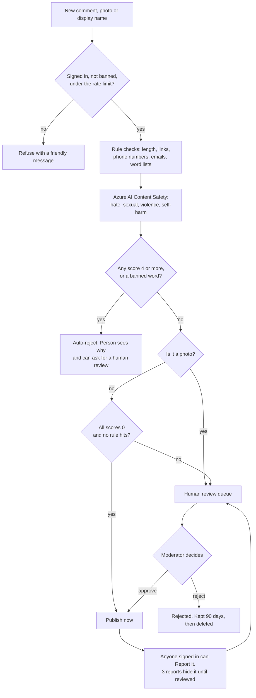
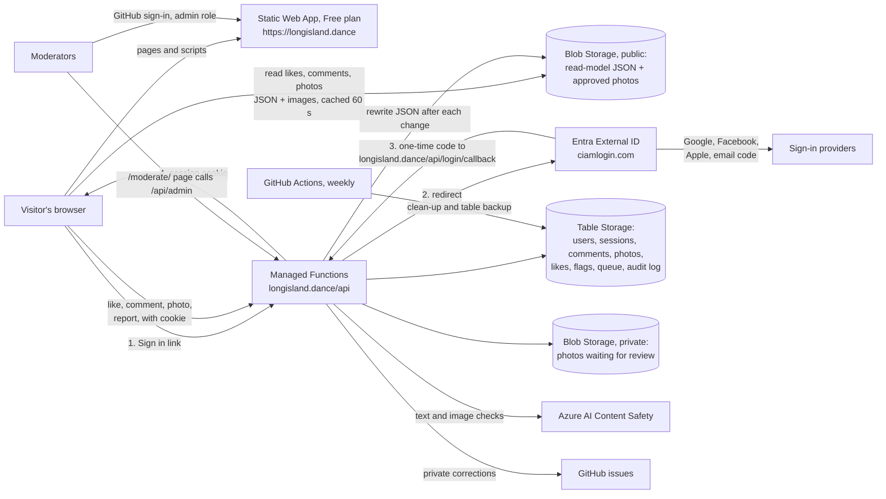
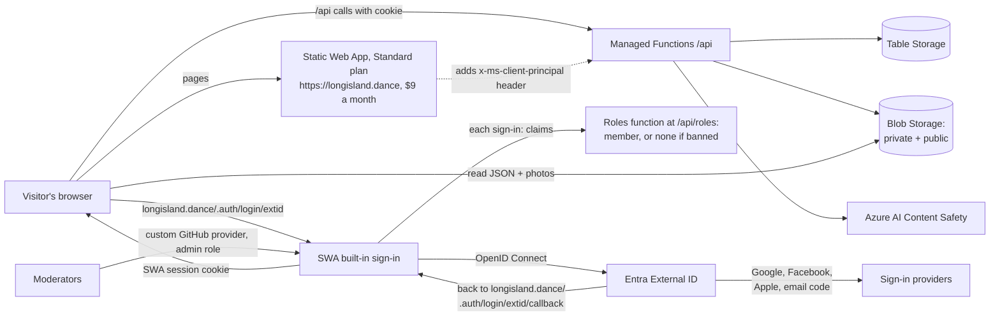
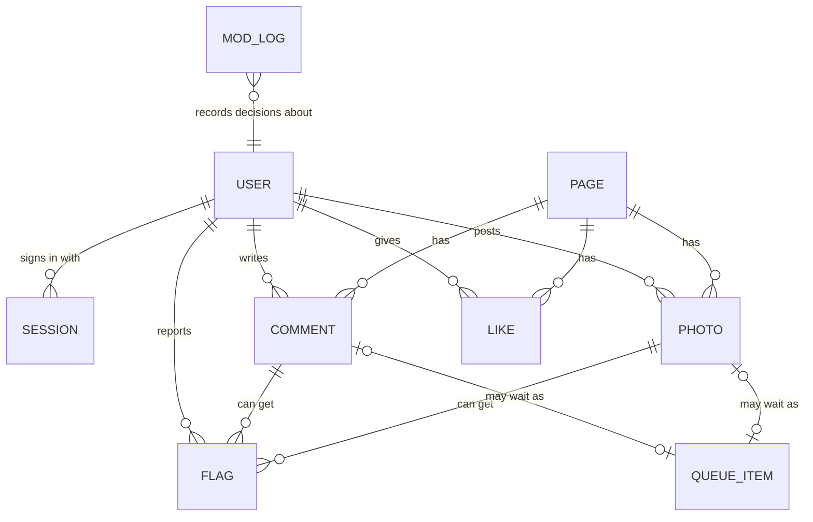

# Proposal: sign-in, comments, photos and likes

**Status:** proposal, **waiting for the owner to decide**. Nothing here is built, and no Azure resources or live-site settings were changed.
**Date:** 2026-10-03. Every vendor fact was checked on this date against the official page linked in [Sources](#sources). Anything we could not confirm says **unverified**.

## Summary

Visitors could sign in with **Google, Facebook, Apple or a one-time code sent to their email**, then **like** a page, **comment**, and (later) **post photos** on events, venues, organizers, teachers, bands/DJs and dance styles. Browsing stays free and open to everyone; only liking, commenting and posting need an account. **"Sign in with Instagram" is not possible** for ordinary personal accounts: Meta shut down that API on December 4, 2024, and its replacement only works for business and creator accounts.

**Recommendation: Option 1.** Let **Microsoft Entra External ID** run sign-in (free up to 50,000 monthly users). Keep the site on the **Static Web Apps Free plan**. Our own small Azure Functions save likes, comments and photos in **one Azure Storage account**. **Azure AI Content Safety** checks every post; anything unclear, and **every photo**, waits for a human in a moderation queue. Estimated running cost: **about $0.10 a month at 200 signed-in users, about $0.50 at 2,000, and about $35 at 20,000** (mostly AI checks and photo downloads). Build it in two steps: **phase 1** = likes + text comments (about 11-15 developer-days), **phase 2** = photos (about 5-7 more days) after the owner approves the photo and age rules. If the owner would rather pay **$9 a month** so Azure manages sign-in sessions for us, **Option 2** (Static Web Apps Standard) is a close second.

### The 3 decisions the owner needs to make

1. **Option 1 ($0 a month, a bit more of our own sign-in code) or Option 2 ($9 a month, Azure handles sign-in sessions).**
2. **Who owns visitor accounts and where they live.** External ID needs an Azure subscription and its own Entra "external tenant". The current subscription looks like a Microsoft-internal one; a community site that volunteers may take over may need its own subscription. (The custom domain is already done: the site is live at **https://longisland.dance**, which every redirect and callback address below uses.)
3. **Community rules:** we suggest **13+ to like or comment, 18+ to post photos, no photos where a child can be recognized, every photo reviewed by a person, and removal requests handled within 48 hours.** Who are the moderators?

Smaller choices (can wait): turn on Facebook at launch or later; add Apple later (costs $99 a year); use Cloudflare Turnstile bot checks or not.

## Words used in this proposal

| Word | Plain meaning |
| --- | --- |
| **Sign-in provider** (identity provider, IdP) | The company that checks who you are: Google, Facebook, Apple, Microsoft, or an email code. |
| **OAuth / OIDC** | OAuth is the standard "Sign in with Google" handshake. **OpenID Connect (OIDC)** is OAuth plus a signed "ID card" (an **ID token**) that says who the person is. |
| **Token / JWT** | A small signed text that proves something (for example, "this is user 123"). A **JWT** is the common format. Our server checks the signature before trusting it. |
| **Session cookie** | A small random value the browser sends back with each request so the site remembers you are signed in. |
| **MAU** (monthly active users) | People who **sign in** at least once in a month. People who only browse are not counted. |
| **Entra External ID** | Microsoft's sign-in service for customers and the public (not employees). |
| **SWA** | Azure **Static Web Apps**, where the site is hosted. **Free** plan today; **Standard** costs $9 per app per month. |
| **Azure Function** | A small piece of server code that runs only when called. Ours live in `api/`. |
| **Table Storage / Blob Storage** | Cheap Azure storage. **Tables** hold small records (likes, comments). **Blobs** hold files (photos, JSON). |
| **SAS** (shared access signature) | A temporary link that lets someone read or write one storage file for a few minutes without knowing the storage password. |
| **Read model** | A ready-to-show JSON file per page (likes count, approved comments and photos) that the browser downloads directly. |
| **Egress** | Data sent out of Azure to visitors (for example, photo downloads). The first 100 GB each month is free. |
| **CSP** (Content Security Policy) | A browser rule list that says which websites our pages may load scripts, images and frames from. Ours is strict on purpose. |
| **EXIF** | Hidden data inside photos, often including **GPS location** and the camera owner. We remove it. |
| **Moderation queue** | A to-do list of posts waiting for a person to approve or reject. |
| **Gray band** | Posts the AI is unsure about. They go to the queue instead of being auto-approved or auto-rejected. |
| **Turnstile** | Cloudflare's free "are you a human?" check that usually needs no clicking. |

## Options at a glance

Costs are per month at three sizes: **tiny** (200 signed-in users, 50 photos a month), **medium** (2,000 users, 500 photos), **large** (20,000 users, 5,000 photos). Details and math are in [Cost table](#8-cost-table).

| # | Option | Google | Facebook | Email code | Stays on SWA Free | Tiny | Medium | Large | Build effort | Biggest risk |
| ---: | --- | :---: | :---: | :---: | :---: | ---: | ---: | ---: | ---: | --- |
| **1** | **External ID + our Functions + Azure Storage (recommended)** | ✅ | ✅ | ✅ | ✅ | **$0.10** | **$0.50** | **$35** | 16-22 days | We write and maintain the sign-in session code. |
| 2 | SWA **Standard** + External ID plugged into SWA sign-in | ✅ | ✅ | ✅ | ❌ | $9.10 | $9.50 | $44 | 15-20 days | $108 a year; less control over the session. |
| 3 | Build our own sign-in (talk to Google and Facebook directly, send our own email codes) | ✅ | ✅ | ✅ | ✅ | $0.15 | $1.00 | $40 | 20-27 days | Most security-sensitive code; email delivery is on us. |
| 4 | Hosted sign-in service (Auth0 Free is the best fit) + our Functions + Azure Storage | ✅ | ✅ | ✅ | ✅ | $0.10 | $0.50 | $40 | 15-21 days | Big price jump past 25,000 users; outside vendor holds user data. |
| 5 | All-in-one backend (Supabase; Firebase similar) | ✅ | ✅ | ✅ | ✅ | $0-25 | $25 | $42+ | 13-19 days | Free projects pause after 7 quiet days; data leaves Azure; new platform to learn. |
| 6 | Self-hosted open-source sign-in server (Keycloak, Zitadel, Authentik...) on Azure | ✅ | ✅ | ✅* | ✅ | $27-51 | $28-52 | $67-91 | 19-26 days + upkeep | Always-on server and database to patch and back up. |
| 7 | Comment system (Remark42 self-hosted; or a paid hosted widget) + our own likes | ✅ | ✅ | ✅ | ✅ | $12.50 | $13 | $48 | 7-12 days | No page likes, no pre-approval queue, weaker AI moderation, iframe. |
| 0 | *For comparison:* SWA Free built-in sign-in (GitHub + Microsoft accounts only) | ❌ | ❌ | ❌ | ✅ | $0.10 | $0.50 | $35 | 12-17 days | Does not meet the brief (no Google, Facebook or email). |

\* Keycloak has no built-in email code sign-in; Kratos, Authentik, Logto and Zitadel do (see [Option 6](#option-6-self-hosted-open-source-sign-in-server)).
**Instagram is ❌ for every option** (see [Instagram](#3-sign-in-providers-what-is-really-possible)).

## Recommendation and phased plan

**Choose Option 1.** It meets every requirement that is possible today, costs nothing for sign-in at all three sizes, keeps the site on SWA Free, and keeps visitor data in Azure next to the rest of the project. External ID does the hard parts (Google, Facebook, Apple, email codes, password-free accounts, account recovery), and sends the email codes for free. Our Functions only have to trust **one** sign-in issuer.

**Phase 1: likes and text comments (about 11-15 developer-days).**

- External ID tenant with **Google + email code** first. Add **Facebook** when the Meta app, privacy page and data-deletion page are ready (no Meta app review is needed for basic login).
- Like button and comment box on every event, venue, organizer, teacher, band/DJ and dance-style page. "Suggest a correction" sends private feedback to editors and opens a GitHub issue (replaces the GitHub-account requirement in decision P12 for signed-in visitors).
- AI text checks (Content Safety free tier), a "Report" button, rate limits, bans, an audit log, and a moderation page for admins (GitHub sign-in with an `admin` role, as already planned for phase 5).
- Account page: change display name, download my data, delete my account.
- Privacy page, community rules and FAQ updates.

**Phase 2: photos (about 5-7 developer-days), after the owner approves the photo and age rules.**

- Upload through our Function: check the file type, remove EXIF/GPS, resize, run the AI image check, then **always** wait for a human.
- Approved photos appear on the page within a minute.

**Phase 3 (optional):** Apple sign-in, "trusted member" auto-approval for people with a good record, a second AI opinion for gray-band posts, and email notices ("your photo was approved").

**Revisit** if usage grows past about 10,000 signed-in users a month (AI checks and photo downloads start to cost real money; see [cost table](#8-cost-table)) or if the owner wants Azure-managed identity instead of storage keys (needs SWA Standard; see [Option 2](#option-2-swa-standard--external-id-as-the-swa-sign-in-provider)).

## 1. What the site has today (checked in the repo)

- **Astro static site**; all data is JSON/YAML in `src/content/**`, validated by Zod (`src/lib/schemas.ts`). Every data change is a git commit (GitOps).
- **Azure Static Web Apps Free** (`swa-li-dance-events-web`, East US 2) plus Log Analytics (0.1 GB/day cap) and Application Insights, from `infra/main.bicep` and `infra/deploy.ps1`. The Bicep already allows `skuName: 'Standard'`.
- **Live at https://longisland.dance** (the Static Web App's default domain). `www.longisland.dance` and the `*.azurestaticapps.net` address redirect to it with 301s, so every sign-in redirect and callback address in this proposal uses `https://longisland.dance` only.
- **Managed Functions** in `api/` (Node, Functions v4, `apiRuntime: node:22`): a GitHub OAuth bridge for Decap CMS (`/api/auth`, `/api/callback`) and `/api/telemetry`. They already use patterns we will reuse: host allow-list (`api/src/hosts.js`), same-origin checks, size limits, strict input validation, a per-instance rate limiter and a salted IP hash that is never stored (`api/src/telemetry-validate.js`, `api/src/functions/telemetry.js`).
- **Strict CSP** written at build time by `scripts/postbuild.mjs` into `staticwebapp.config.json`: script hashes, no inline styles (the build fails on `style="..."`), `default-src 'self'`, no `frame-src`, `form-action 'self'`, `frame-ancestors 'none'`. Decap CMS has its own looser CSP under `/admin/*`. The config file must stay under 20 KB.
- **Privacy promise today:** the privacy page says "No accounts" and no tracking cookies unless you agree (`src/content/pages/privacy.md`). This proposal would change that page.
- **Planned, not built:** one Storage account (Tables + Blobs, decision P20), an admin area with SWA built-in GitHub sign-in and an `admin` role, a moderation queue, and a feedback form that writes to Table Storage and opens a GitHub issue (decision P12). Corrections today use GitHub issue forms. **SWA Free managed Functions cannot use managed identity**, so they must reach Storage with a key or SAS kept in app settings (P20).
- **Content today:** 41 events, 13 venues, 14 organizers, 10 teachers, 9 bands/DJs, 15 styles. Event pages are per date (`/events/<date>-<id>/`); we suggest attaching comments and likes to the **event series id** and storing the date as an extra field.

## 2. Static Web Apps sign-in: Free vs Standard

| | **Free** (today) | **Standard** |
| --- | --- | --- |
| Price | $0 | **$9.00 per app per month** in East US 2. 100 GB bandwidth a month included per subscription, then $0.20 per GB. |
| Ready-made sign-in | **GitHub** and **Microsoft Entra ID**. The Microsoft option lets **any Microsoft account** sign in. | Same, **but adding any custom provider turns the ready-made ones off.** |
| Google, Facebook, Apple, X, or any OpenID Connect provider (for example External ID) | **No** | **Yes** ("custom authentication"). Secrets go in app settings. |
| Give people roles by invitation | Yes, up to **25** people per app; invite links last at most 168 hours (7 days). | Same. |
| Give roles from our own function at each sign-in (`rolesSource`) | No | Yes (only with custom authentication). Roles from invitations are then ignored. |
| "Who am I?" for the browser | `GET /.auth/me` returns the signed-in user, or `null`. | Same, plus the provider's **claims** (name, email...). |
| What our Functions receive | Header **`x-ms-client-principal`**: Base64 JSON with `identityProvider`, `userId` (unique **per app**), `userDetails` (email or username), `userRoles`. **No claims.** | Same. |
| Functions | Managed only: HTTP triggers only, no managed identity, no Key Vault references. | Managed **or** bring your own Functions app (timers, Blob triggers, managed identity). |
| Limits | 30 MB per request, 45 seconds per API call, 250 MB site, 15,000 files, 3 preview environments. | 30 MB, 45 s, 500 MB site, 15,000 files, 10 previews, SLA. |

**What moving to Standard would change:**

- **+$108 a year.** No overage risk on bandwidth (Free has no overage option).
- Adding Google/Facebook/External ID **switches off** the ready-made GitHub sign-in, so moderators would also need a **custom GitHub registration**. Decap CMS is not affected: it uses its own OAuth bridge.
- Allows `rolesSource` (for example, give everyone a `member` role at sign-in, and give banned people none).
- Allows a **separate Functions app** with managed identity (no storage keys in settings) and background triggers (photo processing, nightly clean-up). That app would be billed separately.
- One line in `infra/main.bicep` (`skuName = 'Standard'`), or one switch in the portal.

## 3. Sign-in providers: what is really possible

| Provider | Possible? | Cost | What it takes |
| --- | --- | --- | --- |
| **Google** (OIDC) | ✅ | Free (no price or billing step anywhere in Google's setup; "free" is not stated in one sentence, so treat as *very likely*). | A Google Cloud project and OAuth client. Asking only for `openid email profile` needs **no Google verification** and has **no 100-user cap**. Showing **our name and logo** needs "brand verification", which needs a **domain we own**: **longisland.dance** qualifies once it is verified in Google Search Console. With External ID, Google's redirect goes to Microsoft's `ciamlogin.com` (authorized domains `ciamlogin.com` and `microsoftonline.com`); with our own sign-in (Option 3), the redirect is `https://longisland.dance/api/login/callback`. |
| **Facebook** (OAuth 2.0) | ✅ | Free (no fee anywhere in Meta's docs; *unverified* as an explicit statement). | A Meta developer account and a **Consumer** app (type cannot be changed later). `public_profile` and `email` are **granted automatically, no app review**, and **no business verification** (that is only for "Advanced Access" requests). Needs a public **privacy policy URL** and either a **data-deletion instructions page** or a **data-deletion callback** (Meta POSTs a signed request; we must reply `{"url": ..., "confirmation_code": ...}`). The yearly Data Use Checkup applies only to Advanced Access (double-check in the dashboard). |
| **Instagram** | ❌ for personal accounts | - | The **Instagram Basic Display API ended on December 4, 2024**. Its replacements ("Instagram API with Instagram Login" / "with Facebook Login") only work for **professional (business or creator) accounts**; Meta says the Facebook-login version "cannot access Instagram consumer accounts". Threads' API is for publishing, not sign-in. Tools that list an "Instagram" button (PocketBase, Auth.js, Keycloak) all hit this same business-only API. **Plan:** offer Google and Facebook (many Instagram users have one); keep linking to organizers' public Instagram pages as today. |
| **Apple** | ✅ (optional) | **$99 a year** (Apple Developer Program). | A Services ID and our domain (`longisland.dance`) registered with Apple. Users may hide their email; Apple then gives a relay address (100 emails a day limit per address). Useful for iPhone users without Google. Whether a published app is also required is *unverified*; test in the Apple portal. |
| **Microsoft account** | ✅ | Free | Ready-made on SWA Free, or as a custom OIDC provider in External ID. Low demand for a dance site. |
| **Email code** (one-time passcode) or **magic link** | ✅ | **Free with External ID** (Microsoft sends the code). If we send our own: see below. | External ID supports "email with one-time passcode" out of the box. Sending our own email needs a sending service and, for good delivery, SPF/DKIM records on **longisland.dance** (we already own it). |

**If we send our own sign-in emails** (Options 3, 4 and 6):

| Service | Free amount | Price after | Notes |
| --- | --- | --- | --- |
| Azure Communication Services Email | none | **$0.00025 per email** + $0.00012 per MB | Azure-managed test domain: **5 a minute, 10 an hour, cannot be raised**. Our own domain: 30 a minute, 100 an hour by default (support can raise it). |
| Resend | **3,000 a month, max 100 a day** | from $20 a month (50,000) | |
| Brevo | **300 a day** | - | |
| Amazon SES | none ongoing (one-time AWS credit) | $0.10 per 1,000 | |
| Postmark | 100 a month | $15 a month (10,000) | |
| Mailgun | 100 a day | from $15 a month | |
| Twilio SendGrid | **free plan retired May 28, 2025** (now a 60-day trial) | from $19.95 a month | |

Email codes are cheap: 20,000 sign-in emails a month cost about **$5** on Azure.

## 4. The options in detail

All Azure-based options (1, 2, 3, 4, 6 and the likes part of 7) share the same **community backend**: Functions in `api/`, one Storage account (Tables for records, Blobs for photos and read-model JSON), and Content Safety for AI checks. Sections [5](#5-photos)-[7](#7-moderation) and [10](#10-architecture-data-model-and-what-changes) describe it once. The options differ mainly in **how people sign in**.

### Option 1: External ID + our Functions on SWA Free (recommended)

**How it works.** A "Sign in" link goes to `/api/login?with=google` (or `facebook`, `apple`, `email`). Our Function redirects the whole page to External ID (`<tenant>.ciamlogin.com`) with a hint so Google/Facebook opens directly (External ID "issuer acceleration": `domain_hint=google`). After sign-in, External ID sends the browser back to **`https://longisland.dance/api/login/callback`** with a one-time code. This is the only redirect URI to register in the External ID app registration, because `www` and the `azurestaticapps.net` address already 301 to `longisland.dance`; the Function builds it from the host allow-list, as `oauth.js` does today. (Pull-request preview sites have other addresses, so sign-in will not work there unless their URIs are added.) The Function swaps the code for an **ID token** (server-to-server, with a client secret in app settings), checks its signature, finds or creates the user record, and sets **our own session cookie** (`__Host-` prefix, `HttpOnly`, `Secure`, `SameSite=Lax`, 30 days). The session id is stored only as a hash in Table Storage, so we can sign someone out instantly (for example, when banning). This is the same shape as the existing GitHub bridge in `api/src/functions/oauth.js`, using a well-tested library (`openid-client`) instead of hand-written token code.

- **Sign-in methods:** Google, Facebook, Apple, Microsoft Entra / other OIDC, email + password, **email one-time code** (External ID docs). Instagram: no.
- **Cost:** **$0 up to 50,000 MAU**, then $0.03 per MAU. Email codes are sent by Microsoft at no extra charge. SMS sign-in would cost extra (not needed). A custom sign-in domain (for example `login.longisland.dance`) needs **Azure Front Door**, which costs extra; we suggest keeping the default `ciamlogin.com` address.
- **Pros:** free at every size we priced; Microsoft runs the risky parts (passwords, codes, account recovery, provider secrets); keeps data in Azure; no third-party script on our pages and **no CSP change for sign-in**; stays on SWA Free.
- **Cons:** we own the session code (small, but security-relevant: CSRF, cookie flags, logout); setting up an external tenant and user flow in the Entra admin center takes learning; the sign-in page is Microsoft-hosted (we can add our logo and colors); the tenant must be linked to an Azure subscription for billing.
- **Effort:** sign-in 3-5 days; whole project 16-22 days (phase 1 + 2).
- **Risks:** subscription/tenant ownership (see owner decision 2); someone must keep the Google/Facebook client secrets current in External ID.

### Option 2: SWA Standard + External ID as the SWA sign-in provider

**How it works.** Upgrade SWA to Standard and register External ID as a **custom OpenID Connect provider** in `staticwebapp.config.json` (`auth.identityProviders.customOpenIdConnectProviders`). SWA handles the redirect, callback and session cookie; the callback to register in External ID is **`https://longisland.dance/.auth/login/extid/callback`** (SWA's pattern is `/.auth/login/<provider name>/callback`; `extid` is the name we would give the provider in the config). Functions read the **`x-ms-client-principal`** header. A `rolesSource` function (`/api/roles`) runs at each sign-in and returns roles such as `member` (or nothing for banned users). GitHub must be re-added as a custom provider for moderators. You could also register Google and Facebook directly in SWA and use External ID only for email codes, but using External ID for everything keeps one user list.

- **Cost:** $9 a month + the shared backend.
- **Pros:** least sign-in code for us; SWA's session handling is managed by Microsoft; route rules can require roles (`"allowedRoles": ["member"]` on `/api/comments`).
- **Cons:** $108 a year; the Function header has **no claims** and an SWA-specific user id, so we map users through `rolesSource` (which does receive claims); turning on custom auth disables the ready-made GitHub/Microsoft logins; bans take effect at next sign-in unless the Functions also check a ban list (they should).
- **Effort:** sign-in 2-3 days; whole project 15-20 days.
- **Bonus:** opens the door to a separate Functions app with managed identity (no storage keys) and timer/Blob triggers.

### Option 3: Build our own sign-in

**How it works.** Our Functions talk to Google (OIDC) and Facebook (OAuth 2.0 + Graph API `/me`) directly, with redirect URIs `https://longisland.dance/api/login/callback/google` and `.../facebook`, and send their own email codes or magic links through Azure Communication Services Email from `longisland.dance`. We store users, linked identities and sessions in Table Storage.

- **Cost:** $0 for sign-in + email about $0.05 / $0.50 / $5 a month (200 / 2,000 / 20,000 emails). Sending from `longisland.dance` needs SPF/DKIM DNS records, but no new domain.
- **Pros:** no identity vendor; full control; stays on SWA Free.
- **Cons:** the most security-sensitive code (code-guessing limits, token expiry, account linking when the same email uses Google and Facebook, account recovery); we must implement Facebook's data-deletion rules ourselves; email deliverability and spam folders are our problem; ACS's test domain allows only 10 emails an hour.
- **Effort:** sign-in 7-10 days; whole project 20-27 days.

### Option 4: Hosted sign-in service + our Functions

All of these use a **top-level redirect** to the vendor's sign-in page (works with our CSP), and our Functions check the vendor's tokens with its public keys (JWKS). Every vendor needs us to create our **own Google and Facebook OAuth clients** for production.

| Vendor | Free amount | Google / Facebook / email code | Notes |
| --- | --- | --- | --- |
| **Auth0** | **25,000 MAU** | ✅ / ✅ / ✅ | Best free fit. Built-in email is rate-limited and "not production-grade", so add our own email service. Custom domain is free but needs a card on file. Crossing 25,000 MAU jumps to paid "B2C Essentials" bands (20,000 MAU is listed at about $1,400 a month), a big cliff. Inactive free tenants may be deleted after 150 days (*unverified*). |
| Clerk | 50,000 monthly *retained* users | ✅ / ✅ / ✅ | Production **requires a domain we own** with a DNS record (`longisland.dance` works); branding removal is paid. Repriced 2026-02-05. |
| Firebase Authentication | Unlimited for Google/Facebook/email link | ✅ / ✅ / link only | Email links: **5 a day on the free Spark plan**. Its redirect sign-in uses an **iframe** from Firebase's domain, so we would have to add `frame-src`. |
| WorkOS AuthKit | 1,000,000 MAU | ✅ / **❌ no Facebook** / ✅ | Fails the Facebook requirement. |
| Supabase Auth | 50,000 MAU | ✅ / ✅ / ✅ | Built-in email: **2 an hour**, so custom SMTP is needed. See Option 5. |
| Stytch (Twilio since 2025-11-14) | 10,000 MAU | ✅ / ✅ / ✅ | $0.20 per MAU above 10,000, about **$2,000 a month at 20,000**. |
| Logto Cloud | 50,000 MAU | ✅ / ✅ / ✅ | One free custom domain. |
| Descope, Kinde | 7,500 / 10,500 MAU | ✅ / ✅ / ✅ | Paid tiers from $249 (Descope) or $25 (Kinde) a month. |
| Zitadel Cloud, Ory Network | 100 daily users / no production on free | - | Effectively paid ($100+ a month). |

- **Cost (Auth0):** $0 for sign-in up to 25,000 MAU + email (Resend free at tiny and medium, about $5 on Azure at large) + shared backend: about **$0.10 / $0.50 / $40**.
- **Pros:** polished sign-in pages; little code.
- **Cons:** an outside company holds visitor emails; pricing can change (Clerk, Logto and Firebase all changed terms in 2025-2026); hard price cliffs.
- **Effort:** sign-in 2-4 days; whole project 15-21 days.

### Option 5: All-in-one backend (Supabase or Firebase)

Use one vendor for sign-in, database and file storage, called straight from the browser with row-level security rules.

- **Supabase Free:** 50,000 MAU, 500 MB Postgres, **1 GB file storage, 5 GB egress a month**, and **free projects pause after 7 days without activity** (2 free projects max). A public site should not risk pausing, so plan on **Pro at $25 a month** (100,000 MAU included). Pro's included storage and egress were not verified; check before deciding. No built-in image moderation; we would still call Content Safety or OpenAI's free moderation API.
- **Firebase:** Auth is free, but **Cloud Storage needs the pay-as-you-go Blaze plan** since 2026-02-03 (card required). The "Moderate images" extension uses Cloud Vision SafeSearch (first 1,000 a month free, then $1.50 per 1,000).
- **Cost:** about **$0-25 / $25 / $42+** a month (large: Pro + Content Safety + overages that we could not verify).
- **Pros:** less backend code; real database queries; generous free sign-in.
- **Cons:** visitor data and photos leave Azure and git; a second platform to secure, monitor and pay; the browser talks to a third-party domain (CSP `connect-src` and `img-src` changes); moving away later is work.
- **Effort:** 13-19 days, plus learning Postgres row-level security.

### Option 6: Self-hosted open-source sign-in server

Run **Keycloak** (Apache-2.0), **Ory Kratos** (Apache-2.0), **Authentik** (MIT), **Logto OSS** (MPL-2.0) or **Zitadel** (AGPL-3.0 since v3) in Azure Container Apps with a PostgreSQL database. All support Google and Facebook. Kratos, Logto and Authentik have built-in email codes or links; **Keycloak does not** (community add-ons only). All need **our own email service**.

- **Cost:** an always-on container (0.5 vCPU, 1 GiB) is about **$10-34 a month** after Container Apps' free monthly allowance (180,000 vCPU-seconds and 360,000 GiB-seconds); the low end assumes Azure bills it at the "idle" rate most of the time. PostgreSQL Flexible Server B1ms is **$0.017 an hour, about $12.41 a month**, plus disk (*unverified*, roughly $4). Total about **$27-51 / $28-52 / $67-91** with the shared backend.
- **Pros:** no vendor; full control; can move anywhere.
- **Cons:** the site has **no always-on server today**; this adds patching (security fixes often ship only for the latest version), upgrades in order, backups, monitoring and an on-call worry. Logto suggests 2 vCPU / 8 GiB as a minimum, far above the cheap sizes.
- **Effort:** 19-26 days, plus about 2-4 hours a month of upkeep.

### Option 7: Use a comment system

None of the 18 systems checked does everything (photos + page likes + AI moderation + Google/Facebook/email + $0 + strict CSP). The credible ones:

| System | License / status | Google / Facebook / email | Photos | Page-level like | Moderation | Embed | Cost |
| --- | --- | --- | --- | --- | --- | --- | --- |
| **Remark42** | MIT, v1.17.1 (2026-09-14) | ✅ / ✅ / ✅, plus custom OAuth2 | ✅ up to 5 MB | ❌ (comment votes only) | **No approval queue**; webhooks can call our AI *after* posting | iframe | Self-host; about 80 MB RAM. App Service B1 Linux $0.017/hour (about $12.41 a month). 4 security advisories in 2024-26, all fixed. |
| **Artalk** | MIT, v2.10.0 (2026-07-24) | ✅ / ✅ / ✅ | ✅ up to 5 MB | ✅ (`pageVote`) | Approval queue, Akismet; its AI checks are Tencent/Alibaba clouds | script | Self-host; needs a disk. |
| **Waline** | GPL-2.0 | ✅ / ✅ / ✅, plus OIDC | ✅ (Base64 or custom) | ✅ ("reactions") | Server hooks before saving, so we can call our own AI | script (Vue) | Self-host or serverless. **Two high-severity XSS advisories in 2026** (GHSA-7w94-hxwm-gg99, GHSA-crj3-q72p-ggqm). |
| **Comentario** | MIT, v3.18.0 (2026-08-14) | ✅ / ✅ / password | ❌ | ❌ | Real approval queue; Akismet | web component (cleanest CSP) | Self-host (Go + Postgres). |
| Hyvor Talk | proprietary | ✅ / *unverified* / ✅ | ✅ 2-5 MB | ✅ ("Ratings") | Akismet + its own filter | script, documented CSP | **No free tier**; from €5 a month. |
| FastComments | proprietary | via our own sign-in (SSO) | ✅ with AI image checks | ✅ | AI agents + human approval | script | No free tier; about $6 a month (*unverified*). |
| Disqus | proprietary | ✅ / ✅ / ✅ | ✅ 2 MB | ❌ | spam filter | script + iframe | Free plan **shows ads and shares data with ad partners**; no ads from $12 a month. **Rejected** on privacy. |
| giscus | MIT | **GitHub only** | ❌ | ✅ | GitHub tools | iframe | Free. Fails the sign-in requirement. |

Not viable: **Coral** (depends on Google's Perspective API, which **ends December 31, 2026**; needs MongoDB + Redis), **Isso** (no sign-in), **Cusdis** (archived), **Commento / Commento++** (dead since 2022-2023), **Twikoo** (no sign-in; a critical 2026 file-overwrite advisory, GHSA-3q3f-grmp-83pj), **Cactus Comments** (cannot pre-approve), **Talkyard** (heavy, no free tier), **Commentbox.io** (no photos, stale plugin), **Remarkbox** (email only, no photos).

- **Best pick if going this way: Remark42** for comments + photos, plus our own small likes feature, plus a webhook that sends new posts to Content Safety and hides bad ones. Cost about **$12.50 / $13 / $48** a month (large adds photo egress, AI checks and email).
- **Pros:** fastest to a working comment box (7-12 days); mature, privacy-first.
- **Cons:** posts are **public before** our AI or a human sees them (fails "everything moderated"); two user lists (Remark42's and ours for likes); an iframe means adding `frame-src`; another server to patch; photos live on that server's disk.

### Option 0: SWA Free ready-made sign-in (for comparison)

GitHub + any Microsoft account work today for free. It would be the cheapest path, but it does not offer Google, Facebook or email codes, so it does not meet the brief. It remains the right choice for **moderators** (GitHub + `admin` role), as already planned.

## 5. Photos

### Upload path

| | **A. Upload through our Function (recommended)** | B. Browser uploads straight to Blob with a short-lived SAS |
| --- | --- | --- |
| How | Browser shrinks the photo, then POSTs it to `/api/photos`. The Function checks, cleans, resizes and stores it. | `/api/photos/start` returns a write-only SAS for one file name (valid ~10 minutes). Browser uploads to Blob, then calls `/api/photos/finish`. |
| Size and type limits | Enforced before anything is stored. | **A SAS cannot limit file size or type**; we can only check afterwards. |
| GPS/EXIF | Removed before the photo is ever saved. | The raw file, **with GPS**, sits in storage until `finish` runs (or forever, if it never runs). |
| Fits SWA Free? | Yes: 30 MB request limit, 45-second time limit. One phone photo takes a few seconds. | Managed Functions have **no Blob trigger**, so we depend on the browser calling `finish`. |
| CSP | No change for upload. | `connect-src` must allow the Blob host, plus a CORS rule on the storage account. |

**Steps in option A:**

1. Browser: accept JPEG, PNG or WebP; shrink to at most 2,560 px on the long side with a `<canvas>` (this also drops EXIF) so uploads are usually under 2 MB. Reject anything over **8 MB**. iPhone HEIC photos are usually converted to JPEG by the browser; test this on real iPhones.
2. Function: signed in, not banned, under the upload limit (for example 10 photos a day), consent boxes ticked, Turnstile token valid (for new accounts).
3. Check the **real file type from the first bytes**, not the file name.
4. With the `sharp` image library: apply the camera rotation, **strip all metadata** (sharp drops EXIF unless told to keep it), and save three WebP sizes: 480, 1,024 and 2,048 px. **The original is never stored.** sharp uses a native library; confirm it runs in SWA managed Functions during phase 2 (*unverified*). Fallback: a pure-JavaScript image library (slower).
5. AI image check (Content Safety accepts up to 4 MB and 50-7,200 px, so we send the 1,024 px copy) and a text check of the caption and alt text.
6. Save the three sizes in a **private** `pending` container and add a queue item. **Every photo waits for a person.**
7. On approval, copy to the **public** `photos` container (file names include a random id, so they can be cached for a year) and update the page's read-model JSON. On rejection or takedown, delete the files and update the JSON; the photo disappears within a minute.

### How approved photos appear on a static site

| | **Fetched at runtime from Blob (recommended)** | Committed to git and rebuilt |
| --- | --- | --- |
| Speed | Visible within about a minute of approval. | Visible after the next build and deploy (minutes to a week). |
| Removal | Delete the file: gone at once. | A photo of a person stays in **git history forever** unless history is rewritten. Bad for takedowns and for minors. |
| Limits | None that matter. | SWA Free allows **250 MB** and **15,000 files** per site; three sizes per photo use these up fast. Repo keeps growing. |
| Search engines | Photos are not in the HTML (fine; they are user content). | Photos are in the HTML. |
| Work | One small script on the page. | A bot that commits, plus noisy history. |

Keep the existing `gallery/*.yml` path (decision P15) for the few photos editors add on purpose with written permission.

### Rules for photos (proposed policy)

- **18 or older** to post photos. Uploaders tick: "I took this photo or have the right to share it", "The people who can be recognized agreed to be posted", and "No one under 18 can be recognized".
- **No photos where a child can be recognized.** Many listings are kids' classes. Organizers who want to share kids' photos can send them to editors with written parent consent; that stays outside this feature. Under New York Civil Rights Law §§ 50-51, using a person's picture for advertising or trade needs written consent, and a **parent's** consent for a minor. A non-commercial community site is probably safer than an advertiser, but the simple, safe rule is "no recognizable kids".
- **Every photo is checked by a person** before it is public. AI cannot tell age or consent.
- **Anyone can ask to remove a photo of themselves**, no reason needed; we remove it within **48 hours** (faster for safety issues).
- **Neither Azure Content Safety nor OpenAI's moderation API can detect child-abuse images** (both say so). If a moderator ever sees one: do not download or share it, keep the record, and report it to the NCMEC CyberTipline. U.S. law (18 U.S.C. § 2258A) requires online "providers" that learn of such material to report it; ask a lawyer how this applies to a volunteer site. Microsoft's PhotoDNA matches known abuse images; whether a small site can use it is *unverified*.

### Photo storage and download cost

Assume each photo is stored as three WebP files totaling about **0.6 MB**, and the average photo request is about **50 KB** (mostly 480 px thumbnails). Prices are East US 2, Hot LRS.

| | Tiny | Medium | Large |
| --- | ---: | ---: | ---: |
| Photos stored after 12 months | 600 (0.36 GB) | 6,000 (3.6 GB) | 60,000 (36 GB) |
| Storage at $0.0184 per GB-month | $0.01 | $0.07 | $0.66 |
| Photo requests a month | 50,000 | 500,000 | 5,000,000 |
| Read operations at $0.004 per 10,000 | $0.02 | $0.20 | $2.00 |
| Data sent to visitors | 2.5 GB | 25 GB | 250 GB |
| Egress (first 100 GB a month free, then $0.087 per GB) | $0 | $0 | $13.05 |

## 6. Likes

- **One like per signed-in person per page.** Table `Likes`: **PartitionKey** = page key (for example `venue:huntington-moose-lodge`, `event:<series-id>`, `style:west-coast-swing`), **RowKey** = user id. Liking twice just finds the existing row (no double counts); unliking deletes it. A second row in `UserItems` (PartitionKey = user id) lets us list or delete everything a person liked.
- **Counting:** after each like or unlike, the Function counts the rows in that page's partition (fast: one partition, a few thousand rows at most) and writes the count into the page's **read-model JSON** (`community/venue/huntington-moose-lodge.json`) and into a small per-type file (`community/counts/venue.json`) used by list pages. No separate counter to drift out of sync.
- **Showing counts on static pages:** the page's small script downloads the JSON from Blob Storage with `Cache-Control: public, max-age=60`. Reads never touch our Functions, so they are fast, cheap and do not count against the managed Functions' included executions (the SWA pricing page mentions "1 million free executions"; what happens past that on Free is *unverified*). Only signed-in people make one extra call (`/api/me/likes?page=...`) to see whether *they* liked it.
- **Why not rebuild?** Counts in the HTML would be up to a week old, and each like would need a commit. Not worth it. Without JavaScript, the page shows no counts and a "Sign in to like" link.
- **Limits:** for example 300 likes a day per person, to stop scripts.

## 7. Moderation

### How a post is checked

- **Scores:** Content Safety rates each of 4 categories (hate, sexual, violence, self-harm) as **0, 2, 4 or 6** (0 = safe, 6 = most severe). **0 everywhere → publish. 2 anywhere → gray band → human. 4 or 6 anywhere → reject.** Tune after a month of real data.
- **Rules the AI does not cover:** links, phone numbers and email addresses (privacy and spam) go to the queue; a custom word list (Content Safety supports blocklists) catches local slurs and spam words; posts from accounts less than a day old that contain links go to the queue.
- **Spam and off-topic posts** are not what Content Safety looks for. Phase 3 could add a second opinion for gray-band posts, for example OpenAI's moderation API (free, text and images; data not used for training; kept up to 30 days for abuse checks) or a small language model asked "Is this about dancing?". Google's Perspective API is **shutting down at the end of 2026**; do not use it.

### AI moderation options and cost

| Service | Free amount | Paid price | Notes |
| --- | --- | --- | --- |
| **Azure AI Content Safety (recommended)** | **5,000 text records + 5,000 images a month**; stops (no charge) when used up; 5 requests a second | **$0.375 per 1,000 text records**, **$0.75 per 1,000 images** | A text record is up to 1,000 characters. Text up to 10,000 characters, images up to 4 MB. Available in East US 2. Cannot detect child-abuse images. |
| OpenAI Moderation API | free | free | Text + images (`omni-moderation-latest`). The "sexual/minors" category works on **text only**. Sends content to a third party. |
| Google Cloud Vision SafeSearch | 1,000 images a month | $1.50 per 1,000 | Images only. |
| AWS Rekognition | 1,000 images a month for 12 months | $0.001 per image | Images only. |
| Sightengine | 2,000 a month (500 a day) | paid plans | Images and text. |
| Google Perspective API | - | - | **Ends December 31, 2026.** |

### The human queue (in the planned admin area)

- A page at **`/moderate/`** (not under `/admin/`, so it keeps the strict site CSP instead of Decap's looser one), protected by a route rule `"allowedRoles": ["admin"]`. Moderators sign in with SWA's ready-made **GitHub** sign-in and get the `admin` role by invitation (up to 25 people on Free).
- It lists pending items oldest-first with the AI scores, the reason it is waiting, the page it belongs to and the poster's record (approved/rejected counts). Buttons: **Approve**, **Reject** (with a reason), **Hide**, **Ban user**. Photos are shown through short-lived read links (SAS) from the private container.
- **Reports from visitors:** a "Report" button on every comment and photo (one report per person per item). Three reports from different people, or one from an admin, **hide the item** until a moderator looks.
- **Banning:** set the user to `banned` (optionally until a date); all their sessions end at once; optionally hide all their posts. They can also be blocked in External ID so they cannot sign in at all. Because sign-in requires Google, Facebook or a working email, getting around a ban takes real effort.
- **Audit log:** every decision (AI or human) is written to an append-only `ModLog` table: who, what, when, why, scores, before/after status. Kept 2 years; the text of rejected posts is removed after 90 days.
- **Rate limits (starting points):** 10 comments an hour and 30 a day, 10 photos a day, 300 likes a day per person, plus the existing per-IP limiter for anonymous calls.
- **Bots:** sign-in itself (Google, Facebook, or an email code) stops most bots. Add **Cloudflare Turnstile** (free, unlimited checks, up to 20 widgets) on a new account's first posts and on any anonymous form; the Function must verify each token with Cloudflare's `siteverify` endpoint. Cloudflare says Turnstile uses only what it needs for bot detection; it needs `script-src` and `frame-src https://challenges.cloudflare.com`.
- **Workload guess:** at the medium size (about 3,000 comments and 500 photos a month), expect roughly 1-3 hours a week of human review once the thresholds are tuned (*estimate*).

### How feedback fits the "Report a problem / corrections" flow

Each page gets two different buttons:

- **Comment** (public): goes through the flow above and shows on the page.
- **Suggest a correction** (private, to editors): saved in a `Feedback` table **and** turned into a GitHub issue by the Function, labeled `correction`, with the page link and the suggested fix (after the AI check). **No name, email or user id goes into the public issue.** The Function uses a fine-grained GitHub token limited to "Issues: write" on this one repo, kept in app settings.
- People without an account keep using today's GitHub issue forms (decision P12). A later anonymous form with Turnstile can replace them.

## 8. Cost table

### Assumptions

| | Tiny | Medium | Large |
| --- | ---: | ---: | ---: |
| Signed-in users a month (MAU) | 200 | 2,000 | 20,000 |
| Photos posted a month | 50 | 500 | 5,000 |
| Comments and corrections a month | 300 | 3,000 | 30,000 |
| Likes a month | 1,000 | 10,000 | 100,000 |
| Page views that load likes/comments/photos | 20,000 | 200,000 | 2,000,000 |
| Photo requests a month (about 50 KB each) | 50,000 | 500,000 | 5,000,000 |
| Sign-in emails we send ourselves (Options 3, 4, 6, 7 only) | 200 | 2,000 | 20,000 |

Other assumptions: East US 2 prices from the Azure Retail Prices API; Storage is Standard LRS (Hot tier for blobs); photos are kept 12 months; text posts are under 1,000 characters (one Content Safety text record each, plus one for each photo caption); the read-model JSON is about 3 KB; the Azure subscription has no other big egress (the first 100 GB a month of egress is free per subscription). The domain `longisland.dance` is already owned and live, so no domain cost is added. Taxes and people's time are **not** included.

### Shared community backend (Options 1-4 and 6; Option 7 uses part of it)

| Item | Price used | Tiny | Medium | Large |
| --- | --- | ---: | ---: | ---: |
| Table Storage (records + transactions) | $0.045 per GB-month; $0.00036 per 10,000 transactions | $0.01 | $0.01 | $0.06 |
| Blob storage for photos (after 12 months) | $0.0184 per GB-month | $0.01 | $0.07 | $0.66 |
| Blob reads (photos + JSON) | $0.004 per 10,000 | $0.03 | $0.28 | $2.80 |
| Blob writes (photo files + JSON updates) | $0.05 per 10,000 | $0.01 | $0.08 | $0.80 |
| Egress (2.6 / 25.6 / 256 GB) | first 100 GB free, then $0.087 per GB | $0 | $0 | $13.57 |
| AI checks: Content Safety (350 / 3,500 / 35,000 text records; 50 / 500 / 5,000 images) | Free tier up to 5,000 + 5,000; then $0.375 per 1,000 text, $0.75 per 1,000 images | $0 | $0 | $16.88 |
| Managed Functions (writes and signed-in calls only: about 5,000 / 50,000 / 500,000 runs) | included with SWA | $0 | $0 | $0 |
| **Subtotal** | | **≈ $0.06** | **≈ $0.44** | **≈ $34.77** |

At the large size, Content Safety must move from the Free tier (which simply stops when used up) to the paid S0 tier, where every check is billed.

### Total per option (per month)

| Option | Sign-in | Email | SWA plan | Extra servers | **Tiny** | **Medium** | **Large** |
| --- | --- | --- | --- | --- | ---: | ---: | ---: |
| **1. External ID + our Functions** | $0 (free to 50,000 MAU) | $0 (Microsoft sends codes) | $0 | - | **≈ $0.10** | **≈ $0.50** | **≈ $35** |
| 2. SWA Standard + External ID | $0 | $0 | $9 | - | ≈ $9.10 | ≈ $9.50 | ≈ $44 |
| 3. Our own sign-in | $0 | ACS: $0.05 / $0.50 / $5.00 | $0 | - | ≈ $0.15 | ≈ $1.00 | ≈ $40 |
| 4. Auth0 Free + our Functions | $0 (free to 25,000 MAU) | Resend free / Resend free / ACS $5 | $0 | - | ≈ $0.10 | ≈ $0.50 | ≈ $40 |
| 5. Supabase (+ Content Safety) | Free, or Pro $25 | custom SMTP (free tiers) | $0 | Supabase | $0-25 | ≈ $25 | ≈ $42 + overages (*unverified*) |
| 6. Keycloak on Container Apps + PostgreSQL | $0 | ACS | $0 | ≈ $27-50 | ≈ $27-51 | ≈ $28-52 | ≈ $67-91 |
| 7. Remark42 on App Service B1 + our likes | $0 | Resend free / Resend free / ACS $5 | $0 | ≈ $12.41 | ≈ $12.50 | ≈ $13 | ≈ $48 |
| 0. SWA Free built-in (GitHub/Microsoft only) | $0 | $0 | $0 | - | ≈ $0.10 | ≈ $0.50 | ≈ $35 |

How to read this: at the tiny and medium sizes, the recommended option costs **less than a dollar a month**. At the large size, about half the cost is AI checks and about 40% is photo downloads. Ways to cut it later: skip AI checks for "trusted" members, make thumbnails smaller, or put a free CDN in front of the photos (not evaluated).

## 9. Privacy and legal (plain language, not legal advice)

> This section is general information from official sources, **not legal advice**. Ask a lawyer to review the final rules, especially anything about children and photos.

### What personal data is kept, and where

| Option | Sign-in data (email, name, Google/Facebook id) lives in | What our own tables keep |
| --- | --- | --- |
| **1** | Our Entra External ID tenant (Microsoft; we pick the country when creating it) | Our user id, the External ID user id, display name, status, posts, likes. **No email address.** |
| 2 | Same as 1, plus Static Web Apps' sign-in records (can be purged at `/.auth/purge/<provider>`) | Same as 1 |
| 3 | Our Table Storage (emails, provider ids, sessions) | Everything |
| 4 | The vendor (for example Auth0) | Same as 1 |
| 5 | Supabase or Firebase | Everything, including posts and photos, at that vendor |
| 6 | Our PostgreSQL server | Posts in our tables |
| 7 | The comment server's database and disk | Likes in our tables |

### Keeping and deleting data (proposal for Option 1)

| Data | Kept for |
| --- | --- |
| Session (sign-in cookie) | Up to 30 days, or until sign-out |
| Approved comments and photos | Until the person deletes them or their account, or a moderator removes them |
| Rejected posts | 90 days (for appeals), then the text and files are deleted; the decision stays in the log |
| Moderation log | 2 years |
| IP addresses | Never stored. A salted hash is used in memory for rate limits only, as `/api/telemetry` does today |
| Weekly backup of tables | 5 weeks, so deleted data is fully gone within about 5 weeks |

- **Account page:** change display name, **download my data** (profile, comments, photo links, likes as a JSON file), **delete my account** (removes profile, likes, comments and photos right away; the External ID account is deleted within 30 days, by hand in phase 1 and automatically later through Microsoft Graph).
- **Cookies:** our session cookie is set only after someone signs in and is **strictly necessary**. No U.S. law requires a cookie banner for that, and California's rules are about selling or sharing data, not login cookies. EU cookie rules do not apply to a U.S.-only site. The existing consent banner for optional analytics stays as it is. During sign-in, Microsoft sets its own cookies on `ciamlogin.com`.
- **Privacy page:** must change from "No accounts" to explain sign-in, what is stored, how long, how to download or delete, and that we **never sell or share** sign-in data (Meta's Platform Terms also forbid misuse of Facebook data; read section 3 of the terms in a browser before launch, *unverified* wording).

### Children

- **COPPA (federal):** applies to sites aimed at children under 13, or when the site **actually knows** a user is under 13. The FTC's FAQ says nonprofits outside the FTC Act are generally not covered, but encourages following the rules anyway. The updated COPPA Rule was published April 22, 2025, took effect June 23, 2025, with most compliance due April 22, 2026. **Our plan:** a **neutral age question** at first sign-up (month and year of birth, with no hint of the "right" answer, as the FTC suggests). Under 13: no account, nothing stored. We save only "13+ confirmed" (and "18+ confirmed" for photo posting), not the birth date.
- **New York Child Data Protection Act** (General Business Law Art. 39-FF), in effect since June 20, 2025: covers users a site **actually knows** are under 18. No nonprofit exception was found (*unverified*; check the Attorney General's guidance). The 18+ photo rule and "no extra data" design help here.
- **New York SAFE for Kids Act** takes effect January 25, 2027 and targets addictive algorithmic feeds; a date-sorted event list without push notifications is unlikely to count.

### Other rules that matter

- **New York SHIELD Act:** keep "reasonable" security (a lighter standard for small organizations) and notify people within 30 days of discovering a breach (and the Attorney General if 500+ New Yorkers are affected). Option 1 stores no passwords and no email addresses in our tables, which lowers the risk.
- **No general New York privacy law yet:** the "NY Privacy Act" (S3044) is still a bill. California, Virginia and Connecticut privacy laws have size thresholds (for example $25 million revenue or 100,000 people) that a volunteer site does not meet, and Virginia and Connecticut exempt nonprofits.
- **Section 230** (47 U.S.C. § 230): a site is generally not treated as the publisher of what users post, and removing posts it finds objectionable in good faith is protected. It does not cover federal crimes or copyright.
- **Copyright (DMCA, 17 U.S.C. § 512):** before accepting photos, **register a DMCA agent** with the U.S. Copyright Office (**$6**, renew every **3 years**), publish how to send a takedown notice, remove reported photos quickly, and follow the counter-notice rules (restore after 10-14 business days unless the claimant sues).
- **Facebook:** give Meta a **data-deletion instructions URL** (simplest: `https://longisland.dance/privacy/#delete-your-account`). A callback is optional. With External ID, the Facebook user id is stored in External ID, and deleting the account removes it.
- **Google:** the consent screen needs a homepage and privacy policy link (`https://longisland.dance/` and `https://longisland.dance/privacy/`); showing our name and logo needs brand verification of `longisland.dance`.

### Community rules and terms for posts (draft, plain language)

1. You must be **13 or older** to like or comment, and **18 or older** to post photos.
2. Only post photos you took or have the right to share. People who can be recognized must have agreed. **No photos where a child can be recognized.**
3. You still own what you post. You let us show it, resize it, and remove it on this site, and keep it in backups for a few weeks after you delete it.
4. Be kind and stay on topic. No ads or spam, no hate or harassment, no nudity or violence, and no one's private details (phone numbers, home addresses).
5. Every photo and some comments are checked by a person before they appear. We may remove anything and pause or close accounts. You can ask for one review of a decision.
6. Use **Report** to flag a problem. If a photo shows you, we will remove it within 48 hours, no questions asked.
7. This is a volunteer site; it is offered as is.

## 10. Architecture, data model and what changes

### Option 1 (recommended)

### Option 2 (runner-up)

### Data model (Azure Table Storage + Blob Storage)

A **page key** names what is being liked or discussed: `event:<series-id>`, `venue:<id>`, `organizer:<id>`, `instructor:<id>`, `performer:<id>`, `style:<id>`. Ids are the existing file names in `src/content/`. Time-ordered row keys use "reverse ticks" (a large number minus the time), so the newest rows come first.

| Table | PartitionKey | RowKey | Main fields |
| --- | --- | --- | --- |
| `Users` | user id (random) | `profile` | `idpUserId` (External ID object id), `displayName`, `status` (`active`, `muted`, `banned`), `bannedUntil`, `banReason`, `trust` (0 new, 1 trusted), `approvedCount`, `rejectedCount`, `age13Confirmed`, `age18Confirmed`, `photoTermsAcceptedAt`, `createdAt`, `lastSeenAt`. **No email.** |
| `UserIndex` | `idp` | External ID object id | `userId` (fast lookup at sign-in) |
| `Sessions` | SHA-256 of the session id | `s` | `userId`, `createdAt`, `expiresAt` |
| `Comments` | page key | reverse ticks + comment id | `userId`, `displayName` (copy), `kind` (`comment` or `correction`), `body`, `occurrenceDate`, `status` (`pending`, `published`, `rejected`, `hidden`), `ai` (scores JSON), `reason`, `flagCount`, `decidedBy`, `decidedAt`, `githubIssue` (corrections) |
| `Photos` | page key | reverse ticks + photo id | `userId`, `caption`, `alt`, `width`, `height`, `status`, `ai`, `consent` (own photo, people agreed, no children), `decidedBy`, `decidedAt` |
| `Likes` | page key | user id | `createdAt` |
| `UserItems` | user id | `like#<page key>`, `comment#<page key>#<row key>`, `photo#...` | pointer back to the row (for "download my data" and account deletion) |
| `Flags` | item id | reporter user id | `reason`, `note`, `createdAt` |
| `ModQueue` | `pending` | ticks + item type + item id | page key, row key, why it is waiting (`ai_gray`, `rule_link`, `reports`, `photo`), short AI summary |
| `ModLog` | `yyyy-mm` | reverse ticks + id | `actor` (GitHub username or `ai`), `action`, `targetType`, `targetId`, `reason`, `ai`, `before`, `after` (append-only) |
| `Limits` | user id | `<action>#<yyyymmddhh>` | `count` (deleted by the weekly clean-up) |

| Blob container | Access | Contents |
| --- | --- | --- |
| `pending` | private | Cleaned photos waiting for review (`<photo id>-480.webp`, `-1024`, `-2048`). Deleted automatically after 30 days by a lifecycle rule. |
| `photos` | public read | Approved photos: `<type>/<id>/<photo id>-<size>.webp`, `Cache-Control: public, max-age=31536000, immutable` |
| `community` | public read | Read model: `<type>/<id>.json` (likes count, latest approved comments, photo list) and `counts/<type>.json`, `Cache-Control: public, max-age=60` |
| `backups` | private | Weekly table exports, kept 5 weeks |

Table Storage has no automatic expiry, so a **weekly GitHub Actions workflow** deletes expired sessions, old rate-limit rows and old rejected posts, and exports the tables to `backups`. This matches the project rule "heavy work runs in GitHub Actions".

### What changes in the repo (Option 1)

**`staticwebapp.config.json` and the CSP (`scripts/postbuild.mjs`)**

- `img-src`: add `https://<account>.blob.core.windows.net` (approved photos) and `blob:` (photo preview before upload).
- `connect-src`: add `https://<account>.blob.core.windows.net` (read-model JSON).
- If Turnstile is used: `script-src` and a new `frame-src` with `https://challenges.cloudflare.com` (today there is no `frame-src`, so `default-src 'self'` blocks all frames). Check in tests that the widget adds no inline `style` attributes the CSP would block (*unverified*).
- **No change for sign-in:** sign-in starts with a normal link, and the browser leaves our site for External ID. Keep it a link (GET), not a form, because some browsers apply `form-action` to redirects after a form is submitted. `frame-ancestors 'none'` stays.
- New routes: `{ "route": "/moderate/*", "allowedRoles": ["admin"] }`, `{ "route": "/api/admin/*", "allowedRoles": ["admin"] }`, and `{ "route": "/.auth/login/aad", "statusCode": 404 }` so moderators use GitHub only. Do **not** add a global 401 override that redirects to GitHub sign-in; it could also catch our API's "please sign in" answers (*check*).
- The file must stay under 20 KB (it will).

**`api/`**

- New helpers: `src/lib/session.js` (create, read, revoke sessions; cookie flags), `src/lib/oidc.js` (External ID code flow with `openid-client`), `src/lib/store.js` (`@azure/data-tables`, `@azure/storage-blob`), `src/lib/moderate.js` (Content Safety REST calls + the decision rules as a pure, unit-tested function), `src/lib/images.js` (`sharp`), `src/lib/turnstile.js`, `src/lib/readmodel.js` (rebuild one page's JSON).
- New Functions: `login.js` (`/api/login`, `/api/login/callback`, `/api/logout`), `me.js` (`/api/me`, data export, account deletion, "did I like these?"), `likes.js`, `comments.js` (comments and corrections → GitHub issue), `photos.js`, `flags.js`, `admin.js` (queue list, decide, ban, unban), and optionally `facebook-deletion.js`.
- Reuse `hosts.js` and the same-origin check from `telemetry.js` on every write (CSRF protection together with `SameSite=Lax`), keep `Cache-Control: no-store` on personal answers, and add telemetry counters (posts, AI decisions, queue size).
- New app settings (never in git): `EXTERNAL_ID_ISSUER`, `EXTERNAL_ID_CLIENT_ID`, `EXTERNAL_ID_CLIENT_SECRET`, `COMMUNITY_STORAGE_CONNECTION` (or a SAS per service), `CONTENT_SAFETY_ENDPOINT`, `CONTENT_SAFETY_KEY`, `TURNSTILE_SECRET`, `GITHUB_ISSUES_TOKEN`. `ALLOWED_HOSTS` must include `longisland.dance` so the callback is built as `https://longisland.dance/api/login/callback`. Because SWA Free Functions cannot use managed identity (decision P20), use a **separate storage account only for community data**, and rotate its keys twice a year.
- Tests (`node --test`): validators, moderation decision rules, session cookie flags, like idempotency, read-model builder, image cleaning (EXIF really removed). `package-lock.json` changes must be normalized with `npm run lockfile:normalize`.

**`infra/main.bicep` and `infra/deploy.ps1`**

- Storage account (StorageV2, Standard_LRS, HTTPS only, TLS 1.2, blob public access allowed **only** for `photos` and `community`), the containers and tables above, a CORS rule allowing `GET` from `https://longisland.dance`, a lifecycle rule for `pending`, and blob soft delete (7 days).
- Content Safety account (`Microsoft.CognitiveServices/accounts`, kind `ContentSafety`, sku `F0`, East US 2).
- `deploy.ps1` writes the new app settings (values not printed), like it does today.
- **Not in Bicep:** the External ID tenant, its user flow, and the Google/Facebook app registrations are set up once in the Entra admin center, Google Cloud console and Meta dashboard, with `https://longisland.dance` as the home page and `https://longisland.dance/api/login/callback` as the app's redirect URI. Document the steps in `docs/deployment.md`.

**Static pages (`src/`)**

- `src/components/CommunityPanel.astro` on the six detail page templates (`events/[slug]`, `venues/[slug]`, `organizers/[slug]`, `instructors/[slug]`, `performers/[slug]`, `styles/[slug]`), with `data-page-key`. Server-rendered fallback: a "Sign in to like or comment" link, so the page still works without JavaScript.
- `src/scripts/community.ts`: one small external module (no inline script, so no new CSP hash), loaded only when the panel scrolls into view. It reads the JSON from Blob, shows counts, comments and photos, and handles like, comment, report and upload for signed-in people.
- Like counts on list pages from `community/counts/<type>.json`.
- New pages: `/account/` (name, download, delete), `/moderate/` (admin queue), `/community-rules/`; updates to `/privacy/`, `/faq/` and `/sources/` (corrections).
- e2e tests with a mocked API, axe checks on the new panel, and the inline-style guard keeps working.

**Docs:** `docs/architecture.md` (new boxes), `docs/decision-log.md` (record the decision when made), `docs/editor-guide.md` (how to moderate), `docs/deployment.md` (tenant and provider set-up, secrets), `SECURITY.md` (reporting abuse).

## 11. Effort and risks

Rough developer-days for one experienced developer. Phase 1 = sign-in + likes + text comments + moderation + account page. Phase 2 = photos.

| Option | Sign-in | Phase 1 rest | Phase 2 photos | **Total** | Upkeep | Main risks |
| --- | ---: | ---: | ---: | ---: | --- | --- |
| **1. External ID + Functions** | 3-5 | 8-10 | 5-7 | **16-22** | Low: renew provider secrets; rotate storage keys | Tenant/subscription ownership; our session code must be right; Microsoft-hosted sign-in page look |
| 2. SWA Standard + External ID | 2-3 | 8-10 | 5-7 | 15-20 | Low | $108 a year; claims only reach `rolesSource`; re-registering GitHub for moderators |
| 3. Own sign-in | 7-10 | 8-10 | 5-7 | 20-27 | Medium: email delivery, provider changes | Security bugs in auth code; spam-folder emails; Facebook deletion duties |
| 4. Auth0 + Functions | 2-4 | 8-10 | 5-7 | 15-21 | Low | Price cliff past 25,000 MAU; inactive-tenant deletion; vendor terms change |
| 5. Supabase | 2-3 | 7-10 | 4-6 | 13-19 | Medium | Free-project pausing; data outside Azure; new database security model |
| 6. Keycloak etc. | 6-9 | 8-10 | 5-7 | 19-26 | **High**: patching, upgrades, backups | Always-on server; outages lock everyone out; cost is fixed even at zero users |
| 7. Remark42 + own likes | 3-5 | 4-6 | 0-1 | 7-12 | Medium: another server to patch | Posts public **before** review; iframe/CSP; two user lists; fewer moderation tools |

**Risks for every option and how to lower them:**

- **Abuse and spam:** sign-in required, rate limits, AI checks, human queue, reports, bans, Turnstile for new accounts.
- **Photos of people and children:** 18+ uploaders, consent boxes, no recognizable kids, every photo reviewed by a person, 48-hour removals, DMCA agent.
- **Volunteer time:** the queue must not pile up. Start with comments only; add photos when there are at least two moderators.
- **Lock-in:** keep our own user id and our own tables, so changing the sign-in service later only changes the login code (moving from Option 1 to Option 2 later is easy).
- **Cost surprises:** set an Azure budget alert (for example $10 a month) on the resource group; Content Safety's free tier stops instead of billing.

## Sources

All checked **2026-10-03**. Azure prices come from the public [Azure Retail Prices API](https://learn.microsoft.com/en-us/rest/api/cost-management/retail-prices/azure-retail-prices) (`https://prices.azure.com/api/retail/prices`, region `eastus2`, USD, pay-as-you-go) and match the linked pricing pages.

**Azure Static Web Apps**

- Sign-in basics, ready-made providers, purge: <https://learn.microsoft.com/en-us/azure/static-web-apps/authentication-authorization>
- Custom providers (Standard only), invitations (168 hours), `rolesSource`: <https://learn.microsoft.com/en-us/azure/static-web-apps/authentication-custom>
- `/.auth/me` and `x-ms-client-principal`: <https://learn.microsoft.com/en-us/azure/static-web-apps/user-information>
- Plans: <https://learn.microsoft.com/en-us/azure/static-web-apps/plans>
- Quotas (30 MB requests, 25 invitations, 15,000 files, bandwidth): <https://learn.microsoft.com/en-us/azure/static-web-apps/quotas>
- API limits (45 seconds, bring-your-own APIs need Standard): <https://learn.microsoft.com/en-us/azure/static-web-apps/apis-overview>
- Managed vs bring-your-own Functions (no managed identity on managed): <https://learn.microsoft.com/en-us/azure/static-web-apps/apis-functions>
- Pricing ("1 million free executions", Standard price): <https://azure.microsoft.com/en-us/pricing/details/app-service/static/> (Standard App meter $9.00/month in East US 2 via the Retail Prices API)

**Microsoft Entra External ID**

- Pricing (free to 50,000 MAU, then $0.03 per MAU): <https://azure.microsoft.com/en-us/pricing/details/microsoft-entra-external-id/>
- Billing model and subscription linking: <https://learn.microsoft.com/en-us/entra/external-id/external-identities-pricing>
- Identity providers, email one-time passcode, `domain_hint`: <https://learn.microsoft.com/en-us/entra/external-id/customers/concept-authentication-methods-customers>
- Google set-up (authorized domains `ciamlogin.com`, `microsoftonline.com`): <https://learn.microsoft.com/en-us/entra/external-id/customers/how-to-google-federation-customers>
- Custom sign-in domains need Azure Front Door: <https://learn.microsoft.com/en-us/entra/external-id/customers/how-to-custom-url-domain>

**Azure AI Content Safety, storage and other Azure services**

- Overview, rate limits, "cannot detect child exploitation images": <https://learn.microsoft.com/en-us/azure/ai-services/content-safety/overview>
- Input limits and regions: <https://learn.microsoft.com/en-us/azure/ai-services/content-safety/region-availability>
- Pricing (Free 5,000 text records + 5,000 images; S0 $0.375 / $0.75 per 1,000): <https://azure.microsoft.com/en-us/pricing/details/cognitive-services/content-safety/>
- Table Storage pricing: <https://azure.microsoft.com/en-us/pricing/details/storage/tables/>
- Blob Storage pricing: <https://azure.microsoft.com/en-us/pricing/details/storage/blobs/>
- Bandwidth (first 100 GB free, then $0.087/GB): <https://azure.microsoft.com/en-us/pricing/details/bandwidth/>
- Container Apps billing and free grant: <https://learn.microsoft.com/en-us/azure/container-apps/billing>
- Communication Services Email pricing and limits: <https://azure.microsoft.com/en-us/pricing/details/communication-services/>, <https://learn.microsoft.com/azure/communication-services/concepts/service-limits#email>
- PostgreSQL Flexible Server B1ms ($0.017/hour) and App Service B1 Linux ($0.017/hour): Retail Prices API; <https://azure.microsoft.com/en-us/pricing/details/postgresql/flexible-server/>, <https://azure.microsoft.com/en-us/pricing/details/app-service/linux/>
- PhotoDNA: <https://www.microsoft.com/en-us/photodna>

**Sign-in providers**

- Google OAuth overview: <https://developers.google.com/identity/protocols/oauth2>; verification not needed for basic scopes: <https://support.google.com/cloud/answer/13463073>; production readiness and 100-user cap exception: <https://developers.google.com/identity/protocols/oauth2/production-readiness/overview>; brand verification: <https://developers.google.com/identity/protocols/oauth2/production-readiness/brand-verification>; consent screen fields: <https://support.google.com/cloud/answer/15549049>; OAuth client rules: <https://support.google.com/cloud/answer/15549257>
- Facebook Login (no review for `public_profile`, `email`): <https://developers.facebook.com/docs/facebook-login/web>, <https://developers.facebook.com/docs/permissions/reference/public_profile>; access levels: <https://developers.facebook.com/docs/graph-api/overview/access-levels>; business verification: <https://developers.facebook.com/docs/development/release/business-verification>; data-deletion callback: <https://developers.facebook.com/docs/development/create-an-app/app-dashboard/data-deletion-callback>; app types: <https://developers.facebook.com/docs/development/create-an-app/app-dashboard/app-types>; Data Use Checkup: <https://developers.facebook.com/documentation/resp-plat-initiatives/individual-processes/data-use-checkup>; Platform Terms: <https://developers.facebook.com/terms>
- Instagram: Basic Display API end (2024-12-04): <https://developers.facebook.com/docs/instagram-platform/changelog>; professional accounts only: <https://developers.facebook.com/docs/instagram-platform>, <https://developers.facebook.com/documentation/instagram-platform/instagram-api-with-facebook-login>; Threads API: <https://developers.facebook.com/docs/threads>
- Apple: <https://developer.apple.com/help/account/membership/program-enrollment/>, <https://developer.apple.com/help/account/capabilities/configure-sign-in-with-apple-for-the-web/>, <https://developer.apple.com/documentation/signinwithapple/communicating-using-the-private-email-relay-service>

**Email and bot checks**

- Amazon SES: <https://aws.amazon.com/ses/pricing/>; Resend: <https://resend.com/pricing>; Postmark: <https://postmarkapp.com/pricing>; Brevo: <https://www.brevo.com/pricing/>; Mailgun: <https://www.mailgun.com/pricing/>; SendGrid free plan retirement: <https://www.twilio.com/en-us/changelog/changes-coming-to-sendgrid-s-free-plans>
- Cloudflare Turnstile plans: <https://developers.cloudflare.com/turnstile/plans/>; privacy: <https://www.cloudflare.com/turnstile-privacy-policy/>; CSP: <https://developers.cloudflare.com/turnstile/reference/content-security-policy/>; server check: <https://developers.cloudflare.com/turnstile/get-started/server-side-validation/>

**Other AI moderation**

- OpenAI moderation (free; image support; `sexual/minors` text only; not for CSAM): <https://platform.openai.com/docs/guides/moderation>; data use: <https://platform.openai.com/docs/guides/your-data>
- Perspective API sunset (ends after 2026): <https://perspectiveapi.com/>
- Google Cloud Vision: <https://cloud.google.com/vision/pricing>; AWS Rekognition: <https://aws.amazon.com/rekognition/pricing/>; Sightengine: <https://sightengine.com/faq/if-exceed-a-plan>

**Hosted and self-hosted sign-in**

- Auth0: <https://auth0.com/pricing>, <https://auth0.com/docs/authenticate/identity-providers/social-identity-providers/devkeys>, <https://auth0.com/docs/customize/custom-domains>, <https://auth0.com/blog/auth0-plans-got-an-upgrade/>
- Clerk: <https://clerk.com/pricing>, <https://clerk.com/docs/guides/development/deployment/production>, <https://clerk.com/changelog/2026-02-05-new-plans-more-value>
- Firebase: <https://firebase.google.com/docs/projects/billing/firebase-pricing-plans>, <https://firebase.google.com/docs/auth/limits>, <https://firebase.google.com/docs/auth/web/redirect-best-practices>, <https://firebase.google.com/docs/storage/faqs-storage-changes-announced-sept-2024>
- Supabase: <https://supabase.com/pricing>, <https://supabase.com/docs/guides/deployment/going-into-prod>, <https://supabase.com/docs/guides/auth/social-login>
- Stytch: <https://stytch.com/pricing>, <https://changelog.stytch.com/announcements/2025-11-14-a-new-chapter-begins-stytch-joins-twilio>
- WorkOS: <https://workos.com/pricing>, <https://workos.com/docs/authkit/social-login>
- Logto: <https://logto.io/pricing>, <https://docs.logto.io/logto-oss/get-started-with-oss>; Zitadel: <https://zitadel.com/pricing/detail>, <https://zitadel.com/docs/self-hosting/manage/database>; Ory: <https://www.ory.com/pricing>, <https://www.ory.com/docs/kratos/guides/production>; Descope: <https://www.descope.com/pricing>; Kinde: <https://www.kinde.com/pricing/>
- Keycloak: <https://www.keycloak.org/server/supported-configurations>, <https://www.keycloak.org/docs/latest/server_admin/#configuring-email-for-a-realm>; Authentik: <https://docs.goauthentik.io/install-config/upgrade/>
- Better Auth and Auth.js: <https://www.better-auth.com/docs/concepts/database>, <https://better-auth.com/blog/authjs-joins-better-auth>, <https://authjs.dev/getting-started/database>
- PocketBase: <https://pocketbase.io/docs/going-to-production/>; Appwrite: <https://appwrite.io/pricing>, <https://appwrite.io/changelog/entry/2026-02-20-1>

**Comment systems**

- Remark42: <https://github.com/umputun/remark42/releases/tag/v1.17.1>, <https://remark42.com/docs/configuration/authorization/>, <https://remark42.com/docs/configuration/parameters/>
- Artalk: <https://github.com/ArtalkJS/Artalk> (docs: `docs/docs/en/guide/frontend/voting.md`, `guide/backend/img-upload.md`, `guide/backend/moderator.md`)
- Waline: <https://waline.js.org/en/guide/features/reaction.html>, <https://github.com/walinejs/waline/security/advisories/GHSA-7w94-hxwm-gg99>, <https://github.com/walinejs/waline/security/advisories/GHSA-crj3-q72p-ggqm>
- Comentario: <https://gitlab.com/comentario/comentario>, <https://docs.comentario.app/en/about/features/>
- Hyvor Talk: <https://hyvor.com/talk/pricing>, <https://hyvor.com/talk/docs/security>
- FastComments: <https://docs.fastcomments.com/guide-page-reacts.html>, <https://docs.fastcomments.com/guide-moderation.html>
- Disqus: <https://help.disqus.com/en/articles/1717110-comments-pricing-and-plans>, <https://help.disqus.com/en/articles/1944034-cookies-and-data-recipients>
- giscus: <https://github.com/giscus/giscus>
- Coral: <https://docs.coralproject.net/administration>; Isso: <https://isso-comments.de/docs/reference/server-config/>; Cusdis (archived): <https://github.com/djyde/cusdis>; Commento: <https://github.com/adtac/commento>; Commento++: <https://github.com/souramoo/commentoplusplus>; Twikoo advisory: <https://github.com/twikoojs/twikoo/security/advisories/GHSA-3q3f-grmp-83pj>; Cactus: <https://cactus.chat/docs/getting-started/moderation/>; Talkyard: <https://blog-comments.talkyard.io>; Commentbox.io: <https://commentbox.io/docs/dashboard/>; Remarkbox: <https://remarkbox.com/>

**Law (general information, not legal advice)**

- COPPA FAQ: <https://www.ftc.gov/business-guidance/resources/complying-coppa-frequently-asked-questions>; 2025 rule: <https://www.federalregister.gov/documents/2025/04/22/2025-05904/childrens-online-privacy-protection-rule>
- NY Child Data Protection Act: <https://www.nysenate.gov/legislation/laws/GBS/A39-FF>, <https://ag.ny.gov/child-data-protection-act-guidance>
- NY SAFE for Kids Act rules: <https://ag.ny.gov/press-release/2026/attorney-general-james-and-governor-hochul-release-final-safe-kids-act-rules>
- NY SHIELD Act: <https://www.nysenate.gov/legislation/laws/GBS/899-BB>, <https://www.nysenate.gov/legislation/laws/GBS/899-AA>
- NY Privacy Act bill: <https://www.nysenate.gov/legislation/bills/2025/S3044>
- NY Civil Rights Law §§ 50-51: <https://www.nysenate.gov/legislation/laws/CVR/50>, <https://www.nysenate.gov/legislation/laws/CVR/51>
- Section 230: <https://www.law.cornell.edu/uscode/text/47/230>
- DMCA § 512 and agent directory ($6, 3 years): <https://www.law.cornell.edu/uscode/text/17/512>, <https://www.copyright.gov/dmca-directory/faq.html>
- Reporting child sexual abuse material: <https://www.law.cornell.edu/uscode/text/18/2258A>
- California CCPA thresholds: <https://leginfo.legislature.ca.gov/faces/codes_displaySection.xhtml?sectionNum=1798.140.&lawCode=CIV>; CPPA FAQ: <https://cppa.ca.gov/faq.html>; Virginia: <https://law.lis.virginia.gov/vacode/title59.1/chapter53/section59.1-576/>; Connecticut: <https://www.cga.ct.gov/current/pub/chap_743jj.htm>

### Still unverified (check before building)

- Whether Facebook Login is explicitly free; exact "no selling data" wording in Meta Platform Terms section 3.
- Whether Sign in with Apple for a website also needs a published app.
- What happens on SWA Free past "1 million free executions" of managed Functions.
- Whether `sharp` runs in SWA managed Functions; whether Turnstile adds inline styles under our CSP.
- Supabase Pro included storage and egress; Auth0 inactive-tenant deletion after 150 days; FastComments' exact price; Hyvor Talk Facebook login.
- PostgreSQL Flexible Server disk price for Option 6 (roughly $4 a month for a small disk).
- Whether a small volunteer site can use PhotoDNA, and how 18 U.S.C. § 2258A applies to it (ask a lawyer).
- New York Child Data Protection Act: whether it exempts nonprofits (ask a lawyer).
