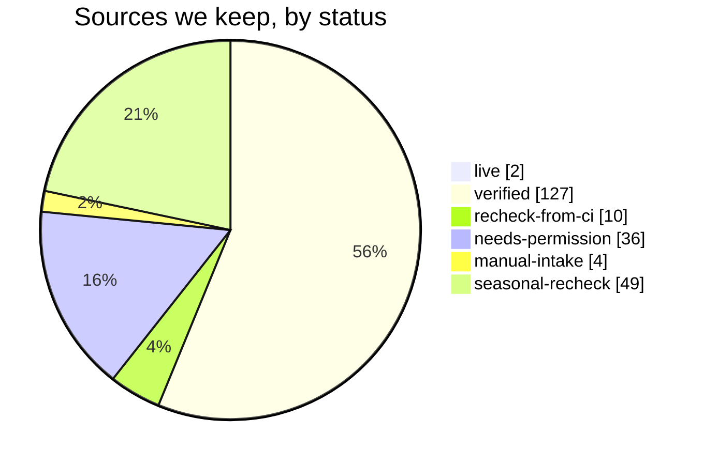

# Long Island Dance Events - source catalog

> Generated from [`catalog/sources.json`](../catalog/sources.json) by `python catalog/scripts/catalog_report.py`. Last checked on **2026-10-05**. Area: **Nassau and Suffolk counties only**. Site: https://longisland.dance

This is the list of websites that publish upcoming **dance events** and **live music** on Long Island, what each one covers, and whether we may collect it. It merges the earlier discovery pass ([`docs/source-proposals.md`](source-proposals.md), 57 sites), a first search using the Microsoft Web IQ search API, and a town-by-town search of every Long Island town, village and hamlet (October 2026). How these sources are read every week is explained in [how-weekly-updates-work.md](how-weekly-updates-work.md).

## The short version

- We looked at **642 websites**. **129 are usable now** (2 live, 127 verified), 10 need one more check from GitHub Actions, 36 need the organizer's permission, 4 can only be added by hand, 49 are seasonal, and 414 were set aside.
- Usable sources by priority: **31 High, 65 Medium, 33 Low.**
- Of the 228 sources we keep, **45 are mainly about dancing** (clubs, studios, teachers, dance calendars) and **183 are mainly about live music** (bars, venues, bands). Music sources matter because many people dance to cover bands and DJs.
- **Best new finds:** bar and beach-club calendars with event data built in (Daisy's in Miller Place, Mulcahy's in Wantagh), a country line-dance venue (89 North in Patchogue), the Mayor of Montauk and Webtunes music calendars, and dance-band gig lists (Pour Some 80s On Me, Radio Active, Decadia, Beernutz, Audawind).
- **Ask first:** LongIsland.com (events and nightlife), Triple Step Swing and others block bots. We will ask the organizers for permission or for a calendar feed. We never get around a block.
- **Town-by-town search (October 2026):** 3,038 searches across every Long Island place found 38 new usable sources (venues, bands, dance studios and local calendars); see [below](#town-by-town-search-october-2026).

## How we searched

- **85 Web IQ searches** (dance styles, line dancing, cover bands, DJs, "live music" plus 25 towns, and venue types such as breweries, VFW halls and libraries). They returned 1,700 results: **1,323 different pages on 487 websites**. Every query and its result count is in [`catalog/search-log.json`](../catalog/search-log.json).
- Web IQ cost: $12.50 per 1,000 calls at list price (checked October 3, 2026). Our 85 searches plus 14 page reads ("Browse") would cost about **$1.24**; evaluation traffic is free.
- 203 of the 487 websites made it into this catalog. The rest were ticket resellers, national directories, how-to articles, wedding-band ads or places outside Long Island.

## How we checked each source

1. A script ([`catalog/scripts/verify_sources.py`](../catalog/scripts/verify_sources.py)) read each site's **robots.txt**, then opened the page as `LongIslandDanceEventsBot/1.0` (our own name, never a browser disguise), one request at a time with a pause between requests.
2. It looked for event data built into the page, calendar feeds and dates after October 3, 2026, and counted Nassau/Suffolk town names.
3. A person (with AI help) then read each page and wrote the notes in our own words. Nothing was copied from the sites, and no private people's details were recorded.
4. Our office network blocks some bar, brewery and winery sites. For those we read Microsoft's saved copy through Web IQ Browse and marked them **recheck-from-ci**: GitHub Actions must read their robots.txt before we collect anything.

**Screenshots are not a way around a block.** A program that takes screenshots or reads text from images is still a robot, so robots.txt and the site's rules still apply. Blocked sites are asked for permission. Social-media-only and flyer-only events come in through the hand-entry (flyer upload) path described in [`docs/database-plan.md`](database-plan.md).

## Town-by-town search (October 2026)

The owner asked us to search **every Long Island town, village and hamlet** with each dance style and kind of live music. We used all 303 places in `src/data/long-island-places.json` (19 Census places and well-known hamlets were added). Tiny villages next to each other share one search (the Great Neck villages are searched as "Great Neck"), which gives **229 search places**: 134 towns with a downtown or venues got all 17 search terms, and 95 small residential places got the 8 most useful ones ([`catalog/search-places.json`](../catalog/search-places.json)).

- **Dance terms:** swing dance, lindy hop, salsa dancing, bachata, ballroom dancing, hustle dance, argentine tango, west coast swing, line dancing, country two step.
- **Music terms:** live music, cover band, rock band, DJ night, dance party, live jazz, blues music.
- **3,038 searches** such as "Commack NY line dancing", 30 results each: 91,140 results, **27,236 different pages on 4,225 websites**. Titles and links only are kept in [`catalog/search-log-towns.json`](../catalog/search-log-towns.json).
- **Web IQ calls and cost:** 3,068 successful calls in total for this search (including 30 follow-up searches), about **$38.35** at $12.50 per 1,000 calls.

Every website was sorted ([`catalog/scripts/triage_search.py`](../catalog/scripts/triage_search.py)); the likely ones were opened politely with `verify_sources.py`, and the ones with upcoming Long Island dates were read and judged one by one. Websites that were not worth a full catalog entry are listed with the reason in [`catalog/search-triage.json`](../catalog/search-triage.json), so they are not checked again.

| How each website was sorted | Websites |
| --- | ---: |
| Big platforms, ticket sellers, national directories, maps and reviews | 249 |
| Social media (hand entry only) | 2 |
| Already in this catalog or the source list | 173 |
| Results point outside Nassau and Suffolk | 236 |
| No sign of an event list | 1,358 |
| Blocks our bot (robots.txt or a bot check), no sign of a Long Island event list | 237 |
| Page did not open | 122 |
| One or two dates only (a single event page) | 226 |
| No upcoming dates on the page | 600 |
| Newest date more than a year old | 55 |
| Upcoming dates, but not on Long Island or not dance or music | 550 |
| Read and judged: now in this catalog (kept or set aside, with a reason) | 417 |

**Outcome for the 424 websites added to this catalog:** 38 kept (25 switched on now; 13 switched off until the venues they list are researched or their pages name venues clearly), 14 need permission, 3 need a check from GitHub Actions, 31 seasonal, 338 set aside (each with its reason in the tables below).

## What the status words mean

| Status | Meaning | Sources |
| --- | --- | ---: |
| **live** | Already collected by the website every week. | 2 |
| **in-progress** | Being wired into the website right now (in another work session). | 0 |
| **verified** | We opened it, it lists upcoming Long Island events, and robots.txt lets our bot read it. | 127 |
| **recheck-from-ci** | Looks good, but our office network blocks the site (bars, breweries, wineries). Check robots.txt from GitHub Actions before collecting. | 10 |
| **needs-permission** | The site blocks bots (robots.txt says no, or it answered 403/429/bot check), or its rules forbid collecting. We ask the organizer first. | 36 |
| **manual-intake** | Events are only on social media or in picture flyers. An editor or organizer adds them by hand (flyer upload). | 4 |
| **seasonal-recheck** | A real Long Island source with no upcoming dates right now (for example, summer concerts). Check again in spring. | 49 |
| **set-aside** | Not useful: outside Nassau/Suffolk, out of date, no event list, private events only, or a copy of a better source. | 414 |

## Counts

Counts below include every source we keep (everything except set-aside).

| Who publishes it | Sources |
| --- | ---: |
| Venue (bar, restaurant, hall, theater) | 83 |
| Band or DJ | 51 |
| Town, village or library | 23 |
| Event calendar that collects many events | 22 |
| Organizer or club | 19 |
| News site or newsletter | 11 |
| Lodge, church, temple or civic group | 8 |
| Dance studio | 7 |
| Teacher | 4 |

| What it covers (a source can count more than once) | Sources |
| --- | ---: |
| Live music | 162 |
| Freestyle / club dancing | 66 |
| Partner dancing | 32 |
| Line dancing | 20 |

| Best format we can read | Sources |
| --- | ---: |
| Web page list (HTML) | 123 |
| No list found | 40 |
| Calendar feed (.ics) | 21 |
| Event data built into the page (schema.org JSON-LD) | 18 |
| Calendar that only shows up in a browser (JavaScript) | 9 |
| Public Google Calendar | 6 |
| Data feed (JSON) | 4 |
| Picture flyers | 4 |
| Social media only | 2 |
| PDF | 1 |

| County | Sources |
| --- | ---: |
| Suffolk | 93 |
| Nassau + Suffolk | 54 |
| Nassau | 49 |
|  | 32 |

| Priority (usable sources only) | Sources |
| --- | ---: |
| High | 31 |
| Medium | 65 |
| Low | 33 |

## Top recommendations (High priority)

**Collected by the website:** 69 of 189 source files are switched on (46 with `htmllist`, 12 with `ical`, 9 with `jsonld`, 1 with `iraslist`, 1 with `thedancecalendar`). The rest stay off with a note saying why (permission needed, browser-only calendar, seasonal, hand entry, or not yet checked).

| Source | Status | Kind of dancing | Towns | Format | Events per month | Effort |
| --- | --- | --- | --- | --- | ---: | --- |
| [Ira's List LI live music calendar](https://www.iraslistli.com/) | live | freestyle, line | Babylon, Bellmore, Coram + | Web page list (HTML) | 100 | L |
| [The Dance Calendar - monthly Long Island dance PDF](https://www.thedancecalendar.com/find-venues-events) | live | partner, line | Carle Place, Westbury, Massapequa + | PDF | 40 | L |
| [LongIsland.com Events calendar](https://events.longisland.com/) | needs-permission | freestyle | Bay Shore, Bethpage, Deer Park + | Web page list (HTML) | 100 | M |
| [LongIsland.com Nightlife Events](https://nightlife.longisland.com/events/) | needs-permission | freestyle | Bellmore, Bohemia, Jericho + | Web page list (HTML) | 40 | M |
| [The Nutty Irishman (Farmingdale) - dance floor and country night](https://www.thenuttyirishman.com/venues) | recheck-from-ci | line, freestyle | Farmingdale | Web page list (HTML) | 12 | M |
| [Audawind - tour dates](https://audawind.com/) | verified | freestyle | Huntington Station, Southold, Cutchogue + | Web page list (HTML) | 3 | M |
| [Ballroom Legacy Dance Studio (Sea Cliff) - Wix Events](https://www.ballroomlegacy.us/) | verified | partner | Sea Cliff | Event data built into the page (schema.org JSON-LD) | 1 | S |
| [Beernutz Music - 2026 gigs](https://www.beernutzmusic.com/) | verified | freestyle | Farmingdale, Babylon, Bay Shore + | Web page list (HTML) | 3 | M |
| [BOBBIQUE (Patchogue) - live music calendar](https://www.bobbique.com/upcoming-events/) | verified | freestyle | Patchogue | Web page list (HTML) | 12 | M |
| [Club Brumidi / Constantino Brumidi Lodge, Sons of Italy (Deer Park)](https://sonsofitalyli.com/events/) | verified | partner, line, freestyle | Deer Park | Web page list (HTML) | 8 | S |
| [LITMA Contradances (on the CDSS community calendar)](https://cdss.org/organizer/long-island-traditional-music-association/) | verified | partner | Smithtown | Calendar feed (.ics) | 1 | S |
| [Coverland Band - live music calendar](https://www.coverlandband.com/) | verified | freestyle | Greenport, Copiague, East Meadow + | Web page list (HTML) | 2 | M |
| [Daisy's Nashville Lounge (Miller Place/Patchogue) - live music calendar](https://daisysli.com/calendar/) | verified | freestyle | Miller Place, Patchogue | Event data built into the page (schema.org JSON-LD) | 20 | S |
| [Dance Party Explosion - upcoming shows](https://dpe-li.com/upcoming-shows/) | verified | freestyle | Patchogue | Event data built into the page (schema.org JSON-LD) | 1 | S |
| [Dance With Me Long Island - Greenvale class schedule](https://dancewithmeusa.com/studio/long-island-dance-studio/) | verified | partner, line | Greenvale | Web page list (HTML) | 12 | M |
| [Dancing With Deanna - public line-dance events](https://www.dancingwithdeanna.com/events-1) | verified | line | Manorville, Port Jefferson, North Patchogue + | Web page list (HTML) | 8 | M |
| [Decadia - upcoming shows](https://www.decadialive.com/home) | verified | freestyle | Babylon, Smithtown, Amityville + | Web page list (HTML) | 4 | S |
| [89 North Music Venue calendar](https://89northmusic.com/calendar) | verified | line, freestyle | Patchogue | Web page list (HTML) | 15 | S |
| [Hamptons.com Events Calendar - dance calendar](https://hamptons.com/events/) | verified | freestyle | East Hampton, Southampton, Sag Harbor + | Web page list (HTML) | 30 | M |
| [Hoodoo Loungers - live music calendar](https://hoodooloungers.com/schedule) | verified | freestyle | Shelter Island, Sag Harbor, Patchogue + | Web page list (HTML) | 3 | M |
| [Mayor of Montauk Guide - live music](https://www.mayorofmontauk.com/events/live-music) | verified | freestyle | Montauk, East Hampton | Event data built into the page (schema.org JSON-LD) | 25 | M |
| [Mulcahy's (Wantagh) - concert and dance-party calendar](https://mulcahyslongisland.com/concert-events/) | verified | freestyle | Wantagh | Event data built into the page (schema.org JSON-LD) | 15 | S |
| [Plattduetsche Park Restaurant - live music calendar](https://parkrestaurant.com/events/) | verified | freestyle | Franklin Square | Event data built into the page (schema.org JSON-LD) | 10 | S |
| [Pour Some 80s On Me - show calendar](https://poursome80sonme.org/) | verified | freestyle | Miller Place, Oyster Bay, Farmingdale + | Web page list (HTML) | 4 | S |
| [Radio Active - events calendar](https://radioactiveny.com/) | verified | freestyle | Coram, Lindenhurst, Farmingdale + | Web page list (HTML) | 2 | S |
| [Salt Shack at Cedar Beach (Babylon) - beach music calendar](https://saltshackny.com/) | verified | freestyle | Babylon | Web page list (HTML) | 8 | M |
| [Swing Dance Long Island (SDLI) - Upcoming Events](http://www.sdli.org/index.php/sdli/events/) | verified | partner | Greenlawn | Web page list (HTML) | 4 | S |
| [The Second Street Band - shows](https://www.thesecondstreetband.com/event-list) | verified | freestyle | Baldwin, Bohemia, Lynbrook + | Calendar that only shows up in a browser (JavaScript) | 8 | M |
| [Stereo Garden (Patchogue) - concerts and dance parties](https://www.stereogardenli.com/stereo-garden-li-events/) | verified | partner, freestyle | Patchogue | Calendar feed (.ics) | 15 | S |
| [The Max: The Ultimate 90's Party - live music calendar](https://wearethemaxny.com/shows) | verified | freestyle | Brookhaven, Patchogue, Miller Place | Web page list (HTML) | 5 | M |
| [The Rag Times - live music calendar](https://www.theragtimes.net/events/) | verified | freestyle | Patchogue, Blue Point, Peconic + | Calendar feed (.ics) | 20 | S |
| [Touch the 80s - 2026 schedule](http://touchthe80s.com/) | verified | freestyle | Farmingdale, Franklin Square | Web page list (HTML) | 2 | M |
| [Webtunes - Long Island live music](https://webtunes.com/events/long-island) | verified | freestyle | Amityville, Bay Shore, Bellmore + | Event data built into the page (schema.org JSON-LD) | 30 | S |
| [Worst Case Scenario - upcoming shows](https://wcsrocks.com/) | verified | freestyle | Wantagh, Deer Park, Massapequa Park + | Web page list (HTML) | 2 | S |

Effort: **S** = a day or less (feed or tidy page), **M** = a few days (free text, several pages, filtering), **L** = a week or more (browser-only pages, many platforms).

Kind of dancing: **partner** (swing, ballroom, salsa, hustle, tango, two-step, contra), **line** (line dancing), **freestyle** (dancing on your own to a band or DJ), **listening** (seated concerts).

## Usable sources (live, being built, verified)

Owner decision (October 3, 2026): every source in this table and every source in the earlier proposals is accepted. "Accepted" never overrides robots.txt, site rules or bot protection.

| Priority | Source | Covers | Towns | Format | robots.txt | Per month | Check |
| --- | --- | --- | --- | --- | --- | --- | --- |
| High | [Audawind - tour dates](https://audawind.com/) | coastal country rock, country rock, Nashville, beach concerts | Huntington Station, Southold, Cutchogue + | html | allowed | 3 | twice-weekly |
| High | [Ballroom Legacy Dance Studio (Sea Cliff) - Wix Events](https://www.ballroomlegacy.us/) | Latin social, ballroom | Sea Cliff | jsonld | allowed | 1 | monthly |
| High | [Beernutz Music - 2026 gigs](https://www.beernutzmusic.com/) | rock cover band, bar band | Farmingdale, Babylon, Bay Shore + | html | allowed | 3 | twice-weekly |
| High | [BOBBIQUE (Patchogue) - live music calendar](https://www.bobbique.com/upcoming-events/) | blues, jam band, cover band, live music | Patchogue | html | unknown | 12 | monthly |
| High | [Club Brumidi / Constantino Brumidi Lodge, Sons of Italy (Deer Park)](https://sonsofitalyli.com/events/) | social dance mix (tango, West Coast Swing, hustle, ballroom/Latin), dinner dances, classes | Deer Park | html | allowed | 8 | weekly |
| High | [LITMA Contradances (on the CDSS community calendar)](https://cdss.org/organizer/long-island-traditional-music-association/) | contra dance | Smithtown | ical | allowed | 1 | weekly |
| High | [Coverland Band - live music calendar](https://www.coverlandband.com/) | cover band, disco, pop, rock | Greenport, Copiague, East Meadow + | html | allowed | 2 | monthly |
| High | [Daisy's Nashville Lounge (Miller Place/Patchogue) - live music calendar](https://daisysli.com/calendar/) | country bar dancing, rock and pop cover bands, DJ and karaoke nights | Miller Place, Patchogue | jsonld | allowed | 20 | twice-weekly |
| High | [Dance Party Explosion - upcoming shows](https://dpe-li.com/upcoming-shows/) | funk, rock, dance, Top 40 | Patchogue | jsonld | allowed | 1 | weekly |
| High | [Dance With Me Long Island - Greenvale class schedule](https://dancewithmeusa.com/studio/long-island-dance-studio/) | ballroom, Latin, bachata, salsa | Greenvale | html | allowed | 12 | weekly |
| High | [Dancing With Deanna - public line-dance events](https://www.dancingwithdeanna.com/events-1) | country line dancing, country music events | Manorville, Port Jefferson, North Patchogue + | html | allowed | 8 | weekly |
| High | [Decadia - upcoming shows](https://www.decadialive.com/home) | 80s and 90s, party band, tribute concerts, cover band | Babylon, Smithtown, Amityville + | html | allowed | 4 | twice-weekly |
| High | [89 North Music Venue calendar](https://89northmusic.com/calendar) | country line dancing, cover bands, tribute bands, live music | Patchogue | html | allowed | 15 | twice-weekly |
| High | [Hamptons.com Events Calendar - dance calendar](https://hamptons.com/events/) | ballet, tap, hip hop, lyrical dance | East Hampton, Southampton, Sag Harbor + | html | allowed | 30 | monthly |
| High | [Hoodoo Loungers - live music calendar](https://hoodooloungers.com/schedule) | roots, rock, horn band, live music | Shelter Island, Sag Harbor, Patchogue + | html | allowed | 3 | monthly |
| High | [Ira's List LI live music calendar](https://www.iraslistli.com/) | cover bands, DJs, country nights, dance parties | Babylon, Bellmore, Coram + | html | allowed | 100 | twice-weekly |
| High | [Mayor of Montauk Guide - live music](https://www.mayorofmontauk.com/events/live-music) | acoustic, rock, bar bands, nightlife | Montauk, East Hampton | jsonld | allowed | 25 | twice-weekly |
| High | [Mulcahy's (Wantagh) - concert and dance-party calendar](https://mulcahyslongisland.com/concert-events/) | hip-hop and R&B dance parties, freestyle and old-school nights, tribute and cover-band shows | Wantagh | jsonld | allowed | 15 | daily |
| High | [Plattduetsche Park Restaurant - live music calendar](https://parkrestaurant.com/events/) | German music, cover band, accordion, Oktoberfest | Franklin Square | jsonld | allowed | 10 | monthly |
| High | [Pour Some 80s On Me - show calendar](https://poursome80sonme.org/) | 80s rock, party band, cover band | Miller Place, Oyster Bay, Farmingdale + | html | allowed | 4 | twice-weekly |
| High | [Radio Active - events calendar](https://radioactiveny.com/) | rock cover band, acoustic trio, bar band | Coram, Lindenhurst, Farmingdale + | html | allowed | 2 | twice-weekly |
| High | [Salt Shack at Cedar Beach (Babylon) - beach music calendar](https://saltshackny.com/) | beach DJs, party and variety bands, seasonal live music | Babylon | html | allowed | 8 | twice-weekly |
| High | [Swing Dance Long Island (SDLI) - Upcoming Events](http://www.sdli.org/index.php/sdli/events/) | East Coast Swing, Lindy Hop, West Coast Swing, Balboa | Greenlawn | html | none | 4 | weekly |
| High | [The Second Street Band - shows](https://www.thesecondstreetband.com/event-list) | cover band, bar band, acoustic shows | Baldwin, Bohemia, Lynbrook + | js-widget | allowed | 8 | twice-weekly |
| High | [Stereo Garden (Patchogue) - concerts and dance parties](https://www.stereogardenli.com/stereo-garden-li-events/) | salsa, reggaeton, freestyle and old-school, tribute concerts | Patchogue | ical | allowed | 15 | twice-weekly |
| High | [The Max: The Ultimate 90's Party - live music calendar](https://wearethemaxny.com/shows) | 90s party band, cover band, rock, pop | Brookhaven, Patchogue, Miller Place | html | allowed | 5 | monthly |
| High | [The Rag Times - live music calendar](https://www.theragtimes.net/events/) | jam band, Grateful Dead tribute, jazz, reggae | Patchogue, Blue Point, Peconic + | ical | allowed | 20 | monthly |
| High | [The Dance Calendar - monthly Long Island dance PDF](https://www.thedancecalendar.com/find-venues-events) | ballroom, swing, tango, hustle | Carle Place, Westbury, Massapequa + | pdf | allowed | 40 | monthly |
| High | [Touch the 80s - 2026 schedule](http://touchthe80s.com/) | 80s new wave, tribute band, club dance music | Farmingdale, Franklin Square | html | none | 2 | twice-weekly |
| High | [Webtunes - Long Island live music](https://webtunes.com/events/long-island) | rock cover bands, tribute bands, freestyle concert | Amityville, Bay Shore, Bellmore + | jsonld | allowed | 30 | daily |
| High | [Worst Case Scenario - upcoming shows](https://wcsrocks.com/) | classic rock, modern rock, country, cover band | Wantagh, Deer Park, Massapequa Park + | html | allowed | 2 | twice-weekly |
| Medium | [Amici Restaurant (Mount Sinai) - live music calendar](https://amicirestaurant.org/event/) | acoustic, cover band, live music | Mount Sinai | ical | allowed | 7 | monthly |
| Medium | [Anthurium - live music calendar](https://anthurium.band/shows) | rock, cover band, live band | Lindenhurst, Deer Park, Patchogue + | html | allowed | 4 | monthly |
| Medium | [Arts in the Plaza live music calendar](https://www.artsintheplaza.com/live-music-calendar.html) | live music, DJ, dance party, plaza performances | Long Beach | html | allowed | 8 | weekly |
| Medium | [Bartini Bar & Lounge (Babylon) - event calendar](https://www.bartinibabylon.com/event-calendar) | weekend local rock bands, karaoke, open mic | Babylon | html | allowed | 10 | twice-weekly |
| Medium | [Blues Groupie live music listings](https://bluesgroupie.com/sun-tues) | blues jams, bar bands, recurring gigs | Amagansett, Amityville, Babylon + | html | allowed | 20 | twice-weekly |
| Medium | [Cedar Beach Blues Festival](https://cedarbeachbluesfestival.com/) | blues festival, waterfront blues, rock-blues bands | Port Jefferson | html | allowed | 1 | seasonal |
| Medium | [The Citi-Lites Band - upcoming shows](https://citilitesbandlongisland.com/upcoming-shows/) | rock, blues, disco, oldies | Bayport | jsonld | allowed | 1 | weekly |
| Medium | [Country Dancing with Natalie - lessons and events](https://www.countrydancingwithnatalie.com/lessons.html) | country line dancing | Port Jefferson Station, Mastic, Massapequa + | html | allowed | 10 | weekly |
| Medium | [Dance Manhattan - 'LI Recommended Swing Dances on Long Island'](http://dancemanhattan.com/calendar/event/113) | swing, Lindy Hop, blues | Farmingdale, Greenlawn, Amityville + | html | none | 6 | weekly |
| Medium | [Danny Langdon - upcoming shows](https://www.dannylangdon.com/) | classic rock, solo acoustic, cover band | Merrick, Seaford, Massapequa Park | js-widget | allowed | 2 | weekly |
| Medium | [Dan's Papers East End concerts](https://events.danspapers.com/things-to-do/east-end/concerts/) | East End concerts, wine and live music, dance category | Amagansett, Bridgehampton, Cutchogue + | html | allowed | 16 | weekly |
| Medium | [Dead Ahead Band - tour dates](https://www.deadaheadband.net/) | jam band, Grateful Dead, blues, Motown | Riverhead | html | none | 1 | weekly |
| Medium | [DiVa Ballroom / Dance with Lourdes Cruz - Long Island Google Calendar](https://divaballroomdancing.com/long-island/) | ballroom, Latin, salsa, West Coast Swing | Deer Park, Great Neck, Merrick + | google-calendar | allowed | 20 | weekly |
| Medium | [Dock Holiday - live music calendar](https://dockholiday.org/) | funk, country, pop, rock | Port Jefferson Station, Patchogue, Miller Place | html | allowed | 1 | monthly |
| Medium | [East End Jazz - live music calendar](https://www.eastendjazz.org/events) | jazz, jam session, American songbook, roots music | Southampton, Jamesport, Cutchogue | html | allowed | 2 | monthly |
| Medium | [The Band Easy Street - upcoming events](https://thebandeasystreet.com/) | dance, funk, soul, rock and roll | Babylon, Dix Hills, Jones Beach + | google-calendar | allowed | 1 | weekly |
| Medium | [Eleanor's Lounge (Bohemia) - bands, karaoke, and DJs](https://eleanorslounge.com/) | local rock cover bands, karaoke, DJs | Bohemia | html | allowed | 12 | twice-weekly |
| Medium | [Electric Dudes - Long Island music dates](https://electricdudes.com/events) | party band, rock cover band, acoustic duo | Bethpage, Farmingdale | html | allowed | 2 | weekly |
| Medium | [Enjoy Long Beach music and events](https://www.enjoylb.com/music-and-events) | DJs, bar bands, rooftop events, free concerts | Long Beach | html | allowed | 15 | weekly |
| Medium | [Enology Wine Bar & Bistro - live music calendar](https://enologywinebar.com/events/live-music/) | acoustic, singer-songwriter, live music | Saint James | html | allowed | 4 | monthly |
| Medium | [Gene Casey & the Lone Sharks (band) - show calendar](https://genecasey.com/events/) | swing / rockabilly / roots band for dancing | Amityville, Greenlawn, Bayport + | ical | allowed | 8 | twice-weekly |
| Medium | [Generation Gap - live music calendar](https://gengapmusic.com/shows) | cover band, rock | Baldwin, Freeport | html | allowed | 2 | monthly |
| Medium | [Harley's American Grille (Farmingdale/Huntington) - DJ and live music nights](https://www.harleysamericangrille.com/) | disco freestyle, DJ entertainment, restaurant live music | Farmingdale, Huntington | js-widget | allowed | 8 | weekly |
| Medium | [High Tide Band - schedule](https://hightideli.com/schedule) | party band, cover band | Bay Shore, West Islip | html | allowed | 1 | weekly |
| Medium | [HOG Farm (Brookhaven) - live music calendar](https://thehogfarm.org/events/) | open mic, farm jam, live music, Halloween | Brookhaven, Sayville | html | allowed | 3 | monthly |
| Medium | [Huntington Matters events](https://huntingtonmatters.com/events/) | line dancing, festival live music, community events | Centerport, Huntington, Huntington Station + | jsonld | allowed | 4 | weekly |
| Medium | [I Love Babylon events](https://ilovebabylon.com/events/) | drag brunch, theater, community concerts, local festivals | Amityville, Babylon, Copiague + | api-json | allowed | 20 | weekly |
| Medium | [Jericho Public Library events](https://www.jericholibrary.org/events) | Chinese dance, traditional Chinese dancercise, children music movement | Jericho | html | allowed | 4 | weekly |
| Medium | [JLR Dance Unlimited (Bay Shore) - Wix Events](https://www.jlrdanceunlimited.com/events-2) | ballroom, Latin, hustle | Bay Shore | jsonld | allowed | 2 | weekly |
| Medium | [Kitty Mulligan's Irish Pub (Bay Shore) - events](https://kittymulligans.com/bay-shore-kitty-mulligans-irish-pub-events) | classic rock cover bands, open jams, music bingo | Bay Shore | html | allowed | 8 | weekly |
| Medium | [Long Island Music and Entertainment Hall of Fame concert calendar](https://www.limusichalloffame.org/long-island-concert-calendar/) | concerts, jazz, rock, tribute shows | Huntington, Patchogue, Port Jefferson + | html | allowed | 20 | weekly |
| Medium | [Lily Flanagan's Pub (Babylon) - music calendar](https://www.lilyflanaganspub.com/musicevents) | Friday happy-hour cover bands, Saturday pub bands | Babylon | ical | allowed | 10 | twice-weekly |
| Medium | [Long Island Blues Society - live music calendar](https://www.libsny.org/) | blues, live music | Farmingdale, Mineola, Amityville | html | allowed | 1 | monthly |
| Medium | [Milagro Santana Tribute Band - live music calendar](https://www.milagrolive.com/schedule) | Santana tribute, Latin rock, classic rock | Peconic, Center Moriches, Port Jefferson | html | allowed | 3 | monthly |
| Medium | [Mixed Vibes Band - live music calendar](https://bnds.us/fm31j4) | cover band, live music, bar band | Patchogue, Baiting Hollow, Lake Ronkonkoma + | js-widget | allowed | 7 | monthly |
| Medium | [Nassau County Tourism events](https://nassaucountytourism.com/events/) | concerts, tribute shows, arts events | Bethpage, Farmingdale, Roslyn | html | allowed | 8 | weekly |
| Medium | [NOIZ Entertainment - live music calendar](https://noizentertainment.com/schedule/%f0%9f%8c%8a%e2%98%80%ef%b8%8f-sunday-funday-with-noiz-at-dockers-%e2%98%80%ef%b8%8f%f0%9f%8c%8a/) | top 40, oldies, party band, live music | Greenport, Cutchogue, East Quogue | ical | allowed | 3 | monthly |
| Medium | [North Fork Resort (Greenport) - Miss May's Friday live music](https://nfresort.com/events/) | Friday resort live music, classic rock and blues bands | Greenport | html | allowed | 4 | weekly |
| Medium | [Oakdale Brew House (Oakdale) - live music calendar](https://www.oakdalebrewhouse.com/events) | live acoustic, cover band, music bingo | Oakdale | html | allowed | 8 | monthly |
| Medium | [Oceanside Library LibCal](https://oceansidelibrary.libcal.com/calendar) | dance and movement, Zumba, music trivia, library concert | Oceanside | ical | allowed | 8 | weekly |
| Medium | [Pat Farrell Music - live music calendar](https://patfarrellmusic.com/Upcoming.htm) | Billy Joel tribute, solo piano, duo, cover band | Westbury, Manhasset, Hicksville + | html | allowed | 7 | monthly |
| Medium | [Piano Man Pat - live music calendar](https://www.pianomanpat.com/Upcoming.htm) | Billy Joel tribute, solo piano, duo, cover band | Westbury, Manhasset, Hicksville + | html | allowed | 7 | monthly |
| Medium | [Rooted North Vineyards - live music calendar](https://rootednorthvineyards.com/events/) | acoustic, singer-songwriter, live music, wine bar | Cutchogue | html | allowed | 4 | monthly |
| Medium | [Saint Demetrios Merrick Dinner Dance](https://saint-demetrios.com/dance) | Greek dinner dance, live Greek band | Merrick | html | allowed | 1 | monthly |
| Medium | [Spotlight at The Paramount (Huntington) - live music calendar](https://www.spotlightny.com/events/) | live music, DJ, bar music | Huntington | html | unknown | 7 | monthly |
| Medium | [Stage 317 (Farmingdale) - concerts and dance parties](https://www.stage317.com/upcoming-events) | DJ dance party, 80s and new-wave cover bands, dueling pianos | Farmingdale | js-widget | allowed | 4 | weekly |
| Medium | [Subculture Long Island New Wave Dance Club](https://www.alternativesounds.com/subculture.htm) | 80s new wave, industrial, synthpop, alternative dance | Wantagh, Hicksville, Island Park | html | none | 3 | weekly |
| Medium | [Temple Sinai of Roslyn - Israeli Folk Dancing](https://templesinaiweb.org/meet-us/committees/adult-education-2/israeli-folk-dancing) | Israeli folk dancing | Roslyn Heights | ical | allowed | 4 | monthly |
| Medium | [That's What She Said - performances](https://thatswhatshesaidny.com/) | women icons tribute, rock, pop cover band | Commack, Port Jefferson Station, Baldwin | html | allowed | 1 | weekly |
| Medium | [The Fabulous Acchords - appearance schedule](https://theacchords.com/) | doo-wop, oldies, sock hop, dinner dance | New Hyde Park, Levittown, Hicksville + | html | allowed | 1 | weekly |
| Medium | [The Alright Guys - shows](https://thealrightguys.com/shows/) | blues, rock, Americana | Island Park, Long Beach | html | allowed | 2 | weekly |
| Medium | [The Audrey (Oyster Bay) - live music calendar](https://theaudreyob.com/events/) | live music, acoustic duo, karaoke | Oyster Bay | jsonld | allowed | 10 | monthly |
| Medium | [The Liverpool Shuffle - live music calendar](https://www.theliverpoolshuffle.com/calendar/) | Beatles tribute, British Invasion, cover band | Glen Cove, Mattituck, Centerport + | html | allowed | 2 | monthly |
| Medium | [The Mystic Music - live music calendar](https://themysticmusic.com/calendar.html) | cover band, dance music, Neil Diamond tribute, wedding band | Bellmore, Bay Shore | html | allowed | 4 | monthly |
| Medium | [The Pridwin Hotel & Cottages - live music calendar](https://www.caperesorts.com/pridwin/events-calendar) | live music, acoustic, cover artist | Shelter Island | html | allowed | 4 | monthly |
| Medium | [The Project - live music calendar](https://www.theprojectbandny.com/events-1) | classic rock, originals, cover band | Woodmere, Long Beach, Williston Park + | html | allowed | 3 | monthly |
| Medium | [The Realm Band - live music calendar](http://www.therealmband.com/tour-1/) | rock, cover band, live music | Greenport, Peconic, Montauk | html | allowed | 4 | monthly |
| Medium | [The Saint (Farmingdale) - resident DJ lounge](https://thesaintny.com/) | resident DJ lounge, Friday and Saturday nightlife | Farmingdale | html | allowed | 8 | weekly |
| Medium | [The Time Travelers - live music calendar](https://www.timetravelersli.com/upcoming-shows) | cover band, rock, pop | Massapequa, Lindenhurst, Greenlawn | html | allowed | 1 | monthly |
| Medium | [Tribe Band NY - live music calendar](https://www.tribebandny.com/) | cover band, live band, rock | Baldwin, Bay Shore, Captree + | html | allowed | 1 | monthly |
| Medium | [Uncle Frank's Pizza and Cocktails (Wantagh) - live music calendar](https://www.unclefranksli.com/music-and-events/) | live band, acoustic, singer | Wantagh | html | allowed | 9 | monthly |
| Medium | [The Villager Farmingdale - live music calendar](https://www.thevillagerfarmingdale.com/livemusic) | local cover bands, pub live music | Farmingdale | ical | allowed | 12 | twice-weekly |
| Medium | [West Islip Public Library events](https://westisliplibrary.libnet.info/events?r=thismonth) | Zumba, kids movement, library concert, Toddlers Tango | West Islip | api-json | allowed | 6 | weekly |
| Medium | [White Room Band - events](https://whiteroomband.com/events) | live music, cover band, brewery and pub gigs | Calverton, Patchogue, Riverhead | html | allowed | 3 | weekly |
| Medium | [Who Are Those Guys - live music calendar](https://whoarethoseguys.com/calendar) | rock, blues, folk, country | Calverton, Mattituck, Riverhead + | html | allowed | 6 | monthly |
| Low | [All Revved Up NY - Meat Loaf tribute shows](https://allrevvedupnyband.com/shows-meat-loaf-tribute) | Meat Loaf tribute, classic rock tribute | Oakdale, Port Jefferson Station | html | allowed | 2 | weekly |
| Low | [Amityville Music Hall - show list](https://amh.live/) | rock concerts, metal and indie shows | Amityville | html | allowed | 12 | weekly |
| Low | [Bayway Arts Center (East Islip) - upcoming shows](https://www.baywayartscenter.com/) | theatre shows, tribute concerts, dance performances | East Islip | js-widget | allowed | 3 | monthly |
| Low | [Canoe Place Inn & Cottages - live music calendar](https://canoeplace.com/event/) | live jazz, acoustic, blues | Hampton Bays | ical | allowed | 3 | monthly |
| Low | [Casa Stellina (Oyster Bay) - Sinatra night](https://casastellinany.com/whats-on/) | Sinatra night, restaurant vocalist | Oyster Bay | html | allowed | 4 | monthly |
| Low | [The Haymakers (band) - shows](https://www.haymakersmusic.com/shows) | rock & roll / swing-friendly band night | Farmingdale, Lindenhurst | html | allowed | 1 | monthly |
| Low | [Hotel Moraine (Greenport) - events](https://www.hotelmoraine.com/events) | happy-hour acoustic music, hotel events | Greenport | ical | allowed | 3 | weekly |
| Low | [Huntington Arts Council - events calendar, Dance category](https://www.huntingtonarts.org/events/category/dance/) | swing (SDLI), dance performances | Greenlawn, Roslyn Harbor | ical | allowed | 3 | weekly |
| Low | [Jazz at the Barn (Huntington) - upcoming shows](https://jazzatthebarn.com/) | jazz listening shows, small ensemble concerts | Huntington | html | allowed | 3 | monthly |
| Low | [Jim's Roots & Blues jams calendar](https://jimsrootsandblues.com/calendar/jams/) | old-time jam, bluegrass jam, traditional music session | Riverhead | google-calendar | allowed | 2 | monthly |
| Low | [Long Island public library calendars (e.g., Amityville, Hicksville)](https://www.amityvillepubliclibrary.org/event/intermediate-line-dancing-person-vfw-hall-10186) | line dancing, ballroom | Amityville, Hicksville | jsonld | allowed | 6 | monthly |
| Low | [Long Island Country Music Association (LICMA)](https://licma.org/) | country, line dancing | Deer Park | html | allowed | 1 | monthly |
| Low | [Live On The Porch (Smithtown) - show calendar](https://liveontheporch.com/events/) | tribute concerts, classic rock shows, country-rock shows | Smithtown | jsonld | allowed | 6 | weekly |
| Low | [Mezza Luna (Hauppauge) - events](https://www.mezzalunafinedining.com/events) | restaurant live music, solo and small-group acts | Hauppauge | ical | allowed | 4 | weekly |
| Low | [My Father's Place (Roslyn) - supper club events](https://www.mfpproductions.com/blank-2) | supper club concerts, tribute bands, jazz and roots shows | Roslyn | js-widget | allowed | 12 | weekly |
| Low | [One More Once Jazz Ensemble - event calendar](https://onemoreoncejazz.com/events) | big band jazz, jazz concert, library concert | Plainview, Sayville, Bohemia | html | allowed | 2 | weekly |
| Low | [Out on the Town - Long Island event calendar](https://outonthetownli.com/) | country nights, Latin nights, bar dance parties | Farmingdale, Patchogue, Rockville Centre + | ical | allowed | 8 | twice-weekly |
| Low | [Patchogue Theatre - events](https://www.patchoguetheatre.org/events/) | theatre concerts, tribute acts, comedy and stage shows | Patchogue | html | allowed | 10 | weekly |
| Low | [Polish American Cultural Association (Port Washington) - upcoming events](https://portwashingtonpolishclub.com/upcoming-events) | country night, dinner dances | Port Washington | html | allowed | 2 | monthly |
| Low | [RS Beanery (Merrick) - events](https://rsbeanerymerrick.com/events) | coffeehouse live music, small bands | Merrick | ical | allowed | 3 | weekly |
| Low | [sabaki.dance (Latin dance aggregator) - city pages](https://sabaki.dance/events/Sea-Cliff) | salsa, bachata, kizomba | Sea Cliff, Levittown | jsonld | allowed | 2 | weekly |
| Low | [Salsa Sensation Latin Dance Studio (Levittown) - class schedule](https://www.salsasensation.com/schedule) | salsa, bachata | Levittown | html | allowed | 20 | monthly |
| Low | [Sharp Violet - live music calendar](https://sharpviolet.com/) | punk rock, riot grrrl | Bay Shore, Lindenhurst | html | allowed | 2 | monthly |
| Low | [SouthBound](https://southbound.li/) |  |  | google-calendar | allowed | 0 | monthly |
| Low | [Steve Mitchell as Elvis - upcoming performances](https://stevemitchellaselvis.com/shows.php) | Elvis tribute, restaurant shows, concerts | Copiague | html | none | 1 | weekly |
| Low | [Sympatico Jazz - live music calendar](https://sympaticojazz.com/) | jazz, soul, bossa nova, classic pop | Cold Spring Harbor, Glen Cove, North Bellmore + | html | allowed | 1 | monthly |
| Low | [10 Cent Redemption - show schedule](https://10centredemption.com/) | rock, blues, metal, cover band | Huntington | html | allowed | 1 | weekly |
| Low | [The Dedications - 2026 concert events](https://thededications.org/) | doo-wop, 50s and 60s rock and roll, oldies | Northport | html | allowed | 1 | weekly |
| Low | [The Space at Westbury - upcoming concerts](https://www.thespaceatwestbury.com/upcoming-concerts) | concert hall shows, tribute concerts, pop and rock events | Westbury | js-widget | allowed | 4 | weekly |
| Low | [Town of Hempstead adult classes (Line Dancing, Ballroom, Salsa & Latin)](https://hempsteadny.gov/297/Line-Dancing) | line dancing, ballroom, salsa/Latin | Hicksville | html | allowed | 4 | monthly |
| Low | [Village of Bayville Community Center concerts - live music calendar](https://bayvilleny.gov/events) | jazz, acoustic, live band | Bayville | ical | allowed | 3 | monthly |
| Low | [Vinyl Cut - upcoming schedule](https://www.vinylcutny.com/) | 60s and 70s cover band, oldies | Malverne | html | none | 1 | weekly |
| Low | [The Waterfalls (Lake Ronkonkoma) - community event calendar](https://waterfallsapartments.com/event-calendar/) | ballroom | Lake Ronkonkoma | html | allowed | 2 | monthly |

## Recheck from GitHub Actions

Our office network blocks these sites, so robots.txt could not be read from here. The page content was confirmed from Microsoft's saved copy.

| Priority | Source | Covers | Towns | Format | robots.txt | Per month | Check | Why |
| --- | --- | --- | --- | --- | --- | --- | --- | --- |
| High | [The Nutty Irishman (Farmingdale) - dance floor and country night](https://www.thenuttyirishman.com/venues) | 90s and 2000s cover bands, DJ dance floor, country night | Farmingdale | html | unverified | 12 | weekly | Keep and recheck from CI. It is one of the strongest dance-floor sources, but office networking blocked direct verification. |
| Medium | [7 in Heaven Singles Events - dance parties](https://7inheaven.com/events) | singles dinner dance, country western dance lesson | Huntington, Bethpage, Farmingdale + | html | unverified | 2 | weekly | Use recheck-from-ci because the dance-party events were only confirmed through Web IQ, not direct office access. |
| Medium | [Twisted Cow Distillery - Barrelhouse Boogie Lindy Hop night](https://twistedcowdistillery.net/Events?Page=1) | Lindy Hop (lesson + DJ social) | East Northport | html | unverified | 1 | monthly | Recheck from CI. The office network blocks the site, but Web IQ shows a future Barrelhouse Boogie swing night. |
| Low | [Blue Point Brewing - events](https://bluepointbrewing.com/) |  | Patchogue | html | unknown | 0 | monthly | Our office network could not open the site; check it from GitHub Actions. |
| Low | [Dance Fever Inc - calendar](https://dancefeverinc.com/) |  |  | html | unknown | 0 | monthly | Our office network could not open the site; check it from GitHub Actions. |
| Low | [Duckwalk Vineyards - events](https://duckwalk.com/events/) | winery live music, acoustic and small-band sets | Southold, Water Mill | html | unverified | 8 | weekly | Recheck from CI. It is a real Long Island winery music source, but the office network blocked direct verification. |
| Low | [Flounder Brewing Co. - music and events](https://www.flounderbrewing.com/music-and-events) | brewery acoustic music, old-time jam, small bands | Riverhead | html | unverified | 12 | weekly | Keep only as a low-priority listening source. It has many events, but they read like brewery listening nights. |
| Low | [Greenport Harbor Brewing Company - upcoming events](https://greenportharborbrewing.com/upcoming-events) | brewery live music, acoustic and cover acts | Greenport | html | unverified | 12 | weekly | Keep as a low-priority live-music source and recheck from CI. It is more listening/social brewery music than dance. |
| Low | [Jason's Vineyard (Jamesport) - live music schedule](https://www.jasonsvineyard.com/events) | winery live music, afternoon bands | Jamesport | html | unverified | 8 | weekly | Recheck from CI. It has a long dated music schedule, but it is more winery listening than dancing. |
| Low | [Moriches Field Brewing - events](https://morichesfieldbrewing.com/) |  | Center Moriches | html | unknown | 0 | monthly | Our office network could not open the site; check it from GitHub Actions. |

## Needs permission

We will not collect these until the organizer says yes or shares a calendar feed (see the permission flow in the database plan).

| Priority | Source | What blocks us | Rules / notes | What to ask for |
| --- | --- | --- | --- | --- |
| High | [LongIsland.com Events calendar](https://events.longisland.com/) | robots parsed as unknown; main page returned 200 | Terms forbid robots, spiders, automated devices, retrieval, and indexing. | an .ics feed or written OK to read the events page weekly |
| High | [LongIsland.com Nightlife Events](https://nightlife.longisland.com/events/) | robots parsed as unknown; main page returned 200 | Terms forbid robots, spiders, automated devices, retrieval, and indexing. | an .ics feed or written OK to read the events page weekly |
| Medium | [BaseLocal - live music in Islip](https://baselocal.com/ny/islip/events/live-music/) | allowed | Terms forbid scraping, crawling, or automated access without written consent. | an .ics feed or written OK to read the events page weekly |
| Medium | [DayShift Long Island daytime dance party](https://www.locomotivelive.com/dayshift/long-island) | unverified (403) | none found | an .ics feed or written OK to read the events page weekly |
| Medium | [The East End Beacon - events calendar](https://www.eastendbeacon.com/event/) | the site answered our bot with 403 or a bot check | none found | an .ics feed or written OK to read the events page weekly |
| Medium | [East End Getaway - events](https://eastendgetaway.com/calendar/) | the site answered our bot with 403 or a bot check | none found | an .ics feed or written OK to read the events page weekly |
| Medium | [Village of Floral Park - summer concerts](https://floralparkny.gov/events/) | the site answered our bot with 403 or a bot check | none found | an .ics feed or written OK to read the events page weekly |
| Medium | [Islip Arts Council](https://isliparts.org/) | robots and page returned 406/unknown | Terms not checked because page returned 406 | an .ics feed or written OK to read the events page weekly |
| Medium | [Long Island Arts Council at Freeport](https://www.liacf.org/) | robots check returned 429/unknown | Terms not checked because site returned 429 | an .ics feed or written OK to read the events page weekly |
| Medium | [City of Long Beach concerts](https://www.longbeachny.gov/concerts) | disallowed by robots.txt | Terms not checked because robots disallow fetching | an .ics feed or written OK to read the events page weekly |
| Medium | [MTS Productions - Club 112 parties (Central Islip)](https://mtsproductions.com/event/) | the site answered our bot with 403 or a bot check | none found | an .ics feed or written OK to read the events page weekly |
| Medium | [Patchogue Live Local - community events](https://www.patchoguelivelocal.com/events/) | robots.txt does not let our bot read it | none found | an .ics feed or written OK to read the events page weekly |
| Medium | [Popei's Clam Bar (Coram) - live music and DJ nights](https://www.popeisclambaronline.com/events/) | the site answered our bot with 403 or a bot check | none found | an .ics feed or written OK to read the events page weekly |
| Medium | [Press 195 (Rockville Centre) - events](https://press195.com/events/) | the site answered our bot with 403 or a bot check | none found | an .ics feed or written OK to read the events page weekly |
| Medium | [Societelle - Boots & Beats line dancing at 89 North](https://www.societelle.com/event-details/boots-beats-a-night-of-line-dancing) | unverified (429) | none found | an .ics feed or written OK to read the events page weekly |
| Medium | [Station Yards (Ronkonkoma) - country nights and events](https://stationyardsli.com/events/) | blocks our bot | none found | an .ics feed or written OK to read the events page weekly |
| Medium | [The NY Dancers Studio - events](https://www.thenydancersstudio.com/) | the site answered our bot with 429 or a bot check | none found | an .ics feed or written OK to read the events page weekly |
| Medium | [Three Village Local - community events](https://www.threevillagelocal.com/events/) | robots.txt does not let our bot read it | none found | an .ics feed or written OK to read the events page weekly |
| Medium | [Triple Step Swing (Long Island Lindy Hop) - calendar](https://triplestepswing.com/calendar) | site page has no robots.txt, but eventscalendar.co widget host disallows bots | none found | an .ics feed or written OK to read the events page weekly |
| Medium | [Visit Montauk (Montauk Chamber) - events](https://visitmontauk.org/events/) | the site answered our bot with 403 or a bot check | none found | an .ics feed or written OK to read the events page weekly |
| Medium | [Village of Williston Park - gazebo concerts](https://www.willistonparkny.gov/home/events/) | the site answered our bot with 403 or a bot check | none found | an .ics feed or written OK to read the events page weekly |
| Low | [Ballroom Factory Dance Studio (Patchogue) - group classes](https://ballroomfactory.com/group-classes-workshop/) | allowed, but page returned HTTP 403 bot challenge | none found | an .ics feed or written OK to read the events page weekly |
| Low | [Barefoot Adventures - Friends Waterfront line dancing](https://www.barefootadventures.org/event-details/line-dancing-every-thursday-friends-waterfront-bar-grill-2026-09-17-19-00) | allowed | none found | an .ics feed or written OK to read the events page weekly |
| Low | [Bistro 72 (Riverhead) - live entertainment](https://bistro-72.com/live-entertainment/) | unverified (site returned 403) | none found | an .ics feed or written OK to read the events page weekly |
| Low | [Dance With Us Long Island courses](https://dancewithus.net/courses/) | unverified (403) | none found | an .ics feed or written OK to read the events page weekly |
| Low | [dancecalendar.info - Long Island area](https://www.dancecalendar.info/event.aspx?idarea=49) | disallowed for our bot | none found | an .ics feed or written OK to read the events page weekly |
| Low | [Eventbrite event pages](https://www.eventbrite.com/d/ny--central-islip/salsa/) | allowed, but sampled URL returned HTTP 405 | Eventbrite terms prohibit web scraping; use the official API or organizer permission. | an .ics feed or written OK to read the events page weekly |
| Low | [The Garden City Hotel - special events](https://gardencityhotel.com/) | see reason | none found | an .ics feed or written OK to read the events page weekly |
| Low | [Hotel Indigo East End (Riverhead) - weekly live music page](https://indigoeastend.com/weekly-live-music-on-long-islands-east-end/) | unverified (site returned 403) | none found | an .ics feed or written OK to read the events page weekly |
| Low | [Meetup groups (Triple Step Swing; Long Island Swing Syndicate)](https://www.meetup.com/triplestepswing-longisland/) | allowed | Meetup terms forbid scraping or harvesting without permission. | an .ics feed or written OK to read the events page weekly |
| Low | [Nassau Reads upcoming events](https://nassaureads.com/upcomingevents/) | robots and page returned 403/unknown | Terms not checked because page returned 403 | an .ics feed or written OK to read the events page weekly |
| Low | [Patch town calendars (e.g., Israeli Dancing, Plainview)](https://patch.com/new-york/plainview/calendar/event/20260908/5d3cfa39-097a-4ec8-ac79-1b74ffbbc7ee/israeli-dancing) | allowed | Patch terms forbid spiders, robots, scraping, and data mining for cataloging content. | an .ics feed or written OK to read the events page weekly |
| Low | [Peconic Landing - dance calendar](https://peconiclanding.org/events/) | robots.txt does not allow our bot to read the event feed | none found | an .ics feed or written OK to read the events page weekly |
| Low | [Huntington Summer Arts Festival; Islip Arts Council](https://www.huntingtonsummerartsfestival.com/) | allowed, but page returned HTTP 429 to our bot | none found | an .ics feed or written OK to read the events page weekly |
| Low | [Temple Israel Long Beach - Step Into Israeli Dance](https://www.tilb.org/event/step-into-israeli-dance-2/) | unverified (403) | none found | an .ics feed or written OK to read the events page weekly |
| Low | [The Paramount (Huntington) - show calendar](https://www.paramountny.com/show-calendar) | allowed robots.txt; page returned 429 | none found | an .ics feed or written OK to read the events page weekly |

## Add by hand (manual intake)

Events exist but only as social posts or picture flyers.

| Source | Why |
| --- | --- |
| [Arthur Murray Syosset calendar images](https://arthurmurraysyosset.com/dance-lessons-long-island) | Use manual intake if wanted because the calendar is an image, not readable event text or a feed. |
| [DancXchange / Donna DeSimone](https://donnadesimone.us/) | Manual intake. The source has real events, but updates are bulletin/flyer/social style rather than a clean feed. |
| [Good Times Magazine music calendar](https://goodtimesmag.com/music-calendar) | Use by hand only; the event rows are not machine-readable in the cached page. |
| [The Burrows swing/blues nights (The Great Hall, Huntington)](http://dancemanhattan.com/calendar/event/113) | Manual intake. The primary source is social-only, so use manual review unless a better organizer feed appears. |

## Seasonal: check again in spring

| Priority | Source | Towns | Note |
| --- | --- | --- | --- |
| Medium | [Claudio's (Greenport) - nightlife and live music](https://claudios.com/) | Greenport | The page describes seasonal nightlife but does not show current future dates. |
| Medium | [Glen Cove Downtown Sounds](https://glencovedowntown.org/downtown-sounds/) | Glen Cove | 2026 Downtown Sounds schedule was Fridays in July/August; no future dates remain. |
| Medium | [Greenport Dances in the Park](https://greenportvillage.com/event/dances-in-the-park/) | Greenport | 2026 series ran July through August with Battle of the Bands on Labor Day; no future dates after Oct. 3. |
| Medium | [I Love Port Jeff events](https://www.iloveportjeff.com/events) | Port Jefferson | General events run through Dec 6, but live-music items found were summer/past. |
| Low | [Beach Bar Hamptons](https://www.beachbarhamptons.com/events-calendar/dj-fresh) | Hampton Bays | Hampton Bays DJ/nightlife venue is a real summer party series, but the visible calendar ended in September and says summer 2027. |
| Low | [The Boat Yard (Massapequa/Tobay Beach) - seasonal events calendar](https://theboatyardny.com/events/) | Massapequa, Tobay Beach | Only an Oct 3 car show remains; the summer music calendar appears closed. |
| Low | [Boys of Fire Island](https://www.boysoffireisland.com/dance-festival-history) | Fire Island Pines, Cherry Grove, Fire Island | Fire Island dance and party calendar appears seasonal, with visible dates in July rather than current fall listings. |
| Low | [The Buoy Bar (Point Lookout) - seasonal live music](https://www.buoybarli.com/buoy_bar_events.html) | Point Lookout | The opened page shows September 2026 events and no future dated music after Oct 3. |
| Low | [Celebrate St. James Summer Concert Series](https://www.celebratestjames.org/summer-concert-series.html) |  | Celebrate St. James summer concert series is relevant but currently between seasons. |
| Low | [City of Glen Cove](https://glencoveny.gov/events) |  | City pages describe Glen Cove summer concert and festival series, but no upcoming fall dance or live-music dates appear. |
| Low | [Great Neck Parks Summer Concert Series](https://www.gnparksny.gov/Calendar.aspx?EID=26469&month=8&year=2026&day=27&calType=0) |  | Great Neck parks summer concert series is real but ended in August with no current dates. |
| Low | [Village of Greenport calendar](https://villageofgreenport.gov/calendar/) | Greenport | Calendar filters visible, but no upcoming concert dates found. |
| Low | [Half Hollow Hills Community Library](https://www.hhhlibrary.org/event/) |  | Half Hollow Hills summer courtyard concert series has only past summer dates in the packet. |
| Low | [Hampton House Events](https://www.hamptonhouseevents.com/event-details/twilight-dance-party-at-common-ground-east-1) |  | Southampton Twilight/Rewind dance parties appear to be a summer series with no current upcoming dates in the packet. |
| Low | [Town of Hempstead events](https://townofhempsteadevents.com/) | Hempstead, Point Lookout | Upcoming Oct 9 and Oct 25 items are fall/car events; music categories are seasonal. |
| Low | [Incorporated Village of Cedarhurst](https://www.cedarhurst.gov/event/) |  | Village calendar shows a Cedarhurst summer concert series, but no upcoming dance or live-music listings after the season. |
| Low | [Town of Islip calendar](http://www.islipny.gov/community-and-services/town-calendar) | Islip, Bay Shore, Sayville | October calendar visible; relevant summer/music dates not found. |
| Low | [John Philip Sousa Memorial Bandshell](https://www.sousamemorialbandshell.org/concert-schedules/) | Port Washington | Port Washington's bandshell is a real Friday summer concert series, but the 2026 season has ended and no current fall/winter concerts are listed. |
| Low | [Lake Ronkonkoma Civic Organization](https://www.lakeronkonkomacivicorg.com/upcoming-events/) | Lake Ronkonkoma | Lake Ronkonkoma Civic has real summer concerts at Raynor County Park, but they are past and no current music events are listed. |
| Low | [Long Beach Beach Concert Series](https://www.lbcleanup.com/long-beach-concert-schedule.html) |  | Long Beach beach concert schedule is a real summer series, but there are no current fall/winter dates. |
| Low | [Long Island Maritime Museum](https://www.limaritime.org/swingtime-big-band-2026.html) | West Sayville | Museum has local summer music pages such as Swingtime Big Band, but the packet shows no current dated listings. |
| Low | [Lynbrook Chamber Cruise Nights](https://lynbrookchamberofcommerceny.growthzoneapp.com/events/) |  | Lynbrook summer cruise nights with live music ran July to August and have no upcoming dates now. |
| Low | [Lynbrook USA Cruise Nights](https://members.lynbrookusa.com/events/) |  | Duplicate Lynbrook summer cruise-night series ran July to August and has no upcoming dates now. |
| Low | [Maliblue (Lido Beach) - summer live entertainment](https://maliblueny.com/) | Lido Beach | The page says the season closed Sep 14, 2026. |
| Low | [Village of Mineola calendar](https://www.mineola-ny.gov/calendar.aspx?view=list&CID=28) | Mineola | October 2026 calendar shell visible, but no future concert rows found. |
| Low | [Northwell Health at Jones Beach Theater](https://www.northwellatjonesbeachtheater.com/shows) | Wantagh | Official Jones Beach Theater page is a real summer concert venue, but the packet shows only two future concerts plus a season-ticket waitlist. |
| Low | [Ocean Beach Community Fund](https://oceanbeachcommunityfund.org/sponsored-through-your-contributions/2026/6/27/free-outdoor-dock-concert) | Ocean Beach, Fire Island | Ocean Beach Community Fund has a seasonal Fire Island summer calendar, but no current fall music listings are visible. |
| Low | [Peconic River Herb Farm](https://peconicriverherbfarm.com/eventlistings) |  | Peconic farm music listings are summer or older dates, with no current upcoming music in the packet. |
| Low | [Port Jefferson Summer Concert Series](https://www.portjeffny.gov/475/PJVV---Issue-11---Spring-2026---Story-6-) |  | Official Port Jefferson summer concert series is real and local, but the 2026 July-August dates are over. |
| Low | [Port Washington Public Library](https://pwpl.org/pwpl-summer-concert-series-2026/) |  | Port Washington library summer concert series is a real local music series, but its 2026 dates are over. |
| Low | [Quogue Association](https://www.quogueassociation.org/event-details/village-beach-party-3) |  | Quogue association beach party and green concert are summer events with no current dates. |
| Low | [Sag Harbor Community Band](https://www.sagharborband.org/events/) |  | Sag Harbor community band has a real summer concert series, but it has ended and only one holiday concert remains. |
| Low | [Saylor Beach House - live entertainment](https://saylorbeachhouse.com/live-events) | Saint James | The 2026 summer lineup shown ended in September. |
| Low | [Town of Smithtown 2026 concerts](https://www.smithtownny.gov/668/2026-CONCERTS) | Smithtown | 2026 concert schedule was June-August and has ended. |
| Low | [Smithtown Recreation concerts](https://www.smithtownrec.com/concerts) | Smithtown | Smithtown has a real summer concert series at Hoyt Farm, but the packet shows no current fall or winter dance-friendly events; recheck before summer 2027. |
| Low | [Souled Out - dates page](https://www.booksouledout.com/dates.html) | Babylon, Mattituck, Patchogue | 2026 public LI season ended 2026-09-18; 0 future LI public gigs remain. |
| Low | [South Shore Digest / Alive by the Bay](https://weekend.southshoredigest.com/alive-by-the-bay/) | Bay Shore | Alive by the Bay summer music guide is useful locally, but the visible 2026 dates are past. |
| Low | [Southold Historical Museum - Line Dancing in the Barn](https://www.southoldhistorical.org/event-details/line-dancing-in-the-barn-3) | Southold | Line Dancing in the Barn was July 31, 2026; museum text says special events continue year-round. |
| Low | [The Clubhouse Hamptons - live music calendar](https://clubhousehamptons.com/events/) | East Hampton | Upcoming dates through 2026-10-18. |
| Low | [The Common Ground (Sayville) - community concert calendar](https://thecommonground.com/calendar-of-events) | Sayville | Summer 2026 concert dates ended before Oct 3; later page items are mostly non-music civic events. |
| Low | [The Hamptons](https://thehamptons.com/calendar/index.html) |  | Hamptons social calendar has summer live music and dance-party listings, but the visible 2026 list is seasonal and now past. |
| Low | [The Wharf Oakdale](https://www.thewharfoakdale.com/livemusic/) |  | Waterfront live-music schedule is a real summer series but the visible 2026 dates ended in September. |
| Low | [Town of Babylon summer concerts](https://www.townofbabylonny.gov/calendar.aspx?EID=3019) | Copiague, Babylon | Town of Babylon has a real Tanner Park summer concert series, but the visible concert listings are past and the current calendar is civic meetings. |
| Low | [Town of North Hempstead Parks & Recreation](https://northhempsteadny.gov/departments/parks_recreation/events.php?direct=true) | Port Washington, New Hyde Park, Manhasset | Official town summer concert series is real and local, but the packet shows the August 2026 schedule after it ended. |
| Low | [Tradewinds - events calendar](https://tradewindstheband.com/events-1) | Bay Shore, Kismet, Ocean Beach | Summer 2026 public LI schedule ended 2026-09-07; 0 future LI public gigs remain. |
| Low | [12X Live - 2026 shows](https://www.12xlive.com/) | Farmingdale, Brookhaven, Jamesport | 2026 public LI schedule ended 2026-09-06; 0 future LI public gigs remain; outside entries included NYC, CT, and NJ. |
| Low | [Vinyl Productions / Vinyl Revival](https://www.vinylproductions.com/vinyl-revival) | Cedarhurst, Lindenhurst, Long Beach | Long Island dance-party band page has many summer dates, but they are past relative to October 2026. |
| Low | [Waterfront at The Pines](https://pinesfi.com/event/) | Fire Island Pines | Fire Island Pines venue has a DJ-party calendar, but it currently reports no upcoming events after summer. |
| Low | [West Islip Symphony Orchestra](http://www.westislipsymphony.org/calendar/) |  | Symphony page is a summer concert series with August dates and no current fall listings. |

## Set aside

Looked at and not kept. The reason is in our own words.

| Source | Reason |
| --- | --- |
| [102.3 WBAB](https://www.wbab.com/events/) | Radio events page is a broad promotional/news list, mostly not dance or live-music listings. |
| [106.1 BLI](https://www.wbli.com/events/) | Radio events page is a broad promotional/news list, not a focused dance or live-music calendar. |
| [2155 Ballroom & Events - West Coast Swing calendar](https://2155dance.com/calendar/) | Set aside because the venue is in Texas, outside Nassau and Suffolk counties. |
| [375 Dance Studio (Carle Place) - Social Dance](https://375dancestudio.com/social-dance/) | Set aside as stale. Recheck only if the studio starts posting current social dates. |
| [4 Ways From Sunday Band](https://www.4waysfromsunday.com/upcoming-shows/a-tribute-to-top-40-radio-4) | Band page shows a postponed 2025 performance, not a current gig list. |
| [7Dias7Noches](https://7dias7noches.net/event/) | The packet says there are no upcoming events and the visible nightlife listings are past and out of Nassau/Suffolk. |
| [A Lifetime of Dance](https://www.alifetimeofdance.com/wp-content/uploads/2026/08/September-2026-Welcome-Letter.pdf) | Adult tap-dance class site shows a timetable and welcome letter, not several current dated events. |
| [Absolute Entertainment](https://www.absolutedjs.com/team-detail/-nicky-g-dj-strive) | DJ company profile and wedding-service pages do not list a public upcoming event calendar. |
| [Adelphi University Ballroom and Social Dancing - dance calendar](https://www.adelphi.edu/ce-course/workshop/ballroom-dancing/) | A university continuing-education course that needs registration, not open dances or drop-in classes. |
| [After Hours Live Music & Entertainment](https://afterhoursent.com/dj_showcase_performances.php) | Bridal-show DJ demos are vendor showcases, not public dance or live-music events for the calendar. |
| [Argentine Tango Lovers of Long Island - ATL Calendar](https://www.argentinetangolovers.com/atl-calendar) | Set aside as duplicate and fragile. Use The Dance Calendar or organizer permission rather than the signed widget. |
| [Arlo Kitchen & Bar (Northport)](https://www.arlokitchenandbar.com/happenings/) | Restaurant page mentions Thursday live music but does not show several upcoming dated music listings. |
| [Art & Architecture Quarterly East End](https://aaqeastend.com/bulletins/performances/sylvester-manor-creekside-concert-w-the-james-hunter-six-430-to-730-pm-august-8th/) | Arts publication homepage is a media/newsletter article list rather than a current music calendar. |
| [Artists in Partnership](https://www.aip4arts.org/event-details-registration/lbpl-celebration-of-jazz-and-blues) | Arts group pages show past September blues/jazz events, not a current multi-event list. |
| [Average Socialite](https://www.averagesocialite.com/hamptons-events/2026/6/29/callen-lordes-hamptons-tea-dance-hamptons) | Packet is a single Hamptons tea dance article on a broad social-events site, not a Long Island event list. |
| [Babylon United Methodist Church](https://babylonumc.org/events/) | Church packet has a past line-dance fundraiser and one current non-music event only. |
| [Backstage Studio of Dance](https://www.backstagestudioofdance.com/adultclasses) | Studio page is a class schedule and seasonal program information, not dated event listings. |
| [Bailar (getbailar.com)](https://getbailar.com/events/socials-at-lorenz-dance-studio-nassau-floral-park-ny-2026-10-02-2) | Set aside. The only useful-looking item is the out-of-area Lorenz listing. |
| [Ballroom Avenue LLC](https://www.ballroomavenue.com/upcoming-events) | Set aside as out of area. It is an Ohio source. |
| [Ballroom Boutique Dance Company](https://ballroomboutique.net/) | Set aside because the page is a studio marketing page without upcoming public events. |
| [Ballroom Dream Dance Studio](https://ballroomdreamusa.com/calendar/socials/) | Set aside as out of area. It is a New Jersey source. |
| [The Ballroom of Huntington](https://ballroomofhuntington.co/) | Set aside because it is a studio lead page without a public dated schedule. |
| [Bay Street Theater](https://www.baystreet.org/performance/any-way-you-want-it/) | Sag Harbor venue is current, but the packet shows only two upcoming live-music listings among theater, comedy and film events. |
| [Bayport-Blue Point Heritage Association](https://bayportbluepointheritage.org/concert-in-the-park/) | Heritage association page is a single concert news post, not a current multi-event music calendar. |
| [Bayport-Blue Point Library](https://bayportbluepointlibrary.libnet.info/event/) | Library packet shows one past historical dance talk and opening hours, not a current 3+ dance/music calendar. |
| [Beginnings Restaurant (Atlantic Beach) - live music calendar](http://www.beginningsrestaurant.com/upcoming-events/) | Mostly themed dinners, crafts and children's character events; live music is an occasional acoustic set. |
| [Behind the Hedges Events](https://events.behindthehedges.com/event/) | Media event network mixes broad categories and out-of-area listings; packet does not show several current adult dance/music LI events. |
| [Bellport-Brookhaven Historical Museum](https://www.bbhsmuseum.com/event/) | Museum calendar has only one upcoming event and the square dance listing is past. |
| [Bellport Inn](https://www.bellportinn.com/events/) | Area-events page is stale for the review date and visible listings are theater, dining and workshops, not current dance/music. |
| [Bethpage Newsgram](https://www.bethpagenewsgram.com/articles/free-summer-concert-series-at-parks/) | News article about summer concerts is not the official source calendar and the 2026 dates are past. |
| [Bethpage Public Library](https://bethpagelibrary.libnet.info/event/) | Single library concert page is past and the upcoming widget is mostly fitness or library programs. |
| [Bethpage Public Library bookings](https://bookings.bethpagelibrary.info/event/) | The Bethpage Library packet shows a past April jazz concert and current library programs, not 3+ upcoming dance or music events. |
| [Bethpage Public Library events](https://events.bethpagelibrary.info/event/) | This duplicate Bethpage Library packet shows the same past April jazz concert and non-music library programs, not a current relevant list. |
| [Betty Buckley](https://www.bettybuckley.com/event/) | Performer calendar is mainly theatre/cabaret touring, not a recurring Nassau/Suffolk dance or danceable music source. |
| [Beyond The Nest Long Island](https://longisland.beyondthenest.com/content/annual-malverne-chamber-commerce-fall-festival-and-classic-car-show-0) | Beyond The Nest packet is a single fall festival article/listing, not a 3+ dance/music event source. |
| [Black Pearl (Port Jefferson) - events feed](https://blackpearlportjeff.com/) | The venue's calendar feed lists only a couple of events; its bands already come in through Ira's List. |
| [Blackstone Steakhouse - live music calendar](https://www.blackstonesteakhouse.com/event/) | The events page lists drink and dinner promotions ("Pink Thursdays"), not music. |
| [Blue Angel Band - venues page](https://www.blueangelmusic.com/venues.html) | Set aside because it lists venues and reviews, not dated upcoming public gigs. |
| [Boletos Express](https://dev.boletosexpress.com/el-chaval-en-vivo-en-puerto-plata-tiki-bar/) | Single ticket page on a ticketing platform, not a Long Island event calendar with several upcoming listings. |
| [BoletosExpress](https://www.boletosexpress.com/event.php?event_id=89019) | Single Freeport Latin concert ticket page on a ticketing platform, not a reusable LI event calendar. |
| [BoletosExpress](https://org.boletosexpress.com/el-chaval-en-vivo-en-puerto-plata-tiki-bar/) | Duplicate single Freeport Latin concert ticket page, not a reusable LI event calendar. |
| [Boogie by the Bay schedule](https://boogiebythebay.com/schedule/) | Set aside because it is a good dance source but outside Long Island. |
| [BoxOfficeHero](https://www.boxofficehero.com/event/) | Presale and ticket-listing pages, not a Long Island dance or live-music source calendar. |
| [Breakout Dance Competition](https://www.breakoutcomp.com/event-details/2026-2027-long-island-ny-regional-competition_ee9357f8-2d0d-458f-a250-393d5fa06282) | Breakout is a dance competition tour page for studios, not a local social dance, class or live-music event source. |
| [Bridgehampton Child Care & Recreation Center](https://bhccrc.org/events-calendar/dance-fit-aerobics-class/2026-11-23/) | Dance Fit Aerobics is a fitness program and the packet does not show several relevant upcoming events. |
| [Brothers and Friends](https://www.brosandfriends.com/event-details/brothers-and-friends-debut-at-the-peconic-river-herb-farm) | Band packet shows one upcoming Peconic River Herb Farm event page, not a list of several gigs. |
| [Babylon Civic Intelligence social page](https://bvli.app/social) | Set aside; civic/social content, not dance or live-music events. |
| [BXB Pro Experience](https://bxbproexperience.com/event/) | Boxing/pro-experience calendar is not a dance or live-music event source. |
| [The Byrne Unit - events page](https://thebyrneunit.com/events) | Set aside because it lists recent venues and services, not a usable upcoming schedule. |
| [Calissa (Water Mill) - entertainment](https://calissahamptons.com/) | The entertainment page has no dated list right now (seasonal summer music). |
| [Chamber of Commerce of the Moriches](https://moricheschamber.org/events/) | Chamber calendar lists fairs, networking and civic events, with fewer than three relevant dance or live-music events. |
| [Chasing Time Band](https://www.chasingtimeband.com/events.html) | The band schedule has only one future LI show after today; the other visible listings are cancelled or already past. |
| [Chicken Head Rocks](https://chickenheadrocks.net/shows) | Band page shows previous events through Oct. 3 and no confirmed current upcoming LI dates. |
| [Chorus Line Dance Studio](https://choruslinedance.com/calendar/) | Dance studio calendar is mostly season, closure, competition and recital dates, not a public event-source calendar. |
| [Circuit Party Info](https://www.circuitpartyinfo.com/event/) | Global circuit-party directory has filters and producers worldwide, not a Long Island-only event source. |
| [City Guide NY](https://www.cityguideny.com/event/) | City Guide page is a single old Central Islip NYE party listing inside a broad NYC-area directory. |
| [CivicLift](https://www.civiclift.com/feeds/26/events/) | Generic feed includes many out-of-area music items and is not a Nassau/Suffolk-focused source. |
| [Ckord / Sanctified presents Mall Goth](https://app.ckord.com/performances/5cf7b65d-0638-493b-bb81-e3186fbe4cba) | Single ticketed event page in Amityville, not a page listing three or more upcoming events. |
| [CM Performing Arts Center](https://www.cmpac.com/shows/) | The packet mostly shows theater and a single Billy Joel tribute concert page, not 3+ upcoming dance-friendly music listings. |
| [Cold Spring Harbor Laboratory Concert Series](https://www.cshl.edu/mc-events/cshl-concert-series-bixby-kennedy-and-steven-beck/) | Cold Spring Harbor page is a single concert that is already past the review date. |
| [Comfort Zone Band - upcoming shows](https://comfortzoneband.net/events) | Set aside because the future venues listed are not in Nassau or Suffolk. |
| [Comité Cívico Argentino](https://comitecivicoargentino.org/event/) | Calendar shows one annual gala in Bayville, not three or more upcoming dance or live-music events. |
| [CompuServe](https://www.compuserve.com/entertainment/) | CompuServe page is a syndicated press release for a summer Fire Island season, not the organizer calendar. |
| [Consequence Live](https://concerts.consequence.net/events/) | National concert ticket/news pages include event-ended listings, not a Long Island source calendar. |
| [Contra Dance Catalog (contradances.net) - New York](https://contradances.net/events/locate/us/ny) | Set aside. Use the CDSS LITMA feed for the actual Long Island contra dance. |
| [Cornell Cooperative Extension Suffolk County](https://ccesuffolk.org/events/) | Cooperative Extension calendar is agriculture and education programming, not dance or live music. |
| [Country City Line Dancing schedule](https://www.countrycityny.com/schedule) | Set aside until the schedule has readable public dates or a feed. |
| [County Line Band - gigs](https://countylineband.com/gigs) | Set aside because the gigs page has no dated schedule. |
| [C.P. LaManno's - events](https://cplamannos.com/) | No upcoming dated events on the page. |
| [Creative Edge Dance Hub](https://creativeedgedancestudio.com/dance-classes-near-me/long-island-swing-syndicate) | National dance-studio directory articles describe studios but do not provide dated event listings. |
| [CRM Dance competition directory](https://www.crm.dance/competitions/turn-it-up-dance-challenge-brookville-03-06-2026) | CRM Dance is an independent competition directory and software site, not a local Nassau/Suffolk public dance-events source. |
| [Crush Wine & Jazz - Jazz in the Vines](https://crushwinexp.com/jazz-in-the-vines/) | Set aside. The source could not be verified as Long Island from the available copy. |
| [Daily Leader SMB](https://smb.dailyleader.com/article/Tryst-Hospitality-Announces-2026-Season-at-The-Pines-Fire-Island-Celebrating-60-Years-of-Tea-Dance-All-Summer-Long/69f4cede25e04a842cd6b909) | Syndicated press release covers a summer Fire Island season, not the organizer's live calendar. |
| [Dance Centre of the Hamptons](https://www.dancecentreofthehamptons.com/) | The studio page is mainly a class timetable and closure calendar, not a dated public event list with 3+ upcoming events. |
| [Dance Fever Studios - events](https://thedancefever.com/) | A children's dance studio page (birthday parties, camp); no social dances. |
| [Dance Visions NY](https://www.dancevisionsny.org/performances/) | Dance company page is mostly an archive and shows too few future Long Island listings for intake. |
| [DanceComps.com](https://dancecomps.com/competitions/on-stage-america/events/) | National dance-competition directory with scattered Long Island stops, not social dance or live-music events for Nassau/Suffolk. |
| [DanceLocate](https://www.locate.dance/united-states/new-york/events/) | DanceLocate is a broad dance directory/listing site, which the rules exclude even with a local studio entry. |
| [Dancers Responding to AIDS](https://dradance.org/upcoming-event-name/upcoming-fire-island-dance-festival/) | Dance nonprofit page is a single Fire Island performance/fundraiser, not a calendar of several public social dance events. |
| [Dancing on the Shore](https://www.dancingontheshore.com/events/) | Ballroom and line-dance site is on Maryland's Eastern Shore, not Long Island. |
| [Danfords Hotel (Port Jefferson) - events](https://danfords.com/) | No dated public event list. |
| [Deepak Hemrajani](https://deepakhemrajani.com/blog/the-woodbury-summer-weekend-has-quietly-moved-to-jericho-turnpike) | Real-estate blog article is a broad local guide, not a Long Island event-source calendar. |
| [Devoted Fusion](https://devotedfusionband.weebly.com/index.html) | Band site shows one upcoming Patchogue show in the packet; hidden widget dates do not expose a readable 3+ event list. |
| [Di Edge Waterfront Bar & Kitchen (Freeport) - events](https://diedgewaterfrontbarandkitchen.com/) | No dated event list on the page. |
| [Disco Unlimited](https://discounlimitedband.com/event/) | Disco band archive has one upcoming Long Island item while other visible dates are past or out of area. |
| [Discotech](https://app.discotech.me/events/) | Discotech is a national nightlife ticket app with out-of-area and past pages, not a Long Island source. |
| [Discover Long Island events](https://discoverlongisland.com/events/) | Set aside. It is a tourism calendar and did not produce dance or dance-band listings worth importing. |
| [DJ Henry Eau](https://www.djhenryeau.com/2026-2025-schedule) | The event list loads only in a web browser (JavaScript) and no calendar feed was found; ask the organizer for a feed. |
| [DJ Neil Wrangler - Long Island's Country DJ](https://dj-neil.com/) | Set aside as an automated source. Weekly dances are undated and special events ended in September. |
| [DJ Schedule](https://djschedule.com/place/nyc-metro/) | NYC Metro DJ directory covers boroughs and Westchester with only incidental Nassau hits, so it is not Long Island scoped. |
| [DJ Scott (Purple Penguin Entertainment) - social dance calendar](https://www.purplepenguinentertainment.com/events) | Set aside for automation. It is duplicate and no current future-dated listings were readable by the bot. |
| [Dockers Waterside (East Quogue) - calendar](https://dockerswaterside.com/) | The calendar loads only in a web browser (Wix) and shows no upcoming dates now (seasonal). |
| [Donna's Dance Lines newsletter](https://myemail.constantcontact.com/Donna-s-Event-Dancelines.html?soid=1120290311501&aid=6uBfkoHhGAI) | Old dance newsletter and class schedule with stale 2015-era event dates, not a current source calendar. |
| [Dyvarcity](https://dyvarcity.com/events/) | Entertainment listing is mostly NYC/NJ ticket-style content with only isolated Long Island dates. |
| [East End LOCAL](https://eastendlocal.com/event/) | North Fork calendar is current, but the packet shows fewer than three upcoming dance or live-music listings. |
| [East River Blues Band](https://www.eastriverbluesband.com/shows.html) | Band schedule has current gigs in Queens and only past or private Long Island dates in 2026. |
| [Eastern Diocese of the Armenian Church](https://armenianchurch.us/event/) | The Eastern Diocese calendar spans many states and the visible LI-related listings are not 3+ current dance or dance-friendly music events. |
| [Echoes of the Eagles](https://echoesoftheeagles.com/calendar) | Tribute-band calendar shows only two Northport dates plus out-of-area shows, not several upcoming LI events. |
| [Ecstatic Dance Events](https://ecstatic.events/events/) | Global ecstatic-dance aggregator lists worldwide and online events, not a Long Island-focused calendar. |
| [eKnazar New York Events](https://www.eknazar.com/newyork/Events/) | Broad events directory is mostly NYC/NJ and other listings, not a Nassau/Suffolk source. |
| [Elks.org New York local lodge events](https://www.elks.org/lodges/LocalEvents.cfm?State=NY&submit=Events) | Set aside because the statewide list did not include Nassau or Suffolk lodge dances during the review window. |
| [Emanuel Entertainment Services](http://www.emanuelentertainment.com/events/) | Booking-agency event page is mostly past or private events and has no current public LI music run. |
| [New York Estonian House - events](https://estonianhouseny.org/) | Mostly markets, workshops and club parties in Manhattan; few Long Island dance events. |
| [Event Vesta](https://eventvesta.com/events/) | Broad event-directory platform has out-of-area listings and is not a Nassau/Suffolk event-source site. |
| [EventsList.co.uk](https://eventslist.co.uk/northampton/events/) | UK events directory and Northampton theater listing are outside Long Island. |
| [Express Track Blues - Blues Dance New York event](https://www.expresstrackblues.com/) | Set aside because New York City is out of scope for Nassau and Suffolk. |
| [Extra Chill Events](https://events.extrachill.com/events/) | Extra Chill is a large multi-city/national concert directory, even though the packet includes a few Mulcahy's Wantagh listings. |
| [Farmingville Hills Chamber of Commerce](https://farmingvillechamber.com/event/) | Packet opened a chamber member listing rather than a readable event calendar. |
| [Fatsoma](https://www.fatsoma.com/e/t52edt7r/a-frank-sinatra-candlelight-experience-in-huntington-ny-friday-october-16th) | Fatsoma page is a ticketing platform page for one Huntington Sinatra event, not a local source list. |
| [Featuring Desk](https://featuringdesk.com/community-calendar-of-events-june-25-2026/) | News article from June lists already-past community events, not a current event-source calendar. |
| [FestivalIndex](https://festivalindex.com/en-us/events/) | National festival directory page has a single Greenport summer listing that is past, not a current LI source. |
| [Festivals.com](https://www.festivals.com/brentwood-ny-us/music-festivals/) | National festival directory covers NYC, NJ and other areas, which the review rules exclude. |
| [Festscanner](https://festscanner.com/de/north-haven/music) | Festival directory covers broad locations including NYC and is not a Nassau/Suffolk event-source site. |
| [Fire Island News Events - live music calendar](https://events.fireislandnews.com/things-to-do/fire-island/concerts/) | A community calendar; its few music-looking listings are theater shows and crafts. |
| [Fire Island News](https://www.fireislandnews.com/arts-culture/fire-island-dance-festival-pop-up/) | The packet is a news article about the Fire Island Dance Festival and pop-up performances, not a reusable event-source calendar. |
| [Fire Island Pines Historical Society](https://www.pineshistory.org/music/) | The Fire Island Pines Historical Society schedule is mostly history, art, tours and talks, not dance or live-music events. |
| [FireMics](https://www.firemics.com/events/) | Global open-mic directory shows only two LI music mics and warns the listings may be outdated. |
| [Five Towns College Performing Arts Center](https://www.ftc.edu/ftcpac/) | The event list loads only in a web browser (JavaScript) and no calendar feed was found; ask the organizer for a feed. |
| [FiveStone Band](https://5stonebandsite.com/) | The page labels the visible FiveStone listings as previous events and does not show 3+ current upcoming dated gigs. |
| [Flagstar at Westbury Music Fair (Westbury) - live music calendar](https://www.flagstaratwestburymusicfair.com/shows/) | A seated theater whose event data mixes concerts with comedy and talk shows without saying which is which; dancing is rare. |
| [Flagstar at Westbury Music Fair resale guide](https://www.westburymusicfair.org/events/) | Packet says this independent guide links to resale tickets, so it is not an official event-source calendar. |
| [Flanagan's Pub](https://www.flanaganspubny.com/events-2/freestyle-night-with-dj-jeff-nec) | Pub pages are old DJ/dance-party event details rather than current listings. |
| [Floral Park Chamber of Commerce](https://business.floralparkchamber.org/events/) | The chamber calendar lists business meetings, pantry dates and civic items, not 3+ upcoming dance or live-music events. |
| [Folk Music Society of Huntington - live music calendar](https://fmsh.org/concert-series/) | Monthly seated folk concerts (listening music) at a movie theater; not a place people dance. |
| [Four Dollar Jacks](https://www.fourdollarjacks.com/bars-near-me/music-pavilion) | Bar blog/directory page mixes out-of-area examples and does not list several current LI dance/music events. |
| [Fred Astaire studios (Garden City, Manhasset, Huntington, Smithtown, Port Jefferson)](https://www.fredastaire.com/garden-city/calendar/) | Set aside. The pages are promotional and do not provide a public dated event list. |
| [Freestyle Music Events](https://freestylemusicevents.com/event/) | This is a broad regional/national freestyle event directory with mostly NYC, NJ and other out-of-area listings, not a Nassau/Suffolk source. |
| [FSTVL / Great South Bay Music Festival](https://fstvl.app/festival/great-south-bay-music-festival/2026) | Single festival/directory page for Great South Bay Music Festival, with the listed 2026 festival already past. |
| [Gala Season](https://galaseason.com/events/) | National gala and fundraiser directory centered on charity events, not Nassau/Suffolk dance or live-music listings. |
| [GayTravel4U](https://www.gaytravel4u.com/event/) | Global travel and event guide includes Fire Island pages but is a directory, not a local LI calendar source. |
| [Giotopia](https://www.giotopiahub.com/event-details/simply-summer-live-at-parsnips) | Single July 2026 live-music event page is past and not a reusable current events list. |
| [GO Magazine](https://gomag.com/event/) | Magazine events calendar covers NYC and beyond, with only scattered Long Island items and no LI-focused source list. |
| [GO Latin Dance](https://golatindance.com/latin-dance-events-in-new-york/) | Set aside. The New York page is too broad and did not return Long Island events. |
| [Governor's Comedy Clubs](https://govs.govs.com/shows/) | Governor's schedule is mostly stand-up comedy, bingo and private events rather than dance or live music. |
| [Great Neck Ballroom Dance Studio](https://www.gnballroom.com/) | Set aside. There is no event list to import from this site. |
| [Great Neck Library LibCal](https://greatnecklibrary.libcal.com/event/) | The line dance class series ended in August 2026 and the current library calendar shown is mostly children's and civic programs. |
| [Great South Bay Brewery / Sessions weekly dance party article](https://greaterlongisland.com/sessions-launches-weekly-dance-party-at-bay-shores-great-south-bay-brewery/) | A July 2026 news story about a weekly dance party, not a calendar. Use it as a lead and look for the brewery's own event page. |
| [Great South Bay Dance](https://www.gsbdance.com/contactus) | Dance studio page is a school-year closures/session calendar, not a public events list. |
| [Greater Middle Country Chamber of Commerce](https://middlecountrychamber.com/event/) | Chamber archive has mostly civic and business listings; the music-in-the-park item is past and not a current series. |
| [Greater Patchogue Chamber of Commerce](https://business.patchogue.com/events/) | The chamber calendar's visible dance-party items are old library listings, while current results are Halloween, art and sports events. |
| [Greater Port Jefferson Chamber of Commerce](https://portjeffchamber.com/events-calendar/port-jefferson-country-music-festival/) | Chamber page shows the country music festival as passed and current listings are mostly non-music community events. |
| [Green Parrot Bar - Nassau Bahamas event page](https://www.greenparrotbar.com/events-1) | Set aside. This is Nassau in The Bahamas, not Nassau County on Long Island. |
| [Green River Tribute Band](https://greenrivertributeband.com/band.html) | Regional tribute-band tour has only one visible Long Island date among out-of-area shows. |
| [Groove Garden Events NY](https://www.groovegardeneventsny.com/) | Set aside because there is no usable public event listing in the cached page. |
| [Guild Hall](https://www.guildhall.org/events/) | Current Guild Hall packet shows films and exhibitions, not 3+ upcoming dance or live-music listings. |
| [Haitian Corner](https://haitiancorner.com/events/) | Diaspora events directory has one past Elmont concert and current listings outside Long Island. |
| [Hallockville Museum Farm](https://hallockville.org/events/) | Museum farm calendar has occasional old-time jams amid craft and history programs, fewer than 3 current dance/music listings. |
| [Hampton Premium Green](https://hamptonpremiumgreen.com/montauk-music-festival-2026-guide/) | Cannabis dispensary blog guide covers the Montauk Music Festival but is not the official event source. |
| [Hamptons JazzFest - live music calendar](https://www.hamptonsjazzfest.org/) | A seated jazz concert series (listening music) at changing venues. |
| [Hamptons Verified](https://hamptonsverified.com/nightlife) | Nightlife page is a venue directory and guide, not a dated event calendar with upcoming listings. |
| [Harborfields Public Library](https://www.harborfieldslibrary.org/event/) | Library pages show one future cover-band event and past/fitness dance items, not three relevant listings. |
| [Harlem World Magazine](https://www.harlemworldmagazine.com/2026-season-of-hamptons-summer-songbook-by-the-sea-at-ltv-studios/) | Media article about a Hamptons concert series is not a primary Long Island event-source calendar. |
| [Hauppauge Public Library](https://hauppaugelibrary.libnet.info/event/) | Library packet is a past August glow dance party, not a current multi-event source. |
| [Heartspace Gallery and Studio](https://heartspacegalleryny.com/events) | Gallery events are undated/stale art and wellness items, with no current dance or music calendar. |
| [Herald Community Newspapers](https://www.liherald.com/rockvillecentre/stories/music-on-the-green-returns-to-rockville-centre,223139) | The Herald page is an article about Rockville Centre's summer concert series, not the official current event list. |
| [Heritage Diner](https://heritagediner.com/suffolk-countys-best-outdoor-live-music-and-food-festivals-in-2026-the-complete-north-shore-guide/) | This is a blog guide to Suffolk outdoor festivals, not an event-source calendar. |
| [Herricks Public Schools Music](https://www.herricks.org/departments/music/) | School music department page and newsletters, not a public calendar of upcoming dance or live-music events. |
| [Hewlett-Woodmere Public Schools](https://www.hewlett-woodmere.net/curriculum/art-music-education/district-music-staff/concert-schedule-stream) | School concert schedule page text contains no dated public dance or live-music listings to ingest. |
| [Hot Fitness](https://hotfitness.net/fitness-near-me/synergy/) | National fitness directory profile describes a studio but has no dated dance-event listings. |
| [Hot House Jazz Guide](https://hothousejazz.com/front/calendar) | Hot House is a broad NYC/NJ/CT jazz guide with heavy out-of-area coverage, so it fails the Nassau/Suffolk-only source rule. |
| [Humanitix / Avi Ganz at Backstage](https://events.humanitix.com/avi-ganz-at-backstage) | Humanitix packet is a single event page, not a listing of three or more upcoming Long Island events. |
| [InTune Supper Club - events](https://intunesupperclub.com/) | The event list loads only in a web browser (JavaScript) and no calendar feed was found; ask the club for a feed. |
| [Israeli dance listings (israelidances.com, jewishworldlife.com)](https://www.israelidances.com/worldclasses.asp?Country=All) | Set aside for event automation. It may help research organizers, but it is not a future-dated LI event feed. |
| [James Lane Post](https://jameslanepost.com/dance-comes-to-the-hamptons-grand-opening-of-the-studio-by-hill-street-in-southampton/08/11/2025/Hamptons-News-Happenings) | Hamptons lifestyle article announces a dance studio but is not a dated event-source page. |
| [The Jazz Loft (Stony Brook) - calendar](https://thejazzloft.org/calendar/) | Set aside for now. The pages opened but did not expose a usable current event listing. |
| [Jericho News Journal](https://www.jericho-news-journal.com/articles/free-summer-concert-series-at-parks/) | News article about summer concerts is not the official source calendar and the 2026 dates are past. |
| [Joe Pianos Entertainment](https://www.joepianos.com/event-details/clubhouse-bellmore-22) | The event list loads only in a web browser (JavaScript) and no calendar feed was found; ask the organizer for a feed. |
| [Joe Rock & The All Stars](http://joe-rock.com/event/) | Band page lists only one upcoming Northport show, not several current events. |
| [John J. Byrne Community Center (Uniondale) - dance calendar](https://byrncenter.org/event/) | A community center calendar of fitness sessions and registration workshops, not open dances. |
| [Just Suffolk](https://justsuffolk.com/suffolk/events/) | The events are for Suffolk in England, not Suffolk County on Long Island. |
| [Kaintuck Long Island Cover Band - home/upcoming dates](https://www.kaintucklongisland.com/) | Set aside because the current shows page is empty and home-page dates are stale or missing years. |
| [KarloBag](https://karlobag.eu/en/music/) | International ticket/media directory with no Nassau/Suffolk event calendar. |
| [Kedner Stiven Foundation](https://www.kednerstivenfoundation.org/events) | The packet shows one Jazz Créole Festival listing from August 2026 and an Eventbrite pointer, not a current page with 3+ upcoming LI dance or music events. |
| [Kenari Quartet](https://www.kenariquartet.com/events/) | Quartet tour page has a past Quogue concert and future dates outside Long Island. |
| [KidsOutAndAbout Long Island](https://longisland.kidsoutandabout.com/content/perfection-dance-center) | KidsOutAndAbout page is a directory listing for a dance center, not a dated dance/live-music event list. |
| [Lady Blue Saxophone Quartet](https://ladybluesax.com/events) | Band events page has only one clearly public upcoming concert after today; the other future listings are private. |
| [Latin Effect Dance Studio](https://www.latineffectdance.com/event-list) | The event list loads only in a web browser (JavaScript) and no calendar feed was found; ask the organizer for a feed. |
| [Long Beach Latino Civic Association - Latin Night](https://www.lblatinocivic.org/events-1/latin-night-1) | Set aside because the only readable dance event is already past and no future event page was found. |
| [LeoBot Music social network](https://leobotmusic.com/) | Set aside: not a clean public event source and includes social material. |
| [Let's Make Music and Dance Studio](https://letsmakemusicanddancestudio.com/) | Studio page lists notices and deadlines, not a dated public class or event calendar with three relevant listings. |
| [Long Island Chapter Knights of Columbus calendar](https://lickofc.org/calendar) | Set aside because it has no Long Island dance listings and the shown meeting location is Queens. |
| [Long Island Latin Movement (Bay Shore)](https://lilatinmovement.com/events) | Set aside. The events page is not populated with usable listings. |
| [Long Island Open Mics list](http://www.longislandopenmics.com/list.htm) | Set aside until a human freshness check confirms active entries. |
| [LI Playbook](https://longislandplaybook.com/events/) | Family event calendar is mostly farms, fairs and kids activities; visible listings are not a dance/live-music source. |
| [Long Island Press events (Dance shows)](https://events.longislandpress.com/things-to-do/long-island/dance-shows/) | Set aside for now. It is broad media listings with weak social-dance value and many non-catalog items. |
| [Long Island Swing Syndicate](https://www.liswingsyndicate.com/home) | Set aside because the site opens but does not show a usable public event listing. |
| [LI Blogger event listings](https://www.liblogger.com/events/swing-dance-night-twisted-cow) | Set aside. It is a stale duplicate of a better first-party source. |
| [Lindenhurst Community Calendar](https://www.lindenhurstcommunitycalendar.com/) | Set aside for now; real local calendar but not useful for dance/live music today. |
| [Lindenhurst Memorial Library](https://www.lindenhurstlibrary.org/event/) | Recurring Zumba is fitness, which the instructions exclude from dance-event sources. |
| [Line Dance With Ray (Ray Swartz)](https://www.linedancewithray.com/) | Set aside for automation. The weekly schedule is useful, but no current future-dated event cards were visible. |
| [Line Dancing with Lynn - events](https://www.linedancingwithlynn.com/events) | Set aside because the source itself says events are on hold and shows no future public dance dates. |
| [LITMA website (litma.org)](https://litma.org/) | Set aside as stale/duplicate. Use the CDSS LITMA feed instead. |
| [Living Huntington](https://livinghuntington.com/event/) | General Huntington community calendar shows art and civic listings, not several clear dance or live-music events. |
| [Locust Valley Chamber of Commerce](https://www.locustvalleychamberofcommerce.com/event-details-registration/fall-festival-in-thomas-park-2) | Chamber page is a single fall festival with live music, not several dated relevant events. |
| [Long Island Academy of Dance](https://longislandacademyofdance.com/) | Dance studio page has sparse calendar placeholders without event details or a usable dated class list. |
| [Long Island Business News](https://longislandbusiness.com/2023/10/the-illusion-inducted-into-the-long-island-music-entertainment-hall-of-fame/) | Business-news article about a music hall induction, not an event calendar. |
| [Long Island Business News](https://libn.com/2026/08/06/americana-manhasset-hosts-free-live-music-series/) | The packet is a Long Island Business News article about a summer music series, not a current event-source page with 3+ upcoming listings. |
| [Long Island Daily News](https://longislanddailynews.town.news/g/mount-sinai-ny/e/267348/summer-concert-bonjourney) | The packet is a stale 2024 event post for one summer concert, followed by news items rather than current dance or music listings. |
| [Long Island Events List](https://longislandeventslist.com/events/) | This is a general Long Island listing/classifieds site, and the visible upcoming events are not 3+ dance or live-music listings. |
| [Long Island Guide concert venues](https://www.longislandguide.com/info/concert-venues/) | This is a guide/directory of Long Island concert venues, not a dated events calendar with upcoming listings. |
| [Long Island Media Group](https://longislandmediagroup.com/entertainment-for-a-summer-evening-at-the-seaford-public-library/) | Local media article covers a past Seaford summer concert series and is not the source calendar. |
| [Long Island Music Magazine](https://limusicmag.com/2023/10/13/the-illusion-inducted-into-the-long-island-music-entertainment-hall-of-fame/) | Long Island Music Magazine pages are articles and old event posts, not a current event calendar. |
| [Long Island Press](https://www.longislandpress.com/2019/11/21/dance-school-opens-in-port/) | Magazine article page and broad local events links are media content, not a focused source calendar for dance or music events. |
| [Long Island Wave - live music calendar](https://longislandwave.com/events/) | A general things-to-do roundup; almost no listings name live music or a dance, and those lack a venue. |
| [Lorenz Latin Dance Studio - 'Nassau' location](https://www.lorenzdancestudio.com/nassau) | Set aside as out of area. Treat this Lorenz Nassau location as Queens unless the owner confirms otherwise. |
| [Lower Bucks Times](https://lowerbuckstimes.com/2026/08/07/levittown-live-music-bars-quizzo-free-sunday-concerts/) | Lower Bucks Times is a Pennsylvania news article source, outside Nassau and Suffolk. |
| [LuminoCity Dino Safari](https://www.luminocityfestival.com/events/) | Dino Safari/light attraction is not a dance or live-music event calendar. |
| [Madison Theatre](https://madisontheatreny.org/event/) | Performing-arts venue calendar is mostly musicals, theater and seated concerts, not danceable live-music events. |
| [Magnetic Vine PR](https://magneticvine.com/portfolio-items/mayhem-li-summer-tour-2025-powered-by-music-for-everyone/) | PR article announces a 2025 band tour and is stale for current 2026 event sourcing. |
| [Malibu Shore Club](https://malibushoreclub.com/upcoming-events/) | Beach-club page shows only a food run and one fall festival, not three current music or dance events. |
| [Malverne Chamber of Commerce](https://malvernechamberofcommerce.com/events/) | Chamber calendar shows one art-walk event with incidental noon music, not several dance or live-music listings. |
| [Marcus Center for the Performing Arts](https://marcusarts.org/) | Youth arts page advertises music/dance/drama programs and trial classes, not event listings. |
| [Massapequa Philharmonic](http://www.massphil.com/events/) | Philharmonic concert listings are seated classical performances, not danceable live-music or dance events. |
| [MDP Events](https://www.mdpevents.com/events/) | Events page shows festival and street-fair listings that are already past relative to October 2026. |
| [Melody Maker Magazine](https://melodymakermagazine.com/music/) | The packet is a music-news article archive with post dates, not an events calendar for upcoming Nassau or Suffolk dance or music listings. |
| [MENAFN](https://menafn.com/1111059480/Tryst-Hospitality-Announces-2026-Season-At-The-Pines-Fire-Island-Celebrating-60-Years-Of-Tea-Dance-All-Summer-Long) | Press-release/news page about Fire Island tea dances is not a current primary event calendar. |
| [Metropolitan New York Synod](https://www.mnys.org/events/) | Religious organization calendar covers church and regional meetings rather than dance or live music. |
| [Mickey's Ice Cream Kitchen](https://www.mickeys-icecream.com/events) | Shop events are mostly vendor/kids activities with only incidental live music at one street day listing. |
| [Mid-Island Times](https://www.midislandtimes.com/articles/music-under-the-stars-summer-concert-series/) | Newspaper article lists an August summer concert schedule that has already ended. |
| [Mineola Marching Band](https://mineolamarchingband.weebly.com/performance-schedules.html) | School marching-band performance schedule is not a social dance or public live-music events source. |
| [MJ Ballroom](https://www.mjballroom.com/calendar) | Set aside as out of area. It is an Indiana studio. |
| [Ultimate Ballroom & Latin Dance / Mark James](https://www.mjames.org/line_dance_party.html) | Set aside because it is mostly a performance and DJ service page with no usable upcoming schedule. |
| [Momee Friends of Long Island](https://momeefriendsli.com/2026/05/13/southampton-arts-centers-sixth-annual-summer-cocktail-and-dance-party/) | Family blog post about one summer cocktail and dance party is not an upcoming multi-event source. |
| [Mommy Poppins](https://mommypoppins.com/long-island-kids/event/) | National family directory pages are individual past listings, not a Long Island dance/music source calendar. |
| [Montauk Sun](https://www.montauksun.com/the-first-montauk-tango-festival/) | Publication article about a tango festival is media coverage, not a primary calendar with several current listings. |
| [Music and Performing Arts at Shelter Rock - live music calendar](https://www.uucsr.org/music-and-performing-arts-at-shelter-rock) | A church's seated concert series (listening music). |
| [MyTownView Tuckahoe](https://mytownview.com/new-york/westchester/tuckahoe/community/events) | Packet is for Tuckahoe in Westchester County, outside Nassau and Suffolk. |
| [NAACP Eastern Long Island Branch](https://www.naacpelib.org/events/) | Events calendar explicitly says there are no upcoming events; visible jazz and music items are past. |
| [Nassau County Council on Aging classes calendar](https://www.nassaucountycoa.org/classes-and-activities) | Set aside because this is the wrong Nassau County. |
| [The Nautical Note - jazz and smokehouse](https://www.nauticalnote.com/) | Set aside. There is not enough readable event information to use it as a source. |
| [New York City Theatre](https://www.newyorkcitytheatre.com/venues/flagstar-at-westbury-music-fair) | Independent show guide includes resale-ticket language and is not a local Long Island source. |
| [New York State Ancient Order of Hibernians](https://www.nyaoh.com/calendar/) | Statewide Hibernians calendar is mainly meetings, masses and degree ceremonies; the Irish music/dance listing is past. |
| [Nicholai Dimov NYC Line Dance](https://ndimov.com/nyc-line) | Line-dance resource focuses on New York City events rather than Nassau or Suffolk listings. |
| [Nieves Latin Dance Studio (North Merrick)](https://nievesdancestudio.com/long-island/) | Long Island studio page is mainly a recurring class timetable and does not show three dated Long Island events. |
| [NightLife Magazine](https://nightlifemagny.com/the-cedar-beach-blues-festival-is-back/) | Entertainment magazine article is stale media coverage and does not show several current upcoming music listings. |
| [niredonahue.com](https://niredonahue.com/free-salsa-bachata-classes-nyc/) | Guide is for free salsa and bachata in NYC, with no Nassau or Suffolk event source list. |
| [North Fork Promotional Council / Lucharitos Greenport - live music calendar](https://northforkpromotionalcouncil.com/event/) | Weekly karaoke nights; the site does not list karaoke. |
| [North Fork Sun](https://northforksun.com/music-follows-nature-concert-brings-famous-jazz-and-strings-to-mattituck/) | North Fork Sun packet is a news article about one concert and not an event-source calendar. |
| [North Fork Women](https://www.northforkwomen.org/event/) | Nonprofit calendar lists breakfasts, wine gatherings and an oyster event, not dance or live-music listings. |
| [North Hempstead Events](https://north-hempstead.com/events) | General civic/business directory has only incidental music among government and family events, not a focused dance/music feed. |
| [North Shore Symphony Orchestra](https://www.northshoresymphonyorch.org/get-tickets-north-shore-symphony-orchestra/free-americana-concert) | Single orchestra concert page, not a list of several upcoming danceable music events. |
| [Northport Chamber of Commerce](https://www.northportny.com/event-details/red-white-boots) | Chamber packet shows one past line-dance fundraiser and other non-music community listings. |
| [Northport-East Northport Public Library](https://www.nenpl.org/event/) | Library page is one upcoming Toby Tobias concert, fewer than the required several events. |
| [Noticia NY](https://www.noticiany.com/vivelo-li-pachanga-de-ola-en-teatro-suffolk-de-riverhead/) | The page is a Spanish-language news article about an April 2025 Pachanga, with sidebars mostly NYC or general news rather than a LI event list. |
| [Noticia NY Events](https://events.noticiany.com/event/) | Spanish-language events feed covers NYC boroughs and only incidental Long Island results. |
| [Nuevo Tango Arts 2026 calendar](https://nuevotangoarts.org/2026-calendar) | Set aside because the events are in New York City, outside Nassau and Suffolk counties. |
| [NY NJ Sports World](https://nynjsportsworld.com/2025/12/21/pumps-2026-concert-schedule-aerosmith-tribute-bands-shows-through-july/) | The packet is a sports/entertainment article about Pump's 2026 schedule, and the listed shows are stale relative to October 2026. |
| [NYC Kids Week](https://nyckidsweek.com/events/) | NYC kids and family aggregator covering boroughs and NJ; not a Nassau/Suffolk dance or live-music source. |
| [where-to-dance-salsa.com and latindancecalendar.com (New York pages)](https://where-to-dance-salsa.com/cities/new-york/) | Set aside. These pages are NYC-focused and did not produce Long Island events. |
| [NYS DanceForce](https://www.danceforce.org/el-ritmo-sol-y-sombra-dance-company/) | NYS DanceForce is a statewide arts organization page with past project notes and applications, not a current local event calendar. |
| [O.P. Effect](https://opeffect.com/home) | Page text shows LI band gigs only through September with no confirmed Oct. 2026 or later public dates. |
| [Obsidian](https://obsidianband.com/the-band) | Band shows visible in the packet are outside Long Island, while the Long Island dates are old. |
| [OLA of Eastern Long Island](https://www.olaofeasternlongisland.org/events-1/pachanga-2026) | The packet shows a single Pachanga salsa event from May 2026, now past, rather than 3+ current upcoming dance listings. |
| [Old Bethpage Village Restoration](https://oldbethpagevillagerestoration.org/events-programs/) | Historical village programs and fairs are not a current dance/live-music event source. |
| [Open Jam Events](https://openjamevents.com/) | Set aside; platform page, not a usable Nassau/Suffolk listing source. |
| [Opus Steakhouse](https://www.opussteakhouse.com/event/) | Opus page is a single live-music event, not several upcoming listings. |
| [Out x Out Fire Island Dance Festival guide](https://outxout.com/event/) | The packet is a guide article for one Fire Island Dance Festival benefit, not a page listing 3+ upcoming Nassau/Suffolk events. |
| [Parrish Art Museum](https://parrishart.org/event/) | Art museum calendar is mostly exhibitions, talks and films with too few dance/live-music listings. |
| [Partiful line dance invitation](https://partiful.com/e/Nzke1se3DzG9o8PvO9Ug) | This is a single Partiful invitation for an August 2025 beginner line dance class, not a current public event-source page. |
| [Patchogue-Medford Library](https://pmlib.libnet.info/event/) | Patchogue-Medford page is a stale 2025 salsa event, not a current multi-event source. |
| [Paumanok Stompers Jazz Band](https://www.paumanokstompers.com/) | The event list loads only in a web browser (JavaScript) and no calendar feed was found; ask the organizer for a feed. |
| [Pause the World for Peace](https://pausetheworldforpeace.org/nea-jazz-master-big-chief-saxophonist-donald-harrison-jr-s-quantum-leap-music-festival-in-long-island-at-borghese-vineyard-august-14-17-2025/) | Peace-organization article about a past Long Island jazz festival is not a current event-source calendar. |
| [Perfection Dance Center](https://perfectiondancecenter.com/about/) | Dance center pages do not show current upcoming event listings, and the visible events feed is stale. |
| [Petite North Fork](https://www.petitenorthfork.com/events/) | Family-friendly North Fork calendar is mostly kids activities, crafts and festivals, with music only incidental. |
| [Platinum Cuisines Rest Lounge (Freeport) - upcoming events](https://platinumcuisinesrestlounge.com/upcoming-events) | Set aside. The page opened, but it did not expose a usable event listing. |
| [PlaySport](https://playsport.com/let-s-make-music-and-dance-studio) | PlaySport is a broad activity directory and the studio listing says there are no upcoming sessions. |
| [PoliticsNY Events](https://events.politicsny.com/event/) | Broad NYC-area events network mixes many out-of-area listings and is not a Nassau/Suffolk dance or music source. |
| [PolkaUSA Ultimate Polka Dance Calendar](http://www.polkausa.com/polkadances/) | Set aside because it is national and did not expose Nassau or Suffolk events in the visible page text. |
| [Pool Party](https://poolparty.com/event/) | Global pool-party ticket directory shows a stale 2025 Hamptons festival page, not current LI listings. |
| [Port Washington Chamber of Commerce - live music calendar](https://www.pwcoc.org/events/) | Chamber of commerce calendar with business events; no live-music or dance listings, and the site now blocks our bot. |
| [Pow Wow Calendar](https://calendar.powwows.com/events/) | National pow wow directory with events across many states, not a Nassau/Suffolk-focused source calendar. |
| [Project 13 Long Island - home page](https://project13longisland.com/) | Set aside because no public event listing was readable from the cached page. |
| [Rainbow Dance Competition](https://rainbowdance.com/schedule/2026/837) | National dance competition schedule is for competitors and conventions, not social dances, classes or music events. |
| [Rare650 Prime Steak & Sushi - dance calendar](https://www.rare650.com/event/) | The DJ-night page repeats one weekly note without dates we can read; the restaurant's own event list is not readable. |
| [Resident](https://resident.com/events/) | Luxury magazine event articles are broad and the Hamptons music series shown ended in August. |
| [Richie C's Country Music & Dance calendar](https://richiecevents.wordpress.com/2026/06/29/richie-cs-country-music-dance-events/) | Set aside as stale. The author stopped the calendar before the current date. |
| [Richie C's Country Music and Dance Events](https://richiecevents.weebly.com/) | Set aside for now because the cached listing has many dance events but no future dates after today. |
| [Rites of Spring Music Festival](https://www.ritesmusic.org/music-follows-nature.html) | Long Island classical recital/festival pages have dated concerts, but they are listening programs rather than dance or dance-friendly live music events. |
| [Riverhead Chamber of Commerce](https://business.riverheadchamber.com/events/) | Riverhead chamber list has one concert item amid yoga, costume and civic listings, not several relevant events. |
| [Riverhead Moose Lodge Line Dancing - dance calendar](https://riverheadmooselodge.com/line-dance-class-registration.html) | A line-dance class registration page without dates; the lodge has no dated event list. |
| [RiverheadLOCAL](https://riverheadlocal.com/2026/08/24/blues-on-the-river-concert-aug-29/) | RiverheadLOCAL shows a past August blues-concert article and general local news, not 3+ current event-source listings. |
| [Rock Hall Museum - Town of Hempstead](https://www.friendsofrockhall.org/events/) | Museum calendar shows mostly non-music programs, and the ballroom lesson visible in the packet is not current. |
| [Roosevelt Public Library](https://www.rooseveltlibrary.org/event-details/congo-square-house-music-party) | Roosevelt library packet shows Congo Square house-music events from April and May only. |
| [Rooted Hospitality Group](https://www.rootedhg.com/event/) | Restaurant group calendar is food, cocktails, and neighborhood nights; no clear live music or dance listings. |
| [Roslyn Chamber of Commerce](https://roslynchamber.org/roslyn-rocks-summer-concert-at-gerry-park/) | Chamber post recaps one past summer concert and current events are business mixers, not music listings. |
| [RSNS Israeli Folk Dancing](https://www.rsns.org/events/israeli-folk-dancing-in-person/) | Set aside because the listing is stale and no current recurring date was shown. |
| [Rubix Kube](https://rubixkube.com/shows/) | Touring tribute-band page shows private or out-of-area shows and no 3+ upcoming Long Island dates. |
| [RU Dance Long Island](https://rudancelongisland.com/current-schedule) | Set aside as stale. Recheck only if the schedule updates. |
| [Sacandaga Valley Arts Network](https://svanarts.org/summer-concert-series-2026/event-one-rg2bh-mx2wm-3ea3j-5c5gc) | Sacandaga Valley Arts Network concert page is outside Nassau and Suffolk counties. |
| [Salisbury Hospice Charity](https://www.salisburyhospicecharity.org.uk/event/) | Salisbury Hospice is in the UK, outside Nassau and Suffolk counties. |
| [Salsa Salsa A Burrito Bar](https://salsasalsaportjeff.com/port-jefferson-salsa-salsa-a-burrito-bar-events) | Restaurant calendar lists food holidays and empty date cells; no dance or live-music event list despite the Salsa name. |
| [Salsa Vida - 'Long Island' guide](https://www.salsavida.com/guides/new-york/long-island/) | Set aside. Its Long Island page mostly means Long Island City, Queens; only a small Levittown class overlaps. |
| [Sayville Library](https://www.sayvillelibrary.org/event/) | Library packet shows past music events and no current multi-event music list. |
| [Schneps Media](https://www.schnepsmedia.com/events/) | Corporate media events and webinars are not dance or live-music listings. |
| [Sean Mason](https://seanmason.net/pages/events/) | The artist tour page has only one Long Island jazz date and it is past; the remaining upcoming dates are outside Nassau and Suffolk. |
| [Shinnecock Nation events](https://www.shinnecock-nsn.gov/event-details-registration/41st-anniversary-golfers-dance) | The packet centers on a single Golfers Dance from April 2026 plus scattered items, not 3+ current upcoming relevant listings. |
| [Side Street Dive (Patchogue) - theatre experiences](https://www.sidestreetdive.com/) | Set aside. It does not currently provide a useful public dance or live-music calendar. |
| [Silvano Monasterios](https://www.silvanomonasterios.com/event-details/tilles-jazz-fest-with-bobby-sanabria-ascension) | Jazz artist calendar is mostly NYC, NJ and international gigs; the visible Long Island date is past and not a LI source. |
| [Skiddle](https://www.skiddle.com/whats-on/) | Events are out-of-area/UK false positives such as Southampton and Northampton, not Long Island, NY. |
| [Smithtown Library](https://www.smithlib.org/event/) | Library pages show past or cancelled dance/music programs and a broad calendar, not current music or dance listings. |
| [Shelter Rock Public Library LibCal](https://srpl.libcal.com/calendar) | Set aside for now; feed works but current events are not relevant. |
| [Social Life Magazine](https://sociallifemagazine.com/events/) | Events page has zero upcoming events and the linked Hamptons Songbook article is a past summer series. |
| [Sons of Skynyrd](https://sonsofskynyrd.com/event/) | Band site shows only two upcoming Long Island gigs, fewer than the required several events. |
| [South Huntington Public Library](https://www.shpl.info/event/) | The matching Hip Hop Dance series is for children, while the rest of the library calendar is fitness, storytime, movies and civic programs. |
| [Southampton Arts Center](https://www.southamptonartscenter.org/events-1/88u3xom2ctncgl6vjzb2l4rsgsggf4) | Packet shows individual dance-party pages, not a list with three or more upcoming dated events. |
| [Southampton Chamber of Commerce](https://southamptonchamber.com/events/) | The chamber calendar is mixed civic tourism content and shows fewer than three upcoming relevant dance or live-music listings. |
| [Southampton History Museum](https://www.southamptonhistory.org/event-details/old-fashioned-barn-dance) | Museum packet shows past barn dance and jazz event pages, with no current upcoming list. |
| [Southampton Town Police calendar](https://www.southamptontownnypolice.gov/Calendar.aspx?EID=13366) | Packet is a single past Project LEAP dance event page, not a current event-source calendar. |
| [Southforker Events - dance calendar](https://southforker.com/events/) | Mostly children's dance classes and community events; the few music listings do not name a venue. |
| [Southwestern Lanes](https://southwesternlanes.com/bowling-alley-near-me/backstage) | National bowling-alley directory page is not a Long Island dance or live-music event calendar. |
| [Spark Hamptons](https://sparkhamptons.com/events/) | Media page shows event articles and picks rather than a readable dated dance/live-music calendar in the packet. |
| [SpeedDatingLongIsland.com events](https://www.speeddatinglongisland.com/events.aspx) | Set aside because singles and speed-dating events only count here when they are dance parties, and this list is not. |
| [Spy Trail Distillery](https://www.spytraildistillery.com/events/) | Distillery events page lists vendor/festival appearances where live music is incidental, not a dance/music calendar. |
| [St. Gregory the Great Gregorian Festival](https://sgtgfestival.com/schedule) | Bellerose festival is outside the Long Island scope and the June 2026 event is already past. |
| [Star Ballroom Dance Studio](https://www.starballroomdancestudio.com/) | Set aside because it promotes classes and parties but does not list public dates or clear recurring times. |
| [StarQuest Dance](https://www.starquestdance.com/schedule/longislandnyiii2026/) | StarQuest is a national dance-competition tour schedule, not community dance classes or social events. |
| [Stars N Stripes Square Dance Club](https://starsnstripessquares.com/calendar) | Set aside as out of area. It is a Florida club. |
| [Stars of Tomorrow Dance Recital](https://recital.starsoftomorrowdance.com/) | Dance recital hub is a single past recital and family information page, not a public event source. |
| [Stars on Stage Dance Academy](https://starsonstagedanceacademy.com/) | Dance academy page is program and class schedule information, not dated public events. |
| [StarTickets](https://www.startickets.com/ny/westhampton-beach/westhampton-beach-performing-arts-center-tickets) | Ticketing marketplace page for a venue schedule, not an organizer or venue calendar source to ingest. |
| [Stay Salted](https://www.staysaltedinc.com/events/) | Calendar lists family festivals and vendor appearances with live music only incidental, not a dance/live-music source. |
| [StepChique line dancing venues - New York](https://stepchique.com/line-dancing/new-york) | Set aside because its New York listings skip Nassau and Suffolk counties. |
| [First Dance Studio (Farmingdale); The Studio by Hill Street (Southampton); Dance Magic (St. James); Arthur Murray (Port Jefferson)](https://1st-dance.com/) | Set aside. These are studio/lesson sites without public event pages. |
| [Suffolk County Government Events](https://suffolkcountyny.gov/Events/) | County government calendar is current but mostly clinics and public meetings, not a dance or live-music source. |
| [SwingTap](https://swingtap.fun/events/) | National swingers/private-party directory with out-of-area listings, not a community dance or live-music source. |
| [Sylvester Manor](https://www.sylvestermanor.org/event/) | Packet shows one current fall concert item, not a list of several upcoming relevant events. |
| [Syosset Advance](https://www.syossetadvance.com/articles/registration-opening-for-town-fitness-classes/) | Newspaper article about fitness classes is not relevant dance/music event sourcing. |
| [Syosset-Woodbury Chamber of Commerce](https://business.syossetchamber.com/events/) | Chamber calendar shows only one relevant musical bingo listing among business and civic events. |
| [Tablelist / Bounce Beach Montauk](https://www.tablelist.com/venues/bounce-beach-montauk/events/) | Tablelist is a bottle-service/ticketing directory; the Bounce Beach packet says no October events and only shows a past summer daylife listing. |
| [Tanglefoots Square Dance Club](https://www.tanglefoots.org/caller-schedule.html) | Set aside as out of area. It is a South Carolina club. |
| [TBR News Media](https://tbrnewsmedia.com/tag/doc-blues/) | News tag page and stale article snippets, not a current dance or live-music event calendar. |
| [Techniques Dance Center](https://techniquesdancecenter.com/) | Dance studio page is class schedule and registration information, not dated events. |
| [Teddy's Bully Bar](https://teddysbullybar.com/upcoming-events/) | Live music schedule lists September dates only, so it is stale for the current review date. |
| [Terra Vite Vineyard - unverified live music page](https://www.terravitevineyard.com/event/live-music-with-jeff-leblanc-4/2026-09-26/) | Set aside. The source could not be verified as Long Island from the available copy. |
| [Tesoro Restaurant](https://www.tesorosrestaurant.com/event-details/upcoming-events-2) | Restaurant packet shows individual past event pages, not a current dated events list. |
| [The Allegria Hotel](https://www.allegriahotelny.com/events/) | Hotel calendar lists dining, art, and football items rather than several dance or live-music events. |
| [The Argyle Theatre (Babylon)](https://www.argyletheatre.com/event-details/the-fast-lane-eagles-tribute-band-2) | The event list loads only in a web browser (JavaScript) and no calendar feed was found; ask the organizer for a feed. |
| [The Barnyard](https://www.thebarnyardhb.com/event-details-registration/sunday-funday) | The event list loads only in a web browser (JavaScript) and no calendar feed was found; ask the organizer for a feed. |
| [The Boulton Center (Bay Shore) - live music calendar](https://www.boultoncenter.org/) | A seated theater (tribute concerts, comedy) whose list layout we cannot read cleanly; dancing is rare. |
| [The Bravados](https://thebravadosoriginal.com/2026/03/20/beginnings-lawrence-high-school-59-62/) | Band history blog page does not list current public shows or a calendar. |
| [The Breeze Radio events - live music calendar](https://www.933thebreeze.com/events/) | A radio station page that repeats My Father's Place shows; we already read the venue's own calendar. |
| [The Church Sag Harbor](https://www.thechurchsagharbor.org/event-calendar/dance-out-east-kristine-bendul-abdiel) | Packet centers on a single dance-performance page at an arts venue, not a 3+ upcoming event list. |
| [The Coltrane Home](https://thecoltranehome.org/events/) | Events celebrate Coltrane legacy, but packet shows fewer than three future dance-friendly listings after Oct. 5. |
| [The Coop Nashville Kitchen & Bar (Farmingdale) - stale music lineup](https://www.thecoopli.com/) | Set aside for now. The dance signal is useful, but the opened page had no future dates. |
| [The Cove Restaurant and Oyster Bar](https://www.thecoveny.com/events-1/80s90s-night) | Restaurant page has one upcoming DJ night and one past DJ listing, not several current events. |
| [The Dance Enthusiast](https://www.dance-enthusiast.com/dance-listings/events/) | Dance listings cover NYC and other regions rather than a Nassau/Suffolk event source. |
| [The Dance Loft - dance calendar](https://www.danceloftlb.com/schedule) | A dance studio's rehearsal and recital schedule (The Nutcracker), not social dances or open classes. |
| [The Dance Space](https://dancespaceltd.com/index.html?view=full) | Dance school page is mostly student closures and in-studio youth activities, not public dance events. |
| [The Dirty Vice Band](https://www.dirtyviceband.com/) | No-year band schedule appears stale and does not confirm current Oct. 2026 or later public LI dates. |
| [The Dover Group](https://www.dovergroupny.com/events/) | Restaurant-group page shows only a food run and one fall festival, not three current dance or music listings. |
| [The East Hampton Star](https://www.easthamptonstar.com/arts/202458/music-scene-050924) | Newspaper music-scene articles are old editorial listings, not a current primary event calendar. |
| [The Garden Grill (Smithtown)](https://www.thegardengrill.com/upcoming-events-music) | The event list loads only in a web browser (JavaScript) and no calendar feed was found; ask the organizer for a feed. |
| [The Historic Milleridge Inn](https://milleridgeinn.com/events/) | Events pages explicitly show zero upcoming events and only stale past music listings. |
| [The Hit Directory](https://thehitdirectory.com/2026/01/11/all-music-inc-to-present-shows-to-kick-off-2026/) | Music-news article lists January and February shows that are past, not a current source calendar. |
| [The Islip Bulletin](https://islipbulletin.net/stories/summer-fun-concert-series-begins,121234) | Newspaper story about a summer concert series is not a current source calendar for upcoming events. |
| [The Long Island Museum](https://longislandmuseum.org/event/) | Museum calendar has one concert among films, workshops and talks, not 3+ dance/live-music listings. |
| [The Lords of 52nd Street](https://www.lordsof52ndst.com/events/) | Touring band calendar has only one future Long Island date in the packet, with other shows off-island. |
| [The Manila Times / Tryst Hospitality press release](https://www.manilatimes.net/2026/05/02/tmt-newswire/globenewswire/tryst-hospitality-announces-2026-season-at-the-pines-fire-island-celebrating-60-years-of-tea-dance-all-summer-long/2333988) | The Manila Times page is a syndicated press release about Fire Island Pines summer programming, not a local source calendar. |
| [The Mansion at Glen Cove](https://www.themansionatglencove.com/events/) | Hotel venue calendar has dinner mystery, mahjong, sip-and-paint and one K-pop party, not 3+ dance/music listings. |
| [The Meadow Club](https://www.themeadowclub.com/upcoming-events) | Catering and wedding venue page does not show a public calendar with three upcoming dance or music events. |
| [The Old Savoy](https://www.theoldsavoy.co.uk/event/) | Theatre calendar is in Northampton, UK, not Nassau or Suffolk County. |
| [The Port Press](https://nhsportpress.com/6743/entertainment/) | School newspaper article about a band, not an upcoming event calendar or source list. |
| [The Rams Head Inn](https://theramsheadinn.com/events-calendar/) | Inn calendar has only one clear upcoming live-music date among private and dining events. |
| [The Sinclair at Port Washington](https://www.sinclairseniorliving.com/events/) | The senior-living activity calendar has isolated karaoke, line dance and tap items mixed with lectures, not a public 3+ dance/music source. |
| [The Smithereens](https://www.officialsmithereens.com/events/) | Band calendar has only a couple Long Island dates in the packet, not a regular LI event-source list. |
| [The Soul Jam Revue](https://www.thesouljamrevue.com/event-details/the-soul-jam-revue-live-at-whitney-pond-park-town-of-north-hempstead-summer-concert-series) | Band pages are past or cancelled 2026 event details, not a current upcoming gig list. |
| [The Statesman](https://sbstatesman.com/142446/news/flo-rida-and-fetty-wap-to-headline-brookfest-2026-usg-announces/) | News article about one Brookfest concert, not a page listing several upcoming events. |
| [The Suffolk - live music calendar](https://thesuffolk.org/event/) | A seated theater whose list mixes concerts with talks and comedy that the page does not label; dancing is rare. |
| [The Tide of Moriches & Manorville](https://www.thetideofmoriches.com/stories/fearless-dance-company-opens-in-cm,97732) | Local news article about a dance company opening is not an event calendar. |
| [The Traditions Doowop - home page](https://traditionsdoowop.com/) | Set aside because the page has no public calendar or dated gigs. |
| [TheaterMania](https://www.theatermania.com/shows/) | Theater listing site is broad NYC/LI and focuses on plays and stage shows, not danceable live music. |
| [This Long Island events feed](https://thislongisland.com/events/feed.ics) | Set aside. The feed is machine-readable but too broad and weak on dance content for this catalog. |
| [Tickeri](https://www.tickeri.com/events/) | Tickeri is a broad ticketing aggregator with NYC/NJ listings and isolated Long Island events. |
| [Ticket Fairy](https://www.ticketfairy.com/event/) | Ticket Fairy is a national ticketing platform; packet shows a single Fire Island party page rather than a LI source calendar. |
| [Tickethold](https://www.tickethold.com/concerts/) | Ticket marketplace and concert listing site is a reseller-style source, which the rules exclude. |
| [Tickets-Center](https://tickets-center.com/amityville-music-hall-events) | Secondary ticket marketplace, which the review rules exclude even though it lists Amityville Music Hall shows. |
| [Toomey's Tavern (Amityville) - live music calendar](https://toomeystavernamityville.com/) | The calendar loads only in a web browser (Wix); its bands already come in through Ira's List. |
| [Town of Brookhaven](https://www.brookhavenny.gov/Calendar.aspx?EID=5086&month=8&year=2026&day=26&calType=0) | Single senior line-dancing registration page for an eight-week class session, not a calendar of upcoming events. |
| [Town of Oyster Bay Distinguished Artists Concert Series - live music calendar](https://oysterbaytown.com/saladino-announces-free-musical-performances-at-local-libraries-return-this-fall/) | A one-time press release about a concert series, not a calendar that is kept up to date. |
| [Town of Southampton](https://www.southamptontownny.gov/Calendar.aspx?EID=13353) | Single youth ballet program listing, not a public dance or live-music calendar. |
| [Treiber Farms](https://www.treiberfarms.com/upcoming-events/) | Farm music/festival listing ended Oct. 4, 2026, and the packet does not show three later dance or music dates. |
| [Trihamlet News](https://www.trihamletnews.com/stories/fearless-dance-company-opens-in-cm,97732) | News story profiles a dance company opening and does not list dated public classes or events. |
| [Trip.com Events](https://www.trip.com/events/) | Travel/event aggregator is a broad directory and ticketing source, not a local Nassau/Suffolk calendar. |
| [Tu Prensa Local](https://tuprensalocal.com/la-pachanga-de-ola-regresa-a-sag-harbor-como-una-celebracion-de-cultura-comunidad-y-alegria/) | Spanish news article covers one past Sag Harbor salsa party, not a current multi-event source. |
| [Turn It Up Dance Challenge](https://turnitupdance.com/event/) | National dance competition tour calendar, not a local social dance or live-music event source. |
| [Union Band](https://www.union.band/home) | Band page lists no-year dates that match an old schedule and gives no confirmed Oct. 2026 or later events. |
| [Unitarian Universalists of Southold](https://uusouthold.org/events/) | Events archive includes a past community dance and current church activities, not several upcoming dance/music events. |
| [United Skates of America (Seaford) - dance calendar](https://www.unitedskates.com/seaford/event/) | Roller-skating sessions and parties, not dancing or live music. |
| [United States Tournament of Dance](https://www.unitedstatestournamentofdance.com/events/) | Touring dance-competition schedule with only occasional Long Island stops, not community social dance events. |
| [United Tribes](https://unitedtribes.com/events/) | Community platform shows one Roslyn nightlife party that has ended and other featured events are out of area. |
| [UpcomingEvents.com](https://www.upcomingevents.com/queens/events/) | Queens/NYC event aggregator with many out-of-area listings, not a Nassau/Suffolk source. |
| [Us And Floyd Tribute Band](https://www.pinkfloydtributebandny.com/blog/event/) | The band page shows only one upcoming Long Island show after today; the rest are out of area or past posts. |
| [UUFSB](https://uufsb.org/events/) | Religious events archive shows old items and no current calendar of several dance or music events. |
| [VenueGuide / Amityville Music Hall](https://venueguide.com/long_island/data/v103093.htm) | VenueGuide is a directory/aggregator profile for Amityville Music Hall rather than an official source, even though it lists upcoming concerts. |
| [VFW Post 1896 Anniversary Dance](https://vfw1896.org/) | Set aside because Queens is out of area and the listed dance is not future-dated. |
| [VFW Post 9592](https://vfw9592.org/di/vfw/v2/default.asp?pid=159521) | VFW page shows one April jazz concert and no current dated music calendar. |
| [Village Green Music](https://villagegreenmusic.com/upcoming-events) | Band page has Long Island gigs but the latest visible date is Oct. 3, before the review date. |
| [Village of Amityville](https://amityville.gov/Calendar.aspx?EID=1620) | Packet shows one past Music on the Greene event, not a current recurring music calendar. |
| [Village of Ocean Beach](https://villageofoceanbeach.org/new-events) | Village calendar is mostly civic notices, meetings and holiday items rather than dance or live-music listings. |
| [Village of Quogue](https://villageofquogueny.gov/events/) | Village calendar shows one chamber-music item among civic meetings, not several relevant events. |
| [Visit The Northshore - VFW Post 8290 Dance](https://www.visitthenorthshore.com/event/vfw-post-8290-dance/11429/) | Set aside; out of area despite the North Shore name. |
| [Visit Westchester](https://www.visitwestchesterny.com/events/) | Westchester tourism calendar is outside Nassau and Suffolk and mixes non-LI events. |
| [Vitality Lounge (Hicksville) - stale dance calendar](https://www.vitalityloungebar.com/events) | Set aside for now. It is very dance-friendly, but the visible calendar is stale as of today. |
| [Wading River-Shoreham Chamber of Commerce](https://www.wadingrivershorehamchamber.com/events) | Chamber calendar has one fall festival with live music plus meetings and ribbon cuttings, not 3+ music/dance events. |
| [West Coast Swing Long Island (WCSLI)](https://www.westcoastswinglongisland.com/calendar) | Set aside. There is no readable event list; contact or social channels would need manual intake. |
| [West Hempstead Echo](https://westhempsteadecho.com/let-it-bleed-a-rolling-stones-cover-band-returns-to-the-avenue-formerly-the-g/) | News article about a cover band from 2023 is not a current event-source calendar. |
| [Westchester Blogger events](https://westchesterblogger.com/events/) | The calendar is for Westchester County and beyond, not Nassau or Suffolk, with many farmers markets and out-of-area listings. |
| [Westhampton Chamber calendar events](https://westhamptonchamber.org/calendar-events/) | Set aside; candidate event URL is gone. |
| [Willistons'](https://www.willistonswp.com/livemusic-specials-events) | Live music schedule is stale with February 2024 dates. |
| [WLIT.FM](https://wlit.fm/post/music-on-main-farmingdale-2026-wlit-fm) | Radio article about Farmingdale Music on Main is a past summer feature, not a current source calendar. |
| [WSHU Community Calendar](https://www.wshu.org/community-calendar/event/) | Regional public-radio community calendar mixes Connecticut and other out-of-area listings rather than a focused LI dance/music source. |
| [WUSB 90.1 FM](https://wusb.fm/node/38) | Radio program page lists past broadcasts and playlists, not several upcoming public Long Island dance or live-music events. |
| [YMCA of Long Island](https://ymcali.org/news/country-line-dancing-lesson-demo) | YMCA article describes one past line-dancing demo, not a recurring dated event source. |
| [Your Local Kids](https://yourlocalkids.com/events/) | The visible dated dance party is specifically for kids ages 6-10, and kids-only events are outside the site scope. |

## Files

- Each source we keep also has a file in [`src/content/sources/`](../src/content/sources/) that the collector reads. It holds the adapter, `focus` (dance or music), `cadence`, feed and default venue or band, and a `permission` note for blocked sources.
- [`catalog/sources.json`](../catalog/sources.json): one record per source with every field (styles, towns, format, robots.txt, terms, freshness, overlap, evidence links).
- [`catalog/search-log.json`](../catalog/search-log.json): every Web IQ query, its result count and result links.
- [`catalog/search-log-towns.json`](../catalog/search-log-towns.json), [`catalog/search-matrix.json`](../catalog/search-matrix.json) and [`catalog/search-triage.json`](../catalog/search-triage.json): the town-by-town search, its queries, and how every website it found was sorted.
- [`catalog/newsletters.json`](../catalog/newsletters.json): newsletter sign-ups for sources (decision P44).
- [`catalog/search-queries.json`](../catalog/search-queries.json) and [`catalog/scripts/webiq-search.mjs`](../catalog/scripts/webiq-search.mjs): rerun the search (the key comes only from the `WEBIQ_API_KEY` environment variable).
- [`catalog/scripts/verify_sources.py`](../catalog/scripts/verify_sources.py): the polite checker used for robots.txt, dates and formats.
