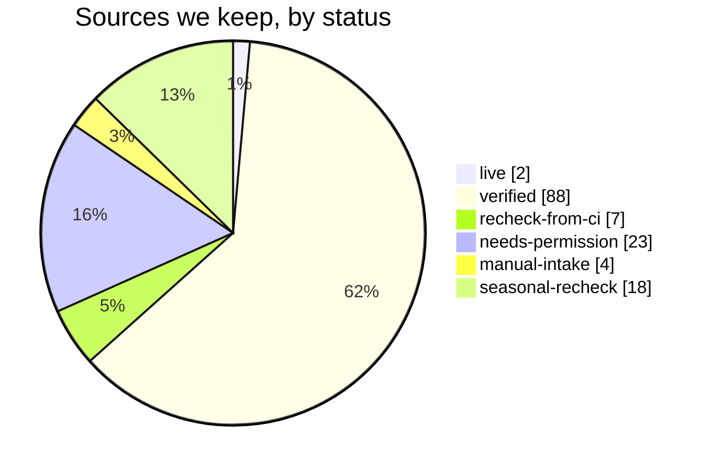

# Long Island Dance Events - source catalog

> Generated from [`catalog/sources.json`](../catalog/sources.json) by `python catalog/scripts/catalog_report.py`. Checked on **October 3, 2026**. Area: **Nassau and Suffolk counties only**. Site: https://longisland.dance

This is the list of websites that publish upcoming **dance events** and **live music** on Long Island, what each one covers, and whether we may collect it. It merges the earlier discovery pass ([`docs/source-proposals.md`](source-proposals.md), 57 sites) with a new search using the Microsoft Web IQ search API.

## The short version

- We looked at **218 websites**. **90 are usable now** (2 live, 88 verified), 7 need one more check from GitHub Actions, 23 need the organizer's permission, 4 can only be added by hand, 18 are seasonal, and 76 were set aside.
- Usable sources by priority: **24 High, 38 Medium, 28 Low.**
- Of the 142 sources we keep, **42 are mainly about dancing** (clubs, studios, teachers, dance calendars) and **100 are mainly about live music** (bars, venues, bands). Music sources matter because many people dance to cover bands and DJs.
- **Best new finds:** bar and beach-club calendars with event data built in (Daisy's in Miller Place, Mulcahy's in Wantagh), a country line-dance venue (89 North in Patchogue), the Mayor of Montauk and Webtunes music calendars, and dance-band gig lists (Pour Some 80s On Me, Radio Active, Decadia, Beernutz, Audawind).
- **Ask first:** LongIsland.com (events and nightlife), Triple Step Swing, Lourdes Cruz's Google Calendar and others block bots. We will ask the organizers for permission or for a calendar feed. We never get around a block.

## How we searched

- **85 Web IQ searches** (dance styles, line dancing, cover bands, DJs, "live music" plus 25 towns, and venue types such as breweries, VFW halls and libraries). They returned 1,700 results: **1,323 different pages on 487 websites**. Every query and its result count is in [`catalog/search-log.json`](../catalog/search-log.json).
- Web IQ cost: $12.50 per 1,000 calls at list price (checked October 3, 2026). Our 85 searches plus 14 page reads ("Browse") would cost about **$1.24**; evaluation traffic is free.
- 203 of the 487 websites made it into this catalog. The rest were ticket resellers, national directories, how-to articles, wedding-band ads or places outside Long Island.

## How we checked each source

1. A script ([`catalog/scripts/verify_sources.py`](../catalog/scripts/verify_sources.py)) read each site's **robots.txt**, then opened the page as `LongIslandDanceEventsBot/1.0` (our own name, never a browser disguise), one request at a time with a pause between requests.
2. It looked for event data built into the page, calendar feeds and dates after October 3, 2026, and counted Nassau/Suffolk town names.
3. A person (with AI help) then read each page and wrote the notes in our own words. Nothing was copied from the sites, and no private people's details were recorded.
4. Our office network blocks some bar, brewery and winery sites. For those we read Microsoft's saved copy through Web IQ Browse and marked them **recheck-from-ci**: GitHub Actions must read their robots.txt before we collect anything.

**Public Google Calendars are the one exception.** `calendar.google.com/robots.txt` blocks all bots, but Google tells people to use a public calendar's iCal address in other apps (support.google.com/calendar/answer/37083). So when an organizer makes a calendar public, we read only that address: `https://calendar.google.com/calendar/ical/<id>/public/basic.ics`. Ira's List is read this way (decision P40). A Google Calendar embedded on a web page shows its id in the page's code (`src=` in the calendar link); put that feed address in the source's `url` or `feedUrl` and use the `ical` adapter.

**Screenshots are not a way around a block.** A program that takes screenshots or reads text from images is still a robot, so robots.txt and the site's rules still apply. Blocked sites are asked for permission. Social-media-only and flyer-only events come in through the hand-entry (flyer upload) path described in [`docs/database-plan.md`](database-plan.md).

## What the status words mean

| Status | Meaning | Sources |
| --- | --- | ---: |
| **live** | Already collected by the website every week. | 2 |
| **in-progress** | Being wired into the website right now (in another work session). | 0 |
| **verified** | We opened it, it lists upcoming Long Island events, and robots.txt lets our bot read it. | 88 |
| **recheck-from-ci** | Looks good, but our office network blocks the site (bars, breweries, wineries). Check robots.txt from GitHub Actions before collecting. | 7 |
| **needs-permission** | The site blocks bots (robots.txt says no, or it answered 403/429/bot check), or its rules forbid collecting. We ask the organizer first. | 23 |
| **manual-intake** | Events are only on social media or in picture flyers. An editor or organizer adds them by hand (flyer upload). | 4 |
| **seasonal-recheck** | A real Long Island source with no upcoming dates right now (for example, summer concerts). Check again in spring. | 18 |
| **set-aside** | Not useful: outside Nassau/Suffolk, out of date, no event list, private events only, or a copy of a better source. | 76 |

## Counts

Counts below include every source we keep (everything except set-aside).

| Who publishes it | Sources |
| --- | ---: |
| Venue (bar, restaurant, hall, theater) | 40 |
| Band or DJ | 30 |
| Event calendar that collects many events | 20 |
| Town, village or library | 16 |
| Organizer or club | 15 |
| Dance studio | 7 |
| Lodge, church, temple or civic group | 6 |
| Teacher | 4 |
| News site or newsletter | 4 |

| What it covers (a source can count more than once) | Sources |
| --- | ---: |
| Live music | 109 |
| Freestyle / club dancing | 66 |
| Partner dancing | 31 |
| Line dancing | 20 |

| Best format we can read | Sources |
| --- | ---: |
| Web page list (HTML) | 77 |
| Event data built into the page (schema.org JSON-LD) | 16 |
| Calendar feed (.ics) | 15 |
| No list found | 11 |
| Calendar that only shows up in a browser (JavaScript) | 8 |
| Data feed (JSON) | 4 |
| Public Google Calendar | 4 |
| Picture flyers | 4 |
| Social media only | 2 |
| PDF | 1 |

| County | Sources |
| --- | ---: |
| Suffolk | 60 |
| Nassau + Suffolk | 43 |
| Nassau | 39 |

| Priority (usable sources only) | Sources |
| --- | ---: |
| High | 24 |
| Medium | 38 |
| Low | 28 |

## Top recommendations (High priority)

**Collected by the website:** 68 of 145 source files are switched on (51 with `htmllist`, 9 with `jsonld`, 6 with `ical`, 1 with `iraslist`, 1 with `thedancecalendar`). The rest stay off with a note saying why (permission needed, browser-only calendar, seasonal, hand entry, or not yet checked).

| Source | Status | Kind of dancing | Towns | Format | Events per month | Effort |
| --- | --- | --- | --- | --- | ---: | --- |
| [Ira's List LI live music calendar](https://www.iraslistli.com/) | live | freestyle, line | Babylon, Bellmore, Coram + | Web page list (HTML) | 100 | L |
| [The Dance Calendar - monthly Long Island dance PDF](https://www.thedancecalendar.com/find-venues-events) | live | partner, line | Carle Place, Westbury, Massapequa + | PDF | 40 | L |
| [LongIsland.com Events calendar](https://events.longisland.com/) | needs-permission | freestyle | Bay Shore, Bethpage, Deer Park + | Web page list (HTML) | 100 | M |
| [LongIsland.com Nightlife Events](https://nightlife.longisland.com/events/) | needs-permission | freestyle | Bellmore, Bohemia, Jericho + | Web page list (HTML) | 40 | M |
| [The Nutty Irishman (Farmingdale) - dance floor and country night](https://www.thenuttyirishman.com/venues) | recheck-from-ci | line, freestyle | Farmingdale | Web page list (HTML) | 12 | M |
| [Audawind - tour dates](https://audawind.com/) | verified | freestyle | Huntington Station, Southold, Cutchogue + | Web page list (HTML) | 3 | M |
| [Ballroom Legacy Dance Studio (Sea Cliff) - Wix Events](https://www.ballroomlegacy.us/) | verified | partner | Sea Cliff | Event data built into the page (schema.org JSON-LD) | 1 | S |
| [Beernutz Music - 2026 gigs](https://www.beernutzmusic.com/) | verified | freestyle | Farmingdale, Babylon, Bay Shore + | Web page list (HTML) | 3 | M |
| [Club Brumidi / Constantino Brumidi Lodge, Sons of Italy (Deer Park)](https://sonsofitalyli.com/events/) | verified | partner, line, freestyle | Deer Park | Web page list (HTML) | 8 | S |
| [LITMA Contradances (on the CDSS community calendar)](https://cdss.org/organizer/long-island-traditional-music-association/) | verified | partner | Smithtown | Calendar feed (.ics) | 1 | S |
| [Daisy's Nashville Lounge (Miller Place/Patchogue) - live music calendar](https://daisysli.com/calendar/) | verified | freestyle | Miller Place, Patchogue | Event data built into the page (schema.org JSON-LD) | 20 | S |
| [Dance Party Explosion - upcoming shows](https://dpe-li.com/upcoming-shows/) | verified | freestyle | Patchogue | Event data built into the page (schema.org JSON-LD) | 1 | S |
| [Dance With Me Long Island - Greenvale class schedule](https://dancewithmeusa.com/studio/long-island-dance-studio/) | verified | partner, line | Greenvale | Web page list (HTML) | 12 | M |
| [Dancing With Deanna - public line-dance events](https://www.dancingwithdeanna.com/events-1) | verified | line | Manorville, Port Jefferson, North Patchogue + | Web page list (HTML) | 8 | M |
| [Decadia - upcoming shows](https://www.decadialive.com/home) | verified | freestyle | Babylon, Smithtown, Amityville + | Web page list (HTML) | 4 | S |
| [89 North Music Venue calendar](https://89northmusic.com/calendar) | verified | line, freestyle | Patchogue | Web page list (HTML) | 15 | S |
| [Mayor of Montauk Guide - live music](https://www.mayorofmontauk.com/events/live-music) | verified | freestyle | Montauk, East Hampton | Event data built into the page (schema.org JSON-LD) | 25 | M |
| [Mulcahy's (Wantagh) - concert and dance-party calendar](https://mulcahyslongisland.com/concert-events/) | verified | freestyle | Wantagh | Event data built into the page (schema.org JSON-LD) | 15 | S |
| [Pour Some 80s On Me - show calendar](https://poursome80sonme.org/) | verified | freestyle | Miller Place, Oyster Bay, Farmingdale + | Web page list (HTML) | 4 | S |
| [Radio Active - events calendar](https://radioactiveny.com/) | verified | freestyle | Coram, Lindenhurst, Farmingdale + | Web page list (HTML) | 2 | S |
| [Salt Shack at Cedar Beach (Babylon) - beach music calendar](https://saltshackny.com/) | verified | freestyle | Babylon | Web page list (HTML) | 8 | M |
| [Swing Dance Long Island (SDLI) - Upcoming Events](http://www.sdli.org/index.php/sdli/events/) | verified | partner | Greenlawn | Web page list (HTML) | 4 | S |
| [The Second Street Band - shows](https://www.thesecondstreetband.com/event-list) | verified | freestyle | Baldwin, Bohemia, Lynbrook + | Calendar that only shows up in a browser (JavaScript) | 8 | M |
| [Stereo Garden (Patchogue) - concerts and dance parties](https://www.stereogardenli.com/stereo-garden-li-events/) | verified | partner, freestyle | Patchogue | Calendar feed (.ics) | 15 | S |
| [Touch the 80s - 2026 schedule](http://touchthe80s.com/) | verified | freestyle | Farmingdale, Franklin Square | Web page list (HTML) | 2 | M |
| [Webtunes - Long Island live music](https://webtunes.com/events/long-island) | verified | freestyle | Amityville, Bay Shore, Bellmore + | Event data built into the page (schema.org JSON-LD) | 30 | S |
| [Worst Case Scenario - upcoming shows](https://wcsrocks.com/) | verified | freestyle | Wantagh, Deer Park, Massapequa Park + | Web page list (HTML) | 2 | S |

Effort: **S** = a day or less (feed or tidy page), **M** = a few days (free text, several pages, filtering), **L** = a week or more (browser-only pages, many platforms).

Kind of dancing: **partner** (swing, ballroom, salsa, hustle, tango, two-step, contra), **line** (line dancing), **freestyle** (dancing on your own to a band or DJ), **listening** (seated concerts).

## Usable sources (live, being built, verified)

Owner decision (October 3, 2026): every source in this table and every source in the earlier proposals is accepted. "Accepted" never overrides robots.txt, site rules or bot protection.

| Priority | Source | Covers | Towns | Format | robots.txt | Per month | Check |
| --- | --- | --- | --- | --- | --- | --- | --- |
| High | [Audawind - tour dates](https://audawind.com/) | coastal country rock, country rock, Nashville, beach concerts | Huntington Station, Southold, Cutchogue + | html | allowed | 3 | twice-weekly |
| High | [Ballroom Legacy Dance Studio (Sea Cliff) - Wix Events](https://www.ballroomlegacy.us/) | Latin social, ballroom | Sea Cliff | jsonld | allowed | 1 | monthly |
| High | [Beernutz Music - 2026 gigs](https://www.beernutzmusic.com/) | rock cover band, bar band | Farmingdale, Babylon, Bay Shore + | html | allowed | 3 | twice-weekly |
| High | [Club Brumidi / Constantino Brumidi Lodge, Sons of Italy (Deer Park)](https://sonsofitalyli.com/events/) | social dance mix (tango, West Coast Swing, hustle, ballroom/Latin), dinner dances, classes | Deer Park | html | allowed | 8 | weekly |
| High | [LITMA Contradances (on the CDSS community calendar)](https://cdss.org/organizer/long-island-traditional-music-association/) | contra dance | Smithtown | ical | allowed | 1 | weekly |
| High | [Daisy's Nashville Lounge (Miller Place/Patchogue) - live music calendar](https://daisysli.com/calendar/) | country bar dancing, rock and pop cover bands, DJ and karaoke nights | Miller Place, Patchogue | jsonld | allowed | 20 | twice-weekly |
| High | [Dance Party Explosion - upcoming shows](https://dpe-li.com/upcoming-shows/) | funk, rock, dance, Top 40 | Patchogue | jsonld | allowed | 1 | weekly |
| High | [Dance With Me Long Island - Greenvale class schedule](https://dancewithmeusa.com/studio/long-island-dance-studio/) | ballroom, Latin, bachata, salsa | Greenvale | html | allowed | 12 | weekly |
| High | [Dancing With Deanna - public line-dance events](https://www.dancingwithdeanna.com/events-1) | country line dancing, country music events | Manorville, Port Jefferson, North Patchogue + | html | allowed | 8 | weekly |
| High | [Decadia - upcoming shows](https://www.decadialive.com/home) | 80s and 90s, party band, tribute concerts, cover band | Babylon, Smithtown, Amityville + | html | allowed | 4 | twice-weekly |
| High | [89 North Music Venue calendar](https://89northmusic.com/calendar) | country line dancing, cover bands, tribute bands, live music | Patchogue | html | allowed | 15 | twice-weekly |
| High | [Ira's List LI live music calendar](https://www.iraslistli.com/) | cover bands, DJs, country nights, dance parties | Babylon, Bellmore, Coram + | html | allowed | 100 | twice-weekly |
| High | [Mayor of Montauk Guide - live music](https://www.mayorofmontauk.com/events/live-music) | acoustic, rock, bar bands, nightlife | Montauk, East Hampton | jsonld | allowed | 25 | twice-weekly |
| High | [Mulcahy's (Wantagh) - concert and dance-party calendar](https://mulcahyslongisland.com/concert-events/) | hip-hop and R&B dance parties, freestyle and old-school nights, tribute and cover-band shows | Wantagh | jsonld | allowed | 15 | daily |
| High | [Pour Some 80s On Me - show calendar](https://poursome80sonme.org/) | 80s rock, party band, cover band | Miller Place, Oyster Bay, Farmingdale + | html | allowed | 4 | twice-weekly |
| High | [Radio Active - events calendar](https://radioactiveny.com/) | rock cover band, acoustic trio, bar band | Coram, Lindenhurst, Farmingdale + | html | allowed | 2 | twice-weekly |
| High | [Salt Shack at Cedar Beach (Babylon) - beach music calendar](https://saltshackny.com/) | beach DJs, party and variety bands, seasonal live music | Babylon | html | allowed | 8 | twice-weekly |
| High | [Swing Dance Long Island (SDLI) - Upcoming Events](http://www.sdli.org/index.php/sdli/events/) | East Coast Swing, Lindy Hop, West Coast Swing, Balboa | Greenlawn | html | none | 4 | weekly |
| High | [The Second Street Band - shows](https://www.thesecondstreetband.com/event-list) | cover band, bar band, acoustic shows | Baldwin, Bohemia, Lynbrook + | js-widget | allowed | 8 | twice-weekly |
| High | [Stereo Garden (Patchogue) - concerts and dance parties](https://www.stereogardenli.com/stereo-garden-li-events/) | salsa, reggaeton, freestyle and old-school, tribute concerts | Patchogue | ical | allowed | 15 | twice-weekly |
| High | [The Dance Calendar - monthly Long Island dance PDF](https://www.thedancecalendar.com/find-venues-events) | ballroom, swing, tango, hustle | Carle Place, Westbury, Massapequa + | pdf | allowed | 40 | monthly |
| High | [Touch the 80s - 2026 schedule](http://touchthe80s.com/) | 80s new wave, tribute band, club dance music | Farmingdale, Franklin Square | html | none | 2 | twice-weekly |
| High | [Webtunes - Long Island live music](https://webtunes.com/events/long-island) | rock cover bands, tribute bands, freestyle concert | Amityville, Bay Shore, Bellmore + | jsonld | allowed | 30 | daily |
| High | [Worst Case Scenario - upcoming shows](https://wcsrocks.com/) | classic rock, modern rock, country, cover band | Wantagh, Deer Park, Massapequa Park + | html | allowed | 2 | twice-weekly |
| Medium | [Arts in the Plaza live music calendar](https://www.artsintheplaza.com/live-music-calendar.html) | live music, DJ, dance party, plaza performances | Long Beach | html | allowed | 8 | weekly |
| Medium | [Bartini Bar & Lounge (Babylon) - event calendar](https://www.bartinibabylon.com/event-calendar) | weekend local rock bands, karaoke, open mic | Babylon | html | allowed | 10 | twice-weekly |
| Medium | [Blues Groupie live music listings](https://bluesgroupie.com/sun-tues) | blues jams, bar bands, recurring gigs | Amagansett, Amityville, Babylon + | html | allowed | 20 | twice-weekly |
| Medium | [Cedar Beach Blues Festival](https://cedarbeachbluesfestival.com/) | blues festival, waterfront blues, rock-blues bands | Port Jefferson | html | allowed | 1 | seasonal |
| Medium | [The Citi-Lites Band - upcoming shows](https://citilitesbandlongisland.com/upcoming-shows/) | rock, blues, disco, oldies | Bayport | jsonld | allowed | 1 | weekly |
| Medium | [Country Dancing with Natalie - lessons and events](https://www.countrydancingwithnatalie.com/lessons.html) | country line dancing | Port Jefferson Station, Mastic, Massapequa + | html | allowed | 10 | weekly |
| Medium | [Dance Manhattan - 'LI Recommended Swing Dances on Long Island'](http://dancemanhattan.com/calendar/event/113) | swing, Lindy Hop, blues | Farmingdale, Greenlawn, Amityville + | html | none | 6 | weekly |
| Medium | [Danny Langdon - upcoming shows](https://www.dannylangdon.com/) | classic rock, solo acoustic, cover band | Merrick, Seaford, Massapequa Park | js-widget | allowed | 2 | weekly |
| Medium | [Dan's Papers East End concerts](https://events.danspapers.com/things-to-do/east-end/concerts/) | East End concerts, wine and live music, dance category | Amagansett, Bridgehampton, Cutchogue + | html | allowed | 16 | weekly |
| Medium | [Dead Ahead Band - tour dates](https://deadaheadband.com/) | jam band, Grateful Dead, blues, Motown | Riverhead | html | none | 1 | weekly |
| Medium | [The Band Easy Street - upcoming events](https://thebandeasystreet.com/) | dance, funk, soul, rock and roll | Babylon, Dix Hills, Jones Beach + | google-calendar | allowed | 1 | weekly |
| Medium | [Eleanor's Lounge (Bohemia) - bands, karaoke, and DJs](https://eleanorslounge.com/) | local rock cover bands, karaoke, DJs | Bohemia | html | allowed | 12 | twice-weekly |
| Medium | [Electric Dudes - Long Island music dates](https://electricdudes.com/events) | party band, rock cover band, acoustic duo | Bethpage, Farmingdale | html | allowed | 2 | weekly |
| Medium | [Enjoy Long Beach music and events](https://www.enjoylb.com/music-and-events) | DJs, bar bands, rooftop events, free concerts | Long Beach | html | allowed | 15 | weekly |
| Medium | [Gene Casey & the Lone Sharks (band) - show calendar](https://genecasey.com/events/) | swing / rockabilly / roots band for dancing | Amityville, Greenlawn, Bayport + | ical | allowed | 8 | twice-weekly |
| Medium | [Harley's American Grille (Farmingdale/Huntington) - DJ and live music nights](https://www.harleysamericangrille.com/) | disco freestyle, DJ entertainment, restaurant live music | Farmingdale, Huntington | js-widget | allowed | 8 | weekly |
| Medium | [High Tide Band - schedule](https://hightideli.com/schedule) | party band, cover band | Bay Shore, West Islip | html | allowed | 1 | weekly |
| Medium | [Huntington Matters events](https://huntingtonmatters.com/events/) | line dancing, festival live music, community events | Centerport, Huntington, Huntington Station + | jsonld | allowed | 4 | weekly |
| Medium | [I Love Babylon events](https://ilovebabylon.com/events/) | drag brunch, theater, community concerts, local festivals | Amityville, Babylon, Copiague + | api-json | allowed | 20 | weekly |
| Medium | [Jericho Public Library events](https://www.jericholibrary.org/events) | Chinese dance, traditional Chinese dancercise, children music movement | Jericho | html | allowed | 4 | weekly |
| Medium | [JLR Dance Unlimited (Bay Shore) - Wix Events](https://www.jlrdanceunlimited.com/events-2) | ballroom, Latin, hustle | Bay Shore | jsonld | allowed | 2 | weekly |
| Medium | [Kitty Mulligan's Irish Pub (Bay Shore) - events](https://kittymulligans.com/bay-shore-kitty-mulligans-irish-pub-events) | classic rock cover bands, open jams, music bingo | Bay Shore | html | allowed | 8 | weekly |
| Medium | [Long Island Music and Entertainment Hall of Fame concert calendar](https://www.limusichalloffame.org/long-island-concert-calendar/) | concerts, jazz, rock, tribute shows | Huntington, Patchogue, Port Jefferson + | html | allowed | 20 | weekly |
| Medium | [Lily Flanagan's Pub (Babylon) - music calendar](https://www.lilyflanaganspub.com/musicevents) | Friday happy-hour cover bands, Saturday pub bands | Babylon | ical | allowed | 10 | twice-weekly |
| Medium | [Nassau County Tourism events](https://nassaucountytourism.com/events/) | concerts, tribute shows, arts events | Bethpage, Farmingdale, Roslyn | html | allowed | 8 | weekly |
| Medium | [North Fork Resort (Greenport) - Miss May's Friday live music](https://nfresort.com/events/) | Friday resort live music, classic rock and blues bands | Greenport | html | allowed | 4 | weekly |
| Medium | [Oceanside Library LibCal](https://oceansidelibrary.libcal.com/calendar) | dance and movement, Zumba, music trivia, library concert | Oceanside | ical | allowed | 8 | weekly |
| Medium | [Saint Demetrios Merrick Dinner Dance](https://saint-demetrios.com/dance) | Greek dinner dance, live Greek band | Merrick | html | allowed | 1 | monthly |
| Medium | [Stage 317 (Farmingdale) - concerts and dance parties](https://www.stage317.com/upcoming-events) | DJ dance party, 80s and new-wave cover bands, dueling pianos | Farmingdale | js-widget | allowed | 4 | weekly |
| Medium | [Subculture Long Island New Wave Dance Club](https://www.alternativesounds.com/subculture.htm) | 80s new wave, industrial, synthpop, alternative dance | Wantagh, Hicksville, Island Park | html | none | 3 | weekly |
| Medium | [Temple Sinai of Roslyn - Israeli Folk Dancing](https://templesinaiweb.org/meet-us/committees/adult-education-2/israeli-folk-dancing) | Israeli folk dancing | Roslyn Heights | ical | allowed | 4 | monthly |
| Medium | [That's What She Said - performances](https://thatswhatshesaidny.com/) | women icons tribute, rock, pop cover band | Commack, Port Jefferson Station, Baldwin | html | allowed | 1 | weekly |
| Medium | [The Fabulous Acchords - appearance schedule](https://theacchords.com/) | doo-wop, oldies, sock hop, dinner dance | New Hyde Park, Levittown, Hicksville + | html | allowed | 1 | weekly |
| Medium | [The Alright Guys - shows](https://thealrightguys.com/shows/) | blues, rock, Americana | Island Park, Long Beach | html | allowed | 2 | weekly |
| Medium | [The Saint (Farmingdale) - resident DJ lounge](https://thesaintny.com/) | resident DJ lounge, Friday and Saturday nightlife | Farmingdale | html | allowed | 8 | weekly |
| Medium | [The Villager Farmingdale - live music calendar](https://www.thevillagerfarmingdale.com/livemusic) | local cover bands, pub live music | Farmingdale | ical | allowed | 12 | twice-weekly |
| Medium | [West Islip Public Library events](https://westisliplibrary.libnet.info/events?r=thismonth) | Zumba, kids movement, library concert, Toddlers Tango | West Islip | api-json | allowed | 6 | weekly |
| Medium | [White Room Band - events](https://whiteroomband.com/events) | live music, cover band, brewery and pub gigs | Calverton, Patchogue, Riverhead | html | allowed | 3 | weekly |
| Low | [All Revved Up NY - Meat Loaf tribute shows](https://allrevvedupnyband.com/shows-meat-loaf-tribute) | Meat Loaf tribute, classic rock tribute | Oakdale, Port Jefferson Station | html | allowed | 2 | weekly |
| Low | [Amityville Music Hall - show list](https://amh.live/) | rock concerts, metal and indie shows | Amityville | html | allowed | 12 | weekly |
| Low | [Bayway Arts Center (East Islip) - upcoming shows](https://www.baywayartscenter.com/) | theatre shows, tribute concerts, dance performances | East Islip | js-widget | allowed | 3 | monthly |
| Low | [Casa Stellina (Oyster Bay) - Sinatra night](https://casastellinany.com/whats-on/) | Sinatra night, restaurant vocalist | Oyster Bay | html | allowed | 4 | monthly |
| Low | [The Haymakers (band) - shows](https://www.haymakersmusic.com/shows) | rock & roll / swing-friendly band night | Farmingdale, Lindenhurst | html | allowed | 1 | monthly |
| Low | [Hotel Moraine (Greenport) - events](https://www.hotelmoraine.com/events) | happy-hour acoustic music, hotel events | Greenport | ical | allowed | 3 | weekly |
| Low | [Huntington Arts Council - events calendar, Dance category](https://www.huntingtonarts.org/events/category/dance/) | swing (SDLI), dance performances | Greenlawn, Roslyn Harbor | ical | allowed | 3 | weekly |
| Low | [Jazz at the Barn (Huntington) - upcoming shows](https://jazzatthebarn.com/) | jazz listening shows, small ensemble concerts | Huntington | html | allowed | 3 | monthly |
| Low | [Jim's Roots & Blues jams calendar](https://jimsrootsandblues.com/calendar/jams/) | old-time jam, bluegrass jam, traditional music session | Riverhead | google-calendar | allowed | 2 | monthly |
| Low | [Long Island public library calendars (e.g., Amityville, Hicksville)](https://www.amityvillepubliclibrary.org/event/intermediate-line-dancing-person-vfw-hall-10186) | line dancing, ballroom | Amityville, Hicksville | jsonld | allowed | 6 | monthly |
| Low | [Long Island Country Music Association (LICMA)](https://licma.org/) | country, line dancing | Deer Park | html | allowed | 1 | monthly |
| Low | [Live On The Porch (Smithtown) - show calendar](https://liveontheporch.com/events/) | tribute concerts, classic rock shows, country-rock shows | Smithtown | jsonld | allowed | 6 | weekly |
| Low | [Mezza Luna (Hauppauge) - events](https://www.mezzalunafinedining.com/events) | restaurant live music, solo and small-group acts | Hauppauge | ical | allowed | 4 | weekly |
| Low | [My Father's Place (Roslyn) - supper club events](https://www.mfpproductions.com/blank-2) | supper club concerts, tribute bands, jazz and roots shows | Roslyn | js-widget | allowed | 12 | weekly |
| Low | [One More Once Jazz Ensemble - event calendar](https://onemoreoncejazz.com/events) | big band jazz, jazz concert, library concert | Plainview, Sayville, Bohemia | html | allowed | 2 | weekly |
| Low | [Out on the Town - Long Island event calendar](https://outonthetownli.com/) | country nights, Latin nights, bar dance parties | Farmingdale, Patchogue, Rockville Centre + | ical | allowed | 8 | twice-weekly |
| Low | [Patchogue Theatre - events](https://www.patchoguetheatre.org/events/) | theatre concerts, tribute acts, comedy and stage shows | Patchogue | html | allowed | 10 | weekly |
| Low | [Polish American Cultural Association (Port Washington) - upcoming events](https://portwashingtonpolishclub.com/upcoming-events) | country night, dinner dances | Port Washington | html | allowed | 2 | monthly |
| Low | [RS Beanery (Merrick) - events](https://rsbeanerymerrick.com/events) | coffeehouse live music, small bands | Merrick | ical | allowed | 3 | weekly |
| Low | [sabaki.dance (Latin dance aggregator) - city pages](https://sabaki.dance/events/Sea-Cliff) | salsa, bachata, kizomba | Sea Cliff, Levittown | jsonld | allowed | 2 | weekly |
| Low | [Salsa Sensation Latin Dance Studio (Levittown) - class schedule](https://www.salsasensation.com/schedule) | salsa, bachata | Levittown | html | allowed | 20 | monthly |
| Low | [Steve Mitchell as Elvis - upcoming performances](https://stevemitchellaselvis.com/shows.php) | Elvis tribute, restaurant shows, concerts | Copiague | html | none | 1 | weekly |
| Low | [10 Cent Redemption - show schedule](https://10centredemption.com/) | rock, blues, metal, cover band | Huntington | html | allowed | 1 | weekly |
| Low | [The Dedications - 2026 concert events](https://thededications.org/) | doo-wop, 50s and 60s rock and roll, oldies | Northport | html | allowed | 1 | weekly |
| Low | [The Space at Westbury - upcoming concerts](https://www.thespaceatwestbury.com/upcoming-concerts) | concert hall shows, tribute concerts, pop and rock events | Westbury | js-widget | allowed | 4 | weekly |
| Low | [Town of Hempstead adult classes (Line Dancing, Ballroom, Salsa & Latin)](https://hempsteadny.gov/297/Line-Dancing) | line dancing, ballroom, salsa/Latin | Hicksville | html | allowed | 4 | monthly |
| Low | [Vinyl Cut - upcoming schedule](https://www.vinylcutny.com/) | 60s and 70s cover band, oldies | Malverne | html | none | 1 | weekly |
| Low | [The Waterfalls (Lake Ronkonkoma) - community event calendar](https://waterfallsapartments.com/event-calendar/) | ballroom | Lake Ronkonkoma | html | allowed | 2 | monthly |

## Recheck from GitHub Actions

Our office network blocks these sites, so robots.txt could not be read from here. The page content was confirmed from Microsoft's saved copy.

| Priority | Source | Covers | Towns | Format | robots.txt | Per month | Check | Why |
| --- | --- | --- | --- | --- | --- | --- | --- | --- |
| High | [The Nutty Irishman (Farmingdale) - dance floor and country night](https://www.thenuttyirishman.com/venues) | 90s and 2000s cover bands, DJ dance floor, country night | Farmingdale | html | unverified | 12 | weekly | Keep and recheck from CI. It is one of the strongest dance-floor sources, but office networking blocked direct verification. |
| Medium | [7 in Heaven Singles Events - dance parties](https://7inheaven.com/events) | singles dinner dance, country western dance lesson | Huntington, Bethpage, Farmingdale + | html | unverified | 2 | weekly | Use recheck-from-ci because the dance-party events were only confirmed through Web IQ, not direct office access. |
| Medium | [Twisted Cow Distillery - Barrelhouse Boogie Lindy Hop night](https://twistedcowdistillery.net/Events?Page=1) | Lindy Hop (lesson + DJ social) | East Northport | html | unverified | 1 | monthly | Recheck from CI. The office network blocks the site, but Web IQ shows a future Barrelhouse Boogie swing night. |
| Low | [Duckwalk Vineyards - events](https://duckwalk.com/events/) | winery live music, acoustic and small-band sets | Southold, Water Mill | html | unverified | 8 | weekly | Recheck from CI. It is a real Long Island winery music source, but the office network blocked direct verification. |
| Low | [Flounder Brewing Co. - music and events](https://www.flounderbrewing.com/music-and-events) | brewery acoustic music, old-time jam, small bands | Riverhead | html | unverified | 12 | weekly | Keep only as a low-priority listening source. It has many events, but they read like brewery listening nights. |
| Low | [Greenport Harbor Brewing Company - upcoming events](https://greenportharborbrewing.com/upcoming-events) | brewery live music, acoustic and cover acts | Greenport | html | unverified | 12 | weekly | Keep as a low-priority live-music source and recheck from CI. It is more listening/social brewery music than dance. |
| Low | [Jason's Vineyard (Jamesport) - live music schedule](https://www.jasonsvineyard.com/events) | winery live music, afternoon bands | Jamesport | html | unverified | 8 | weekly | Recheck from CI. It has a long dated music schedule, but it is more winery listening than dancing. |

## Needs permission

We will not collect these until the organizer says yes or shares a calendar feed (see the permission flow in the database plan).

| Priority | Source | What blocks us | Rules / notes | What to ask for |
| --- | --- | --- | --- | --- |
| High | [LongIsland.com Events calendar](https://events.longisland.com/) | robots parsed as unknown; main page returned 200 | Terms forbid robots, spiders, automated devices, retrieval, and indexing. | an .ics feed or written OK to read the events page weekly |
| High | [LongIsland.com Nightlife Events](https://nightlife.longisland.com/events/) | robots parsed as unknown; main page returned 200 | Terms forbid robots, spiders, automated devices, retrieval, and indexing. | an .ics feed or written OK to read the events page weekly |
| Medium | [BaseLocal - live music in Islip](https://baselocal.com/ny/islip/events/live-music/) | allowed | Terms forbid scraping, crawling, or automated access without written consent. | an .ics feed or written OK to read the events page weekly |
| Medium | [DayShift Long Island daytime dance party](https://www.locomotivelive.com/dayshift/long-island) | unverified (403) | none found | an .ics feed or written OK to read the events page weekly |
| Medium | [DiVa Ballroom / Dance with Lourdes Cruz - Long Island Google Calendar](https://divaballroomdancing.com/long-island/) | site robots allowed, but calendar.google.com robots disallows our bot | none found | an .ics feed or written OK to read the events page weekly |
| Medium | [Islip Arts Council](https://isliparts.org/) | robots and page returned 406/unknown | Terms not checked because page returned 406 | an .ics feed or written OK to read the events page weekly |
| Medium | [Long Island Arts Council at Freeport](https://www.liacf.org/) | robots check returned 429/unknown | Terms not checked because site returned 429 | an .ics feed or written OK to read the events page weekly |
| Medium | [City of Long Beach concerts](https://www.longbeachny.gov/concerts) | disallowed by robots.txt | Terms not checked because robots disallow fetching | an .ics feed or written OK to read the events page weekly |
| Medium | [Societelle - Boots & Beats line dancing at 89 North](https://www.societelle.com/event-details/boots-beats-a-night-of-line-dancing) | unverified (429) | none found | an .ics feed or written OK to read the events page weekly |
| Medium | [Triple Step Swing (Long Island Lindy Hop) - calendar](https://triplestepswing.com/calendar) | site page has no robots.txt, but eventscalendar.co widget host disallows bots | none found | an .ics feed or written OK to read the events page weekly |
| Low | [Ballroom Factory Dance Studio (Patchogue) - group classes](https://ballroomfactory.com/group-classes-workshop/) | allowed, but page returned HTTP 403 bot challenge | none found | an .ics feed or written OK to read the events page weekly |
| Low | [Barefoot Adventures - Friends Waterfront line dancing](https://www.barefootadventures.org/event-details/line-dancing-every-thursday-friends-waterfront-bar-grill-2026-09-17-19-00) | allowed | none found | an .ics feed or written OK to read the events page weekly |
| Low | [Bistro 72 (Riverhead) - live entertainment](https://bistro-72.com/live-entertainment/) | unverified (site returned 403) | none found | an .ics feed or written OK to read the events page weekly |
| Low | [Dance With Us Long Island courses](https://dancewithus.net/courses/) | unverified (403) | none found | an .ics feed or written OK to read the events page weekly |
| Low | [dancecalendar.info - Long Island area](https://www.dancecalendar.info/event.aspx?idarea=49) | disallowed for our bot | none found | an .ics feed or written OK to read the events page weekly |
| Low | [Eventbrite event pages](https://www.eventbrite.com/d/ny--central-islip/salsa/) | allowed, but sampled URL returned HTTP 405 | Eventbrite terms prohibit web scraping; use the official API or organizer permission. | an .ics feed or written OK to read the events page weekly |
| Low | [Hotel Indigo East End (Riverhead) - weekly live music page](https://indigoeastend.com/weekly-live-music-on-long-islands-east-end/) | unverified (site returned 403) | none found | an .ics feed or written OK to read the events page weekly |
| Low | [Meetup groups (Triple Step Swing; Long Island Swing Syndicate)](https://www.meetup.com/triplestepswing-longisland/) | allowed | Meetup terms forbid scraping or harvesting without permission. | an .ics feed or written OK to read the events page weekly |
| Low | [Nassau Reads upcoming events](https://nassaureads.com/upcomingevents/) | robots and page returned 403/unknown | Terms not checked because page returned 403 | an .ics feed or written OK to read the events page weekly |
| Low | [Patch town calendars (e.g., Israeli Dancing, Plainview)](https://patch.com/new-york/plainview/calendar/event/20260908/5d3cfa39-097a-4ec8-ac79-1b74ffbbc7ee/israeli-dancing) | allowed | Patch terms forbid spiders, robots, scraping, and data mining for cataloging content. | an .ics feed or written OK to read the events page weekly |
| Low | [Huntington Summer Arts Festival; Islip Arts Council](https://www.huntingtonsummerartsfestival.com/) | allowed, but page returned HTTP 429 to our bot | none found | an .ics feed or written OK to read the events page weekly |
| Low | [Temple Israel Long Beach - Step Into Israeli Dance](https://www.tilb.org/event/step-into-israeli-dance-2/) | unverified (403) | none found | an .ics feed or written OK to read the events page weekly |
| Low | [The Paramount (Huntington) - show calendar](https://www.paramountny.com/show-calendar) | allowed robots.txt; page returned 429 | none found | an .ics feed or written OK to read the events page weekly |

## Add by hand (manual intake)

Events exist but only as social posts or picture flyers.

| Source | Why |
| --- | --- |
| [Arthur Murray Syosset calendar images](https://arthurmurraysyosset.com/dance-lessons-long-island) | Use manual intake if wanted because the calendar is an image, not readable event text or a feed. |
| [DancXchange / Donna DeSimone](https://donnadesimone.us/) | Manual intake. The source has real events, but updates are bulletin/flyer/social style rather than a clean feed. |
| [Good Times Magazine music calendar](https://goodtimesmag.com/music-calendar) | Use by hand only; the event rows are not machine-readable in the cached page. |
| [The Burrows swing/blues nights (The Great Hall, Huntington)](http://dancemanhattan.com/calendar/event/113) | Manual intake. The primary source is social-only, so use manual review unless a better organizer feed appears. |

## Seasonal: check again in spring

| Priority | Source | Towns | Note |
| --- | --- | --- | --- |
| Medium | [Claudio's (Greenport) - nightlife and live music](https://claudios.com/) | Greenport | The page describes seasonal nightlife but does not show current future dates. |
| Medium | [Glen Cove Downtown Sounds](https://glencovedowntown.org/downtown-sounds/) | Glen Cove | 2026 Downtown Sounds schedule was Fridays in July/August; no future dates remain. |
| Medium | [Greenport Dances in the Park](https://greenportvillage.com/event/dances-in-the-park/) | Greenport | 2026 series ran July through August with Battle of the Bands on Labor Day; no future dates after Oct. 3. |
| Medium | [I Love Port Jeff events](https://www.iloveportjeff.com/events) | Port Jefferson | General events run through Dec 6, but live-music items found were summer/past. |
| Low | [The Boat Yard (Massapequa/Tobay Beach) - seasonal events calendar](https://theboatyardny.com/events/) | Massapequa, Tobay Beach | Only an Oct 3 car show remains; the summer music calendar appears closed. |
| Low | [The Buoy Bar (Point Lookout) - seasonal live music](https://www.buoybarli.com/buoy_bar_events.html) | Point Lookout | The opened page shows September 2026 events and no future dated music after Oct 3. |
| Low | [Village of Greenport calendar](https://villageofgreenport.gov/calendar/) | Greenport | Calendar filters visible, but no upcoming concert dates found. |
| Low | [Town of Hempstead events](https://townofhempsteadevents.com/) | Hempstead, Point Lookout | Upcoming Oct 9 and Oct 25 items are fall/car events; music categories are seasonal. |
| Low | [Town of Islip calendar](http://www.islipny.gov/community-and-services/town-calendar) | Islip, Bay Shore, Sayville | October calendar visible; relevant summer/music dates not found. |
| Low | [Maliblue (Lido Beach) - summer live entertainment](https://maliblueny.com/) | Lido Beach | The page says the season closed Sep 14, 2026. |
| Low | [Village of Mineola calendar](https://www.mineola-ny.gov/calendar.aspx?view=list&CID=28) | Mineola | October 2026 calendar shell visible, but no future concert rows found. |
| Low | [Saylor Beach House - live entertainment](https://saylorbeachhouse.com/live-events) | Saint James | The 2026 summer lineup shown ended in September. |
| Low | [Town of Smithtown 2026 concerts](https://www.smithtownny.gov/668/2026-CONCERTS) | Smithtown | 2026 concert schedule was June-August and has ended. |
| Low | [Souled Out - dates page](https://www.booksouledout.com/dates.html) | Babylon, Mattituck, Patchogue | 2026 public LI season ended 2026-09-18; 0 future LI public gigs remain. |
| Low | [Southold Historical Museum - Line Dancing in the Barn](https://www.southoldhistorical.org/event-details/line-dancing-in-the-barn-3) | Southold | Line Dancing in the Barn was July 31, 2026; museum text says special events continue year-round. |
| Low | [The Common Ground (Sayville) - community concert calendar](https://thecommonground.com/calendar-of-events) | Sayville | Summer 2026 concert dates ended before Oct 3; later page items are mostly non-music civic events. |
| Low | [Tradewinds - events calendar](https://tradewindstheband.com/events-1) | Bay Shore, Kismet, Ocean Beach | Summer 2026 public LI schedule ended 2026-09-07; 0 future LI public gigs remain. |
| Low | [12X Live - 2026 shows](https://www.12xlive.com/) | Farmingdale, Brookhaven, Jamesport | 2026 public LI schedule ended 2026-09-06; 0 future LI public gigs remain; outside entries included NYC, CT, and NJ. |

## Set aside

Looked at and not kept. The reason is in our own words.

| Source | Reason |
| --- | --- |
| [2155 Ballroom & Events - West Coast Swing calendar](https://2155dance.com/calendar/) | Set aside because the venue is in Texas, outside Nassau and Suffolk counties. |
| [375 Dance Studio (Carle Place) - Social Dance](https://375dancestudio.com/social-dance/) | Set aside as stale. Recheck only if the studio starts posting current social dates. |
| [Argentine Tango Lovers of Long Island - ATL Calendar](https://www.argentinetangolovers.com/atl-calendar) | Set aside as duplicate and fragile. Use The Dance Calendar or organizer permission rather than the signed widget. |
| [Bailar (getbailar.com)](https://getbailar.com/events/socials-at-lorenz-dance-studio-nassau-floral-park-ny-2026-10-02-2) | Set aside. The only useful-looking item is the out-of-area Lorenz listing. |
| [Ballroom Avenue LLC](https://www.ballroomavenue.com/upcoming-events) | Set aside as out of area. It is an Ohio source. |
| [Ballroom Boutique Dance Company](https://ballroomboutique.net/) | Set aside because the page is a studio marketing page without upcoming public events. |
| [Ballroom Dream Dance Studio](https://ballroomdreamusa.com/calendar/socials/) | Set aside as out of area. It is a New Jersey source. |
| [The Ballroom of Huntington](https://ballroomofhuntington.co/) | Set aside because it is a studio lead page without a public dated schedule. |
| [Blue Angel Band - venues page](https://www.blueangelmusic.com/venues.html) | Set aside because it lists venues and reviews, not dated upcoming public gigs. |
| [Boogie by the Bay schedule](https://boogiebythebay.com/schedule/) | Set aside because it is a good dance source but outside Long Island. |
| [Babylon Civic Intelligence social page](https://bvli.app/social) | Set aside; civic/social content, not dance or live-music events. |
| [The Byrne Unit - events page](https://thebyrneunit.com/events) | Set aside because it lists recent venues and services, not a usable upcoming schedule. |
| [Comfort Zone Band - upcoming shows](https://comfortzoneband.net/events) | Set aside because the future venues listed are not in Nassau or Suffolk. |
| [Contra Dance Catalog (contradances.net) - New York](https://contradances.net/events/locate/us/ny) | Set aside. Use the CDSS LITMA feed for the actual Long Island contra dance. |
| [Country City Line Dancing schedule](https://www.countrycityny.com/schedule) | Set aside until the schedule has readable public dates or a feed. |
| [County Line Band - gigs](https://countylineband.com/gigs) | Set aside because the gigs page has no dated schedule. |
| [Crush Wine & Jazz - Jazz in the Vines](https://crushwinexp.com/jazz-in-the-vines/) | Set aside. The source could not be verified as Long Island from the available copy. |
| [Discover Long Island events](https://discoverlongisland.com/events/) | Set aside. It is a tourism calendar and did not produce dance or dance-band listings worth importing. |
| [DJ Neil Wrangler - Long Island's Country DJ](https://dj-neil.com/) | Set aside as an automated source. Weekly dances are undated and special events ended in September. |
| [DJ Scott (Purple Penguin Entertainment) - social dance calendar](https://www.purplepenguinentertainment.com/events) | Set aside for automation. It is duplicate and no current future-dated listings were readable by the bot. |
| [Elks.org New York local lodge events](https://www.elks.org/lodges/LocalEvents.cfm?State=NY&submit=Events) | Set aside because the statewide list did not include Nassau or Suffolk lodge dances during the review window. |
| [Express Track Blues - Blues Dance New York event](https://www.expresstrackblues.com/) | Set aside because New York City is out of scope for Nassau and Suffolk. |
| [Fred Astaire studios (Garden City, Manhasset, Huntington, Smithtown, Port Jefferson)](https://www.fredastaire.com/garden-city/calendar/) | Set aside. The pages are promotional and do not provide a public dated event list. |
| [GO Latin Dance](https://golatindance.com/latin-dance-events-in-new-york/) | Set aside. The New York page is too broad and did not return Long Island events. |
| [Great Neck Ballroom Dance Studio](https://www.gnballroom.com/) | Set aside. There is no event list to import from this site. |
| [Great South Bay Brewery / Sessions weekly dance party article](https://greaterlongisland.com/sessions-launches-weekly-dance-party-at-bay-shores-great-south-bay-brewery/) | A July 2026 news story about a weekly dance party, not a calendar. Use it as a lead and look for the brewery's own event page. |
| [Green Parrot Bar - Nassau Bahamas event page](https://www.greenparrotbar.com/events-1) | Set aside. This is Nassau in The Bahamas, not Nassau County on Long Island. |
| [Groove Garden Events NY](https://www.groovegardeneventsny.com/) | Set aside because there is no usable public event listing in the cached page. |
| [Israeli dance listings (israelidances.com, jewishworldlife.com)](https://www.israelidances.com/worldclasses.asp?Country=All) | Set aside for event automation. It may help research organizers, but it is not a future-dated LI event feed. |
| [The Jazz Loft (Stony Brook) - calendar](https://thejazzloft.org/calendar/) | Set aside for now. The pages opened but did not expose a usable current event listing. |
| [Kaintuck Long Island Cover Band - home/upcoming dates](https://www.kaintucklongisland.com/) | Set aside because the current shows page is empty and home-page dates are stale or missing years. |
| [Long Beach Latino Civic Association - Latin Night](https://www.lblatinocivic.org/events-1/latin-night-1) | Set aside because the only readable dance event is already past and no future event page was found. |
| [LeoBot Music social network](https://leobotmusic.com/) | Set aside: not a clean public event source and includes social material. |
| [Long Island Chapter Knights of Columbus calendar](https://lickofc.org/calendar) | Set aside because it has no Long Island dance listings and the shown meeting location is Queens. |
| [Long Island Latin Movement (Bay Shore)](https://lilatinmovement.com/events) | Set aside. The events page is not populated with usable listings. |
| [Long Island Open Mics list](http://www.longislandopenmics.com/list.htm) | Set aside until a human freshness check confirms active entries. |
| [Long Island Press events (Dance shows)](https://events.longislandpress.com/things-to-do/long-island/dance-shows/) | Set aside for now. It is broad media listings with weak social-dance value and many non-catalog items. |
| [Long Island Swing Syndicate](https://www.liswingsyndicate.com/home) | Set aside because the site opens but does not show a usable public event listing. |
| [LI Blogger event listings](https://www.liblogger.com/events/swing-dance-night-twisted-cow) | Set aside. It is a stale duplicate of a better first-party source. |
| [Lindenhurst Community Calendar](https://www.lindenhurstcommunitycalendar.com/) | Set aside for now; real local calendar but not useful for dance/live music today. |
| [Line Dance With Ray (Ray Swartz)](https://www.linedancewithray.com/) | Set aside for automation. The weekly schedule is useful, but no current future-dated event cards were visible. |
| [Line Dancing with Lynn - events](https://www.linedancingwithlynn.com/events) | Set aside because the source itself says events are on hold and shows no future public dance dates. |
| [LITMA website (litma.org)](https://litma.org/) | Set aside as stale/duplicate. Use the CDSS LITMA feed instead. |
| [Lorenz Latin Dance Studio - 'Nassau' location](https://www.lorenzdancestudio.com/nassau) | Set aside as out of area. Treat this Lorenz Nassau location as Queens unless the owner confirms otherwise. |
| [MJ Ballroom](https://www.mjballroom.com/calendar) | Set aside as out of area. It is an Indiana studio. |
| [Ultimate Ballroom & Latin Dance / Mark James](https://www.mjames.org/line_dance_party.html) | Set aside because it is mostly a performance and DJ service page with no usable upcoming schedule. |
| [Nassau County Council on Aging classes calendar](https://www.nassaucountycoa.org/classes-and-activities) | Set aside because this is the wrong Nassau County. |
| [The Nautical Note - jazz and smokehouse](https://www.nauticalnote.com/) | Set aside. There is not enough readable event information to use it as a source. |
| [Nuevo Tango Arts 2026 calendar](https://nuevotangoarts.org/2026-calendar) | Set aside because the events are in New York City, outside Nassau and Suffolk counties. |
| [where-to-dance-salsa.com and latindancecalendar.com (New York pages)](https://where-to-dance-salsa.com/cities/new-york/) | Set aside. These pages are NYC-focused and did not produce Long Island events. |
| [Open Jam Events](https://openjamevents.com/) | Set aside; platform page, not a usable Nassau/Suffolk listing source. |
| [Platinum Cuisines Rest Lounge (Freeport) - upcoming events](https://platinumcuisinesrestlounge.com/upcoming-events) | Set aside. The page opened, but it did not expose a usable event listing. |
| [PolkaUSA Ultimate Polka Dance Calendar](http://www.polkausa.com/polkadances/) | Set aside because it is national and did not expose Nassau or Suffolk events in the visible page text. |
| [Project 13 Long Island - home page](https://project13longisland.com/) | Set aside because no public event listing was readable from the cached page. |
| [Richie C's Country Music & Dance calendar](https://richiecevents.wordpress.com/2026/06/29/richie-cs-country-music-dance-events/) | Set aside as stale. The author stopped the calendar before the current date. |
| [Richie C's Country Music and Dance Events](https://richiecevents.weebly.com/) | Set aside for now because the cached listing has many dance events but no future dates after today. |
| [RSNS Israeli Folk Dancing](https://www.rsns.org/events/israeli-folk-dancing-in-person/) | Set aside because the listing is stale and no current recurring date was shown. |
| [RU Dance Long Island](https://rudancelongisland.com/current-schedule) | Set aside as stale. Recheck only if the schedule updates. |
| [Salsa Vida - 'Long Island' guide](https://www.salsavida.com/guides/new-york/long-island/) | Set aside. Its Long Island page mostly means Long Island City, Queens; only a small Levittown class overlaps. |
| [Side Street Dive (Patchogue) - theatre experiences](https://www.sidestreetdive.com/) | Set aside. It does not currently provide a useful public dance or live-music calendar. |
| [Shelter Rock Public Library LibCal](https://srpl.libcal.com/calendar) | Set aside for now; feed works but current events are not relevant. |
| [SpeedDatingLongIsland.com events](https://www.speeddatinglongisland.com/events.aspx) | Set aside because singles and speed-dating events only count here when they are dance parties, and this list is not. |
| [Star Ballroom Dance Studio](https://www.starballroomdancestudio.com/) | Set aside because it promotes classes and parties but does not list public dates or clear recurring times. |
| [Stars N Stripes Square Dance Club](https://starsnstripessquares.com/calendar) | Set aside as out of area. It is a Florida club. |
| [StepChique line dancing venues - New York](https://stepchique.com/line-dancing/new-york) | Set aside because its New York listings skip Nassau and Suffolk counties. |
| [First Dance Studio (Farmingdale); The Studio by Hill Street (Southampton); Dance Magic (St. James); Arthur Murray (Port Jefferson)](https://1st-dance.com/) | Set aside. These are studio/lesson sites without public event pages. |
| [Tanglefoots Square Dance Club](https://www.tanglefoots.org/caller-schedule.html) | Set aside as out of area. It is a South Carolina club. |
| [Terra Vite Vineyard - unverified live music page](https://www.terravitevineyard.com/event/live-music-with-jeff-leblanc-4/2026-09-26/) | Set aside. The source could not be verified as Long Island from the available copy. |
| [The Coop Nashville Kitchen & Bar (Farmingdale) - stale music lineup](https://www.thecoopli.com/) | Set aside for now. The dance signal is useful, but the opened page had no future dates. |
| [The Traditions Doowop - home page](https://traditionsdoowop.com/) | Set aside because the page has no public calendar or dated gigs. |
| [This Long Island events feed](https://thislongisland.com/events/feed.ics) | Set aside. The feed is machine-readable but too broad and weak on dance content for this catalog. |
| [VFW Post 1896 Anniversary Dance](https://vfw1896.org/) | Set aside because Queens is out of area and the listed dance is not future-dated. |
| [Visit The Northshore - VFW Post 8290 Dance](https://www.visitthenorthshore.com/event/vfw-post-8290-dance/11429/) | Set aside; out of area despite the North Shore name. |
| [Vitality Lounge (Hicksville) - stale dance calendar](https://www.vitalityloungebar.com/events) | Set aside for now. It is very dance-friendly, but the visible calendar is stale as of today. |
| [West Coast Swing Long Island (WCSLI)](https://www.westcoastswinglongisland.com/calendar) | Set aside. There is no readable event list; contact or social channels would need manual intake. |
| [Westhampton Chamber calendar events](https://westhamptonchamber.org/calendar-events/) | Set aside; candidate event URL is gone. |

## Files

- Each source we keep also has a file in [`src/content/sources/`](../src/content/sources/) that the collector reads. It holds the adapter, `focus` (dance or music), `cadence`, feed and default venue or band, and a `permission` note for blocked sources.
- [`catalog/sources.json`](../catalog/sources.json): one record per source with every field (styles, towns, format, robots.txt, terms, freshness, overlap, evidence links).
- [`catalog/search-log.json`](../catalog/search-log.json): every Web IQ query, its result count and result links.
- [`catalog/search-queries.json`](../catalog/search-queries.json) and [`catalog/scripts/webiq-search.mjs`](../catalog/scripts/webiq-search.mjs): rerun the search (the key comes only from the `WEBIQ_API_KEY` environment variable).
- [`catalog/scripts/verify_sources.py`](../catalog/scripts/verify_sources.py): the polite checker used for robots.txt, dates and formats.
